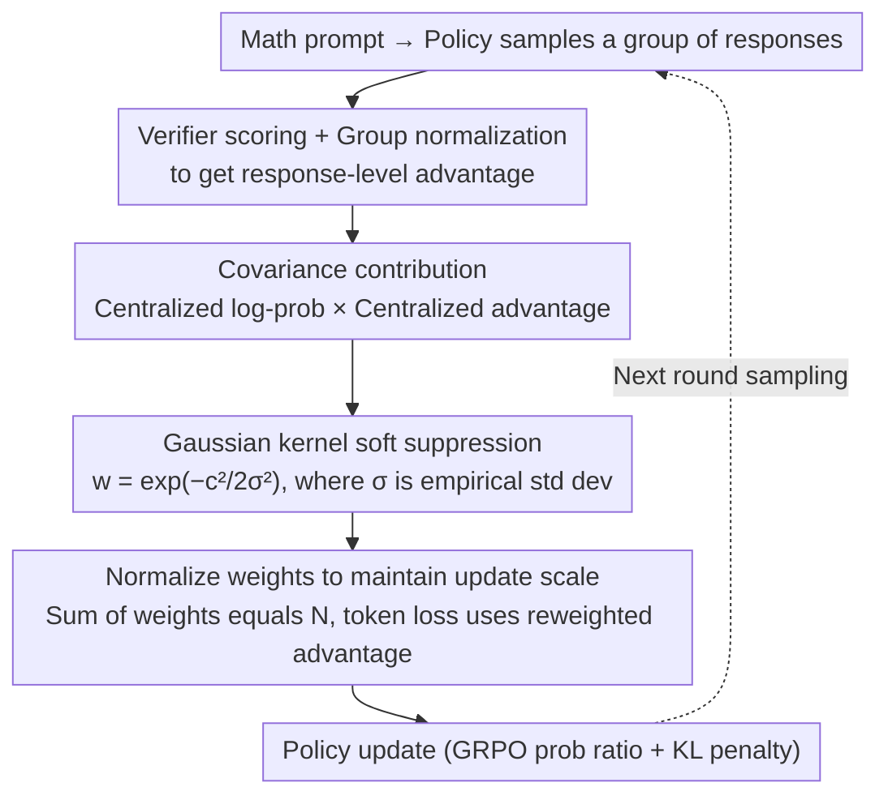

# Taming Extreme Tokens: Covariance-Aware GRPO with Gaussian-Kernel Advantage Reweighting

**Conference**: ACL2026  
**arXiv**: [2605.11538](https://arxiv.org/abs/2605.11538)  
**Code**: Not publicly available  
**Area**: LLM Alignment / RL Post-training  
**Keywords**: GRPO, Covariance Reweighting, Entropy Stability, Mathematical Reasoning, RLVR

## TL;DR
This paper attributes the entropy instability in GRPO training to the "log probability-advantage" covariance contribution of a few extreme tokens. It utilizes a Gaussian kernel without additional hyperparameters to softly suppress the advantage of these tokens, resulting in stable performance improvements across 1.5B and 7B mathematical reasoning models.

## Background & Motivation
**Background**: In reasoning training with verifiable rewards, GRPO has become a common post-training solution for DeepSeek-R1-like models because it does not require an additional value model. It estimates advantage through the relative reward of multiple responses under the same prompt and updates the policy using a PPO-style probability ratio.

**Limitations of Prior Work**: The issue with GRPO is not a lack of rewards, but rather the tendency for updates to oscillate between exploration and exploitation. Excessive exploitation causes the model to become prematurely certain about suboptimal reasoning templates, while excessive exploration leads to drastic fluctuations in training entropy, ultimately resulting in performance drops at later checkpoints.

**Key Challenge**: The authors identify a finer mechanism: changes in policy entropy are related to the covariance between token log-probabilities and advantages. That is, not all tokens affect the exploration-exploitation balance equally; a few tokens with very large absolute covariance values amplify the gradient direction, dragging the overall policy entropy toward instability.

**Goal**: First, to quantify whether extreme-covariance tokens actually exist in GRPO training; second, to suppress them without introducing additional manual thresholds; and third, to maintain effective learning signals from moderate-covariance tokens, ensuring the model neither suffers from entropy collapse nor over-divergence.

**Key Insight**: Instead of directly clipping advantages or tuning the KL coefficient, this work starts from token-level covariance. The advantage of this perspective is its direct correspondence to entropy dynamics, allowing "dangerous updates" to be localized at the token level rather than crudely weakening the reward of an entire response.

**Core Idea**: Use the standard deviation of empirical covariance as the bandwidth for a Gaussian kernel to softly down-weight updates of tokens with abnormally large absolute covariance, while keeping the original GRPO objective and training process largely unchanged.

## Method

### Overall Architecture
The proposed method can be viewed as inserting a covariance-aware advantage reweighting layer into the token-level loss of GRPO. Given a prompt, the policy model samples a group of responses, and an external verifier scores each. GRPO first obtains response-level advantages based on the group mean and standard deviation. Subsequently, CW-GRPO does not directly copy the same advantage to every token; instead, it calculates the product of each token's centralized log-probability and centralized advantage as its covariance contribution to entropy change. Tokens with extreme covariance contributions are deemed likely to push the policy toward unstable states and are down-weighted using a Gaussian kernel. The weights are then normalized to maintain the overall update scale. Finally, the reweighted advantages are used in the original probability ratio term, maintaining compatibility with KL penalties and the overall training framework.

### Key Designs

**1. Explaining GRPO entropy instability with covariance: Converting "fluctuating policy entropy" into a measurable token-level diagnostic**

The pain point of GRPO is not the absence of rewards, but the drastic oscillation of policy entropy in late training, leading to checkpoint performance decay. However, vanilla GRPO only considers the relative quality of entire responses, failing to distinguish between "useful reasoning tokens" and "extreme tokens that pull entropy off track." Borrowing from the entropy change relationship under natural policy gradients, the authors approximate $\Delta H \approx -\eta\cdot \mathrm{Cov}_t(\log\pi_\theta(o_t), A_i)$: the further a token's log-probability deviates from the mean, and the further its response advantage deviates from the mean, the stronger its pull on entropy change. Thus, "exploration-exploitation imbalance" is translated into the covariance contribution of each token—a metric more closely aligned with true entropy dynamics than blaming the KL coefficient or learning rate, allowing precise localization of "dangerous updates" at the token level.

**2. Gaussian kernel soft suppression of extreme tokens: Automatically down-weighting large-covariance tokens to prevent outliers from dominating updates**

Once extreme tokens are diagnosed, the key is to suppress them without harming useful gradients. For each token, the centralized product $c_{i,t}=(\log\pi_\theta(o_{i,t})-\overline{\log\pi})(A_i-\overline{A})$ is calculated as the covariance contribution. Then, the weight $w_{i,t}=\exp(-c_{i,t}^2/(2\sigma^2))$ is computed using a Gaussian kernel, where the bandwidth $\sigma$ is the empirical standard deviation of the covariance set across the current batch. Moderate-covariance tokens receive weights near 1 and are largely unaffected, while extreme tokens at both ends are smoothly suppressed. Unlike hard thresholds or clipping, the Gaussian kernel is continuous and symmetric for positive/negative extremes. Furthermore, because the bandwidth adapts using the empirical standard deviation, the method **introduces no new hand-tuned hyperparameters**, naturally fitting the covariance scale of different batches.

**3. Normalized weights to maintain GRPO update scale: Altering relative token contributions without systematically shrinking the overall loss**

Directly multiplying by Gaussian weights would lead to an average weight less than 1, effectively lowering the learning rate and disrupting the original GRPO training rhythm. To address this, the authors normalize the weights as $\tilde{w}_{i,t}=w_{i,t}\cdot N/\sum_{j,k}w_{j,k}$ (where $N$ is the total number of tokens in the group) and replace the advantage in the token loss with $\tilde{w}_{i,t}A_i$. Thus, the sum of all token weights remains $N$. The semantic shift of the method is from "lowering the overall learning rate" to "reallocating the same gradient budget"—shifting the budget from dangerous outliers to more stable moderate-covariance tokens, which stabilizes entropy while preserving GRPO's update magnitude and convergence speed.

### Loss & Training
The training follows the basic GRPO/RLVR workflow: the model generates 12 responses for each math problem, the verifier assigns 0/1 for correctness and checks `<think>` tag formatting; rewards are group-standardized to form advantages. The experiment uses 7,000 high-quality math problems from Open-RS as the training set, with evaluations covering AIME24, MATH-500, AMC23, Minerva, and OlympiadBench. Implementation uses HuggingFace TRL for training and Lighteval for evaluation. Key hyperparameters include a learning rate of $1e-6$, batch size of 12, gradient accumulation of 4, training for 100 steps, temperature of 0.7, and maximum completion length of 4096. The method itself introduces no extra thresholds, clip ranges, or temperature-style hyperparameters.

## Key Experimental Results

### Main Results

| Model & Method | AIME24 | MATH-500 | AMC23 | Minerva | OlympiadBench | Average |
|----------------|--------|----------|-------|---------|---------------|---------|
| 1.5B Base      | 28.8   | 82.8     | 62.9  | 26.5    | 43.3          | 48.9    |
| 1.5B GRPO      | 33.3   | 85.0     | 67.5  | 27.2    | 49.9          | 52.6    |
| 1.5B Clip-Cov | 33.3   | 85.5     | 70.0  | 29.0    | 50.0          | 53.6    |
| 1.5B CW-GRPO   | 30.0   | 87.0     | 77.5  | 29.8    | 52.0          | 55.3    |
| 7B Base        | 3.3    | 82.6     | 47.5  | 33.1    | 40.4          | 41.4    |
| 7B GRPO        | 10.0   | 82.2     | 55.0  | 33.1    | 40.3          | 44.1    |
| 7B Clip-Cov   | 10.0   | 82.4     | 57.5  | 32.4    | 41.3          | 44.7    |
| 7B CW-GRPO     | 13.3   | 82.8     | 62.5  | 32.0    | 42.7          | 46.7    |

CW-GRPO achieves an average score of 55.3 on the 1.5B model, 2.7 points higher than vanilla GRPO and 1.7 points higher than Clip-Cov. On the 7B model, the average is 46.7, 2.6 points higher than GRPO. Significant gains are concentrated in AMC23 and OlympiadBench, which require higher reasoning stability.

### Ablation Study

| Method | Training Step | MATH-500 | OlympiadBench | Observation |
|--------|---------------|----------|---------------|-------------|
| GRPO   | 100           | 85.0     | 49.9          | Good early on |
| GRPO   | 150 (Low Entropy) | 82.0 | 49.9          | MATH drops after entropy falls |
| GRPO   | 200 (High Entropy)| 79.8 | 47.8          | Further degradation after entropy bounce |
| CW-GRPO| 100           | 87.0     | 52.0          | Higher starting point |
| CW-GRPO| 150 (Low Entropy) | 86.2 | 53.9          | Stable during entropy fluctuations |
| CW-GRPO| 200 (High Entropy)| 86.4 | 53.5          | No collapse in late stages |

### Covariance Distribution Analysis

| Percentile | Positive Cov Threshold | Negative Cov Threshold | Interpretation |
|------------|------------------------|------------------------|----------------|
| 0.01%      | 11.52                  | -13.62                 | A few tokens contribute far beyond the main distribution |
| 1.00%      | 3.32                   | -3.34                  | Top 1% already deviates significantly |
| 20.00%     | 0.58                   | -0.36                  | Most tokens are in a moderate range |
| 40.00%     | 0.33                   | -0.22                  | Majority covariance is very small |
| 100.00%    | 0.06                   | -0.04                  | Tails dominate overall covariance |

### Key Findings
- Extreme covariance indeed exists and is not just small noise in the average sense: the magnitude of covariance in the top 0.01% of tokens is an order of magnitude higher than the main distribution, explaining why vanilla GRPO's entropy curve is skewed by a few tokens.
- Stable entropy is highly correlated with downstream performance: GRPO drops from 85.0 to 79.8 on MATH-500 after step 100, while CW-GRPO stays between 86.2 and 87.0.
- The method is effective for both 1.5B and 7B models, indicating it is a general token-level update stabilization technique rather than a coincidental tuning gain for a specific model size.

## Highlights & Insights
- The biggest highlight is explaining GRPO's training instability as token-level covariance outliers, rather than simply attributing it to KL coefficients, learning rates, or reward noise. This diagnosis is closer to the actual dynamics of policy entropy and simplifies the design of local corrections.
- The Gaussian kernel reweighting is restrained: it doesn't change the reward model, doesn't train a value network, and requires no manual thresholds. For engineering practice, this "stabilizer in the loss" is easier to implement than rewriting the whole RL process.
- The paper also reminds us that response-level advantage is actually too coarse for long reasoning chains. Even if rewards are only verifiable at the answer level, token-level statistics can still help identify which updates harm the exploration-exploitation balance.

## Limitations & Future Work
- Experimental scale only reached 7B and was primarily focused on mathematical reasoning. The effectiveness of this mechanism in larger models, longer contexts, multi-turn dialogues, and more open-ended tasks still needs verification.
- The Gaussian kernel defaults to "more extreme covariance is more dangerous," but in some tasks, extreme tokens might correspond to truly critical breakthrough reasoning steps. Future work could combine correctness, position, and reasoning step type into the weight design.
- Training only evaluated short-term behavior (around 100-200 steps). Whether weight distributions show new degradation patterns in longer training (e.g., the model actively avoiding high-covariance tokens) requires further monitoring.

## Related Work & Insights
- **vs GRPO**: GRPO replaces value models with group relative rewards, which is simple but lacks token-level stability control; this work retains the GRPO framework, only applying covariance-aware reweighting before the advantage enters the token loss.
- **vs Clip-Cov**: Clip-Cov also focuses on covariance but acts more like a hard limit on extreme values; CW-GRPO uses a Gaussian kernel for soft decay and self-adapts the scale using empirical standard deviation, avoiding manual clipping boundaries.
- **vs KL/entropy regularization**: Conventional methods constrain entropy or KL globally, which can suppress useful exploration; this work targets specific token updates, providing a finer-grained stabilization path.
- **Insight**: This approach can be transferred to preference optimization, code generation RL, and tool-use RL, especially in scenarios with sparse rewards but long token sequences: first identify which token statistics dominate training dynamics, then apply soft adjustments only to those outliers.

## Rating
- Novelty: ⭐⭐⭐⭐☆ Token-level reweighting derived from entropy-covariance relationships is clear and offers more mechanistic explanation than conventional GRPO tuning.
- Experimental Thoroughness: ⭐⭐⭐⭐☆ Solid results across two model sizes, five math benchmarks, and entropy/covariance analysis, though the task domain remains narrow.
- Writing Quality: ⭐⭐⭐⭐☆ Motivation, formulas, and results are logically linked, with tables directly supporting core arguments.
- Value: ⭐⭐⭐⭐☆ Practical for RLVR post-training, especially as a low-cost stability enhancement module for GRPO.

<!-- RELATED:START -->

## Related Papers

- [\[ACL 2026\] Mitigating Selection Bias in Large Language Models via Permutation-Aware GRPO](mitigating_selection_bias_in_large_language_models_via_permutation-aware_grpo.md)
- [\[NeurIPS 2025\] DeepVideo-R1: Video Reinforcement Fine-Tuning via Difficulty-aware Regressive GRPO](../../NeurIPS2025/llm_alignment/deepvideor1_video_reinforcement_finetuning_via_difficultyawa.md)
- [\[ACL 2026\] MDP-GRPO: Stabilized Group Relative Policy Optimization for Multi-Constraint Instruction Following](mdp-grpo_stabilized_group_relative_policy_optimization_for_multi-constraint_inst.md)
- [\[ICLR 2026\] No Prompt Left Behind: Exploiting Zero-Variance Prompts in LLM Reinforcement Learning via Entropy-Guided Advantage Shaping](../../ICLR2026/llm_alignment/no_prompt_left_behind_exploiting_zero-variance_prompts_in_llm_reinforcement_lear.md)
- [\[AAAI 2026\] LaF-GRPO: In-Situ Navigation Instruction Generation for the Visually Impaired via GRPO with LLM-as-Follower Reward](../../AAAI2026/llm_alignment/laf-grpo_in-situ_navigation_instruction_generation_for_the_visually_impaired_via.md)

<!-- RELATED:END -->
