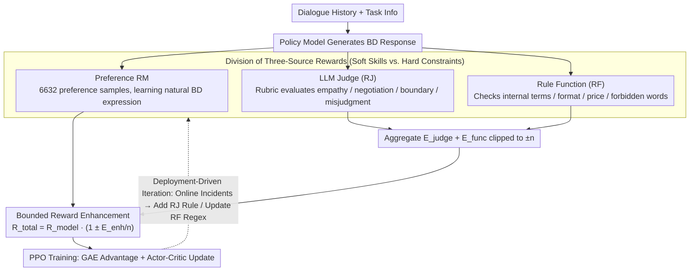

# Teaching LLM to be Persuasive: Reward-Enhanced Policy Optimization for Alignment from Heterogeneous Rewards

**Conference**: ACL2026  
**arXiv**: [2510.04214](https://arxiv.org/abs/2510.04214)  
**Code**: None  
**Area**: Task-oriented Dialogue / Alignment RLHF / Industrial Agents  
**Keywords**: Persuasive Dialogue, Multi-source Rewards, PPO, Business Negotiation, Rule Constraints

## TL;DR
Addressing hotel price reduction negotiation scenarios on online travel platforms (OTA), this paper proposes REPO. It co-trains Qwen3-32B using three types of rewards: preference reward models, LLM reviewers, and rule functions. The method simultaneously improves persuasiveness, SOP compliance, and badcase repair quality across expert evaluations and 9,653 real A/B dialogues.

## Background & Motivation
**Background**: Task-oriented dialogue systems have evolved from traditional intent recognition and slot filling to LLM-driven multi-turn agents. For operations like customer service, booking, and business development (BD) calls, the natural language capabilities of LLMs significantly improve fluency and generalization. However, real-world deployment still requires adherence to SOPs, boundary rules, and business metrics.

**Limitations of Prior Work**: The scenario in this paper involves price chasing calls for an OTA platform. BD agents must persuade hotel managers to lower room rates without making exaggerated promises, leaking internal ticket terminology, or confusing selling prices with net prices, all while following a multi-stage SOP. Single SFT tends to learn rigid scripts; DPO is limited by the coverage of preference data; and standard PPO/GRPO with thin reward designs may lead to reward hacking or violation of compliance rules.

**Key Challenge**: Persuasive business dialogue involves both verifiable constraints and soft skills that are difficult to formalize. Numbers, formats, and forbidden words can be checked by rules, but "soothing emotions," "smooth transitions," and "linking price reductions to exposure/conversion" are hard to capture via regular expressions. Conversely, LLM judges or preference RMs struggle to stably handle numerical price values and internal terminology leakage.

**Goal**: The authors aim to construct an RL post-training framework that allows for rapid online iteration. The reward should maintain the primary direction of human preferences while enabling the quick injection of new issues identified by business experts through prompt rubrics and rules.

**Key Insight**: Rewards are categorized into three complementary sources: RM provides dense human preference signals, RJ (LLM-as-a-judge) evaluates emotional value, SOP, and negotiation strategies, and RF (Rule Function) checks values, formats, and guardrails. The key to REPO is not simple addition but using RJ/RF as bounded enhancement terms to modulate the RM.

**Core Idea**: Using a preference reward model as the primary signal, the LLM judge and rule functions are aggregated and clipped as bounded multipliers. These perform sign-sensitive amplification or attenuation of the RM reward, thereby injecting business constraints and persuasive behavioral preferences into stable RL training.

## Method
REPO targets a specific yet representative industrial dialogue task: a platform BD proactively contacts a hotel to negotiate price reductions for one or more chase tickets. The model must determine the current SOP stage based on responses, distinguish prices, stop when an acceptable price is reached, avoid misinterpreting silence as consent, and avoid internal terms like "ticket" or "target price."

### Overall Architecture
Given a dialogue history and task information, the policy model generates the next BD response. This response is simultaneously sent to three reward components. The Reward Model (RM) provides an alignment score based on preference data. The Reward Judge (RJ) assesses emotional value, style, SOP compliance, and overstepping based on a rubric. The Reward Function (RF) uses regex or deterministic rules to check formats, mixed languages, price constraints, and forbidden words.

These signals are integrated into a total reward for RL training. The process follows a PPO-style actor-critic flow: the policy model generates output, the value model estimates state value, and rewards form the advantage via GAE to update the policy. The authors emphasize that all RL baselines use identical LoRA configurations and budgets, meaning gains stem primarily from the reward design.

### Key Designs

**1. Division of Responsibilities: Allocating Soft Skills and Hard Constraints to Optimal Sources**

In hotel price negotiations, soft skills (e.g., "empathizing like an elite BD") and hard constraints (e.g., "no leaking internal jargon") are intertwined. If handled entirely by one reward model, soft skills suffer from data coverage issues while hard constraints are missed by preference signals. REPO splits rewards into three paths: RM (trained on 6,632 samples) focuses on natural expression; RJ (LLM evaluator) uses an editable rubric to penalize specific complex behaviors like over-promising or repetition; and RF uses deterministic checks for hard errors. This allows each to play to its strengths—RM learns "how to sound human," while RJ/RF guard against business errors.

**2. Bounded Reward Enhancement: Modulating RM instead of Linear Addition**

The most common failure in multi-source rewards is simple addition: if one rule's scale is too large, it overwhelms the preference model, leading to instability or reward hacking. REPO treats RM as the primary signal and RJ/RF as bounded multipliers. It aggregates the judge and function scores into $E_{judge}+E_{func}$, clipped to $[-n,n]$ to get $E_{enh}$ (with $n=100$), then calculates:

$$R_{total}=R_{model}\left(1 \pm \frac{E_{enh}}{n}\right)$$

This performs sign-sensitive modulation: if RM is positive and the auxiliary signal is positive, the reward is amplified; if RM is positive but the auxiliary signal is negative, the reward is weakened; if RM is negative and the auxiliary signal is negative, the penalty is amplified. Since the auxiliary term is limited to a $\pm 1$ modulation range, business "patches" can only fine-tune rather than overwrite the primary policy direction.

**3. Deployment-Driven Iteration Loop: Turning Online Incidents into Auditable Reward Patches**

Industrial constraints change with business processes, and collecting large-scale preference data often lags behind. REPO treats reward engineering as an interface: if an online model leaks internal terms like "work-order," the team adds a penalty rule to the RJ prompt or a regex to the RF. The RM provides the human preference foundation, while RJ/RF provide patches for new error types, making every fix an auditable code change rather than a long data collection cycle.

### Loss & Training
The backbone is Qwen3-32B-Instruct. Parameters include a max response length of 512 and batch size of 128. LoRA rank and alpha are both 64. Learning rate is $10^{-6}$ with 2 warmup steps. SFT and DPO are trained for 10 epochs, while PPO, GRPO, and REPO are trained for 2 epochs, reporting the best checkpoint.

Training data includes 6,632 preference samples: 252 from online production, 3,178 from linguistic experts, 1,211 from business experts (human BDs), and 1,991 derived from SOP-path SFT samples. Evaluation includes 30 full online dialogues (~240 turns) and 45 expert-curated badcases (~360 turns).

## Key Experimental Results

### Main Results
Expert consensus evaluation was conducted by task experts, linguistics experts, and CS experts. The online test set focuses on overall scores and excellent reply ratios; the badcase set focuses on repair rates.

| Method | Online Dialogue Score | At least one Excellent Reply % | Badcase Repair Rate | Clean Repair % | Main Conclusion |
| :--- | :--- | :--- | :--- | :--- | :--- |
| Base | 3.43 | 13.33% | - | - | Weak persuasion ability |
| SFT | - | - | 93.33% | 31.11% | High coverage but coarse repair quality |
| DPO | 3.80 | 33.33% | 93.33% | 40.00% | More stable than SFT; low excellence % |
| PPO | < Baseline | < Baseline | 86.66% | 33.33% | Vanilla PPO degrades online metrics |
| GRPO | 4.30 | 43.33% | 71.10% | 44.44% | Good dialogue quality; insufficient coverage |
| **REPO** | **4.63** | **66.67%** | **93.33%** | **75.56%** | Best scores, excellence, and clean repair |

Production A/B tests compared REPO with the existing intent-driven system, as other end-to-end models failed stability/compliance requirements.

| Online Metric | Production Intent System | REPO (Ours) | Gain | Significance | Interpretation |
| :--- | :--- | :--- | :--- | :--- | :--- |
| Sample Size | 9653 dialogues | 9653 dialogues | - | - | Real customer/hotel traffic |
| Response Rate | 46.72% | 58.86% | +12.14 pp | p < 0.001 | Reflects naturalness/acceptance |
| Task Success | 19.32% | 25.26% | +5.94 pp | p < 0.001 | Actual price reduction success |
| Human BD Comp. | - | ~25% success | - | - | Performance approaching human BDs |

### Ablation Study

| Analysis Item | Result | Explanation |
| :--- | :--- | :--- |
| Severe Unresolved Cases | REPO, PPO, SFT at 0; GRPO 4.44% | REPO maintains high repair while avoiding severe errors |
| Major Issue Repair | REPO 4.44%, GRPO 13.33%, DPO 31.11% | REPO repairs are "cleaner" without introducing new issues |
| Negotiation during Training | DeepSeek-R1 evaluation +14 pts (~30%) | Multi-source rewards drive strategies beyond training gold |
| Fine-grained Skills | REPO leads in negotiation effectiveness | Rewards improve business goals, not just fluency |

### Key Findings
- REPO’s primary advantage is not just "repairing more badcases" (since SFT/DPO also reach 93.33%), but its **clean repair rate** (75.56%), indicating it rarely introduces new problems.
- PPO degraded on this task, showing that RL is not a "guaranteed gain" button. Without stable reward combinations, RL can destroy dialogue quality.
- GRPO had high online scores but lower badcase repair (71.10%), suggesting group rewards might not suit strong business constraints where error distributions differ from the online average.
- Online A/B is the most convincing part: REPO improved actual response and success rates in nearly 10,000 real dialogues.

## Highlights & Insights
- The greatest value of this paper is its industrialized approach to reward engineering. It clearly shows how human preferences, LLM rubrics, and rule patches work together in production.
- The multiplicative enhancement in REPO is more stable than weighted sums. It preserves the RM's dominance while allowing RJ/RF to make sign-sensitive corrections across different reward scales.
- The task definition reveals a universal challenge for dialogue agents: being persuasive while remaining compliant, and managing soft emotions while avoiding hard errors in logic or data.
- The prompts and reward mappings in the appendix are highly practical, providing a template for enterprise agents (e.g., handling non-response, target price acceptance, and internal term filtering).

## Limitations & Future Work
- The experiment focuses on OTA hotel price negotiation. While realistic, the transferability of REPO to after-sales, finance, or medical consulting requires broader validation.
- The paper lacks a granular numerical ablation (removing RM/RJ/RF one by one), leaving the exact contribution of each component slightly opaque.
- RJ depends on LLM-as-a-judge, which may have biases or be sensitive to prompt changes. Long-term monitoring of reward judge stability is necessary.
- Online data and business prompts are desensitized, making reproduction difficult. Future work could build open benchmarks for constrained negotiation.

## Related Work & Insights
- **vs SFT**: SFT is stable but limited to imitating existing scripts. REPO generates richer emotional value and competitive logic under reward guidance.
- **vs DPO**: DPO depends on preference pairs and is computationally efficient but capped by data coverage. REPO iterates faster by turning expert rules into rewards.
- **vs PPO / GRPO**: REPO’s contribution is the reward composition. Experiments show that in constrained dialogue, reward design is more critical than the specific RL algorithm.
- **vs Intent-driven Systems**: Intent systems are controllable but struggle with natural persuasion. REPO maintains LLM flexibility while adding compliance via rules and judges.

## Rating
- **Novelty**: ⭐⭐⭐⭐☆ While individual components exist, the bounded enhancement and deployment-driven loop address specific industrial pain points.
- **Experimental Thoroughness**: ⭐⭐⭐⭐☆ Includes expert reviews, badcase sets, and real A/B tests, though numerical ablation for reward sources is missing.
- **Writing Quality**: ⭐⭐⭐⭐☆ Background and results are clear; appendix prompts are helpful.
- **Value**: ⭐⭐⭐⭐⭐ Highly relevant for enterprise task-oriented agents, sales agents, and constrained RLHF.

<!-- RELATED:START -->

## Related Papers

- [\[ACL 2026\] Topology-Enhanced Alignment for Large Language Models: Trajectory Topology Loss and Topological Preference Optimization](topology-enhanced_alignment_for_large_language_models_trajectory_topology_loss_a.md)
- [\[ACL 2025\] Probability-Consistent Preference Optimization for Enhanced LLM Reasoning](../../ACL2025/llm_alignment/probability-consistent_preference_optimization_for_enhanced_llm_reasoning.md)
- [\[ACL 2025\] Teaching an Old LLM Secure Coding: Localized Preference Optimization on Distilled Preferences](../../ACL2025/llm_alignment/teaching_an_old_llm_secure_coding.md)
- [\[ACL 2026\] MDP-GRPO: Stabilized Group Relative Policy Optimization for Multi-Constraint Instruction Following](mdp-grpo_stabilized_group_relative_policy_optimization_for_multi-constraint_inst.md)
- [\[CVPR 2026\] Unlocking Token Rewards via Training-Free Reward Attribution](../../CVPR2026/llm_alignment/unlocking_token_rewards_via_training-free_reward_attribution.md)

<!-- RELATED:END -->
