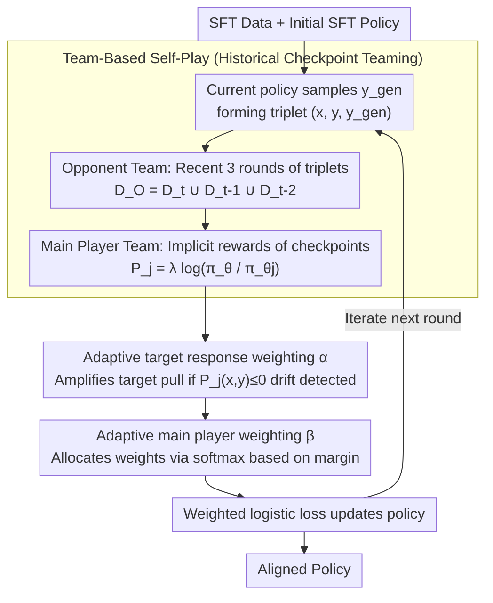

# Team-Based Self-Play With Dual Adaptive Weighting for Fine-Tuning LLMs

**Conference**: ACL 2026  
**arXiv**: [2605.09922](https://arxiv.org/abs/2605.09922)  
**Code**: https://github.com/lab-klc/TPAW  
**Area**: Self-Supervised / LLM Alignment  
**Keywords**: Self-play fine-tuning, historical checkpoints, preference optimization, adaptive weighting, LLM alignment

## TL;DR
TPAW transforms LLM self-training into an alignment process of "teaming up current and historical models for competition." It stabilizes preference optimization through two adaptive mechanisms—target response weighting and main player weighting—improving performance on the Open LLM Leaderboard and GSM8K without additional human preference annotations.

## Background & Motivation
**Background**: LLM alignment typically depends on SFT, RLHF, or DPO. SFT requires high-quality demonstration data, while RLHF necessitates reward models and human preferences. Although DPO eliminates explicit reward models, it still requires preference pairs. To reduce human annotation costs, self-play/self-training methods like SPIN utilize existing SFT data by treating human answers as positive samples and model-generated answers as negative samples to iteratively improve alignment quality.

**Limitations of Prior Work**: Such self-training methods primarily focus on the generation quality of the "current model," underutilizing historical training trajectories. If generated samples in a specific round are biased, subsequent iterations tend to amplify these errors. A more subtle issue is that DPO-style objectives simultaneously push positive samples and suppress negative ones; in later stages of self-training, as model-generated answers approach target answers, the margin narrows, and training signals become noisy. The paper also observes a decrease in the probability of target responses, causing the model to drift from the SFT target distribution.

**Key Challenge**: Self-training aims to replace human preferences with self-generated data but must avoid instability, bias accumulation, and target distribution drift caused by "only comparing with one's current self." In other words, the model needs to obtain more diverse opponents from historical versions without letting noise from weaker early checkpoints overwhelm current learning.

**Goal**: The authors aim to further extract alignment gains from the same SFT data under a completely self-supervised setting. Specifically, they address three sub-problems: how to utilize historical checkpoints, how to prevent the reward of target responses from decreasing, and how to assign appropriate training weights to different historical players for each sample.

**Key Insight**: The paper reframes self-play as a competition between two teams: an opponent team responsible for generating negative samples increasingly similar to human answers, and a main player team responsible for distinguishing between SFT target responses and model-generated responses. Historical checkpoints enter both teams, ensuring the training process no longer relies solely on a single judgment from the current model.

**Core Idea**: Replacing single-model self-play with "historical checkpoint teaming + dual adaptive weighting" allows for more stable and data-efficient alignment of LLMs using the same SFT data.

## Method
The intuition behind TPAW is akin to transforming a solo practice match into a team competition. While standard SPIN only lets the current model generate negative samples and then trains it to distinguish them from human answers, TPAW retains several recent checkpoints to form teams of opponents and judges. This offers two advantages: first, negative samples come from multiple stages of the training trajectory, avoiding a single error mode; second, implicit rewards are given by the relative probabilities of current and historical models, measuring whether the "current policy is more biased towards the target than a historical one."

### Overall Architecture
The input consists of an SFT dataset $D_{SFT}=\{(x_i,y_i)\}$ and an initial SFT policy $\pi_{\theta_0}$. In round $t+1$, the current policy $\pi_{\theta_t}$ samples $y_i^{gen}$ for an SFT prompt $x_i$, forming a triplet $(x_i,y_i,y_i^{gen})$. The paper retains triplets from the most recent three rounds to form the opponent dataset $D_O=D_t\cup D_{t-1}\cup D_{t-2}$.

Next, TPAW constructs main players for the three most recent checkpoints. Each player $P_j$ uses the log-probability ratio between the current model and historical model $\pi_{\theta_j}$ as the implicit reward: $P_j(x,y)=\lambda\log \frac{\pi_\theta(y|x)}{\pi_{\theta_j}(y|x)}$. If a target answer is closer to the current model's target distribution, the player should assign it a higher score; if a generated answer resembles a response deviating from the target, the player should assign a lower score. The training goal is to increase the margin $P_j(x,y)-P_j(x,y^{gen})$ for each player.

Finally, instead of directly averaging losses from all players, TPAW applies weight $\alpha$ to the target response and weight $\beta$ to different players, updating the policy with a weighted logistic loss. The final aligned policy is obtained after several iterations.

### Key Designs

**1. Team-Based Self-Play Framework: Teaming with historical checkpoints instead of only comparing with the current self**

Standard SPIN only uses the current model to generate negative samples and then trains it to distinguish human answers from its own. The problem is that if synthetic data in one round is biased, subsequent iterations follow that error mode. TPAW changes the solo match into a team match: it retains the three most recent historical checkpoints to serve as both the opponent team (generating negative samples) and the main player team (judging the relative quality of target vs. generated answers), using data from $D_O=D_t\cup D_{t-1}\cup D_{t-2}$. Thus, negative samples represent various training stages, and the "weak-to-strong" trajectory itself provides cheap supervision, offering richer contrastive distributions than a single model and mitigating bias accumulation.

**2. Adaptive Target Response Weighting: Pulling training back to the real answer when target distribution drift is detected**

DPO-style self-training has a hidden side effect—it pushes positive samples and suppresses negative ones simultaneously, which can lead to a decrease in the probability of the target answer itself. TPAW uses a sample-triggered weight $\alpha$ to correct this: if a player gives $P_j(x,y)\le 0$, indicating the current model does not prefer the target answer over the historical model (a sign of drift), the weight for that target response is set to $\eta>1$ (practical value $\eta=6$); otherwise, it remains 1. The comparison shifts from $P_j(x,y)$ vs $P_j(x,y^{gen})$ to $\alpha_j P_j(x,y)$ vs $P_j(x,y^{gen})$—applying extra pull only when target rewards drop, acting as "drift-correcting" negative feedback.

**3. Adaptive Main Player Weighting: Dynamically allocating training contributions based on discriminative difficulty**

Recent checkpoints might be insufficiently trained, while earlier ones might overfit their distributions. Simple averaging wastes the learning budget on samples already well-separated. TPAW first calculates the margin $m_j=P_j(x,y)-P_j(x,y^{gen})$ for each player and allocates weights via softmax:

$$\beta_j=\frac{e^{-\gamma m_j}}{\sum_k e^{-\gamma m_k}}$$

(practical value $\gamma=0.5$). A smaller margin implies the player struggles to distinguish between samples, resulting in a larger weight. Consequently, optimization focuses on the "weakest current judgments." This dynamic weighting ensures gains from multiple checkpoints are applied precisely where needed.

### Loss & Training
TPAW employs the logistic loss $\ell(t)=\log(1+\exp(-t))$, optimizing $\ell(\alpha_j P_j(x,y)-P_j(x,y^{gen}))$ for each player, then aggregating them using $\beta_j$. By default, the opponent/main player teams use the three most recent checkpoints. Practical hyperparameter settings are $\eta=6$ and $\gamma=0.5$. In round 0, missing items are skipped; in round 1, only the two available checkpoints are used, moving to the full three-player team training thereafter.

## Key Experimental Results

### Main Results
Experiments were conducted on Qwen2.5-1.5B and Llama3.1-8B. SFT used Ultrachat200k, while TPAW/SPIN used a 50k subset. Evaluation covered 12 benchmarks from Open LLM Leaderboard V1/V2. The following table selects the best performing iterations for each method.

| Base Model | Method | V1 Avg. | V2 Avg. | Remarks |
|----------|------|---------|---------|------|
| Qwen2.5-1.5B | SFT | 56.28 | 13.40 | Full Ultrachat200k SFT |
| Qwen2.5-1.5B | DPO | 58.55 | 13.50 | Using UltraFeedback preference data |
| Qwen2.5-1.5B | SPIN best | 57.61 | 14.34 | Iter-4 for V1, Iter-3 for V2 |
| Qwen2.5-1.5B | **Ours** (TPAW) best | 57.76 | 14.82 | Iter-4 for V1, Iter-3 for V2 |
| Llama3.1-8B | SFT | 63.93 | 17.69 | Initial aligned model |
| Llama3.1-8B | DPO | 64.79 | 17.91 | Extra preference data baseline |
| Llama3.1-8B | SPIN best | 64.88 | 19.68 | Iter-4 for V1, Iter-1 for V2 |
| Llama3.1-8B | **Ours** (TPAW) best | 66.14 | 20.84 | Iter-3 for V1, Iter-4 for V2 |

On specific benchmarks, TPAW gains exceed the average scores. For Qwen, IFEval improved by up to 4.37, Math by 3.55, and GSM8K by 3.79. For Llama, Arc increased by 4.79, IFEval by 8.78, and MUSR by 4.45. Since TPAW uses no additional human preference data, these results indicate more effective exploitation of existing SFT signals.

| GSM8K Training | Accuracy | Gain vs Qwen2.5-1.5B-SFT | Trend |
|----------------|----------|-----------------------------|------|
| Qwen2.5-1.5B-SFT | 51.25 | - | Initial Model |
| SPIN-gsm8k iter-1 | 53.75 | +2.50 | Clear gain |
| SPIN-gsm8k iter-2 | 54.36 | +3.11 | Continued improvement |
| SPIN-gsm8k iter-4 | 54.59 | +3.34 | Plateaus in later stages |
| TPAW-gsm8k iter-1 | 54.21 | +2.96 | Slightly better than SPIN iter-1 |
| TPAW-gsm8k iter-3 | 56.56 | +5.31 | Gap widens at round 3 |
| TPAW-gsm8k iter-4 | 56.94 | +5.69 | Final best |

### Ablation Study
The paper removes three key components on GSM8K: target response weighting, main player weighting, and the team mechanism. Figure 3 shows the curves, highlighting that removing the team-based mechanism causes the largest drop, and removing either adaptive weighting mechanism prevents the model from reaching TPAW's optimal performance.

| Ablation | Component Removed | Observed Impact | Explanation |
|----------|--------------|--------------|------|
| w/o TRW | Target response adaptive weight $\alpha$ | Target reward remains negative, lower than full TPAW | Model not explicitly pulled back to SFT distribution |
| w/o MPW | Main player adaptive weight $\beta$ | Gains from multiple checkpoints decrease | Static averaging fails to focus on difficult players |
| w/o Team | Historical checkpoint team | Significant performance drop | Training degrades toward single-model self-play |

### Key Findings
- The team-based design is the primary source of improvement. It provides diverse negative samples and uses historical models as implicit rewards to prevent self-confirmation loops.
- Adaptive Target Response Weighting directly addresses the DPO side effect where positive sample probability drops. Figure 2 shows that without this, target reward stays negative, whereas TPAW lets it converge to a positive value.
- Increasing SFT epochs cannot replace TPAW. Analysis shows that more SFT epochs lead to memorization without the same generalization gains; TPAW breaks the SFT performance ceiling on the same data.

## Highlights & Insights
- Turning historical checkpoints into "team members" is natural and highly reusable. While many iterative methods only keep the final model, this paper shows that the training trajectory itself is a valuable, cost-free supervision signal.
- The dual weighting design addresses specific failure modes: $\alpha$ prevents target drift, and $\beta$ prevents weak player dilution. It explicitly encodes "instability detection" into the optimization objective.
- The discussion on SFT data reuse is insightful: demonstration data can provide more than just imitation signals; it can generate preference signals repeatedly through self-constructed contrastive responses.

## Limitations & Future Work
- TPAW's upper bound is still constrained by SFT data quality. If SFT data is biased or low-quality, team-based self-play will fit it more thoroughly without automatic correction.
- Experiments focus on general leaderboards and GSM8K; safety alignment, multi-turn tool use, and code generation require further validation.
- There is a trade-off in team size. The paper notes $N_{max}>3$ might introduce weak historical players that provide low-quality preference signals. Future work could select team members dynamically based on quality rather than fixed rounds.
- Negative samples still come from the same model family, limiting exploration. Mixing in external weak models or RAG responses might provide stronger contrastive signals.

## Related Work & Insights
- **vs SPIN**: SPIN distinguishes target answers from current model generations. TPAW introduces historical teams and dual adaptive weighting for more stable multi-round trajectory utilization.
- **vs DPO**: DPO optimizes human preference pairs, whereas TPAW constructs signals from SFT targets and model generations without extra labels, though it remains dependent on SFT data quality.
- **vs Self-Rewarding / AutoIF**: While those emphasize automatic data generation/verification, TPAW focuses on objective stability—specifically preventing target response reward degradation.
- **Insight**: For any iterative LLM training, historical checkpoints can serve as reference models, reward models, or data generators instead of being discarded.

## Rating
- Novelty: ⭐⭐⭐⭐ The combination of historical teaming and dual adaptive weighting is comprehensive, though built on SPIN/DPO.
- Experimental Thoroughness: ⭐⭐⭐⭐ Uses two base models, two leaderboards, GSM8K, and ablations, but lacks diverse specialized domains.
- Writing Quality: ⭐⭐⭐⭐ clear motivation, complete formulas, and algorithms.
- Value: ⭐⭐⭐⭐ High practical value for low-cost alignment and SFT data reuse, especially for teams with high-quality SFT sets but no preference data.

<!-- RELATED:START -->

## Related Papers

- [\[ICML 2025\] AMPO: Active Multi-Preference Optimization for Self-play Preference Selection](../../ICML2025/llm_alignment/ampo_active_multi-preference_optimization_for_self-play_preference_selection.md)
- [\[ACL 2026\] Why Supervised Fine-Tuning Fails to Learn: A Systematic Study of Incomplete Learning in Large Language Models](why_supervised_fine-tuning_fails_to_learn_a_systematic_study_of_incomplete_learn.md)
- [\[NeurIPS 2025\] Attack via Overfitting: 10-shot Benign Fine-tuning to Jailbreak LLMs](../../NeurIPS2025/llm_alignment/attack_via_overfitting_10-shot_benign_fine-tuning_to_jailbreak_llms.md)
- [\[ACL 2026\] ConsistRM: Improving Generative Reward Models via Consistency-Aware Self-Training](consistrm_improving_generative_reward_models_via_consistency-aware_self-training.md)
- [\[ACL 2025\] Intuitive Fine-Tuning: Towards Simplifying Alignment into a Single Process](../../ACL2025/llm_alignment/intuitive_fine_tuning_simplifying_alignment_into_single_process.md)

<!-- RELATED:END -->
