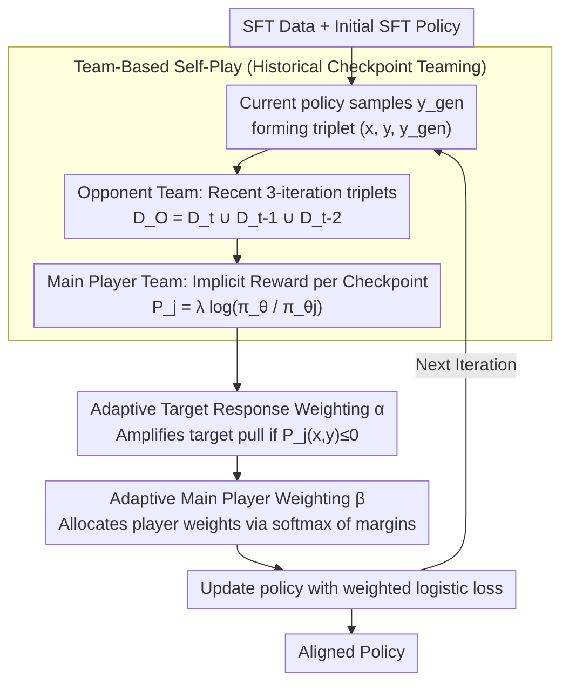

# Team-Based Self-Play With Dual Adaptive Weighting for Fine-Tuning LLMs

**Conference**: ACL 2026  
**arXiv**: [2605.09922](https://arxiv.org/abs/2605.09922)  
**Code**: https://github.com/lab-klc/TPAW  
**Area**: Self-Supervision / LLM Alignment  
**Keywords**: Self-play fine-tuning, historical checkpoints, preference optimization, adaptive weighting, LLM alignment

## TL;DR
TPAW transforms LLM self-training into an alignment process where the "current model teams up with historical models" to compete. By employing dual adaptive weighting mechanisms for target responses and main players, it stabilizes preference optimization and improves performance on the Open LLM Leaderboard and GSM8K without additional human preference annotations.

## Background & Motivation
**Background**: LLM alignment typically relies on SFT, RLHF, or DPO. SFT requires high-quality demonstration data, while RLHF requires reward models and human preferences. Although DPO avoids an explicit reward model, it still requires preference pairs. To reduce human annotation costs, self-play/self-training methods like SPIN utilize existing SFT data by treating human answers as positive samples and model-generated answers as negative samples to iteratively improve alignment quality.

**Limitations of Prior Work**: These self-training methods primarily focus on the generation quality of the "current model," underutilizing historical training trajectories. If a generated sample is biased in one iteration, subsequent iterations tend to amplify that error. A more subtle issue is that DPO-style objectives simultaneously push positive samples and suppress negative samples. In the later stages of self-training, as model-generated answers become closer to target answers, the gap between positive and negative samples narrows, making training signals noisy. The paper also observes a decrease in the probability of target responses, causing the model to drift from the SFT target distribution.

**Key Challenge**: Self-training aims to replace human preferences with model-generated data but must avoid instability, bias accumulation, and target distribution drift caused by "comparing only with itself." In other words, the model needs to obtain more diverse opponents from historical versions without allowing noise from weaker early checkpoints to overwhelm current learning.

**Goal**: The authors aim to further extract alignment gains from the same SFT data in a completely self-supervised setting. Specifically, they address three sub-problems: how to utilize historical checkpoints, how to prevent the reward of target responses from decreasing, and how to assign appropriate training weights to different historical players for each sample.

**Key Insight**: This paper reframes self-play as a competition between two teams: an opponent team responsible for generating negative samples that increasingly resemble human answers, and a main player team responsible for distinguishing between SFT target responses and generated responses. Historical checkpoints enter both teams, ensuring the training process no longer relies solely on a single judgment from the current model.

**Core Idea**: Replace single-model self-play with "historical checkpoint teaming + dual adaptive weighting" to achieve more stable and data-efficient alignment on the same SFT dataset.

## Method
The mechanism behind TPAW is reminiscent of transforming solo training matches into team competitions. While standard SPIN only lets the current model generate negative samples, TPAW retains the most recent checkpoints to form both the opponents and the referees. This provides two benefits: first, negative samples come from multiple stages of the training trajectory, preventing them from reflecting only the current model's error patterns; second, the implicit reward is given by the relative probability between the current and historical models, measuring whether the "current policy is more biased towards the target answer relative to a historical policy."

### Overall Architecture
The input consists of an SFT dataset $D_{SFT}=\{(x_i,y_i)\}$ and an initial SFT policy $\pi_{\theta_0}$. In iteration $t+1$, the current policy $\pi_{\theta_t}$ samples $y_i^{gen}$ for $x_i$ to form a triplet $(x_i,y_i,y_i^{gen})$. The paper retains triplets from the most recent three iterations to form the opponent dataset $D_O=D_t\cup D_{t-1}\cup D_{t-2}$.

Next, TPAW constructs main players for the recent three checkpoints. Each player $P_j$ uses the log-probability ratio between the current and historical model $\pi_{\theta_j}$ as an implicit reward: $P_j(x,y)=\lambda\log \frac{\pi_\theta(y|x)}{\pi_{\theta_j}(y|x)}$. If a target answer is closer to the current model's target distribution, the player gives it a higher score; if a generated answer appears drifted, the player gives it a lower score. The training goal is to increase the margin $P_j(x,y)-P_j(x,y^{gen})$.

Finally, instead of averaging player losses, TPAW applies weight $\alpha$ to the target response and weight $\beta$ to different players, using a weighted logistic loss to update the policy.

### Key Designs

**1. Team-Based Self-Play Framework: Using historical checkpoints as teams instead of single-model self-comparison**

Standard SPIN relies on the current model to generate negative samples, but if synthetic data is biased in one round, subsequent iterations follow that error pattern. TPAW converts this into a team competition: it retains the last three historical checkpoints to form both the opponent team (generating negative samples) and the main player team (judging relative quality). This ensures negative samples come from various training stages and utilizes the "weak-to-strong" trajectory as a source of cheap supervision, mitigating bias accumulation.

**2. Adaptive Target Response Weighting: Pulling the training back to ground-truth when drift is detected**

DPO-style self-training has a side effect: as it pushes positive and pulls negative samples, the probability of the target answer can also decrease, leading to distribution drift. TPAW uses a sample-triggered weight $\alpha$ for correction. If a player gives $P_j(x,y)\le 0$ (indicating the current model is not preferring the target answer over the history), the weight for that response is set to $\eta>1$ (typically $\eta=6$). Otherwise, it remains 1. This amplifies the pull toward ground-truth answers only when reward decay is detected, acting as negative feedback for "drift correction."

**3. Adaptive Main Player Weighting: Dynamically allocating contributions based on discrimination difficulty**

Recent checkpoints might lack discriminative power, while early ones might overfit. Averaging all player losses wastes the training budget on samples already well-separated. TPAW calculates a margin $m_j=P_j(x,y)-P_j(x,y^{gen})$ for each player and assigns weights using a softmax form:

$$\beta_j=\frac{e^{-\gamma m_j}}{\sum_k e^{-\gamma m_k}}$$

(typically $\gamma=0.5$). Smaller margins result in larger weights, focusing optimization on the "weakest judgments." This dynamic weighting allows benefits from multiple checkpoints to be concentrated where needed most.

### Loss & Training
TPAW uses the logistic loss $\ell(t)=\log(1+\exp(-t))$, optimizing $\ell(\alpha_j P_j(x,y)-P_j(x,y^{gen}))$ for each player, then aggregating them into a team objective via $\beta_j$. In experiments, the opponent/main player teams default to the most recent three checkpoints. The first two rounds use fewer players until the team is full.

## Key Experimental Results

### Main Results
Experiments were conducted on Qwen2.5-1.5B and Llama3.1-8B. SFT used Ultrachat200k, and TPAW/SPIN used a 50k subset. Evaluation covered 12 benchmarks from Open LLM Leaderboard V1/V2.

| Base Model | Method | V1 Avg. | V2 Avg. | Remarks |
|----------|------|---------|---------|------|
| Qwen2.5-1.5B | SFT | 56.28 | 13.40 | Full Ultrachat200k SFT |
| Qwen2.5-1.5B | DPO | 58.55 | 13.50 | Using UltraFeedback preference data |
| Qwen2.5-1.5B | SPIN best | 57.61 | 14.34 | Iter-4 for V1, Iter-3 for V2 |
| Qwen2.5-1.5B | TPAW best | 57.76 | 14.82 | Iter-4 for V1, Iter-3 for V2 |
| Llama3.1-8B | SFT | 63.93 | 17.69 | Initial aligned model |
| Llama3.1-8B | DPO | 64.79 | 17.91 | Baseline with extra preference data |
| Llama3.1-8B | SPIN best | 64.88 | 19.68 | Iter-4 for V1, Iter-1 for V2 |
| Llama3.1-8B | TPAW best | 66.14 | 20.84 | Iter-3 for V1, Iter-4 for V2 |

On specific benchmarks, TPAW showed significant gains: IFEval increased by up to 4.37, Math by 3.55, and GSM8K by 3.79 on Qwen. On Llama, Arc increased by 4.79 and IFEval by 8.78.

| GSM8K Setup | Accuracy | Gain over Qwen2.5-1.5B-SFT | Trend |
|----------------|----------|-----------------------------|------|
| Qwen2.5-1.5B-SFT | 51.25 | - | Initial model |
| SPIN-gsm8k iter-1 | 53.75 | +2.50 | Clear gain |
| SPIN-gsm8k iter-4 | 54.59 | +3.34 | Approaching plateau |
| TPAW-gsm8k iter-1 | 54.21 | +2.96 | Slightly better than SPIN |
| TPAW-gsm8k iter-4 | 56.94 | +5.69 | Final best |

### Ablation Study
Removing any of the three key components (target response weighting, main player weighting, or team mechanism) led to performance drops on GSM8K. Removing the team-based mechanism caused the largest decline.

| Configuration | Removed Part | Impact | Explanation |
|----------|--------------|--------------|------|
| w/o TRW | Adaptive Weight $\alpha$ | Target reward remains negative | Fails to pull back to target distribution |
| w/o MPW | Adaptive Weight $\beta$ | Benefits of multi-checkpoints decrease | Static averaging dilutes focus on difficult samples |
| w/o Team | Historical teams | Most significant drop | Degenerates to single-model self-play |

### Key Findings
- The team-based design is the primary source of gain, providing diverse negative samples and using history as an implicit reward reference to avoid self-confirmation bias.
- Adaptive Target Response Weighting directly addresses the "positive sample probability drop" in DPO-style objectives.
- Simply increasing SFT epochs does not replicate TPAW's benefits; extra epochs tend to result in memorization, whereas TPAW breaks through SFT performance limits.

## Highlights & Insights
- Treating historical checkpoints as "team members" is natural and reusable, turning the training trajectory into cheap supervision signals.
- The dual-weighting design maps to two specific failure modes: $\alpha$ prevents target distribution drift, and $\beta$ prevents weaker players from diluting the optimization.
- The paper demonstrates that demonstration data can be reused beyond simple imitation by generating contrastive responses to form preference signals.

## Limitations & Future Work
- The performance of TPAW is still bounded by SFT data quality; it cannot automatically correct target distributions if the ground truth is flawed.
- Experiments focus on general benchmarks and math; verification in safety, multi-turn tool use, and code generation is still needed.
- There is a trade-off in team size ($N_{max}>3$ may introduce low-quality signals from very early checkpoints).
- Negative samples originate from the same model family; incorporating external weak models or RAG-based responses might provide stronger contrast.

## Related Work & Insights
- **vs SPIN**: While SPIN uses the current model for negative samples, TPAW introduces historical teams and dual adaptive weights for higher stability.
- **vs DPO**: Unlike DPO, TPAW does not require extra human preference labels, though it relies on the quality of model-generated samples.
- **vs Self-Rewarding**: TPAW focuses more on objective stability and avoiding target reward decay than on automated data generation.
- **Insight**: Any iterative LLM training process could benefit from using historical checkpoints as contrastive models or reward references rather than discarding them.

## Rating
- Novelty: ⭐⭐⭐⭐ The combination of historical teams and dual adaptive weighting is comprehensive and well-grounded.
- Experimental Thoroughness: ⭐⭐⭐⭐ Solid coverage of two bases and multiple benchmarks, though lacking in safety or niche domains.
- Writing Quality: ⭐⭐⭐⭐ Clear motivation, complete formulas, and well-structured arguments.
- Value: ⭐⭐⭐⭐ High practical value for low-cost alignment, particularly for teams with high-quality SFT data but no preference labels.

<!-- RELATED:START -->

## Related Papers

- [\[ICML 2025\] AMPO: Active Multi-Preference Optimization for Self-play Preference Selection](../../ICML2025/llm_alignment/ampo_active_multi-preference_optimization_for_self-play_preference_selection.md)
- [\[ACL 2026\] Why Supervised Fine-Tuning Fails to Learn: A Systematic Study of Incomplete Learning in Large Language Models](why_supervised_fine-tuning_fails_to_learn_a_systematic_study_of_incomplete_learn.md)
- [\[NeurIPS 2025\] Attack via Overfitting: 10-shot Benign Fine-tuning to Jailbreak LLMs](../../NeurIPS2025/llm_alignment/attack_via_overfitting_10-shot_benign_fine-tuning_to_jailbreak_llms.md)
- [\[ACL 2025\] Intuitive Fine-Tuning: Towards Simplifying Alignment into a Single Process](../../ACL2025/llm_alignment/intuitive_fine_tuning_simplifying_alignment_into_single_process.md)
- [\[ACL 2026\] ConsistRM: Improving Generative Reward Models via Consistency-Aware Self-Training](consistrm_improving_generative_reward_models_via_consistency-aware_self-training.md)

<!-- RELATED:END -->
