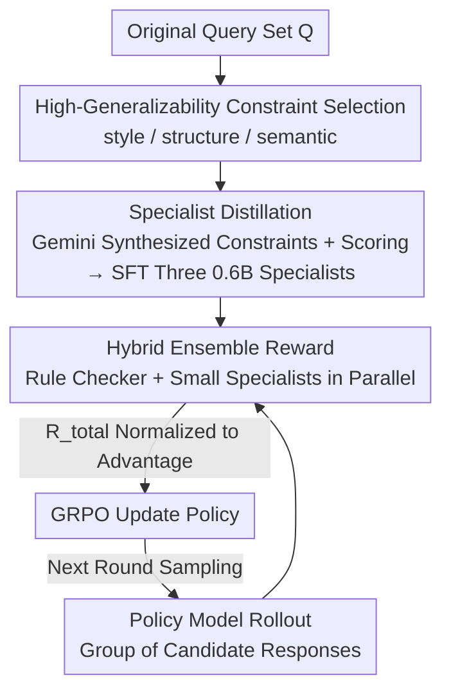

# TinyJudge: Unverifiable Constraint Alignment via Lightweight Specialist Ensembles

**Conference**: ACL 2026  
**arXiv**: [2606.07520](https://arxiv.org/abs/2606.07520)  
**Code**: To be confirmed  
**Area**: Alignment RLHF / Instruction Following / Reward Modeling  
**Keywords**: Unverifiable constraints, LLM-as-a-judge, Reward hacking, Specialist distillation, GRPO

## TL;DR
To address low reward accuracy and slow training performance when using large models as judges (LLM-as-a-judge) for soft constraints in RLVR instruction following, TinyJudge first identifies that "only style/structure/semantic categories possess high generalizability among soft constraints." It then distills the judgment expertise of frontier models into several 0.6B small specialist models to form an ensemble reward. This increases reward accuracy by approximately 12%, accelerates judging by 6x, and reduces total training time by 3x, while improving the downstream instruction satisfaction rate by an average of approximately 10%.

## Background & Motivation
**Background**: Instruction Following (IF) requires LLMs to strictly adhere to various constraints, which are divided into verifiable hard constraints (e.g., "output JSON format," "length ≤ 100 words," verifiable by rule-based programs) and unverifiable soft constraints (e.g., "maintain a professional tone," "colloquial style," requiring semantic understanding for determination). The current mainstream is RLVR (Reinforcement Learning from Verifiable Rewards): hard constraints use code-based rules for rewards, while soft constraints are assigned scores by an LLM-as-a-judge, followed by strategy model optimization via GRPO.

**Limitations of Prior Work**: The authors debunked the implicit assumption that "LLM judges are reliable" through pilot experiments (Section §3), uncovering two fatal issues. First is **severe reward bias**: when evaluating multiple constraints under a single instruction at once, LLM judges tend to "overlook violations" (failing to punish errors), leading to extremely low reward accuracy—Qwen3-32B's judgment accuracy on CFBench is 19.5% lower than rule-based checkers. Second is **explosive training overhead**: using frontier LLMs directly as reward models results in a single-response judgment latency 11x higher than rule-based methods, increasing total training time by approximately 339% (≈3x).

**Key Challenge**: More critically, reward hacking occurs. Visualized training curves demonstrate that models trained only with soft constraints achieve **higher reward scores** during training but show **lower** downstream test performance—the model learns to exploit the bias loopholes of the LLM judge to farm scores rather than truly mastering constraint following. Consequently, "hard-only" models outperform "soft-only" models by 3.0% and mixed-constraint models by 2.4% on IFEval, indicating that using LLMs as soft constraint judges not only fails to provide OOD generalization but is harmful.

**Key Insight**: Instead of fixing the judge model itself, the authors analyzed whether "generalization capabilities vary across different soft constraint types." By subdividing soft constraints into seven categories (style, structure, semantic, linguistic, language, layout, spatial) and conducting individual GRPO training for each to measure generalization on CFBench, they found that style, structure, and semantic categories were significantly higher than the rest—representing more fundamental and universal constraint patterns.

**Core Idea**: Rather than using a massive LLM to evaluate all constraints simultaneously (which is slow and biased), it is better to perform **decoupled evaluation**. Specifically, for a small number of high-generalizability soft constraints, the judgment expertise of frontier models (Gemini-3.0-Pro) is distilled into individual 0.6B small specialist models. During training, these small specialists form an ensemble with rule-based rewards to provide high-precision feedback in milliseconds.

## Method

### Overall Architecture
TinyJudge decomposes the problem of "providing reliable and cheap rewards for soft constraints" into offline and online phases. **Offline Phase (Specialist Distillation)**: Gemini-3.0-Pro is first used to synthesize style/structure/semantic high-generalizability soft constraints into original queries; multiple heterogeneous models then generate responses; Gemini provides binary judgments. These (instruction, response, satisfaction) triplets serve as training data to fine-tune three Qwen3-0.6B specialist judges. **Online Phase (Accelerated GRPO Training)**: The policy model rollouts a group of candidate responses; hard constraints are processed by rule checkers, while soft constraints are processed by corresponding small specialists. The two are summed to obtain the total reward $R_{total}$, and the policy is updated using GRPO. Small specialist inference is executed in parallel with policy sampling, with single-response judgment taking only ~10ms, completely removing the LLM judge latency bottleneck.

### Key Designs

**1. Decoupled Evaluation + High-Generalizability Constraint Selection: Replacing "One Large Judge for All" with "Item-wise Judging + Generalizable Only"**

The root of reward bias lies in "batch judgment"—LLMs face multiple constraints of an instruction simultaneously and lose focus, overlooking violations. Control experiments provide direct evidence: replacing batch judgment with "point-wise judgment" (evaluating only one constraint at a time) increased Qwen3-32B's accuracy on hard constraints by +6.1% and on soft constraints by +9.0%. This indicates that decoupling evaluation to a single-constraint granularity significantly mitigates bias. On this basis, the authors further utilized individual GRPO training of seven constraint types for generalization analysis, retaining only style/structure/semantic types for training, which reduces noise and improves judging efficiency—this step provides the principled basis for distilling only three specialists.

**2. Specialist Reward Synthesis: Distilling Frontier Model Judgment Expertise into 0.6B Small Specialists Offline**

For small models to judge accurately, the training data must cover various satisfied/violated scenarios for each constraint type. For each query $q\in\mathcal{Q}$, Gemini-3.0-Pro first synthesizes and injects a potential soft constraint $c_{soft}$ to obtain the complete instruction $I$; then, responses are sampled from a heterogeneous pool $\mathcal{Y}$ (Qwen2.5-7B/32B-Instruct, Llama3.2-3B) covering different reasoning qualities and common failure modes. For each triplet $(q, c_{soft}, y)$, Gemini-3.0-Pro provides a binary judgment $r$ (satisfaction status), which serves as supervision to fine-tune Qwen3-0.6B (with thinking mode disabled for speed). The objective for the $k$-th specialist $\mathcal{M}_k$ is standard supervised cross-entropy:

$$\mathcal{L}(\theta_k) = -\mathbb{E}_{(I,y,r)\sim\mathcal{D}_k}\sum_t \log P(r \mid I, y; \theta_k)$$

where $\mathcal{D}_k$ is a dataset tailored for a specific constraint type (e.g., style). One specialist is distilled for each of the three high-generalizability constraint types, resulting in a set of lightweight classifiers.

**3. Hybrid Ensemble Reward: Summing Rules + Neural Specialists, Parallel with Rollout to Eliminate Latency**

During online GRPO training, the total reward for each candidate response $y_i$ is calculated by averaging binary results from $N$ rule checkers (hard constraints) and $M$ small specialists (soft constraints), then summing them:

$$R_{total}(q, r_i) = \frac{1}{N}\sum_{n=1}^{N}\mathcal{R}_{rule}^{n}(I, y_i) + \frac{1}{M}\sum_{k=1}^{M}\mathcal{M}_k(I, y_i)$$

The GRPO optimization goal is to maximize $R_{total}$. Since small specialists are 0.6B and disable CoT, they can perform inference in parallel with policy sampling. Single-response judgment takes ~10ms, achieving a 6x speedup compared to the 11x latency of LLM judges. Within-group advantages are normalized as $\hat{A}_i = (r_i - \mu)/\sigma$ and substituted into the GRPO objective. This "additive ensemble + parallel judging" reduces soft constraint computational overhead to nearly the same level as "hard-only" training.

### Loss & Training
The specialist distillation phase uses the SFT cross-entropy in Equation (4); the policy optimization phase uses GRPO (Group Relative Policy Optimization): sampling a group of $G$ candidates per instruction, estimating the baseline via within-group relative comparison, with an objective including clipped importance ratios and a KL regularization term $-\beta\,\mathbb{D}_{KL}[\pi_\theta\|\pi_{ref}]$ relative to the reference policy. The base models are Qwen2.5-7B/32B-Instruct, and the soft constraint judges are the Qwen3-0.6B specialist ensemble.

## Key Experimental Results

### Main Results
Five IF benchmarks: IFEval, Multi-IF, IFBench (hard only) + FollowBench, CFBench (mixed soft/hard), metric is Instruction Satisfaction Rate (ISR).

| Base + Reward | IFEval | Multi-IF | IFBench | CFBench | FollowBench | Average |
|------|------|------|------|------|------|------|
| Qwen2.5-7B-inst (Base) | 72.46 | 51.05 | 28.91 | 44.00 | 61.40 | 51.56 |
| + Qwen3-32B Judge | 79.48 | 57.08 | 30.95 | 49.00 | 69.74 | 57.25 |
| **+ TinyJudge-7B (Ours)** | **82.81** | **64.90** | **35.03** | **54.00** | **70.88** | **61.52** (+9.96) |
| Qwen2.5-32B-inst (Base) | 81.70 | 64.45 | 33.67 | 57.00 | 73.06 | 61.98 |
| + Qwen3-32B Judge | 84.47 | 68.29 | 35.71 | 60.00 | 74.35 | 64.56 |
| **+ TinyJudge-32B (Ours)** | **86.51** | **73.57** | **41.83** | **64.00** | **77.01** | **68.58** (+6.60) |

TinyJudge-7B outperforms the version using Qwen3-32B as a judge by ~4.3 points on average, despite using a 0.6B specialist ensemble; TinyJudge-32B achieves an average of 68.58, approaching the closed-source Claude-Sonnet-4.5 (71.94).

### Reward Reliability / Judging Method Analysis

| Reward Model / Method | Hard Accuracy | Soft Accuracy | Description |
|------|------|------|------|
| Rule Checker | 96.0 | — | Near ground truth for hard constraints |
| Qwen-3-32B · Batch | 76.5 (↓19.5) | 74.5 | ~20 points lower than rules |
| Qwen-3-32B · Point-wise | 82.6 (↑6.1) | 83.5 (↑9.0) | Point-wise significantly better than batch |
| QwQ-32B · Point-wise | 83.8 (↑3.1) | 83.9 (↑5.7) | Also benefits from decoupling |

### Key Findings
- **Reward hacking is an inherent issue for LLM judges**: soft-only models show higher training rewards but lower test performance; this is replicated across Qwen2.5/Qwen3/Llama3.2 and 3B~32B scales, proving it is a systemic flaw of the LLM-as-a-judge paradigm rather than an isolated case.
- **"Decoupling" contributes the most**: Point-wise judgment brings judgment accuracy back to a range comparable with rule-based methods, which is the prerequisite for TinyJudge to achieve high precision with small models.
- **Efficiency is nearly free**: TinyJudge's training overhead is nearly identical to "hard-only" training—it compresses the cost of soft constraint alignment to the level of rule-based methods (~10ms per response vs. ~30ms rules vs. 11x for LLM judges).

## Highlights & Insights
- **Generalization diagnosis before method design**: Instead of stacking specialists blindly, the authors proved that "only three types of soft constraints are highly generalizable," providing a principled basis for distilling only three 0.6B specialists and avoiding redundant models.
- **Quantifying "Reward Hacking" as an observable signal**: The divergence between high training rewards and low test performance solidifies reward hacking claims more convincingly than general statements about judge unreliability.
- **Transferable logic**: Any scenario using LLMs as RL rewards (code, math, safety alignment) can benefit from the combination of "point-wise judging + small specialist distillation + parallel execution with rollout."

## Limitations & Future Work
- The selection of high-generalizability constraints (style/structure/semantic) depends on generalization tests on CFBench; whether these three remain optimal across other benchmarks or taxonomies remains to be verified.
- Specialists are distilled from Gemini-3.0-Pro, meaning the reward upper bound is locked by the teacher model's capability; the teacher's own biases will be inherited.
- Binary (satisfaction/violation) determination loses fine-grained information about "degree of satisfaction," which may be insufficient for soft constraints requiring continuous scoring (e.g., "level of professional tone").
- Only three high-generalizability categories are covered; layout/spatial and other low-generalizability constraints remain excluded from RL training and are not truly "solved."

## Related Work & Insights
- **vs. LLM-as-a-judge (e.g., Qwen3-32B directly as judge)**: These perform batch judging of all constraints, which is slow and biased; TinyJudge uses point-wise judging + 0.6B ensemble to exceed accuracy and achieve 6x speedup.
- **vs. RLVR Extensions (IF-RLVR / RECAST / Qwen-IF)**: These incorporate heterogeneous constraints into RLVR for generalization but assume LLM judges are reliable; this paper debunks that assumption and reconstructs rewards from the perspective of "constraint generalizability."
- **vs. Hard-only RLVR**: Rule-based methods are stable but cannot cover soft constraints; TinyJudge incorporates soft constraints into reliable rewards while maintaining overhead similar to hard-only methods.

## Rating
- Novelty: ⭐⭐⭐⭐ Reconstructing reward sources from "constraint generalizability" and combining specialist distillation with point-wise judging is novel.
- Experimental Thoroughness: ⭐⭐⭐⭐⭐ Five benchmarks + cross-validation across multiple models/scales + multi-angle diagnostics of accuracy/latency/reward hacking.
- Writing Quality: ⭐⭐⭐⭐ Pilot experiments provide strong motivation; methods are tightly linked to insights.
- Value: ⭐⭐⭐⭐ Provides a scalable, low-cost, and reward-hacking-resistant practical path for RLVR soft constraint alignment.

<!-- RELATED:START -->

## Related Papers

- [\[ACL 2026\] MDP-GRPO: Stabilized Group Relative Policy Optimization for Multi-Constraint Instruction Following](mdp-grpo_stabilized_group_relative_policy_optimization_for_multi-constraint_inst.md)
- [\[ICLR 2026\] AlphaSteer: Learning Refusal Steering with Principled Null-Space Constraint](../../ICLR2026/llm_alignment/alphasteer_learning_refusal_steering_with_principled_null-space_constraint.md)
- [\[ACL 2026\] On the Rejection Criterion for Proxy-Based Test-Time Alignment](on_the_rejection_criterion_for_proxy-based_test-time_alignment.md)
- [\[ACL 2026\] Towards Bridging the Reward-Generation Gap in Direct Alignment Algorithms](towards_bridging_the_reward-generation_gap_in_direct_alignment_algorithms.md)
- [\[ACL 2026\] Alignment Data Map for Efficient Preference Data Selection and Diagnosis](alignment_data_map_for_efficient_preference_data_selection_and_diagnosis.md)

<!-- RELATED:END -->
