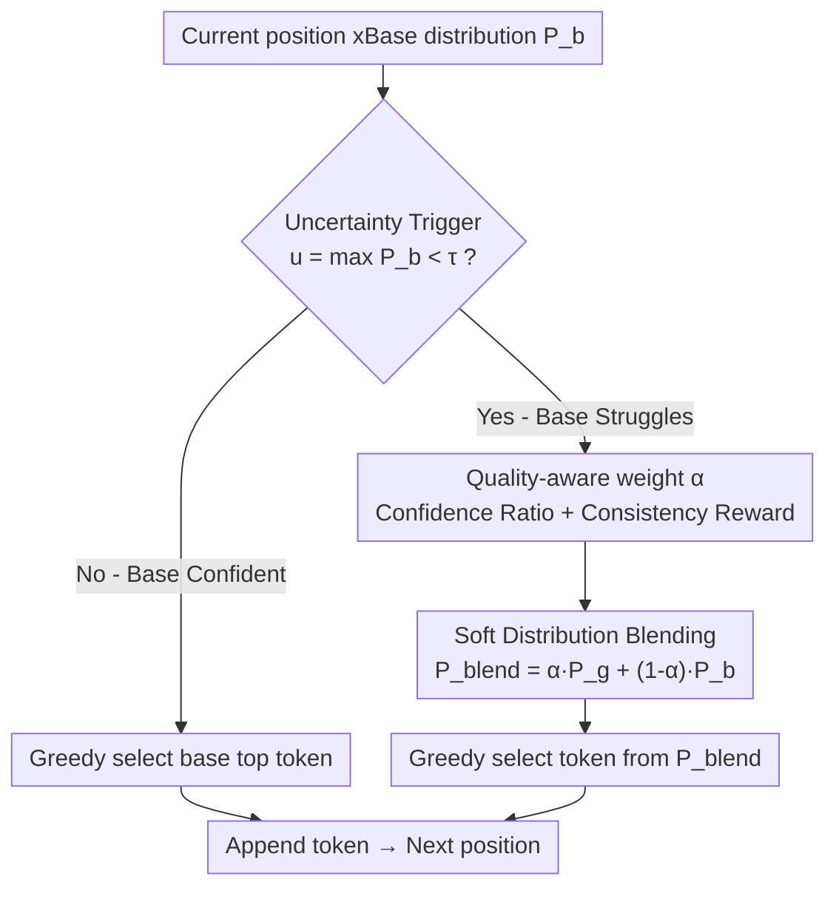

# To Intervene or Not: Guiding Inference-time Alignment with Probabilistic Model Blending

**Conference**: ACL 2026  
**arXiv**: [2606.11201](https://arxiv.org/abs/2606.11201)  
**Code**: https://github.com/DecayingSeart/BlendIn  
**Area**: RLHF Alignment / Inference-time Alignment / Decoding Strategy  
**Keywords**: Inference-time alignment, distribution blending, quality blindness, intervention paradox, guidance model

## TL;DR
Addressing the "quality blindness" in inference-time alignment—where an aligned model guides an unaligned base model token-by-token but fails to distinguish good advice from bad, leading to an "intervention paradox" where more intervention results in worse performance—BlendIn adopts quality-aware probabilistic distribution blending. At positions where the base model is uncertain, it adaptively fuses the distributions of both models based on their respective confidence levels before greedily selecting a token. This preserves beneficial guidance while suppressing unreliable suggestions, achieving up to a 50% consistent improvement on the most challenging high-intervention model pairs.

## Background & Motivation
**Background**: Aligning LLMs (for safety and instruction following) traditionally relies on SFT/RLHF fine-tuning, which is costly as every new model requires individual alignment. **Inference-time alignment** has emerged as an alternative: it corrects an unaligned base model $M_b$ at decoding time using an aligned guidance model $M_g$ (or its signals) without updating parameters. Representative works include NUDGING (where the guidance model proposes tokens when the base top-1 probability falls below a threshold), IVG (using value functions to select the highest-scoring candidate), and InferAligner (shifting activations when harmful queries are detected).

**Limitations of Prior Work**: Despite different mechanisms, these methods share an implicit assumption—**all guidance is beneficial**—and thus perform binary decision-making (either accepting the top token from guidance or rejecting it to fall back to the base). Systematic evaluation by the authors across 9 models, 3 families, and 6 benchmarks debunked this assumption: guidance effectiveness fluctuates violently across model pairs, with some combinations succeeding while others fail catastrophically. More counter-intuitively, an **intervention paradox** appears—higher intervention rates correlate with worse overall performance (significant negative correlations on GSM8K, TruthfulQA, and XSTest), leading to systemic performance drops when more than approximately 20% of tokens are intervened upon.

**Key Challenge**: When the base model makes an incorrect or unsafe prediction at a difficult position, the guidance model is often **equally challenged at the same position**, offering similarly flawed advice. Binary acceptance propagates these erroneous tokens, creating more uncertain positions and triggering further interventions, which leads to cascading failures. Existing methods treat "confident good advice" and "erroneous bad advice" identically, a phenomenon termed **quality blindness**. The authors ruled out surface-level explanations: vocabulary overlap shows no significant correlation with performance (e.g., Qwen→Llama with high overlap may fail, while Gemma→Llama with low overlap succeeds). Hard-capping the intervention rate to 15% also fails, actually worsening performance, proving the issue lies in guidance **quality** rather than **quantity**.

**Core Idea**: Replace "binary accept/reject" with "quality-proportional soft blending." At each position where the base model is uncertain, the **full probability distributions** of the guidance and base models are blended using a weight $\alpha$ that reflects their respective reliability. Greedy token selection from this blended distribution preserves helpful guidance while automatically suppressing unreliable suggestions.

## Method

### Overall Architecture
BlendIn positions itself as a **stabilizer** for inference-time alignment: it does not replace or overwrite the base generation but moves to **softly** blend guidance at positions where the base is "unsure," preventing cascading failures. During token-by-token decoding, the max probability of the base model $u=\max_w P_b(w\mid x_{<t})$ is checked. If $u \ge \tau$ (default $\tau=0.4$), the base is considered confident, and its top token is selected greedily without triggering guidance. Only when $u < \tau$ does the system query the guidance model's distribution, calculate the quality-aware blending weight $\alpha$, fuse the two distributions, and perform greedy selection. This restricts intervention to positions where it is truly needed and uses quality-aware weights to determine "how much to listen to the guidance."

### Key Designs

**1. Soft Distribution Blending vs. Binary Decision: Proportional Co-generation**

The deadlock of binary decision-making is that when guidance is unreliable, one must either accept a harmful suggestion (degrading performance) or reject it entirely (losing potential benefits). BlendIn avoids this choice at uncertain positions ($u < \tau$) by constructing a blended distribution where both models contribute:

$$P_{blend}(w\mid x_{<t}) = \alpha\cdot P_g(w\mid x_{<t}) + (1-\alpha)\cdot P_b(w\mid x_{<t}),\qquad w_t = \arg\max_{w\in\mathcal{V}} P_{blend}(w\mid x_{<t})$$

Even if the guidance model is generally unreliable, its distribution may still contain useful signals; appropriately downweighted, it can improve upon the base model alone. Conversely, the base model, often being more capable, can still provide valid information. Greedy selection from the blend effectively replaces the 0/1 "accept/reject" switch with a continuous dial—when guidance is pathologically wrong, its contribution is suppressed, achieving a **graceful fallback**. To save computation, the full distribution can be approximated by top-k (with a large $k$). For cross-family pairs, weighted tokens are re-normalized across shared entries, requiring no tokenizer alignment.

**2. Quality-aware Blending Weight α: Confidence Ratio + Consistency Reward**

The blending weight $\alpha \in [0, 1]$ is the core of quality awareness, determining the influence of guidance at each step:

$$\alpha = \mathrm{clip}\!\left(\frac{\hat{p}_g}{\hat{p}_b + \hat{p}_g} + \lambda\cdot P_b(t_g),\ 0,\ 1\right)$$

Where $\hat{p}_b=\max_w P_b(w\mid x_{<t})$ and $\hat{p}_g=\max_w P_g(w\mid x_{<t})$ are the top-1 probabilities of both models, $t_g=\arg\max_w P_g$ is the guidance model's preferred token, and $\lambda=0.1$. The first term, **Confidence Ratio**, naturally amplifies intervention intensity when "guidance is confident while the base is hesitant." The second term, **Consistency Reward**, adds weight if the guidance's preferred token already has some support in the base distribution, reducing the risk of distribution mismatch ($\lambda=0.1$ ensures the confidence ratio remains dominant). This adaptive weight ensures guidance is stronger at uncertain positions and the base is prioritized at confident ones; $\alpha$ can also be manually tuned per task.

**3. Intervention Rate as a Diagnostic Signal: Predicting Failure via Small Samples**

This serves as both an analytical and a practical tool. The authors demonstrate that the intervention rate is negatively correlated with performance (the intervention paradox). Consequently, a **high intervention rate serves as a diagnostic signal for poor guidance quality**. Compatible "Base ↔ Guidance" pairs can be identified early by observing intervention rates on a small data subset without running full benchmarks. Notably, the authors distinguish BlendIn from "confidence-based ensembling": while the latter arbitrates between peer models without directionality, inference-time alignment is **directional**—pushing the base towards an alignment target. The intervention paradox is unique to this directional pressure (pushing too hard destroys base capabilities), highlighting the distinct nature of the problem.

### An Example: Resolving Cascading Failures of '+' vs '-' via Blending
Figure 1 in the original paper illustrates an arithmetic generation example. At a specific position, the correct token is '-', but unreliable guidance suggests '+'. Under binary acceptance, this error is adopted and propagated, triggering an intervention rate of 28% and leading to an incorrect result. With BlendIn, because '-' retains strong support in the base distribution and the confidence/consistency of '+' is insufficient for $\alpha$ to overwhelm the base, the $\arg\max$ of the blended distribution remains '-'. The intervention rate drops to approximately 12%, and the correct answer is obtained. The soft blending approach allows for a different outcome using the same guidance model.

## Key Experimental Results

### Main Results
Evaluations on GSM8K, TruthfulQA, and XSTest comparing "Base ↔ Guidance" pairs: Base (base only), Guid. (guidance only), Alig. (ideal alignment upper bound), NUDG. (NUDGING baseline), and Ours (BlendIn). Int.% denotes the intervention rate. L/G/Q refer to Llama/Gemma/Qwen respectvely.

| Model Pair | Benchmark | Base | NUDGING | BlendIn | Relative to NUDGING |
| :--- | :--- | :--- | :--- | :--- | :--- |
| Q→L | GSM8K | 0.11 | 0.27 | 0.31 | +15% |
| G→L | TruthfulQA | 0.58 | 0.45 | 0.50 | +11% |
| L→G | XSTest | 0.01 | 0.10 | 0.15 | +50% |
| G→G | XSTest | 0.01 | 0.10 | 0.14 | +40% |
| Q→L | XSTest | 0.00 | 0.03 | 0.04 | +33% |

BlendIn consistently improves performance across both cross-family and same-family pairs with almost no degradation, showing up to 50% gains in difficult high-intervention scenarios.

### Ablation Study
| Analysis | Conclusion |
| :--- | :--- |
| Intervention Rate vs. Performance | Negative correlation, statistically significant on GSM8K/TruthfulQA/XSTest; systemic drops when >20% of tokens are intervened. |
| Vocab Overlap vs. Performance | No significant correlation (high overlap can still fail), ruling out "tokenization mismatch" as the root cause. |
| Capping Intervention Rate at 15% | Performance worsens—good and bad guidance are discarded indiscriminately, proving the issue is quality, not quantity. |

### Key Findings
- **Quality blindness is a universal flaw in existing methods**: Performance varies wildly for the same base model just by changing the guidance model; binary methods fail to distinguish them.
- **Intervention rate is a "symptom," not the "cause"**: High intervention reflects guidance struggling; capping it treats the symptom, whereas soft blending treats the cause by downweighting bad advice.
- **Directionality distinguishes it from standard ensembling**: BlendIn pushes the base towards an alignment goal, making it susceptible to the intervention paradox—a failure mode not found in ordinary ensembling.

## Highlights & Insights
- **Turning "when to intervene" from heuristic into principled diagnosis**: The intervention rate is used as both an explained phenomenon (the paradox) and a tool for small-sample compatibility prediction.
- **Training-free and Plug-and-play**: BlendIn requires no additional training or value functions. It modifies only the decoding-time fusion, works across families without tokenizer alignment, and has very low deployment costs.
- **Transferable Design**: The "adaptive soft weighting using confidence ratio + consistency reward" can be applied to other multi-signal fusion scenarios like speculative decoding, model ensembling, or multi-teacher distillation.

## Limitations & Future Work
- While the two hyperparameters for adaptive $\alpha$ ($\tau=0.4, \lambda=0.1$) have principled defaults, the authors acknowledge they may require task-specific manual tuning for optimal results.
- Experiments focus on benchmarks measured by accuracy or safety scores (GSM8K/TruthfulQA/XSTest); stability in open-ended generation or long-form writing remains to be fully explored.
- Soft blending requires querying the guidance model's distribution (full or top-k) at every uncertain position, incurring additional forward pass overhead compared to pure base decoding.
- "Quality awareness" relies entirely on the top-1 confidence of the models; if the guidance model is confidently wrong, the confidence ratio may lead to a dangerously high $\alpha$.

## Related Work & Insights
- **vs. NUDGING (Fei et al. 2025)**: NUDGING accepts a guidance token binary when the base top-1 is below a threshold; BlendIn uses soft distribution blending under the same trigger to retain benefits and mitigate risks.
- **vs. IVG / InferAligner**: These use value-based token selection or activation steering, which are "hard" interventions that assume guidance is always beneficial; BlendIn uses soft blending to address quality blindness directly.
- **vs. Confidence-based Ensembling (Lakshminarayanan et al. 2017)**: The latter arbitrates between peers without directionality; BlendIn applies directional pressure toward an alignment target, using confidence to regulate intervention strength and prevent capability degradation.

## Rating
- Novelty: ⭐⭐⭐⭐ Uncovers the "intervention paradox" and "quality blindness," resolving them via soft blending.
- Experimental Thoroughness: ⭐⭐⭐⭐ Systematic evaluation of 9 models across 3 families and 6 benchmarks, including counterfactual analyses.
- Writing Quality: ⭐⭐⭐⭐⭐ Logical progression from motivation to proof, with clear debunking of surface-level assumptions.
- Value: ⭐⭐⭐⭐ Training-free, plug-and-play, and provides a diagnostic signal, making it highly practical.

<!-- RELATED:START -->

## Related Papers

- [\[NeurIPS 2025\] Inference-time Alignment in Continuous Space](../../NeurIPS2025/llm_alignment/inference-time_alignment_in_continuous_space.md)
- [\[ACL 2026\] Debiasing Reward Models via Causally Motivated Inference-Time Intervention](debiasing_reward_models_via_causally_motivated_inference-time_intervention.md)
- [\[ICML 2026\] Reward Shaping for (Inference-Time) Alignment: A Stackelberg Game Perspective](../../ICML2026/llm_alignment/reward_shaping_for_inference-time_alignment_a_stackelberg_game_perspective.md)
- [\[ACL 2026\] On the Rejection Criterion for Proxy-Based Test-Time Alignment](on_the_rejection_criterion_for_proxy-based_test-time_alignment.md)
- [\[AAAI 2026\] W2S-AlignTree: Weak-to-Strong Inference-Time Alignment for Large Language Models via Monte Carlo Tree Search](../../AAAI2026/llm_alignment/w2s-aligntree_weak-to-strong_inference-time_alignment_for_large_language_models_.md)

<!-- RELATED:END -->
