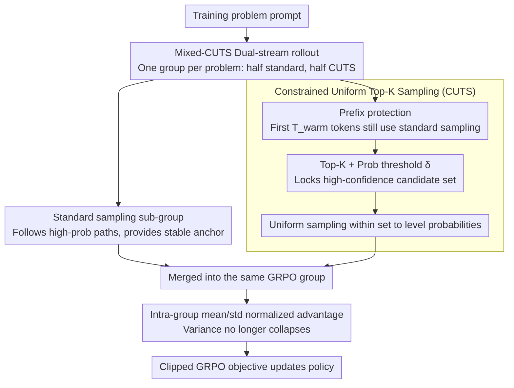

# Too Correct to Learn: Reinforcement Learning on Saturated Reasoning Data

**Conference**: ACL2026  
**arXiv**: [2604.18493](https://arxiv.org/abs/2604.18493)  
**Code**: To be confirmed  
**Area**: LLM Alignment / LLM Reasoning RL  
**Keywords**: Saturated reasoning data, GRPO, CUTS, Exploration diversity, Mode collapse

## TL;DR
This paper points out that strong reasoning models stop learning during GRPO on training sets that are "too easy and nearly all correct" because intra-group reward variance disappears. It proposes Mixed-CUTS, which mixes standard rollouts with constrained Top-K uniform sampling to recreate meaningful exploration differences. On Qwen3-4B, this method improves AIME25 Pass@1 by 15.1% compared to standard GRPO.

## Background & Motivation
**Background**: LLM post-training for mathematics and complex reasoning tasks increasingly relies on reinforcement learning based on outcome rewards. Methods like GRPO do not require training an additional value network; instead, they estimate relative advantages using the intra-group mean and standard deviation of multiple rollouts under the same prompt, making them highly suitable for large-scale reasoning RL.

**Limitations of Prior Work**: As base models like the Qwen3 and DeepSeek-R1 series become stronger, many standard training sets have reached saturation. Models can already answer most questions correctly on data like MATH, and the generated paths are highly homogeneous. For GRPO, this is problematic: when an entire group of rollouts is correct, the reward standard deviation approaches 0, the relative advantage signal vanishes, and the policy lacks sufficient gradient to explore stronger generalized reasoning paths.

**Key Challenge**: Traditional intuition suggests that RL failure occurs because the model is "not capable enough," requiring more correct samples or stronger rewards. This paper highlights the opposite phenomenon: the model is "too capable" on training data, leading to a lack of incorrect samples and contrastive signals. Simple entropy regularization may disperse the distribution indiscriminately, potentially destroying rigorous reasoning chains rather than generating semantic exploration.

**Goal**: The authors aim to restore intra-group reward variance through the generation strategy itself—without modifying the GRPO objective or introducing new model parameters—allowing saturated data to regenerate learnable signals and observing whether this exploration can transfer to harder or cross-domain benchmarks like AIME, AMC, and GPQA.

**Key Insight**: The intervention is placed at decoding rather than the reward function. Standard sampling tends to follow existing preferences where the "stronger gets stronger," sampling the same type of high-probability paths. By leveling probabilities within a high-confidence local set, it becomes possible to sample candidates that are still reasonable but were originally suppressed by the dominant mode.

**Core Idea**: Mix standard sampling with Constrained Uniform Top-K Sampling (CUTS) in the rollout group for each prompt. This allows exploitative trajectories to maintain the stability of the current policy while exploratory trajectories provide structured perturbations, thereby restoring the intra-group advantage variance of GRPO.

## Method

### Overall Architecture
The method consists of two layers. The bottom layer is the CUTS decoding operator: at each token position, it first takes the Top-K candidates of the model distribution, filters out low-confidence tail tokens using a probability threshold, and finally performs uniform sampling within the remaining high-confidence set. Thus, it does not spread probability mass into meaningless tails like high-temperature sampling, nor does it always follow the highest-probability path like greedy or standard sampling.

The top layer is the Mixed-CUTS training framework: for each training problem, a set of rollouts is generated, with half coming from standard sampling and the other half from CUTS. Rewards, mean, standard deviation, and normalized advantages are still calculated within the merged group according to GRPO. Even if the standard sampling part is entirely correct on saturated problems, the CUTS part may still produce a mix of correct/incorrect outputs by exploring different branches or find correct branches that standard paths missed on difficult problems, ensuring the intra-group variance does not collapse.

### Key Designs

**1. Constrained Uniform Top-K Sampling: Leveling probabilities only in high-confidence local neighborhoods to inject "structure-preserving" diversity.**

Reasoning RL requires exploration, but exploration becomes noise if it disrupts the local coherence of the reasoning chain. Standard sampling follows the highest-probability path, while high-temperature sampling spreads probability mass to meaningless tail tokens; neither is ideal. CUTS proceeds as follows: given the current distribution $P_\theta(v|q,x_{<t})$, it takes the Top-K candidates and retains only tokens with probabilities greater than a threshold $\delta$ to obtain set $\mathcal{S}_t$. Finally, it samples uniformly over $\mathcal{S}_t$—meaning each candidate's probability is leveled to $1/|\mathcal{S}_t|$ (backing off to Top-K if the set is empty, or deterministic choice if only one candidate remains). Since homogenization occurs only within the "high-confidence" local neighborhood defined by the model itself, it breaks excessive peaks while preserving reasonable candidates, making it less likely to produce incoherent reasoning than global entropy regularization or high-temperature sampling.

**2. Mixed-CUTS Dual-stream Rollout: Combining stable exploitation and controlled exploration in the same GRPO group to restore advantage signals.**

The Achilles' heel of GRPO on saturated data is that when a group of rollouts is all correct, the intra-group reward standard deviation approaches 0, relative advantages vanish, and the policy stops learning. Mixed-CUTS splits the rollout group $\mathcal{G}$ for each prompt into a standard sampling sub-group $\mathcal{G}_{std}$ and a CUTS sub-group $\mathcal{G}_{CUTS}$, with advantages calculated on the merged group. Total variance decomposition shows that the mixture variance consists of intra-group variance and the difference between the means of the two sub-groups:

$$\sigma^2_{mixed}=\underbrace{\text{Intra-group Variance}}_{}+\underbrace{\text{Inter-group Mean Difference}}_{}$$

As long as the average reward or internal variance of the CUTS sub-group differs from the standard sub-group, $\sigma^2_{mixed}$ will not collapse to 0. Both streams are essential: using only CUTS would cause the behavior policy to deviate too far from the current model and destabilize training, while using only standard sampling leads to zero variance on saturated problems. The standard trajectories provide anchors, while CUTS trajectories provide contrast, reactivating the intra-group contrastive signal.

**3. Prefix Protection and Controlled Off-policy Bias: Delaying exploration to where branches occur and constraining behavioral policy deviation.**

Early decisions in mathematical reasoning (understanding the problem, formatting) are critical; failure here leads to total failure. Therefore, random exploration cannot start from the first token. CUTS uses standard sampling for the first $T_{warm}$ tokens, only enabling local homogenization after the problem understanding and reasoning framework are stable. This ensures diversity manifests as "alternate reasonable solutions" rather than "random steps from the start." Furthermore, as CUTS is an off-policy behavioral sampling, the paper controls this bias using three layers: Top-K ensures candidates are from high-probability areas, threshold $\delta$ removes the tail, and the outer layer utilizes the clipped GRPO objective to limit per-step updates. Together, these ensure exploration is large enough to restore variance without pushing the policy into non-convergent regions.

### Loss & Training
The training objective follows GRPO. Given $G$ outputs for the same problem, outcome rewards are calculated and normalized using the intra-group mean and standard deviation: $\hat{A}_i=(r_i-mean(r))/ (std(r)+\epsilon)$. This trajectory-level advantage is applied to each token. The core contribution is not modifying this objective but ensuring $std(r)$ remains informative in saturated scenarios through Mixed-CUTS.

Experiments were conducted on Qwen3-1.7B and Qwen3-4B in non-thinking mode using the MATH training set for RL. Evaluations covered MATH, AIME24, AIME25, AMC, and GPQA, with additional zero-shot cross-domain tests on MMLU-Pro and SuperGPQA. The maximum generation length was set to 12,000 tokens for the 4B model and 5,000 for the 1.7B model to avoid truncating long reasoning chains.

## Key Experimental Results

### Main Results
The table below extracts Pass@1 results, showing the gains of Mixed-CUTS over standard GRPO across different benchmarks. All training used only the MATH dataset; AIME/AMC/GPQA results reflect out-of-domain generalization or performance on harder problems.

| Model | Method | MATH | AIME24 | AIME25 | AMC | GPQA |
|------|------|------|--------|--------|-----|------|
| Qwen3-1.7B | GRPO | 83.6 | 29.5 | 22.8 | 59.8 | 34.2 |
| Qwen3-1.7B | Mixed-CUTS | 85.1 | 32.3 | 28.1 | 62.7 | 36.0 |
| Qwen3-1.7B | Gain | +1.5 | +2.8 | +5.3 | +2.9 | +1.8 |
| Qwen3-4B | GRPO | 86.4 | 32.5 | 26.6 | 68.9 | 48.1 |
| Qwen3-4B | Mixed-CUTS | 90.8 | 46.0 | 41.7 | 76.7 | 50.1 |
| Qwen3-4B | Gain | +4.4 | +13.5 | +15.1 | +7.8 | +2.0 |

The core result is the improvement of Qwen3-4B on AIME25 from 26.6 to 41.7, indicating that the gains from Mixed-CUTS represent generalization to harder problems rather than memorizing MATH patterns. The 1.7B model also shows steady improvements, but gains are larger on the 4B model, supporting the interpretation that "stronger models have more latent reasoning branches to be unlocked."

### Ablation Study
The paper also tests the zero-shot accuracy of Qwen3-4B checkpoints (trained only on MATH) on non-mathematical benchmarks.

| Training Method | MMLU-Pro | SuperGPQA | Note |
|----------|----------|-----------|------|
| Base Model | 63.80% | 33.05% | Before this round of RL training |
| Standard GRPO | 68.59% | 40.03% | Math RL already improved generalization |
| Mixed-CUTS | 69.65% | 41.28% | Further improvement +1.06 / +1.25 over GRPO |

Training dynamics analysis supports the mechanism hypothesis: standard GRPO policy entropy remains stagnant at approximately 0.20-0.25, with response length plateauing around 1200 tokens. Mixed-CUTS maintains higher entropy and pushes reasoning length beyond 1800 tokens. AIME25 rewards diverge significantly after step 30, and the final maj@16 consistency improvement reaches 23.2%, suggesting the method pushes correct reasoning paths to higher probabilities rather than relying on accidental sampling coverage.

### Key Findings
- Saturated data is not "useless" but requires reactivating contrastive signals. The role of Mixed-CUTS is not to reduce problem difficulty but to generate meaningful success/failure or path differences for the same problem.
- Gains are concentrated on harder out-of-domain benchmarks, especially AIME24/25. This suggests exploration is not noise but rather unearths reasoning branches suppressed by standard sampling near the model's existing capabilities.
- The Pass@1 gain is greater than the Pass@16 gain (e.g., Qwen3-4B on MATH: +4.4 vs +0.7), indicating the method changes the main probability mass of a single generation rather than just expanding random coverage.

## Highlights & Insights
- The paper clearly articulates the phenomenon where "high accuracy leads to stagnation in RL." It serves as a reminder that effective samples in outcome-reward RL are not the correct samples themselves, but the differences between rollouts in the same group.
- The exploration boundary of CUTS is restrained: it only levels probabilities within the Top-K and threshold-filtered local set. This design is more suited for reasoning tasks than simply increasing temperature, as it acknowledges that the model's high-confidence distribution is valuable but needs to break excessive peaking.
- Mixed-CUTS can be viewed as a form of rollout-level data augmentation. It does not change the reward function but alters the "multi-solution" distribution seen by RL. this approach could be transferred to code generation, tool use, and agent planning where premature convergence occurs.

## Limitations & Future Work
- The authors do not provide a rigorous convergence or optimality analysis. Mixed-CUTS introduces a mixed behavioral policy, and while Top-K, thresholds, and clipping control bias, the theoretical properties of long-term policy improvement remain unproven.
- Diversity is approximated as "local homogenization within Top-K," which is a practical proxy rather than equivalent to semantic diversity. Future work could combine process rewards, error localization, or hidden-state novelty to define more targeted exploration criteria.
- Experiments primarily focus on Qwen3 and mathematical datasets. While cross-domain tests exist, they are insufficient to prove the strategy's stability in structured tasks like coding or multi-turn agents.
- Hyperparameters for CUTS ($K$, $\delta$, $T_{warm}$) may be sensitive to different models and tasks. A natural improvement would be dynamically adjusting exploration intensity based on current prompt difficulty or early rollout uncertainty.

## Related Work & Insights
- **vs Standard GRPO**: GRPO replaces the critic with intra-group reward statistics for efficiency; Mixed-CUTS retains the GRPO objective but changes rollout sampling to ensure statistics remain informative on saturated data.
- **vs Entropy Regularization / High-Temperature Sampling**: Entropy regularization encourages flattening the distribution at the objective level, while high-temperature sampling adds randomness globally; CUTS levels probabilities only within high-confidence Top-K sets, emphasizing "exploration among reasonable candidates."
- **vs Curiosity / Novelty Exploration**: Many exploration methods require additional reward models, state distances, or historical memory. Mixed-CUTS is a parameter-free, decoding-time operation that is lighter to implement but has more limited expressive power.

## Rating
- Novelty: ⭐⭐⭐⭐☆ The diagnosis of "vanishing advantage due to saturation" is insightful, and CUTS is a simple yet well-positioned intervention.
- Experimental Thoroughness: ⭐⭐⭐⭐☆ Main experiments, cross-domain generalization, and training dynamics support the conclusions, though the model families and task types could be expanded.
- Writing Quality: ⭐⭐⭐⭐☆ The narrative is clear, and the mechanical explanations and variance decompositions are easy to follow; some theoretical expressions remain intuitive.
- Value: ⭐⭐⭐⭐⭐ Highly practical for current strong reasoning model RL, especially for the challenge of continuous training as data becomes saturated.

<!-- RELATED:START -->

## Related Papers

- [\[ICML 2026\] Decoupling Reasoning and Confidence: Resurrecting Calibration in Reinforcement Learning from Verifiable Rewards](../../ICML2026/llm_alignment/decoupling_reasoning_and_confidence_resurrecting_calibration_in_reinforcement_le.md)
- [\[ACL 2026\] PERSA: Reinforcement Learning for Professor-Style Personalized Feedback with LLMs](persa_reinforcement_learning_for_professor-style_personalized_feedback_with_llms.md)
- [\[ACL 2026\] What Makes Good Instruction-Tuning Data? An In-Context Learning Perspective](what_makes_good_instruction-tuning_data_an_in-context_learning_perspective.md)
- [\[ACL 2026\] Why Supervised Fine-Tuning Fails to Learn: A Systematic Study of Incomplete Learning in Large Language Models](why_supervised_fine-tuning_fails_to_learn_a_systematic_study_of_incomplete_learn.md)
- [\[ACL 2026\] Better Literary Translation: A Multi-Aspect Data Generation and LLM Training Approach](better_literary_translation_a_multi-aspect_data_generation_and_llm_training_appr.md)

<!-- RELATED:END -->
