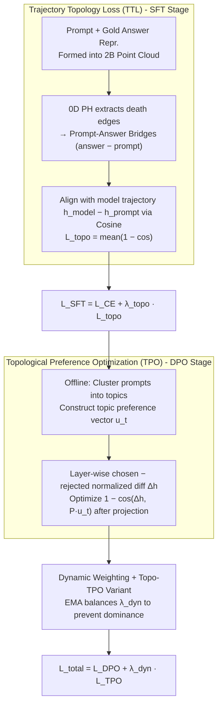

# Topology-Enhanced Alignment for Large Language Models: Trajectory Topology Loss and Topological Preference Optimization

**Conference**: ACL2026  
**arXiv**: [2605.07172](https://arxiv.org/abs/2605.07172)  
**Code**: To be confirmed  
**Area**: LLM Alignment  
**Keywords**: Topological Data Analysis, Persistent Homology, SFT, DPO, Representation Trajectories

## TL;DR
This paper views LLM alignment as a "semantic trajectory" shaping problem in the hidden space. It extracts prompt-answer topological bridges using 0D persistent homology to incorporate TTL during the SFT stage, and utilizes topic-specific preference directions for TPO during the DPO stage. This approach consistently outperforms non-topological baselines in reward, win rate, and harmlessness metrics on UltraChat and HH-RLHF.

## Background & Motivation
**Background**: Current LLM alignment typically involves Supervised Fine-Tuning (SFT) followed by RLHF or DPO. SFT primarily optimizes token-level likelihood, while DPO/RLHF optimizes preference scores or pairwise rankings. While powerful, these training signals mostly remain at the level of local samples or scalars.

**Limitations of Prior Work**: Existing objective functions rarely constrain how internal representations move from a user prompt to an answer, nor do they focus on the "improvement direction" from rejected to chosen responses in the hidden space. Models may resemble preference data at the output level without necessarily learning stable, transferable hidden-space paths.

**Key Challenge**: Alignment essentially requires the model to generate along "more helpful, safer, and instruction-following" directions. However, standard objectives only provide local preferences for tokens or pairs, failing to explicitly exploit the global geometric structure of batches in the representation space. There is a gap between local likelihood and global semantic manifolds.

**Goal**: The authors aim to answer whether the hidden states of prompts, answers, chosen, and rejected responses can be treated as point clouds, using topological data analysis to extract stable cross-cluster connections to regularize the model's semantic trajectories.

**Key Insight**: 0D persistent homology records the merging of connected components in a point cloud as the distance threshold increases. The "death edges" across different labels resemble critical bridge edges in a Minimum Spanning Forest. The authors argue these bridges reflect the global contact between prompt and answer manifolds more effectively than random, gold-pair, or kNN pairings.

**Core Idea**: Replace arbitrary local pairings with topological bridges, transforming "output correctness" into "hidden states moving along topologically reasonable directions."

## Method

### Overall Architecture
The method consists of two training stages. The first stage is SFT + Trajectory Topology Loss (TTL): for each batch, mean-pooled last-layer hidden states are obtained for prompt tokens, teacher-forced answer tokens, and the input embedding means of gold answer tokens. A point cloud of $2B$ points is formed from prompt and gold answer representations. 0D persistent homology is applied to extract death edges connecting prompt and answer points, forming "prompt-answer bridges." The model's actual prompt-to-answer hidden trajectory is aligned with these bridge directions.

The second stage is DPO + Topological Preference Optimization (TPO): HH-RLHF prompts are clustered into topics offline to construct topic-specific preference vectors using sentence transformers with positive/negative templates. During DPO training, the difference between mean-pooled hidden states of chosen and rejected responses is calculated at intermediate layers. A small projection matrix maps topic vectors into the model hidden space, and a cosine loss aligns the "rejected-to-chosen" semantic improvement direction. The final loss is a combination of DPO loss and dynamically weighted TPO loss.

### Key Designs

**1. Trajectory Topology Loss in SFT: Global structure supervision via persistent homology bridges**
Per-sample gold pairing only focuses on the current sample, while kNN only looks at local neighbors, and random pairing is noisy. These methods fail to guide the model towards "globally reasonable" directions. The authors concatenate prompt and gold answer representations in a batch into a $2B$ point cloud. Using Union-Find, they merge components by Euclidean distance and record edges causing component "deaths." Only edges connecting different labels (prompt to answer) are kept as prompt-answer bridges ($v_{topo}$). The model's actual trajectory is $v_{model} = h_i^{model} - h_i^{prompt}$. TTL is the cosine loss between these: $L_{topo} = mean(1 - cos(v_{topo}, v_{model}))$. These bridges are more stable than other methods as they derive from the point cloud's global connectivity.

**2. Topological Preference Optimization in DPO: Refining "Chosen over Rejected" as topic-specific movement**
Standard DPO only ensures chosen responses have higher probability than rejected ones, regardless of whether hidden states actually move toward a "better" answer. Furthermore, preference directions vary across safety, knowledge, and chat tasks. The authors use MiniBatch KMeans on sentence transformer embeddings of prompts and label clusters with a strong model. They create topic-specific preference vectors ($u_t$) using templates like "helpful/harmless" vs "harmful/unhelpful." In training, they compute $\Delta h = LN(h^{ch}) - LN(h^{rj})$ and optimize its cosine similarity with the projected theme vector $P u_t$.

**3. Dynamic Weighting and Topo-TPO Variant: Balancing auxiliary terms**
To prevent auxiliary terms from overwhelming the DPO objective, TPO uses EMA to track the magnitudes of DPO loss and TPO loss, dynamically setting $\lambda_{dyn}$. A "Topo-TPO" variant is also designed where chosen/rejected hidden states form a point cloud, and death edges are extracted directly to align with topic preference vectors. This variant indicates that gains also stem from the global batch structure.

### Loss & Training
The total loss for SFT is $L_{SFT} = L_{CE} + \lambda_{topo}L_{topo}$ (optimal $\lambda_{topo} \approx 0.2$). For DPO, it is $L_{total} = L_{DPO} + \lambda_{dyn}L_{TPO}$, where $\lambda_{dyn}$ is balanced via EMA. Qwen2.5-7B-Instruct is used as the backbone with LoRA (rank 16). Persistent homology is implemented on CPU using Union-Find.

## Key Experimental Results

### Main Results

| Stage / Dataset | Method | Key Metric | Baseline | Ours | Gain |
| :--- | :--- | :--- | :--- | :--- | :--- |
| SFT / UltraChat | Base SFT vs SFT + TTL | RM / IFEval / Toxicity | 64.2 / 68.5 / 0.45 | 67.8 / 71.8 / 0.38 | RM +3.6, IFEval +3.3 |
| SFT zero-shot / HH-RLHF | Base SFT vs SFT + TTL | RM / Help / Toxicity | 62.1 / 45.2 / 0.48 | 65.4 / 49.8 / 0.41 | Help +4.6 |
| DPO / HH-RLHF | DPO vs DPO + TPO | RewardBench / AlpacaEval / MT-Bench | 84.5 / 52.1% / 8.65 | 87.2 / 55.4% / 8.81 | Improved win rate |
| DPO / HH-RLHF | DPO vs DPO + Topo-TPO | Harmlessness | 90.2% | 94.1% | Max toxicity reduction |

### Ablation Study

| Configuration | RM | Win Rate | IFEval | Toxicity | Description |
| :--- | :--- | :--- | :--- | :--- | :--- |
| No TTL | 64.2 | - | 68.5 | 0.45 | Standard CE SFT |
| Random Pair | 64.6 | 50.8% | 68.9 | 0.44 | Minimal gain |
| All Pairs (no PH) | 66.1 | 53.2% | 69.8 | 0.41 | Per-sample alignment |
| kNN Bridge | 66.8 | 55.6% | 70.5 | 0.40 | Local geometric bridges |
| PH Bridge (Ours) | 67.8 | 58.4% | 71.8 | 0.38 | Best performance |

| TPO Configuration | RewardBench | AlpacaEval | Harmless | Conclusion |
| :--- | :--- | :--- | :--- | :--- |
| DPO | 84.5 | 52.1% | 90.2% | Standard DPO |
| + Global Cosine | 85.1 | 52.8% | 90.5% | Single manual direction |
| + TPO (Ours) | 87.2 | 55.4% | 93.5% | Topic-aware + Dynamic |

### Key Findings
- TTL gains stem from the global connectivity of persistent homology bridges; PH bridges outperform Random, All Pairs, and kNN.
- TPO succeeds through topic-awareness. Global preference vectors are insufficient compared to directions tailored to prompt clusters.
- Topo-TPO achieves higher harmlessness, suggesting the preference stage benefits from the global structure of chosen/rejected point clouds.
- Regularization strength is critical; $\lambda_{topo} = 0.4$ degrades performance, indicating trajectory regularization should support rather than replace language modeling.

## Highlights & Insights
- The shift from "output preference" to "hidden state movement" provides a unified perspective for alignment as trajectory shaping.
- The use of 0D persistent homology is efficient, requiring only Union-Find and pairwise distances without complex high-dimensional topological features.
- Topic-aware preference vectors are highly transferable. Different attributes (safety, logic, code) can be modeled as distinct directions in the hidden space.

## Limitations & Future Work
- Evaluation is limited to Qwen2.5-7B and Llama-3-8B; performance on larger models or multi-turn agent tasks remains unverified.
- Dependency on batch composition for point cloud construction; future work could explore cross-batch memory banks.
- Topic vectors rely on offline clustering; learning directions from reward model residuals or discovered concepts could be more robust.

## Related Work & Insights
- **vs. Standard SFT/DPO**: Standard methods optimize probabilities; this work constrains hidden-space trajectories, providing better control over representation geometry.
- **vs. TDA Regularization**: Unlike traditional TDA for classification, this work applies persistent homology to the generative alignment process of LLMs.

## Rating
- Novelty: ⭐⭐⭐⭐☆
- Experimental Thoroughness: ⭐⭐⭐⭐☆
- Writing Quality: ⭐⭐⭐⭐☆
- Value: ⭐⭐⭐⭐☆

<!-- RELATED:START -->

## Related Papers

- [\[CVPR 2026\] Uncertainty-Aware Exploratory Direct Preference Optimization for Multimodal Large Language Models](../../CVPR2026/llm_alignment/uncertainty-aware_exploratory_direct_preference_optimization_for_multimodal_larg.md)
- [\[ACL 2026\] Teaching LLM to be Persuasive: Reward-Enhanced Policy Optimization for Alignment from Heterogeneous Rewards](teaching_llm_to_be_persuasive_reward-enhanced_policy_optimization_for_alignment_.md)
- [\[ICLR 2026\] SafeDPO: A Simple Approach to Direct Preference Optimization with Enhanced Safety](../../ICLR2026/llm_alignment/safedpo_preference_optimization_safety.md)
- [\[ICLR 2026\] Towards Understanding Valuable Preference Data for Large Language Model Alignment](../../ICLR2026/llm_alignment/towards_understanding_valuable_preference_data_for_large_language_model_alignmen.md)
- [\[ACL 2025\] Optimal Transport-Based Token Weighting for Enhanced Preference Optimization](../../ACL2025/llm_alignment/otpo_token_weighting.md)

<!-- RELATED:END -->
