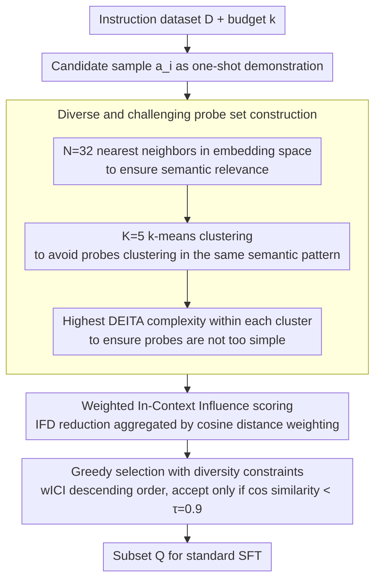

# What Makes Good Instruction-Tuning Data? An In-Context Learning Perspective

**Conference**: ACL2026  
**arXiv**: [2604.25132](https://arxiv.org/abs/2604.25132)  
**Code**: https://github.com/trust-nlp/SyntheticData-Curator  
**Area**: LLM Alignment  
**Keywords**: Instruction Tuning, Data Selection, In-Context Learning, Sample Influence, Diversity Constraints

## TL;DR
The authors propose weighted In-Context Influence (wICI), which measures the value of instruction data by evaluating whether a candidate sample, when used as a one-shot demonstration, can reduce the instruction-following difficulty of related challenging probes. This method outperforms or matches selection techniques such as IFD, DEITA, NUGGETS, and SelectIT under a 10% data budget.

## Background & Motivation
**Background**: Instruction tuning typically relies on large-scale instruction-response datasets, such as Alpaca-GPT4 and WizardLM. Extensive research has identified redundancy, noise, and uneven quality in these datasets. Consequently, training models with a small number of high-value samples to match or exceed the performance of the full dataset has become a critical problem for efficient alignment and low-cost fine-tuning.

**Limitations of Prior Work**: Existing data selection methods have different focuses. IFD/Superfiltering use perplexity or instruction-following difficulty to measure sample hardness; DEITA combines complexity, quality, and diversity rewards; NUGGETS treats candidate samples as one-shot demonstrations and measures improvements on a fixed anchor set. However, a fixed global anchor set ignores semantic correlation, and binary scoring fails to reflect the magnitude of improvement, while also incurring high computational costs.

**Key Challenge**: A "hard" sample is not necessarily a "teachable" one. Difficult samples might simply be ones the model is inherently poor at or have complex annotations, which may not serve as helpful examples for related tasks. Conversely, the value of a good demonstration lies in its ability to make it easier for the model to complete semantically similar but not identical probes. Existing methods do not sufficiently distinguish between "intrinsic difficulty" and "teaching influence on peer samples."

**Goal**: The authors explore three questions: what kind of data is suitable for instruction tuning from an ICL perspective; whether hard samples with high IFD are also strong demonstrations; and whether samples with high ICL influence lead to better instruction-following performance after actual fine-tuning.

**Key Insight**: The paper reinterprets instruction-tuning data selection as "finding examples that help related difficult tasks in context." If a sample, as a one-shot demonstration, can significantly reduce the generation difficulty of multiple semantically related probes, it is not only a good ICL example but also likely a good fine-tuning sample.

**Core Idea**: For each candidate sample, a semantically related, diverse, and difficult probe set is constructed. The reduction in IFD for these probes when the candidate is provided as a demonstration is measured. These improvements are then aggregated into a wICI score weighted by semantic distance, and a final coreset is selected using diversity constraints.

## Method
The method consists of four steps: finding probes for each candidate sample, calculating the in-context influence on those probes, ranking by wICI and selecting data with diversity constraints, and finally performing standard SFT on the selected subset. The framework requires no reward model training and does not rely on external knowledge bases.

### Overall Architecture
The input is an instruction dataset $D = \{(x_i, y_i)\}_{i=1}^n$ and a budget $k$; the output is a training subset $Q$ of size $k$. Each candidate sample $a_i = (x_i, y_i)$ is tested as a one-shot demonstration to see if it reduces the instruction-following difficulty of related probes $b = (x_b, y_b)$. A significant reduction indicates a "teaching effect" on neighboring tasks.

The authors define IFD as a sample difficulty metric: $IFD(y|x) = PPL(y|x)/PPL(y)$, where a higher value indicates that the model benefits less from the instruction and finds generation more difficult. Then, ICI is defined as: $ICI_{i \rightarrow b} = IFD(y_b|x_b) - IFD(y_b|a_i, x_b)$. If the probe's IFD decreases after adding the candidate sample, ICI is positive.

### Key Designs

**1. Diverse and challenging probe set construction: Assigning a set of probes to each candidate to truly test its "teaching value"**

If probes are poorly selected, influence evaluation becomes distorted—random probes introduce noise, purely nearest-neighbor probes are redundant (nearly duplicate samples), and overly simple probes fail to reveal whether the demonstration actually helped. The authors use a three-stage retrieval process to control relevance, diversity, and challenge: first, $N=32$ nearest neighbors are retrieved in the embedding space to ensure semantic relevance; next, these neighbors are grouped into $K=5$ k-means clusters to avoid probes clustering in the same semantic pattern; finally, the sample with the highest DEITA complexity is selected from each cluster to ensure the probes are sufficiently challenging. This ensures the probe set is both relevant to the candidate's task and discriminative for scoring.

**2. Weighted In-Context Influence scoring: Measuring the transferable teaching effect of a sample as a demonstration using weighted IFD reduction**

Relying solely on average influence causes the model to favor samples that only help nearly identical neighbors. Truly valuable demonstrations are those that generalize to slightly more distant related tasks. Based on the difficulty metric $IFD(y|x) = PPL(y|x)/PPL(y)$ and influence $ICI_{i \rightarrow b} = IFD(y_b|x_b) - IFD(y_b|a_i, x_b)$, wICI aggregates the ICI of each probe using normalized cosine distance as a weight:

$$wICI(a_i) = \sum_{b \in B_i} \frac{1 - cos(f(x_i), f(x_b))}{2|B_i|} \cdot ICI_{i \rightarrow b}$$

The distance weight encourages the selection of instructions that help not just near-duplicates but also more distant but related probes, thereby identifying samples with a transferable teaching effect.

**3. Greedy selection with diversity constraints: Preventing the final training set from being saturated with high-scoring but redundant samples**

High-influence samples often concentrate within a few task patterns. Selecting all of them would make the model strong on certain benchmarks but weak in other scenarios. Fine-tuning data must cover a variety of instruction structures. Therefore, the authors perform greedy selection after sorting by wICI: a candidate sample is accepted only if its cosine similarity to every sample already in the selected set $Q$ is less than a threshold $\tau = 0.9$, until the budget $k$ is reached. The selected subset is used directly for standard SFT without additional weighting.

### Loss & Training
The selection phase uses IFD, ICI, and wICI as scoring metrics without gradient backpropagation. The training phase follows standard supervised fine-tuning. Experiments use LlamaFactory for full-parameter fine-tuning of Llama3.1-8B and Mistral-7B-v0.3, utilizing DeepSpeed ZeRO-3, bf16, a sequence length of 2048, 3 training epochs, an AdamW optimizer with a learning rate of $1 \times 10^{-5}$, and a total batch size of 64.

## Key Experimental Results

### Main Results
Main experiments were conducted on the Alpaca-GPT4 and WizardLM datasets, with all methods selecting a 10% subset. Pairwise evaluation was performed using GPT-4.1-mini as a judge to compare subset-tuned models against the full-data baseline. A score greater than 1 indicates performance superior to the full-data baseline.

| Dataset | Method | Llama3.1-8B | Mistral-7B-v0.3 |
|--------|------|-------------|-----------------|
| Alpaca-GPT4 | Full | 1.000 | 1.000 |
| Alpaca-GPT4 | IFD | 1.198 | 1.248 |
| Alpaca-GPT4 | DEITA | 1.076 | 1.099 |
| Alpaca-GPT4 | NUGGETS | 1.133 | 1.201 |
| Alpaca-GPT4 | SelectIT | 1.146 | 1.227 |
| Alpaca-GPT4 | Ours | 1.215 | 1.261 |
| WizardLM | Full | 1.000 | 1.000 |
| WizardLM | IFD | 1.186 | 1.294 |
| WizardLM | DEITA | 1.114 | 1.140 |
| WizardLM | NUGGETS | 1.133 | 1.249 |
| WizardLM | SelectIT | 1.176 | 1.281 |
| WizardLM | Ours | 1.169 | 1.308 |

Results show that 10% high-quality data often outperforms the full dataset, confirming significant redundancy and noise in the original instruction corpora. Ours achieved the best performance for both models on Alpaca-GPT4, and for Mistral on WizardLM (while Llama3.1-8B was slightly lower than IFD but still stronger than the full data).

| Model / Data | Method | ARC-C | HellaSwag | MMLU | GSM8K | MT-Bench | AlpacaEval LC |
|-------------|------|-------|-----------|------|-------|----------|---------------|
| Llama3.1 / Alpaca-GPT4 | Full | 52.99 | 79.78 | 61.81 | 47.46 | 4.30 | 13.19 |
| Llama3.1 / Alpaca-GPT4 | Ours | 58.98 | 81.52 | 63.45 | 55.17 | 4.88 | 14.42 |
| Llama3.1 / WizardLM | Full | 54.61 | 78.36 | 61.32 | 55.42 | 4.75 | 14.75 |
| Llama3.1 / WizardLM | Ours | 57.79 | 81.02 | 64.90 | 52.84 | 5.28 | 13.13 |
| Mistral / Alpaca-GPT4 | Full | 44.03 | 73.01 | 51.40 | 18.73 | 3.80 | 13.19 |
| Mistral / Alpaca-GPT4 | Ours | 49.43 | 81.14 | 54.73 | 28.53 | 4.18 | 11.35 |
| Mistral / WizardLM | Full | 46.25 | 73.57 | 51.15 | 32.37 | 3.97 | 10.77 |
| Mistral / WizardLM | Ours | 51.27 | 78.51 | 56.31 | 29.44 | 4.40 | 11.36 |

### Ablation Study
The ablation study focuses on testing two diversity modules: w/o DA (removing semantic clustering in probe construction) and w/o DS (removing the cosine-similarity diversity constraint during final selection).

| Dataset | Configuration | Llama3.1-8B | Mistral-7B-v0.3 | Description |
|--------|------|-------------|-----------------|------|
| Alpaca-GPT4 | w/o DA | 1.140 | 1.181 | Probes are insufficiently diverse, narrowing influence estimation |
| Alpaca-GPT4 | w/o DS | 1.155 | 1.198 | Training set prone to clustering of similar samples |
| Alpaca-GPT4 | Ours | 1.215 | 1.261 | Both diversity components retained |
| WizardLM | w/o DA | 1.132 | 1.204 | Still outperforms Full, but lower than complete method |
| WizardLM | w/o DS | 1.154 | 1.239 | Demonstration quality is useful, but coverage is insufficient |
| WizardLM | Ours | 1.169 | 1.308 | Complete method is most stable |

The authors also analyzed the overlap between "hard samples" and "high ICI samples," showing that the two only partially overlap.

| Dataset | Top 10% overlap | Top 30% overlap | Top 50% overlap | Spearman |
|--------|------------------|------------------|------------------|----------|
| Alpaca-GPT4 | 0.1006 | 0.3874 | 0.6476 | 0.3947 |
| WizardLM | 0.1442 | 0.3650 | 0.5942 | 0.2568 |

### Key Findings
- Hard samples are not necessarily good demonstrations. The overlap between Top 10% IFD and Top 10% ICI is only 10%-14%, indicating that "model difficulty" and "teachability" are distinct signals.
- Good ICL demonstrations indeed translate to high-quality instruction-tuning data. Even without diversity modules, wICI variants generally outperform the full-data baseline; performance is maximized by including both probe and selection diversity.
- Data selection is less effective for strict instruction-following benchmarks like IFEval compared to benchmarks for knowledge or answer quality. Full data often remains superior on IFEval, suggesting format following may rely more on coverage scale.
- Medical domain transfer experiments indicate cross-domain robustness. When training on 30% of MedQuAD, Ours achieved scores of 37.05, 39.54, and 50.00 on MedMCQA, MedQA, and MMLU-med respectively for Mistral, generally outperforming random selection and matching or exceeding full data on some metrics.

## Highlights & Insights
- The paper shifts the perspective of data selection from "sample quality" to the "ability of a sample to help others." This provides an insightful angle, as fine-tuning requires transferable training signals rather than isolated complex problems.
- The three-stage probe set construction is robust: relevance, diversity, and complexity each address a specific source of bias, avoiding the inefficiency and mismatch of static anchor sets like NUGGETS.
- The use of semantic distance weighting in wICI is clever. It discourages helping only near-duplicates and instead rewards demonstrations that can generalize across a broader semantic region.
- The results suggest that there is no single universal metric for data selection. IFD, DEITA, NUGGETS, and wICI favor different capabilities; as benchmark dimensions shift, the optimal method may change.

## Limitations & Future Work
- The experiments cover only 7B/8B class models and do not evaluate larger models like Llama3-70B or Tulu3, nor larger instruction corpora. Whether wICI maintains equivalent marginal returns on larger models requires further verification.
- The method focuses on supervised instruction tuning and does not test DPO, PPO, or other preference optimization phases. Whether ICL influence can predict the value of samples for preference optimization remains an open question.
- Each sample requires approximately 16 forward passes. While significantly lower than the 2,000 passes required by NUGGETS, this still presents cost pressures for million-scale datasets.
- The effectiveness of wICI depends on the quality of embedding neighbors, complexity scorers, and IFD estimation. If embeddings are insensitive to domain semantics, the probe sets may deviate from truly relevant tasks.

## Related Work & Insights
- **vs IFD / Superfiltering**: IFD focuses on the difficulty of the sample itself. This paper demonstrates that difficulty and teaching influence are only moderately correlated, meaning filtering by difficulty alone misses samples with high transfer value.
- **vs DEITA**: DEITA ranks samples using rewards for complexity, quality, and diversity. This paper adopts a complexity scorer, but only to select the probe set, rather than equating complexity directly with data value.
- **vs NUGGETS**: NUGGETS is the most similar prior work, treating instructions as one-shot demonstrations. The difference is that NUGGETS uses fixed global anchors and coarser scoring, while wICI uses local semantically related probes, improvement magnitude, and distance weighting, making it more computationally efficient.
- **vs SelectIT**: SelectIT relies on uncertainty and multi-round self-reflection. Ours does not require a teacher LLM or complex multi-prompt evaluations, instead defining influence as the change in IFD.

## Rating
- Novelty: ⭐⭐⭐⭐☆ Explaining instruction-tuning data quality through ICL influence is an elegant perspective; it builds on NUGGETS but offers significant improvements.
- Experimental Thoroughness: ⭐⭐⭐⭐☆ Main experiments, ablations, difficulty consistency, budget analysis, and medical transfer are all covered; however, large models and preference optimization are missing.
- Writing Quality: ⭐⭐⭐⭐☆ Methodological formulas and research questions are clearly organized; although there are many tables, the conclusions are clear.
- Value: ⭐⭐⭐⭐☆ Highly practical for low-budget SFT data selection and provides an actionable metric for the "ICL-Fine-tuning relationship."

<!-- RELATED:START -->

## Related Papers

- [\[NeurIPS 2025\] What Makes a Reward Model a Good Teacher? An Optimization Perspective](../../NeurIPS2025/llm_alignment/what_makes_a_reward_model_a_good_teacher_an_optimization_perspective.md)
- [\[AAAI 2026\] Importance-Aware Data Selection for Efficient LLM Instruction Tuning](../../AAAI2026/llm_alignment/importance-aware_data_selection_for_efficient_llm_instruction_tuning.md)
- [\[NeurIPS 2025\] T-SHIRT: Token-Selective Hierarchical Data Selection for Instruction Tuning](../../NeurIPS2025/llm_alignment/t-shirt_token-selective_hierarchical_data_selection_for_instruction_tuning.md)
- [\[ACL 2026\] SFTMix: Elevating Language Model Instruction Tuning with Mixup Recipe](sftmix_elevating_language_model_instruction_tuning_with_mixup_recipe.md)
- [\[ACL 2026\] Too Correct to Learn: Reinforcement Learning on Saturated Reasoning Data](too_correct_to_learn_reinforcement_learning_on_saturated_reasoning_data.md)

<!-- RELATED:END -->
