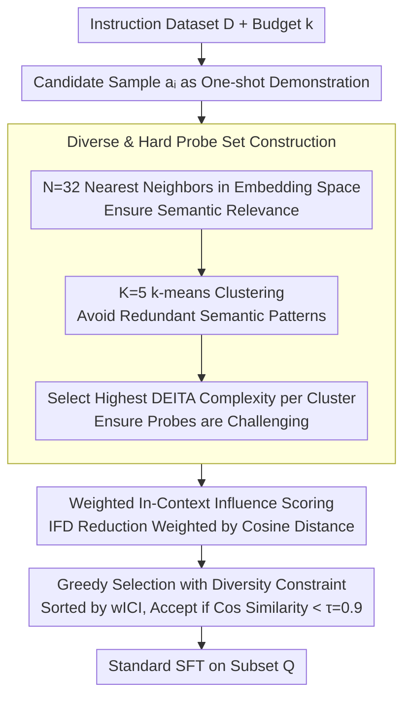

# What Makes Good Instruction-Tuning Data? An In-Context Learning Perspective

**Conference**: ACL2026  
**arXiv**: [2604.25132](https://arxiv.org/abs/2604.25132)  
**Code**: https://github.com/trust-nlp/SyntheticData-Curator  
**Area**: LLM Alignment  
**Keywords**: Instruction tuning, data selection, in-context learning, sample influence, diversity constraints

## TL;DR
This paper proposes weighted In-Context Influence (wICI), which evaluates the value of instruction data by measuring whether a candidate sample, used as a one-shot demonstration, can reduce the instruction-following difficulty of related hard probes. Under a 10% data budget, it outperforms or matches selection methods such as IFD, DEITA, NUGGETS, and SelectIT.

## Background & Motivation
**Background**: Instruction tuning typically relies on large-scale instruction-response datasets, such as Alpaca-GPT4 and WizardLM. Extensive research has found redundancy, noise, and uneven quality in these datasets. Consequently, training models with a small number of high-value samples to approach or exceed the performance of the full dataset has become a critical problem for efficient alignment and low-cost fine-tuning.

**Limitations of Prior Work**: Existing data selection methods have different focuses. IFD/Superfiltering use perplexity or instruction-following difficulty to measure sample hardness; DEITA combines complexity, quality, and diversity rewards; NUGGETS treats candidate samples as one-shot demonstrations and measures improvement on a fixed anchor set. However, a fixed global anchor set ignores semantic relevance, binary scoring fails to reflect the magnitude of improvement, and these methods often incur high computational costs.

**Key Challenge**: A "hard" sample is not necessarily a "good teacher." Hard samples may simply be those the model is inherently poor at or those with complex labels, which do not necessarily serve as good examples for related tasks. Conversely, the value of a good demonstration lies in its ability to make it easier for the model to complete semantically similar but non-identical probes. Existing methods do not sufficiently distinguish between "self-difficulty" and "teaching influence on peer samples."

**Goal**: The authors explore three questions: what kind of data is suitable for instruction tuning from an ICL perspective; whether hard samples with high IFD are also strong demonstrations; and whether samples with high ICL influence lead to better instruction-following performance after actual fine-tuning.

**Key Insight**: The paper reinterprets instruction-tuning data selection as "finding examples that help related hard tasks in-context." If a sample, when used as a one-shot demonstration, significantly reduces the generation difficulty of multiple semantically related probes, it is not only a good ICL example but also likely a good fine-tuning sample.

**Core Idea**: Construct a semantically relevant, diverse, and difficult probe set for each candidate sample; measure the reduction in IFD of these probes when the candidate is used as a demonstration; aggregate these into a wICI score weighted by semantic distance; and select the final coreset using diversity constraints.

## Method
The method consists of four steps: identifying probes for each candidate, calculating the in-context influence on those probes, sorting by wICI following diversity constraints to select data, and finally performing standard SFT on the selected subset. This framework does not require training a reward model or relying on external knowledge bases.

### Overall Architecture
The input is an instruction dataset $D=\{(x_i,y_i)\}_{i=1}^n$ and a budget $k$; the output is a training subset $Q$ of size $k$. Each candidate sample $a_i=(x_i,y_i)$ is tested as a one-shot demonstration: whether it can reduce the instruction-following difficulty of a related probe $b=(x_b,y_b)$. A significant reduction indicates the sample has a "teaching effect" on neighboring tasks.

The authors define IFD as a sample difficulty metric: $IFD(y|x)=PPL(y|x)/PPL(y)$, where a higher value indicates the model derives less benefit from the instruction and finds generation more difficult. Then, ICI is defined as: $ICI_{i\rightarrow b}=IFD(y_b|x_b)-IFD(y_b|a_i,x_b)$. If the probe's IFD decreases after adding the candidate sample, ICI is positive.

### Key Designs

**1. Diverse & Hard Probe Set Construction: Assigning each candidate a set of probes to verify its "teaching value"**

If probes are poorly selected, the influence evaluation will be distorted—random probes introduce noise, purely nearest-neighbor probes are redundant, and overly simple probes hide the helpfulness of the demonstration. The authors use a three-stage retrieval process to control relevance, diversity, and challenge: first, $N=32$ nearest neighbors are retrieved in the embedding space for relevance; then, $K=5$ k-means clusters are formed among these neighbors to avoid redundancy; finally, the sample with the highest DEITA complexity score is selected from each cluster to ensure the probe is not too simple. This ensures the influence scores are task-relevant and discriminative.

**2. Weighted In-Context Influence Scoring: Measuring transferable teaching effect using IFD reduction weighted by semantic distance**

If only average influence is considered, the model favors samples that only help near-duplicate neighbors. Truly valuable samples are demonstrations that generalize to slightly distant related tasks. Based on the difficulty metric $IFD(y|x)$ and influence $ICI_{i\rightarrow b} = IFD(y_b|x_b) - IFD(y_b|a_i, x_b)$, wICI aggregates the ICI of each probe weighted by normalized cosine distance:

$$wICI(a_i)=\sum_{b\in B_i}\frac{1-\cos(f(x_i),f(x_b))}{2|B_i|}\cdot ICI_{i\rightarrow b}$$

The distance weight encourages selecting instructions that have a transferable teaching effect across related but not identical tasks.

**3. Greedy Selection with Diversity Constraint: Preventing the training set from being dominated by high-scoring but similar samples**

High-influence samples often cluster around specific task patterns. Selecting all of them would make the model strong on specific benchmarks but weak in other scenarios. The authors perform greedy selection by sorting samples by wICI: a candidate is accepted only if its cosine similarity to all samples already in the set is less than $\tau=0.9$, until the budget $k$ is met.

### Loss & Training
The selection phase uses IFD, ICI, and wICI as scores without backpropagation. The training phase is standard supervised fine-tuning. Experiments use LlamaFactory for full-parameter fine-tuning of Llama3.1-8B and Mistral-7B-v0.3, with DeepSpeed ZeRO-3, bf16, sequence length 2048, 3 epochs, AdamW learning rate $1\times10^{-5}$, and total batch size 64.

## Key Experimental Results

### Main Results
Experiments were conducted on Alpaca-GPT4 and WizardLM datasets, with all methods selecting a 10% subset. Pairwise evaluation was conducted using GPT-4o-mini as a judge to compare the subset-tuned model against the full-data baseline (score > 1 indicates better than full baseline).

| Dataset | Method | Llama3.1-8B | Mistral-7B-v0.3 |
|--------|------|-------------|-----------------|
| Alpaca-GPT4 | Full | 1.000 | 1.000 |
| Alpaca-GPT4 | IFD | 1.198 | 1.248 |
| Alpaca-GPT4 | DEITA | 1.076 | 1.099 |
| Alpaca-GPT4 | NUGGETS | 1.133 | 1.201 |
| Alpaca-GPT4 | SelectIT | 1.146 | 1.227 |
| **Alpaca-GPT4** | **Ours** | **1.215** | **1.261** |
| WizardLM | Full | 1.000 | 1.000 |
| WizardLM | IFD | 1.186 | 1.294 |
| WizardLM | DEITA | 1.114 | 1.140 |
| WizardLM | NUGGETS | 1.133 | 1.249 |
| WizardLM | SelectIT | 1.176 | 1.281 |
| **WizardLM** | **Ours** | 1.169 | **1.308** |

The results show that 10% high-quality data often outperforms the full dataset, confirming redundancy in original corpora. Ours performs best on Alpaca-GPT4 and Mistral/WizardLM.

| Model / Data | Method | ARC-C | HellaSwag | MMLU | GSM8K | MT-Bench | AlpacaEval LC |
|-------------|------|-------|-----------|------|-------|----------|---------------|
| Llama3.1 / Alpaca-GPT4 | Full | 52.99 | 79.78 | 61.81 | 47.46 | 4.30 | 13.19 |
| Llama3.1 / Alpaca-GPT4 | Ours | 58.98 | 81.52 | 63.45 | 55.17 | 4.88 | 14.42 |
| Llama3.1 / WizardLM | Full | 54.61 | 78.36 | 61.32 | 55.42 | 4.75 | 14.75 |
| Llama3.1 / WizardLM | Ours | 57.79 | 81.02 | 64.90 | 52.84 | 5.28 | 13.13 |

### Ablation Study
Ablations tested two diversity modules: w/o DA (no semantic clustering in probe construction) and w/o DS (no cosine-similarity diversity constraint during selection).

| Dataset | Config | Llama3.1-8B | Mistral-7B-v0.3 | Description |
|--------|------|-------------|-----------------|------|
| Alpaca-GPT4 | w/o DA | 1.140 | 1.181 | Probes lack diversity, influence estimates narrow |
| Alpaca-GPT4 | w/o DS | 1.155 | 1.198 | Training set concentrates on similar samples |
| Alpaca-GPT4 | Ours | 1.215 | 1.261 | Both diversity modules retained |

### Key Findings
- **Hard samples != good demonstrations**: The overlap between Top 10% IFD and Top 10% ICI is only 10%-14%, indicating "perceived difficulty" and "teaching ability" are distinct signals.
- **Good ICL demonstrations translate to good instruction-tuning data**: Even without diversity modules, wICI variants generally outperform the full-data baseline.
- **Benchmark specificity**: Data selection is less effective for strict instruction-following benchmarks like IFEval compared to knowledge/quality benchmarks.
- **Cross-domain capability**: In medical domain experiments (MedQuAD), Ours outperformed random selection and approached full-data performance on medical benchmarks.

## Highlights & Insights
- The paper shifts data selection from "sample quality" to "sample helpfulness," providing a refreshing perspective. Fine-tuning requires transferable signals rather than isolated hard problems.
- The three-stage probe construction is robust, addressing relevance, diversity, and challenge to avoid biases found in prior work like NUGGETS.
- wICI's distance weighting is clever; it rewards demonstrations that benefit broader semantic regions rather than just near-duplicates.

## Limitations & Future Work
- Experiments were limited to 7B/8B models; evaluation on Llama3-70B or larger corpora is missing.
- The method was not tested on preference optimization stages like DPO or PPO.
- Computational overhead: ~16 forward passes per sample may be costly for million-scale datasets.
- Performance relies on the quality of embeddings and IFD estimation.

## Related Work & Insights
- **vs IFD / Superfiltering**: IFD focuses on self-difficulty; this paper proves difficulty and teaching influence are only moderately correlated.
- **vs DEITA**: DEITA use complexity/quality rewards; this paper uses complexity only to select challenging probes.
- **vs NUGGETS**: wICI improves on NUGGETS by using local semantically relevant probes and distance-weighted improvements instead of fixed global anchors.

## Rating
- **Novelty**: ⭐⭐⭐⭐☆ Clear connection between ICL influence and tuning quality.
- **Experimental Thoroughness**: ⭐⭐⭐⭐☆ Covers main benchmarks and cross-domain; lacks larger models and RLHF.
- **Writing Quality**: ⭐⭐⭐⭐☆ Well-organized with clear research questions.
- **Value**: ⭐⭐⭐⭐☆ Practical for low-budget SFT selection and provides an operational metric for the ICL-tuning relationship.

<!-- RELATED:START -->

## Related Papers

- [\[NeurIPS 2025\] What Makes a Reward Model a Good Teacher? An Optimization Perspective](../../NeurIPS2025/llm_alignment/what_makes_a_reward_model_a_good_teacher_an_optimization_perspective.md)
- [\[AAAI 2026\] Importance-Aware Data Selection for Efficient LLM Instruction Tuning](../../AAAI2026/llm_alignment/importance-aware_data_selection_for_efficient_llm_instruction_tuning.md)
- [\[ICLR 2026\] Holdout-Loss-Based Data Selection for LLM Finetuning via In-Context Learning](../../ICLR2026/llm_alignment/holdout-loss-based_data_selection_for_llm_finetuning_via_in-context_learning.md)
- [\[NeurIPS 2025\] T-SHIRT: Token-Selective Hierarchical Data Selection for Instruction Tuning](../../NeurIPS2025/llm_alignment/t-shirt_token-selective_hierarchical_data_selection_for_instruction_tuning.md)
- [\[ACL 2026\] SFTMix: Elevating Language Model Instruction Tuning with Mixup Recipe](sftmix_elevating_language_model_instruction_tuning_with_mixup_recipe.md)

<!-- RELATED:END -->
