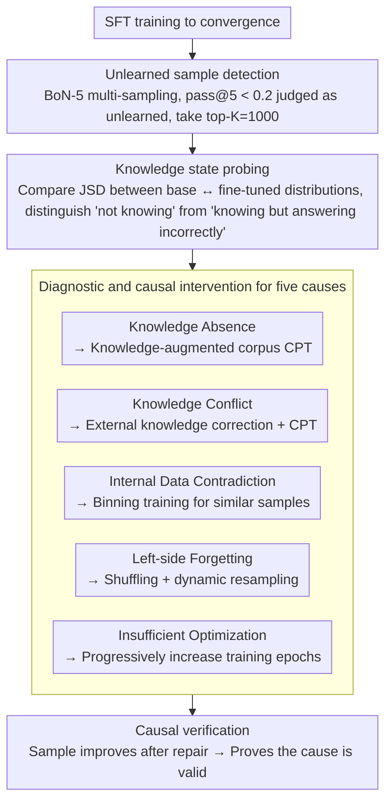

# Why Supervised Fine-Tuning Fails to Learn: A Systematic Study of Incomplete Learning in Large Language Models

**Conference**: ACL 2026  
**arXiv**: [2604.10079](https://arxiv.org/abs/2604.10079)  
**Code**: None  
**Area**: LLM Safety  
**Keywords**: Incomplete Learning, SFT Diagnosis, Knowledge Conflict, Forgetting, Fine-tuning failure modes

## TL;DR

This paper provides the first systematic study of "Incomplete Learning Phenomenon" (ILP) in SFT—where models fail to correctly reproduce part of the training data despite convergence. It identifies five recurring causes (Knowledge Absence, Knowledge Conflict, Internal Data Contradiction, Left-side Forgetting, Insufficient Optimization) and proposes a diagnostic framework along with targeted mitigation strategies.

## Background & Motivation

**Background**: SFT is the standard method for adapting LLMs to downstream tasks and is widely regarded as a reliable and efficient specialization mechanism.

**Limitations of Prior Work**: (1) Even when training loss fully converges, models frequently fail to correctly answer certain training samples—this is not an issue of overfitting or generalization, but a failure on the training set itself; (2) Unlearned samples are often non-random, corresponding to rare cases, compositional patterns, or knowledge-intensive instances; (3) Improvement in aggregate metrics may mask a persistent unlearned subset.

**Key Challenge**: SFT datasets (especially in professional domains like law or medicine) are expensive to construct, yet $15.3\% \pm 2.1\%$ of samples remain unlearned after training—this directly reduces data utilization efficiency.

**Goal**: Instead of proposing a new fine-tuning algorithm, this study systematically characterizes, diagnoses, and validates the sources of incomplete learning in SFT.

**Key Insight**: Unlearned samples are treated as diagnostic signals rather than noise—understanding why these specific samples are not learned reveals the limitations of SFT.

**Core Idea**: The five sources of ILP each require different mitigation strategies—there is no "one-size-fits-all" solution, necessitating fine-grained sample-level diagnosis.

## Method

### Overall Architecture

This work does not propose a new fine-tuning algorithm but establishes a "detection-attribution-intervention" diagnostic pipeline. It treats failures where "training loss converges but samples are incorrect" as analyzable signals. Specifically: the model is first SFTed to convergence; then, each training sample is converted into a multiple-choice question to detect the "unlearned subset" via multi-sampling; distribution-level signals are used to probe the knowledge state of each stubborn sample to determine if it is "completely unknown" or "known but overridden"; samples are then categorized into one of five causes; finally, corresponding repair methods are applied to each cause, and the correctness of the attribution is verified by checking if the samples improve.

### Key Designs

**1. Unlearned Sample Detection: Separating decoding noise from true learning failure using BoN-5**

Aggregate accuracy hides the fact that the same sample might be correct in some sampling rounds and incorrect in others. A single failure could be a genuine learning failure or just random decoding jitter. Thus, each SFT sample is rewritten as a multiple-choice question, and $N$ independent inferences are performed to calculate pass@N. Samples with $\text{pass@5} < 0.2$ that consistently fail across random seeds are judged as "unlearned," and the top-$K=1000$ most severe cases are selected for in-depth analysis. Only repeated sampling failures count, ensuring the identified samples represent knowledge the model failed to internalize rather than stochastic noise.

**2. Knowledge State Probing: Distinguishing "not knowing" from "knowing but answering incorrectly" using JSD**

After filtering unlearned samples, the first task is to determine where the bottleneck lies—final accuracy alone cannot distinguish between lack of knowledge and knowledge conflict, as both appear as incorrect answers. This paper compares the Jensen-Shannon Divergence $\mathrm{JSD}$ between the base model and fine-tuned model prediction distributions: a high $\mathrm{JSD}$ where the base model is already incorrect suggests SFT is trying to override a deep-seated erroneous prior, indicating Knowledge Conflict; a low $\mathrm{JSD}$ where the model remains incorrect after fine-tuning suggests the distribution barely moved and the model failed to receive the knowledge, indicating Knowledge Absence. This distribution-level signal identifies the cause and determines the repair path.

**3. Diagnosis and Causal Intervention for Five ILP Sources: A set of localization tools and repairs for each cause**

Using knowledge state signals, unlearned samples are categorized into five distinct causes, with specific detection and intervention methods for each: **Knowledge Absence**—fact triplets are extracted using OpenIE and probed via BoN on the base model; lack of knowledge is addressed using knowledge-augmented Continued Pre-training (CPT). **Knowledge Conflict**—detected when the base model provides an answer with high confidence that contradicts the SFT label; it is corrected via external knowledge then CPT. **Internal Data Contradiction**—pairs of samples with similar semantics but inconsistent labels are identified; they are evaluated by GPT and trained in separate bins to avoid conflicting supervisory signals in the same mini-batch. **Left-side Forgetting**—samples earlier in the sequential training are overridden by later ones; this is mitigated through random shuffling and dynamic resampling. **Insufficient Optimization**—weak training signals for rare or complex patterns are compensated for by progressively increasing training epochs. Crucially, these repairs are causal interventions: if applying strategy $X$ for cause $Y$ results in the sample being learned, it validates $Y$ as the true cause.

### Loss & Training

Standard SFT cross-entropy loss is used throughout, evaluated across Qwen, LLaMA, and OLMo2 model families. For CPT interventions in knowledge absence/conflict categories, a mixed corpus $\mathcal{C}_{\text{mix}} = 0.8\,\mathcal{C}_{\text{general}} + 0.2\,\mathcal{C}_{\text{aug}}$ is used, blending knowledge-augmented data at a 20% ratio to supplement/correct knowledge without diluting general capabilities.

## Key Experimental Results

### Main Results

**Prevalence of ILP (Average across 10 benchmark SFT datasets)**

| Metric | Value |
|------|------|
| Average unlearned ratio | 15.3% ± 2.1% |
| Cross-model consistency | Observed across Qwen/LLaMA/OLMo2 |
| Cross-domain consistency | Present in Medical/Legal/Finance |

### Ablation Study

**Effectiveness of CPT interventions (Knowledge Absence + Conflict)**

| Domain | SFT only Acc | +CPT Acc | Gain |
|------|-------------|---------|------|
| Medical (MedQA) | baseline | Significant gain | Validates knowledge absence hypothesis |
| Legal (LegalBench) | baseline | Significant gain | Validates knowledge conflict hypothesis |
| Finance (FinanceBench) | baseline | Significant gain | — |

### Key Findings

- ILP is ubiquitous and heterogeneous—no single intervention solves all failures.
- Knowledge Absence and Knowledge Conflict are the two most common causes; CPT is effective for both.
- Left-side Forgetting is particularly severe in multi-task SFT—simple shuffling of data order mitigates most of it.
- ILP caused by internal SFT data contradictions (inconsistent labeling) can be partially resolved through binning training.
- Improvements in aggregate metrics can mask the persistence of unlearned subsets—sample-level monitoring is required.

## Highlights & Insights

- The conceptualization of "ILP" itself is a major contribution—formalizing a widespread but unsystematically studied phenomenon.
- The taxonomy of five sources provides direct guidance for SFT practitioners to audit their own data and models.
- The philosophy of "diagnosis before treatment"—understanding why a failure occurs before designing targeted repairs.

## Limitations & Future Work

- Sample-level evaluation in multiple-choice format may introduce evaluation bias.
- Computational costs for mitigation strategies (CPT, binning training, etc.) are not reported in detail.
- The taxonomy of five sources may be incomplete—other unidentified causes of ILP may exist.
- Analysis focused on SFT; whether subsequent stages like RLHF/DPO exacerbate or mitigate ILP remains unexplored.

## Related Work & Insights

- **vs Catastrophic Forgetting**: The latter focuses on losing previously learned abilities, while ILP focuses on the failure to acquire new knowledge—opposite directions.
- **vs Data Quality Research**: The latter generally focuses on improving overall performance, while ILP focuses on why specific samples cannot be learned.
- **vs Curriculum Learning (Bengio et al., 2009)**: Curriculum learning sorts training by complexity, but ILP diagnosis suggests sorting alone is insufficient—one must identify and handle five different failure modes.

## Rating

- Novelty: ⭐⭐⭐⭐⭐ First systematic study of incomplete learning in SFT; both the concept and taxonomy are original.
- Experimental Thoroughness: ⭐⭐⭐⭐ Multi-model × Multi-domain + Causal intervention validation + 10 benchmarks.
- Writing Quality: ⭐⭐⭐⭐ Problem definition is clear, and the diagnostic framework is logically rigorous.
- Value: ⭐⭐⭐⭐⭐ Significant implications for both the practice and theory of SFT.

<!-- RELATED:START -->

## Related Papers

- [\[ACL 2026\] Compatibility-Aware Dynamic Fine-Tuning for Large Language Models](compatibility-aware_dynamic_fine-tuning_for_large_language_models.md)
- [\[ICLR 2026\] Anchored Supervised Fine-Tuning](../../ICLR2026/llm_alignment/anchored_supervised_fine-tuning.md)
- [\[ICLR 2026\] Safety Subspaces are Not Linearly Distinct: A Fine-Tuning Case Study](../../ICLR2026/llm_alignment/safety_subspaces_are_not_linearly_distinct_a_fine-tuning_case_study.md)
- [\[ICLR 2026\] When Data Is the Algorithm: A Systematic Study and Curation of Preference Optimization Datasets](../../ICLR2026/llm_alignment/when_data_is_the_algorithm_a_systematic_study_and_curation_of_preference_optimiz.md)
- [\[ACL 2026\] Team-Based Self-Play With Dual Adaptive Weighting for Fine-Tuning LLMs](team-based_self-play_with_dual_adaptive_weighting_for_fine-tuning_llms.md)

<!-- RELATED:END -->
