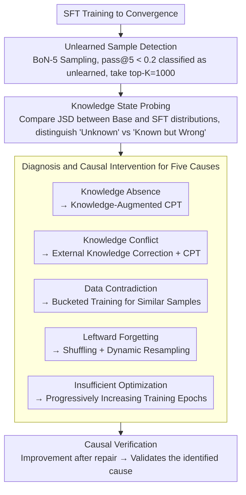

# Why Supervised Fine-Tuning Fails to Learn: A Systematic Study of Incomplete Learning in Large Language Models

**Conference**: ACL 2026  
**arXiv**: [2604.10079](https://arxiv.org/abs/2604.10079)  
**Code**: None  
**Area**: LLM Safety  
**Keywords**: Incomplete Learning, SFT Diagnosis, Knowledge Conflict, Forgetting, Fine-tuning Failure Modes

## TL;DR

This paper provides the first systematic study of the "Incomplete Learning Phenomenon" (ILP) in SFT—where models fail to accurately reproduce training data after convergence. It identifies five recurring causes (Knowledge Absence, Knowledge Conflict, Data Contradiction, Leftward Forgetting, and Insufficient Optimization) and proposes a diagnostic framework along with targeted mitigation strategies.

## Background & Motivation

**Background**: SFT is the standard method for adapting LLMs to downstream tasks and is widely regarded as a reliable and efficient mechanism for specialization.

**Limitations of Prior Work**: (1) Even when training loss fully converges, models frequently fail to correctly answer certain training samples—this is not an issue of overfitting or generalization, but a failure on the training set itself; (2) Unlearned samples are often not random but correspond to rare cases, compositional patterns, or knowledge-intensive instances; (3) Improvements in aggregate metrics can mask the persistence of unlearned subsets.

**Key Challenge**: SFT datasets (especially in specialized fields like law and medicine) are expensive to construct, yet $15.3\% \pm 2.1\%$ of samples remain unlearned after training—directly reducing the utility of the data.

**Goal**: The objective is not to propose a new fine-tuning algorithm, but to systematically characterize, diagnose, and verify the sources of incomplete learning in SFT.

**Key Insight**: Unlearned samples are treated as diagnostic signals rather than noise—understanding the limitations of SFT by analyzing why these specific samples were not learned.

**Core Idea**: The five sources of ILP each require different mitigation strategies—there is no "one-size-fits-all" solution, necessitating fine-grained, sample-level diagnosis.

## Method

### Overall Architecture

Rather than proposing a new fine-tuning algorithm, this work establishes a diagnostic pipeline consisting of "detection, attribution, and intervention." It treats the failure where "training loss converges but samples remain incorrect" as an analyzable signal. Specifically: the model is first SFT-trained to convergence; then, every training sample is converted into a multiple-choice question (MCQ) to detect the "unlearned subset" via multiple sampling; distribution-level signals are used to probe the knowledge state of each stubborn sample to determine if it is "completely unknown" or "known but overridden"; samples are then attributed to one of five causes based on this; finally, corresponding repair methods are applied to each cause, and improvements are used to validate the correctness of the attribution.

### Key Designs

**1. Unlearned Sample Detection: Separating Decoding Noise from Genuine Learning Failure via BoN-5**

Aggregate accuracy masks the fact that a single sample might be correct or incorrect across different samplings. A single failure could be a genuine learning failure or merely random decoding jitter. To address this, each SFT sample is rewritten as an MCQ, and $N$ independent inferences are performed to calculate $\text{pass@N}$. Samples with $\text{pass@5} < 0.2$ that fail consistently across random seeds are classified as "unlearned," from which the top $K=1000$ most severe cases are selected for in-depth analysis. Only repeated failures count, ensuring that the filtered data represents knowledge the model truly failed to internalize.

**2. Knowledge State Probing: Distinguishing "Unknown" from "Known but Wrong" via JSD**

After filtering unlearned samples, the first task is to determine where they are stuck. Final accuracy alone cannot distinguish between knowledge absence and knowledge conflict, as both result in incorrect answers. This work instead compares the Jensen-Shannon Divergence ($\mathrm{JSD}$) between the predictive distributions of the base model and the fine-tuned model. A high $\mathrm{JSD}$ where the base model was originally incorrect indicates SFT attempted to override a deep-seated incorrect prior (Knowledge Conflict); a low $\mathrm{JSD}$ where the model remains incorrect suggests the distribution barely moved and the model failed to receive the knowledge (Knowledge Absence). This distribution-level signal serves as the basis for distinguishing the two causes and deciding the repair path.

**3. Diagnosis and Causal Intervention: Positioning and Repairing for Five ILP Sources**

Using the knowledge state signals, unlearned samples are categorized into five distinct causes, with specific detection and intervention methods for each: **Knowledge Absence in Pre-training**—extracting factual triples via OpenIE and probing the base model; if confirmed, Continued Pre-training (CPT) is used with knowledge-augmented corpora. **Knowledge Conflict**—detecting cases where the base model provides answers with high confidence that contradict SFT labels; these are corrected with external knowledge before CPT. **SFT Data Contradictions**—identifying sample pairs with semantic similarity but inconsistent labels; after GPT evaluation, they are trained in separate buckets to avoid conflicting supervisory signals in the same mini-batch. **Leftward Forgetting**—addressing cases where earlier samples in sequential training are overridden by later ones via shuffling and dynamic resampling. **Insufficient Optimization**—compensating for weak signals in rare or complex patterns by progressively increasing training epochs. Crucially, these repairs are causal interventions: if applying strategy $X$ for cause $Y$ results in the sample being learned, it confirms $Y$ was indeed the cause.

### Loss & Training

Standard SFT cross-entropy loss was used throughout, with evaluations on Qwen, LLaMA, and OLMo2 model families. For CPT interventions addressing knowledge absence/conflict, a mixed corpus of $\mathcal{C}_{\text{mix}} = 0.8\,\mathcal{C}_{\text{general}} + 0.2\,\mathcal{C}_{\text{aug}}$ was used. This 80/20 ratio incorporates knowledge-augmented corpora to fill gaps or correct conflicts without diluting general capabilities.

## Key Experimental Results

### Main Results

**Universality of ILP (Average across 10 benchmark SFT datasets)**

| Metric | Value |
|------|------|
| Average Unlearned Ratio | 15.3% ± 2.1% |
| Consistency across Models | Observed in Qwen, LLaMA, and OLMo2 |
| Consistency across Domains | Exists in Medical, Legal, and Finance |

### Ablation Study

**Effectiveness of CPT Intervention (Knowledge Absence + Conflict)**

| Domain | SFT only Acc | +CPT Acc | Gain |
|------|-------------|---------|------|
| Medical (MedQA) | baseline | Significant Increase | Validates Knowledge Absence |
| Legal (LegalBench) | baseline | Significant Increase | Validates Knowledge Conflict |
| Finance (FinanceBench) | baseline | Significant Increase | — |

### Key Findings

- ILP is universal and heterogeneous—no single intervention can solve all failures.
- Knowledge Absence and Knowledge Conflict are the two most common causes; CPT is effective for both.
- Leftward Forgetting is particularly severe in multi-task SFT—simple shuffling of data order mitigates most of it.
- ILP caused by internal SFT data contradictions (inconsistent labeling) can be partially resolved through bucketed training.
- Improvements in aggregate metrics can mask the persistent existence of unlearned subsets—sample-level monitoring is required.

## Highlights & Insights

- The conceptualization of "ILP" is a major contribution—formalizing a widespread but unsystematically studied phenomenon.
- The taxonomy of five sources provides direct guidance for SFT practitioners to audit their own data and models.
- A philosophy of diagnosis before treatment—understanding why a failure occurs before designing targeted repairs.

## Limitations & Future Work

- Sample-level evaluation using MCQ formats may introduce evaluation bias.
- The computational costs of mitigation strategies (e.g., CPT, bucketed training) are not reported in detail.
- The taxonomy of five sources may be incomplete—other unidentified ILP causes may exist.
- It is unanalyzed whether subsequent training stages like RLHF/DPO exacerbate or mitigate ILP.

## Related Work & Insights

- **vs Catastrophic Forgetting**: The latter focuses on losing acquired abilities, while ILP focuses on the failure to acquire new knowledge—the directions are opposite.
- **vs Data Quality Research**: The latter generally focuses on improving overall performance, while ILP focuses on why specific samples cannot be learned.
- **vs Curriculum Learning (Bengio et al., 2009)**: Curriculum learning sorts training by complexity, whereas ILP diagnosis shows that sorting alone is insufficient—one must identify and handle five different failure modes.

## Rating

- Novelty: ⭐⭐⭐⭐⭐ First systematic study of SFT incomplete learning; both the concept and taxonomy are original.
- Experimental Thoroughness: ⭐⭐⭐⭐ Multi-model × Multi-domain + Causal intervention validation + 10 benchmarks.
- Writing Quality: ⭐⭐⭐⭐ Clear problem definition and logically rigorous diagnostic framework.
- Value: ⭐⭐⭐⭐⭐ Significant impact on both the practice and theory of SFT.

<!-- RELATED:START -->

## Related Papers

- [\[ICLR 2026\] Safety Subspaces are Not Linearly Distinct: A Fine-Tuning Case Study](../../ICLR2026/llm_alignment/safety_subspaces_are_not_linearly_distinct_a_fine-tuning_case_study.md)
- [\[ACL 2026\] Too Correct to Learn: Reinforcement Learning on Saturated Reasoning Data](too_correct_to_learn_reinforcement_learning_on_saturated_reasoning_data.md)
- [\[ACL 2026\] Team-Based Self-Play With Dual Adaptive Weighting for Fine-Tuning LLMs](team-based_self-play_with_dual_adaptive_weighting_for_fine-tuning_llms.md)
- [\[ACL 2026\] BACH-V: Bridging Abstract and Concrete Human-Values in Large Language Models](bach-v_bridging_abstract_and_concrete_human-values_in_large_language_models.md)
- [\[ACL 2026\] Mitigating Selection Bias in Large Language Models via Permutation-Aware GRPO](mitigating_selection_bias_in_large_language_models_via_permutation-aware_grpo.md)

<!-- RELATED:END -->
