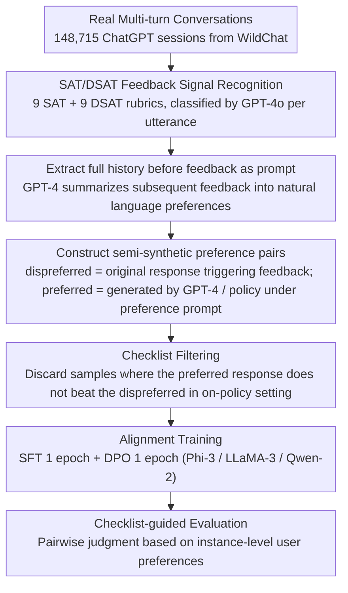

# WildFeedback: Aligning LLMs With In-situ User Interactions And Feedback

**Conference**: ACL2026  
**arXiv**: [2408.15549](https://arxiv.org/abs/2408.15549)  
**Code**: No public training code; Dataset: https://huggingface.co/datasets/microsoft/WildFeedback  
**Area**: LLM Alignment / User Feedback / Preference Learning  
**Keywords**: In-situ User Feedback, Preference Data Construction, SAT/DSAT, DPO, checklist evaluation

## TL;DR
WildFeedback automatically identifies satisfaction/dissatisfaction feedback from real-world multi-turn dialogues between users and ChatGPT. It transforms naturally occurring user preferences into preference training samples and instance-level checklist evaluation criteria. This enables small open-source instruction models to align more closely with real user needs on both general benchmarks and real-user preference tests compared to training with UltraFeedback.

## Background & Motivation
**Background**: LLM alignment typically depends on two types of data: human-annotated preference data or synthetic preference data generated/judged by strong models like GPT-4. The former is high-cost, subjective, and limited in scale, while the latter is cheap and scalable but risks cycling the strong model's own preferences and biases into the target model.

**Limitations of Prior Work**: Real users naturally express feedback during product interactions, such as "Thanks, this is exactly what I wanted," "No, please rewrite," or "You ignored my requirements." These signals are closer to actual usage scenarios than offline annotations, yet they are not structured as thumbs-up/down and are often scattered across multi-turn contexts. Simply using the response that triggered feedback for training is insufficient because negative feedback only indicates the old response was poor; a better response matching the user's preference must still be constructed.

**Key Challenge**: Alignment requires real user preferences, but these are naturally noisy, implicit, and context-dependent. Relying solely on static annotation sets lacks scale and authenticity, while relying solely on model self-evaluation may weaken the diversity of human preferences.

**Goal**: The authors aim to address three sub-problems: first, detecting which user utterances in real multi-turn sessions contain satisfaction or dissatisfaction signals; second, converting these signals into preferred-dispreferred response pairs for SFT/DPO; third, constructing an evaluation method where the automatic judge assesses based on the real user's expressed preferences in that specific instance rather than just asking GPT-4 "which is better."

**Key Insight**: The key observation is that although user feedback lacks explicit labels, it often follows interpretable linguistic patterns within sessions. By summarizing these patterns into SAT/DSAT rubrics and using GPT-4 to detect and summarize preferences according to these rubrics, "wild" feedback can be converted into structured preference data.

**Core Idea**: Replace offline human/model preference annotations with in-situ user feedback from real multi-turn interactions, and use instance-level user preference checklists to guide both preference sample construction and model evaluation.

## Method
WildFeedback does not propose a new alignment loss but rather a data pipeline from real user interactions to preference training and evaluation. The input is a batch of multi-turn user-LLM conversations, and the output is a preference dataset containing prompts, user preference descriptions, preferred responses, and dispreferred responses, along with a held-out benchmark evaluated via user preference checklists.

### Overall Architecture
The workflow consists of four steps. First, SAT (satisfaction) and DSAT (dissatisfaction) signals are identified turn-by-turn within 148,715 multi-turn ChatGPT sessions from WildChat. Second, for sessions containing feedback, the full dialogue history preceding the feedback is extracted as the prompt, and the subsequent user feedback is summarized into natural language preferences. Third, response pairs are constructed based on these preferences: the original response triggering DSAT serves as the dispreferred response, while the preferred response is generated by GPT-4 or the current policy model guided by the user preference prompt. Fourth, the generated WildFeedback data is used to perform one round of SFT and one round of DPO on instruction models like Phi-3, LLaMA-3, and Qwen-2, followed by evaluation on general benchmarks and a user preference checklist benchmark.

The paper also incorporates evaluation into the framework. Traditional AlpacaEval/MT-Bench uses GPT-4 for general quality judgments. Here, each sample includes a preference summarized from real feedback (e.g., "be more concise," "needs factual correction," "do not ignore formatting"). During evaluation, these preferences are provided to GPT-4 as a checklist for pairwise comparison, reducing the discrepancy between the judge and real user preferences.

### Key Designs

**1. SAT/DSAT Feedback Signal Recognition: Summarizing "wild" implicit user reactions into interpretable SAT/DSAT rubrics for localization.**

Real user feedback is rarely an explicit thumbs-up/down; it is usually embedded in the next turn's language—"Thanks, exactly what I needed," "Incorrect, rewrite please," or "You missed my requirement." Inheriting and modifying the user satisfaction estimation ideas from SPUR, the authors structure these reactions using 9 SAT rubrics (Thanks, Learning, Compliance, Praise, Personal Details, Humor, Confirmation, Positive Ending, Progress towards goal) and 9 DSAT rubrics (Negative Feedback, Request Correction, Factual Error, Unrealistic Expectation, No Further Interaction, Ignored, Low Quality, Insufficient Detail, Style Issues). GPT-4o classifies utterances based on these rubrics. Categorizing feedback into interpretable rubrics avoids using vague emotional words as training signals and enables analyzing exactly why users were satisfied or dissatisfied.

**2. Constructing semi-synthetic preference pairs: Grounding weak supervision like "user said dissatisfied" into `(prompt, preferred, dispreferred)` for DPO.**

Negative feedback only indicates that the old response was bad without providing a better answer. For sessions identified with SAT/DSAT, the system first lets GPT-4 summarize the user preferences, then extracts the full conversation history before the feedback as the prompt. In the GPT-4 expert version, the original response triggering DSAT is used as the dispreferred response, and a preferred response is generated by GPT-4 under user preference and safety prompts. In the on-policy version, Phi-3, Qwen-2, or LLaMA-3 generates both responses, with the preferred one guided by user preference system prompts. Unlike offline data like UltraFeedback where GPT-4 provides uniform scores, the prompts and preferences here originate from real human-AI interactions and preserve multi-turn context.

**3. Checklist-guided evaluation and filtering: Using instance-level user preferences to constrain judges and data quality instead of general LLM aesthetics.**

LLM-as-a-judge tends to favor long responses or its own style, diverging from real user preferences. WildFeedback converts the preferences summarized from real feedback for each sample (e.g., "more concise," "correct facts") into a checklist. The judge performs pairwise judgment based on this checklist. During on-policy data construction, if a generated preferred response cannot beat the dispreferred response under checklist evaluation, the sample is filtered out. The checklist shifts the evaluation standard from "generic good response" to "what this specific user wanted for this specific task," re-aligning atomic judges with instance-level ground truth.

### Loss & Training
The training does not modify the DPO objective but integrates WildFeedback data into a standard alignment pipeline: each base model undergoes 1 epoch of SFT on preferred responses, followed by 1 epoch of DPO on the full preference pairs. The experiments cover three open-source instruction models: Phi-3-mini-4k-instruct, Meta-Llama-3-8B-Instruct, and Qwen2-7B-Instruct, comparing five settings: Base Instruction Model, WF GPT-4, WF On-policy, UF GPT-4, and UF On-policy.

The test set construction also avoids overfitting. The authors use FAISS to cluster user prompts and summarized preferences into 70 groups. Ten samples closest to each cluster center are selected, followed by deduplication and filtering of meaningless tasks, resulting in 540 held-out samples. This ensures evaluation reflects the "mainstream preferences of majority users in similar tasks" rather than idiosyncratic outliers.

## Key Experimental Results

### Main Results
WildFeedback demonstrates it can mine a significant scale of feedback data from real sessions. Out of 148,715 WildChat multi-turn sessions, approximately 12.8% contain feedback signals, resulting in 20,281 GPT-4 version preference samples and several on-policy versions.

| Data/Metric | SAT | DSAT | Total |
|--------|------|------|------|
| Sessions with feedback | 5,447 | 13,582 | 148,715 |
| Utterances with feedback | 8,186 | 27,711 | 628,467 |
| GPT-4 vs Human Consistency | $\kappa=0.69$ | $\kappa=0.50$ | Close to human level |

Compared to existing preference data, WildFeedback features multi-turn context, originates from real in-situ feedback, and has longer prompts reflecting actual product usage.

| Dataset | Samples | Prompt Length | Response Length | Multi-turn? | Feedback Source |
|--------|------:|-----------:|-------------:|------|----------|
| WebGPT | 38,925 | 51 | 188 | No | Human Annotation |
| Anthropic HH | 118,263 | 186 | 95 | No | Human Annotation |
| OASST1 | 35,905 | 168 | 221 | Yes | Human Written |
| UltraFeedback | 61,135 | 159 | 256 | No | GPT-4 |
| WildFeedback GPT-4 | 20,281 | 929 | 440 | Yes | In-situ User Feedback |
| WildFeedback Qwen-2 | 11,509 | 1,057 | 541 | Yes | In-situ User Feedback |
| WildFeedback Phi-3 | 9,194 | 931 | 344 | Yes | In-situ User Feedback |
| WildFeedback LLaMA-3 | 10,659 | 982 | 376 | Yes | In-situ User Feedback |

On general benchmarks, training with WildFeedback generally outperforms the original models and UltraFeedback counterparts. Notably, for Phi-3 and LLaMA-3, WF GPT-4 improves AlpacaEval 2, Arena-Hard, and MT-Bench simultaneously.

| Model / Training Data | AlpacaEval2 LC | AlpacaEval2 WR | Arena-Hard WR | MT-Bench |
|---------------|---------------:|---------------:|--------------:|---------:|
| Phi-3 Original | 24.3 | 17.4 | 15.4 | 7.32 |
| Phi-3 + WF On-policy | 29.0 | 27.1 | 30.1 | 7.42 |
| Phi-3 + UF On-policy | 27.2 | 25.9 | 28.7 | 7.40 |
| Phi-3 + WF GPT-4 | 34.9 | 36.6 | 32.4 | 7.75 |
| Phi-3 + UF GPT-4 | 32.5 | 38.4 | 30.5 | 7.68 |
| LLaMA-3 Original | 22.9 | 22.6 | 20.6 | 7.10 |
| LLaMA-3 + WF GPT-4 | 34.2 | 42.8 | 32.9 | 7.57 |
| LLaMA-3 + UF GPT-4 | 32.2 | 43.2 | 32.6 | 7.49 |
| Qwen-2 Original | 28.7 | 26.0 | 24.9 | 7.55 |
| Qwen-2 + WF On-policy | 42.6 | 34.4 | 36.1 | 8.02 |
| Qwen-2 + UF On-policy | 38.3 | 34.2 | 29.2 | 7.72 |

### Ablation Study
Instead of traditional deletion-based ablation, the paper validates components through data construction versions, checklist evaluation, UltraFeedback comparison, and feedback type analysis.

| Configuration / Analysis | Key Metric | Description |
|------|---------|------|
| Preference pair validation w/o checklist | GPT-4 does not always prefer responses matching user preferences | Suggests vanilla GPT-4 judges are influenced by generic preferences and fail to identify in-situ user needs. |
| After adding checklist | >70% of GPT-4 expert preferred responses align with user preferences | Checklists pull the judge's attention back to instance-level user needs. |
| Small model on-policy preferred responses | ~50% align with user preferences | Small models have weaker controllability; checklists are necessary to filter unqualified pairs. |
| WildFeedback held-out test | LLaMA-3 + WF GPT-4 vs UF GPT-4 win rate 45.5%, rises to 50.8% with checklist | WF training is more aligned with in-situ feedback on real user preference tests. |
| Feedback type distribution | DSAT mainly focuses on correction and factual errors; SAT is more dispersed | WildFeedback characterizes specific sources of user dissatisfaction rather than just scores. |

### Key Findings
- The benefits of WildFeedback come not just from "more data," but from training data matching actual usage scenarios. Its prompts come from multi-turn sessions and preferences from natural feedback, making its improvements on real user preference benchmarks more interpretable than UltraFeedback.
- The checklist is the most critical evaluation design. Without it, the GPT-4 judge may select responses based on generic aesthetics; with it, it distinguishes which response satisfies the specific preference expressed by the user in that session.
- DSAT significantly outweighs SAT, indicating a natural selection bias in product data: users are more likely to stay engaged to correct the model when dissatisfied. This focuses the data on failure cases but also means the training distribution might over-represent negative feedback scenarios.

## Highlights & Insights
- The primary highlight is elevating "user feedback" from noise in product logs to trainable preference data. While many alignment works assume preferences must be explicitly scored by annotators or strong models, WildFeedback shows that the user's next-turn reaction itself is a supervisory signal.
- Checklist-guided evaluation is highly suitable for personalized agents, recommendation dialogues, and customer service systems. As long as "what the user wants" can be summarized from behavior or text, evaluation can transition from general quality scores to instance-level goal fulfillment.
- The analysis of feedback types is insightful: dissatisfaction often stems from factual errors and modification needs, whereas satisfaction is more diffuse. This suggests that practical system optimization should prioritize fixing hard factual errors over just pursuing a more pleasing tone.
- The "semi-synthetic" strategy is pragmatic: users provide the real preference, and a strong model completes the preferred response. It does not attempt to avoid model generation entirely but constrains it under user preference.

## Limitations & Future Work
- In-situ feedback might be malicious, dangerous, or irrational. The authors use safety prompts and OpenAI moderation filters, but this is only a primary defense; a more systematic way to distinguish "real preferences" from "preferences that should not be learned" is needed.
- Selection bias exists. Users provide feedback more often when dissatisfied, thus WildFeedback might over-represent scenarios like correction, rewriting, and complaining, while underestimating silent but satisfied users.
- Evaluation still relies on GPT-4o as a judge, only mitigating bias through checklists without eliminating systemic LLM-as-a-judge issues. When the checklist is also summarized by GPT-4, it may introduce model interpretation bias.
- On-policy small models have weak controllability over user preferences; about half of the "preferred responses" may not actually align with the preference. Future work could use rejection sampling, preference verifiers, or multi-model cross-auditing to improve quality.
- The work is primarily validated on general chat data; whether it is equally reliable in specialized domains, long-term personalization, or recommendation system interactions remains to be proven.

## Related Work & Insights
- **vs UltraFeedback**: UltraFeedback uses GPT-4 to score offline prompt-response pairs, offering scale and reproducibility. WildFeedback mines feedback from real multi-turn sessions; though smaller in scale, it is closer to real user needs and better for studying in-product alignment.
- **vs Anthropic HH / WebGPT**: These rely on human-annotated preferences, which are controllable but expensive, and annotator preferences may not represent end-users. WildFeedback utilizes actual user feedback within tasks, reducing the "annotator-user" preference gap.
- **vs OASST1**: OASST1 provides multi-turn dialogues, but many are human-written. WildFeedback's multi-turn context comes from real human-AI interaction, better capturing how users follow up, correct, and supplement requirements after model failures.
- **Insight**: Alignment data can shift from "annotation tasks" toward "interaction log mining." For education, medical QA, recommendation, and agent toolchains, it is worth studying how to convert behaviors like clicks, dwell time, retries, undos, and rewrites into preference signals.

## Rating
- Novelty: ⭐⭐⭐⭐⭐ Automatically constructing preference data and checklist evaluations from in-situ feedback is highly relevant to real product alignment.
- Experimental Thoroughness: ⭐⭐⭐⭐ Covers multiple models, benchmarks, UltraFeedback comparisons, and human consistency, though long-term effects at the user level are not yet evaluated.
- Writing Quality: ⭐⭐⭐⭐ The methodological chain is clear, and the data diagnostics are persuasive. A few details on filtering rules and safety strategies could be expanded.
- Value: ⭐⭐⭐⭐⭐ Directly inspiring for LLM alignment, conversational recommendation, user simulation, and interactive evaluation, serving as a solid framework for learning from real feedback.

<!-- RELATED:START -->

## Related Papers

- [\[ACL 2026\] PERSA: Reinforcement Learning for Professor-Style Personalized Feedback with LLMs](persa_reinforcement_learning_for_professor-style_personalized_feedback_with_llms.md)
- [\[ACL 2026\] RbtAct: Rebuttal as Supervision for Actionable Review Feedback Generation](rbtact_rebuttal_as_supervision_for_actionable_review_feedback_generation.md)
- [\[ACL 2026\] Aligning Agents via Planning: A Benchmark for Trajectory-Level Reward Modeling](aligning_agents_via_planning_a_benchmark_for_trajectory-level_reward_modeling.md)
- [\[ACL 2025\] Aligning to What? Limits to RLHF Based Alignment](../../ACL2025/llm_alignment/aligning_to_what_limits_to_rlhf_based_alignment.md)
- [\[ACL 2025\] Synergistic Weak-Strong Collaboration by Aligning Preferences](../../ACL2025/llm_alignment/synergistic_weak-strong_collaboration_by_aligning_preferences.md)

<!-- RELATED:END -->
