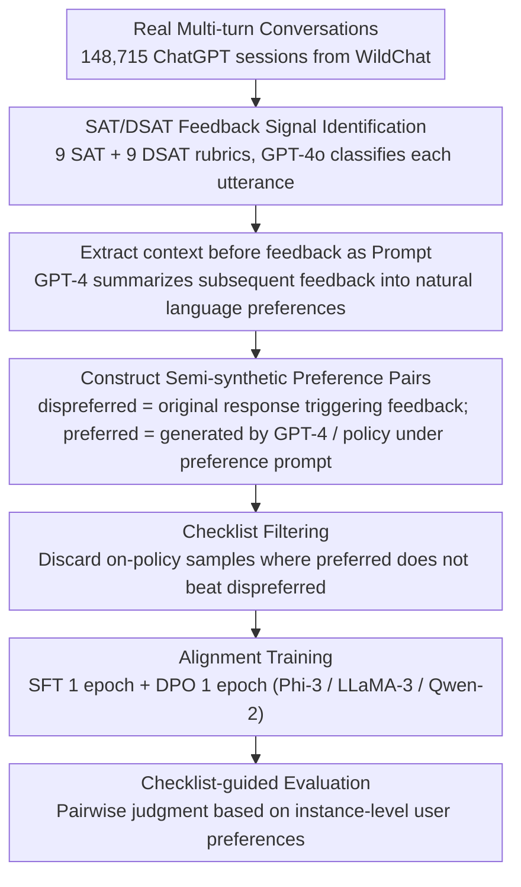

# WildFeedback: Aligning LLMs With In-situ User Interactions And Feedback

**Conference**: ACL2024  
**arXiv**: [2408.15549](https://arxiv.org/abs/2408.15549)  
**Code**: No public training code; Dataset: https://huggingface.co/datasets/microsoft/WildFeedback  
**Area**: LLM Alignment / User Feedback / Preference Learning  
**Keywords**: In-situ User Feedback, Preference Data Construction, SAT/DSAT, DPO, Checklist Evaluation

## TL;DR
WildFeedback automatically identifies satisfied/dissatisfied feedback from real multi-turn ChatGPT conversations. It transforms naturally occurring user preferences into preference training samples and instance-specific checklist evaluation standards. This enables small open-source instruction models to align more closely with real user needs than those trained on UltraFeedback, both on general benchmarks and in real-world user preference tests.

## Background & Motivation
**Background**: LLM alignment typically relies on two types of data: human-annotated preference data or synthetic preference data generated/judged by strong models like GPT-4. The former is costly, subjective, and limited in scale; the latter is cheap and scalable but risks cyclically infusing the strong model's own preferences and biases into the target model.

**Limitations of Prior Work**: Real users naturally express feedback during product use, such as "Thanks, this is exactly what I wanted," "No, please rewrite," or "You ignored my requirements." These signals are closer to actual usage scenarios than offline annotations, yet they are not structured as thumbs-up/down and are often scattered across multi-turn contexts. Simply using the response that triggered feedback for training is insufficient because negative feedback only indicates that the old response was poor; a better response matching the user's preference still needs to be constructed.

**Key Challenge**: Alignment requires real user preferences, but these are naturally noisy, implicit, and context-dependent. Relying solely on static annotation sets lacks scale and authenticity, while relying exclusively on model self-evaluation may weaken the diversity of human preferences.

**Goal**: The authors aim to address three sub-problems: first, detecting which user utterances in real multi-turn conversations contain satisfaction or dissatisfaction signals; second, converting these signals into preferred-dispreferred response pairs suitable for SFT/DPO; and third, constructing an evaluation method where automatic assessment is based on the actual preferences expressed by the user in that specific instance, rather than just asking GPT-4 "which response is better."

**Key Insight**: The critical observation is that although user feedback lacks explicit labels, it often follows interpretable linguistic patterns within a session. By summarizing these patterns into SAT/DSAT rubrics and leveraging GPT-4 to detect and summarize preferences based on these rubrics, "wild" feedback can be converted into structured preference data.

**Core Idea**: Replace offline human/model preference annotations with in-situ user feedback from real multi-turn conversations, using instance-level user preference checklists to guide both preference sample construction and model evaluation.

## Method
WildFeedback does not propose a new alignment loss but rather a data pipeline from real user interactions to preference training and evaluation. The input is a batch of multi-turn user-LLM conversations, and the output is a preference dataset containing prompts, user preference descriptions, preferred responses, and dispreferred responses, along with a held-out benchmark evaluated using user preference checklists.

### Overall Architecture
The overall process is divided into four steps. First, satisfaction signals (SAT) and dissatisfaction signals (DSAT) are identified turn-by-turn within 148,715 multi-turn ChatGPT conversations from WildChat. Second, for sessions containing feedback, the complete dialogue history prior to the feedback is extracted as the prompt, and the subsequent user feedback is summarized into natural language preferences. Third, response pairs are constructed based on these preferences: the original response triggering a DSAT serves as the dispreferred response, while the preferred response is generated by GPT-4 or the current policy model under the user preference prompt. Fourth, instruction models such as Phi-3, LLaMA-3, and Qwen-2 are trained using the generated WildFeedback data through one round of SFT followed by one round of DPO, then evaluated on general benchmarks and the user preference checklist benchmark.

The paper also integrates evaluation into the framework. Traditional AlpacaEval/MT-Bench uses GPT-4 for general quality judgments. Here, each sample has a preference summarized from real feedback (e.g., "be more concise," "needs factual correction," "don't ignore formatting requirements"). These preferences are provided to GPT-4 as a checklist for pairwise comparison, reducing the discrepancy between the judge and real user preferences.

### Key Designs

**1. SAT/DSAT Feedback Signal Identification: Categorizing "wild" implicit user reactions into interpretable rubrics.**

Real user feedback is rarely an explicit thumbs-up/down but is scattered in subsequent utterances—"Thanks, that's exactly it," "Wrong, rewrite it," or "You missed my point." Adapting the satisfaction estimation idea from SPUR, the authors structure these reactions with 9 SAT rubrics (e.g., Appreciation, Learning, Compliance, Humor) and 9 DSAT rubrics (e.g., Negative Feedback, Correction Request, Factual Error, Low Quality). GPT-4o performs utterance-level classification. Mapping feedback to interpretable rubrics avoids using vague emotional words as training signals and enables analysis of why users are satisfied or dissatisfied.

**2. Constructing Semi-synthetic Preference Pairs: Transforming weak supervision into DPO-ready `(prompt, preferred, dispreferred)` triplets.**

Negative feedback only indicates a poor response without providing a better one. For SAT/DSAT sessions, the system first uses GPT-4 to summarize user preferences and extracts the dialogue history prior to feedback as the prompt. In the GPT-4 expert version, the original response triggering a DSAT is the dispreferred response, while the preferred response is generated by GPT-4 under preference and safety prompts. In the on-policy version, Phi-3, Qwen-2, and LLaMA-3 generate their own pairs, with the preferred response guided by user preference system prompts. Unlike UltraFeedback's offline data judged solely by GPT-4, the prompts and preferences here originate from real human-AI interactions and preserve multi-turn context.

**3. Checklist-guided Evaluation and Filtering: Constraining the judge and data quality with instance-level preferences.**

LLM-as-a-judge tends to favor long responses or its own style, diverging from real user preferences. WildFeedback converts preferences summarized from real feedback (e.g., "more concise," "require factual correction") into a checklist. The judge must perform pairwise comparisons based on this checklist. During on-policy data construction, if a generated preferred response fails to beat the dispreferred response under checklist evaluation, it is filtered out. The checklist shifts the evaluation standard from a "generalized good response" to "what this specific user wanted in this specific task."

### Loss & Training
The training does not modify the DPO objective but integrates WildFeedback data into a standard alignment pipeline: each base model undergoes 1 epoch of SFT on preferred responses, followed by 1 epoch of DPO on the full preference pairs. Experiments cover three open-source instruction models: Phi-3-mini-4k-instruct, Meta-Llama-3-8B-Instruct, and Qwen2-7B-Instruct, comparing five settings: original models, WF GPT-4, WF On-policy, UF GPT-4, and UF On-policy.

The test set is constructed to prevent overfitting. Users' prompts and summarized preferences are clustered into 70 groups using FAISS. Ten samples closest to each cluster center are selected, followed by deduplication and filtering of meaningless tasks, resulting in 540 held-out samples. This ensures evaluation focuses on mainstream preferences for similar tasks rather than idiosyncratic outliers.

## Key Experimental Results

### Main Results
WildFeedback demonstrates the ability to mine a significant scale of feedback data from real sessions. Out of 148,715 WildChat sessions, approximately 12.8% contain feedback signals, resulting in 20,281 GPT-4 version preference samples.

| Data/Metric | SAT | DSAT | Total |
|--------|------|------|------|
| Sessions with feedback | 5,447 | 13,582 | 148,715 |
| Utterances with feedback | 8,186 | 27,711 | 628,467 |
| GPT-4 vs Human Agreement | $\kappa=0.69$ | $\kappa=0.50$ | Near-human level |

Compared to existing preference datasets, WildFeedback is characterized by multi-turn context, in-situ user feedback, and longer prompts.

| Dataset | Samples | Prompt Len | Response Len | Multi-turn? | Feedback Source |
|--------|------:|-----------:|-------------:|------|----------|
| WebGPT | 38,925 | 51 | 188 | No | Human Annotation |
| Anthropic HH | 118,263 | 186 | 95 | No | Human Annotation |
| OASST1 | 35,905 | 168 | 221 | Yes | Human Written |
| UltraFeedback | 61,135 | 159 | 256 | No | GPT-4 |
| WildFeedback GPT-4 | 20,281 | 929 | 440 | Yes | In-situ Feedback |
| WildFeedback Qwen-2 | 11,509 | 1,057 | 541 | Yes | In-situ Feedback |
| WildFeedback Phi-3 | 9,194 | 931 | 344 | Yes | In-situ Feedback |
| WildFeedback LLaMA-3 | 10,659 | 982 | 376 | Yes | In-situ Feedback |

On general benchmarks, training with WildFeedback typically outperforms both the base models and UltraFeedback baselines. Notably, for Phi-3 and LLaMA-3, WF GPT-4 improves performance across AlpacaEval 2, Arena-Hard, and MT-Bench simultaneously.

| Model / Training Data | AlpacaEval2 LC | AlpacaEval2 WR | Arena-Hard WR | MT-Bench |
|---------------|---------------:|---------------:|--------------:|---------:|
| Phi-3 Original | 24.3 | 17.4 | 15.4 | 7.32 |
| Phi-3 + WF On-policy | 29.0 | 27.1 | 30.1 | 7.42 |
| Phi-3 + UF On-policy | 27.2 | 25.9 | 28.7 | 7.40 |
| Phi-3 + WF GPT-4 | 34.9 | 36.6 | 32.4 | 7.75 |
| Phi-3 + UF GPT-4 | 32.5 | 38.4 | 30.5 | 7.68 |
| LLaMA-3 Original | 22.9 | 22.6 | 20.6 | 7.10 |
| LLaMA-3 + WF GPT-4 | 34.2 | 42.8 | 32.9 | 7.57 |
| LLaMA-3 + UF GPT-4 | 32.2 | 43.2 | 32.6 | 7.49 |

### Ablation Study
The paper validates components through data construction versions, checklist evaluation, UltraFeedback comparison, and feedback type analysis.

| Configuration / Analysis | Key Metric | Explanation |
|------|---------|------|
| Pairs w/o Checklist | GPT-4 is not always biased toward responses matching user preferences | Indicates standard GPT-4 judges are influenced by general aesthetics and can't stably identify in-situ preferences |
| Pairs w/ Checklist | >70% of GPT-4 expert preferred responses align with user preferences | Checklist steers the judge's attention back to instance-level user needs |
| Small Model On-policy | ~50% align with user preferences | Small models have weaker controllability, necessitating checklist-based filtering |
| WF held-out test | LLaMA-3 + WF GPT-4 win rate 50.8% against UF GPT-4 with checklist | WF training is closer to in-situ feedback on real user preference tests |
| Feedback Distribution | DSAT focused on corrections/factual errors; SAT is more dispersed | WF provides diagnostic insights into user dissatisfaction |

### Key Findings
- The gain from WildFeedback is not just "more data" but a better match between training data and actual usage scenarios. Its prompts and preferences originate from real interactions, making its improvement on user preference benchmarks more interpretable than UltraFeedback.
- The checklist is the most critical evaluation design. It prevents GPT-4 judges from selecting responses based on generalized aesthetics and directs them to fulfill the specific goals expressed by users in that session.
- DSAT significantly outweighs SAT, highlighting a selection bias in real product data: users are more likely to continue interacting to correct a model when dissatisfied.

## Highlights & Insights
- The primary highlight is elevated "user feedback" from noise in product logs to trainable preference data. While many works assume preferences must be explicitly scored, WildFeedback shows that natural next-turn reactions provide a valid supervisory signal.
- Checklist-guided evaluation is highly suitable for personalized agents and customer service systems. Evaluations can shift from general quality scores to instance-level goal achievement.
- Analysis of feedback types suggests that dissatisfaction stems mostly from factual errors and ignored instructions. This implies that system optimization should prioritize fixing hard errors over pursuing a more "pleasing" tone.
- The "semi-synthetic" strategy is pragmatic: users provide the real preference, and a strong model completes the preferred response. It constrains model generation within the bounds of real user intent.

## Limitations & Future Work
- In-situ feedback can be malicious, harmful, or irrational. While safety prompts and moderation filters are used, more robust methods are needed to distinguish "authentic preferences" from "preferences that should not be followed."
- Selection bias exists; users provide more feedback when dissatisfied, potentially leading to an over-representation of error-correction scenarios and an underestimation of silent but satisfied users.
- Evaluation still relies on GPT-4o as a judge. Although the checklist reduces bias, it does not eliminate the systematic issues of LLM-as-a-judge, especially since the checklists are also summarized by GPT-4.
- On-policy generation by small models lacks precision, with about half of the "preferred" responses failing to align with intent. Rejection sampling or cross-model verification could improve data quality.

## Related Work & Insights
- **vs UltraFeedback**: UltraFeedback uses GPT-4 to score offline prompt-response pairs, offering scale and reproducibility; WildFeedback mines real interactions, providing data that is smaller but more aligned with actual user needs.
- **vs Anthropic HH / WebGPT**: These rely on human-annotated preferences which are high-quality but expensive and may not represent the end user; WildFeedback reduces the "annotator-user" preference mismatch.
- **vs OASST1**: OASST1 contains multi-turn dialogues, but many are human-written; WildFeedback captures how users actually follow up and correct models in real human-AI loops.
- **Insight**: Alignment data can shift from "annotation tasks" to "interaction log mining." For specialized domains like education or medical QA, it is worth exploring how to convert behaviors like retries, cancellations, or rewrites into preference signals.

## Rating
- Novelty: ⭐⭐⭐⭐⭐ Automating the construction of preference data and checklist evaluations from in-situ feedback is highly relevant to real-world product alignment.
- Experimental Thoroughness: ⭐⭐⭐⭐ Covers multiple models, benchmarks, and human consistency checks, though long-term user-side effects remain unassessed.
- Writing Quality: ⭐⭐⭐⭐ The methodology is clear, and the data diagnostics are persuasive.
- Value: ⭐⭐⭐⭐⭐ Highly instructive for LLM alignment, conversational recommendation, and interactive evaluation frameworks.

<!-- RELATED:START -->

## Related Papers

- [\[ACL 2026\] PERSA: Reinforcement Learning for Professor-Style Personalized Feedback with LLMs](persa_reinforcement_learning_for_professor-style_personalized_feedback_with_llms.md)
- [\[ACL 2026\] CuMA: Aligning LLMs with Sparse Cultural Values via Demographic-Aware Mixture of Adapters](cuma_aligning_llms_with_sparse_cultural_values_via_demographic-aware_mixture_of_.md)
- [\[ICLR 2026\] COMAL: A Convergent Meta-Algorithm for Aligning LLMs with General Preferences](../../ICLR2026/llm_alignment/comal_a_convergent_meta-algorithm_for_aligning_llms_with_general_preferences.md)
- [\[ACL 2026\] RbtAct: Rebuttal as Supervision for Actionable Review Feedback Generation](rbtact_rebuttal_as_supervision_for_actionable_review_feedback_generation.md)
- [\[ICLR 2026\] Learning to Summarize User Information for Personalized RLHF (PLUS)](../../ICLR2026/llm_alignment/learning_to_summarize_user_information_for_personalized_reinforcement_learning_f.md)

<!-- RELATED:END -->
