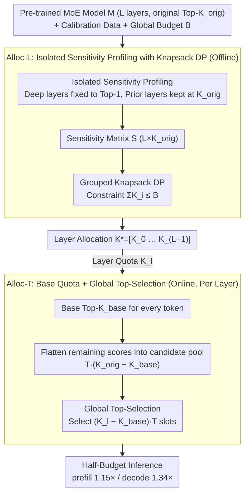

# Alloc-MoE: Budget-Aware Expert Activation Allocation for Efficient Mixture-of-Experts Inference

**Conference**: ACL 2026  
**arXiv**: [2604.08133](https://arxiv.org/abs/2604.08133)  
**Code**: None  
**Area**: LLM Efficiency / MoE Inference  
**Keywords**: Mixture-of-Experts, expert activation budget, dynamic programming, token-level redistribution, inference acceleration

## TL;DR
The "number of activated experts" in MoE inference is abstracted as a global budget $B$. Optimal Top-K allocation is performed across layers via dynamic programming (Alloc-L), followed by token-level redistribution using global Top-$(K \cdot T)$ selection (Alloc-T). This approach halves the activation budget of DeepSeek-V2-Lite while maintaining accuracy, achieving a 1.15× speedup in prefill and a 1.34× speedup in decode.

## Background & Motivation

**Background**: Sparse MoEs (DeepSeek-V2/V3, Qwen-MoE, OLMoE, etc.) route each token to Top-K experts. Since inference latency increases nearly linearly with the number of activated experts, reducing K is a natural approach to acceleration.

**Limitations of Prior Work**: Two main compression routes aim to "reduce activation" but overlook the impact on model performance. Token-level methods (Top-P in XMoE, Dynamic-MoE, NAEE, AdapMoE) mostly rely on training-time calibration or fixed thresholds. Layer-level methods (heuristics like LExI) treat all layers equally. Empirical tests show that reducing the activation of DeepSeek-V2-Lite from 6 to 3 experts per token leads to a 17% performance drop; at K=2, the drop reaches nearly 40%.

**Key Challenge**: Activation quota is a scarce resource, but it should neither be distributed equally across all layers nor across all tokens—layer sensitivity to sparsification varies significantly, and routing distributions for different tokens range from concentrated to sparse. Existing works focus on either layers or tokens, never solving both as a unified budget optimization problem.

**Goal**: Find an optimal layer-level allocation $\mathbf{K}^{\ast}=[K_0,\dots,K_{L-1}]$ and token-level activation distribution under a fixed global activation budget $B$ to minimize overall performance loss.

**Key Insight**: The authors discovered that layer sensitivity can be accurately quantified using an end-to-end PPL metric (key technique: when profiling layer $i$, fix **all subsequent layers** to Top-1 and maintain **all preceding layers** at $K_{\text{orig}}$ to isolate deep-layer compensation effects). Token-level redistribution can then be transformed into a global top-selection problem over a $T \times K_{\text{orig}}$ candidate set.

**Core Idea**: "Activation budget" is explicitly modeled as a schedulable resource. The framework uses DP for optimal inter-layer allocation and global top-selection for intra-layer token redistribution. These two components are orthogonal and stackable.

## Method

### Overall Architecture

Alloc-MoE explicitly models the "number of activated experts" as a fixed global budget $B$ and optimally schedules it across two orthogonal dimensions. The input consists of a pre-trained MoE model $M$ (with $L$ layers and an original Top-$K$ of $K_{\text{orig}}$), calibration data $D_{\text{calib}}$, and a budget $B$. In the offline phase, the sensitivity of each layer to sparsification is quantified, and the budget is partitioned into a layer-level allocation $\mathbf{K}^{\ast}=[K_0,\dots,K_{L-1}]$ using dynamic programming (Alloc-L). In the online phase, activation opportunities are redistributed among tokens within each layer according to that layer's quota (Alloc-T). Since these two phases optimize layers and tokens separately without overlap, they form a unified framework. The output is an inference process that maintains accuracy even with a halved activation budget.

### Key Designs

**1. Alloc-L: Isolated sensitivity profiling with Knapsack DP to optimally partition the budget across layers**

Layer allocation faces two challenges: inaccurate measurement and computational complexity. When quantifying a layer's sensitivity independently, subsequent deep layers "compensate" for its sparsification, making shallow layers appear less critical. This design profiles layer $i$ for $k\in\{K_{\text{orig}},\dots,1\}$ by forcing all $j>i$ deep layers to Top-1 to isolate compensation and keeping all $j<i$ shallow layers at their original configuration. The resulting $\mathbf{S}[i,k]=\mathrm{PPL}$ forms a sensitivity matrix $\mathbf{S}\in\mathbb{R}^{L\times K_{\text{orig}}}$. Finding the optimal allocation $\arg\min_{\mathbf{K}}\sum_i\mathbf{S}[i,K_i]\ \text{s.t.}\ \sum_i K_i\le B$, which is a combinatorial explosion of $K_{\text{orig}}^L$, is solved using grouped knapsack DP: $\mathrm{DP}[i,b]=\min_{k\le b}\big(\mathrm{DP}[i-1,b-k]+\mathbf{S}[i,k]\big)$. The complexity is reduced to $O(L\cdot B\cdot K_{\text{orig}})$, which is efficient since $B\le L K_{\text{orig}}$.

**2. Alloc-T: Base quota with global top-selection to redistribute layer budget among tokens**

Standard Top-$K$ routing applies a uniform cut-off to every token, ignoring differences where some tokens have a single expert with a 0.9 score while others have four experts at 0.25. Alloc-T formulates token-expert selection per layer as a 0-1 integer programming problem $\max\sum z_{t,e}w_{t,e}$ with constraints $\sum z_{t,e}\le T\cdot K_l$ and a minimum $K_{\text{base}}$ per token. Practically, this is implemented in three steps: preserve Top-$K_{\text{base}}$ for every token, flatten the remaining $K_{\text{orig}}-K_{\text{base}}$ score columns into a pool of $T\cdot(K_{\text{orig}}-K_{\text{base}})$ candidates, and globally select the top $(K_l-K_{\text{base}})\cdot T$ slots. This involves two masks and one top-K operation, requiring zero extra kernels or parameters, and allows uncertain (high-entropy) tokens to receive more quota.

**3. Alloc-MoE: Orthogonal combination of layer and token levels into a unified framework**

Alloc-L and Alloc-T operate on non-overlapping resource dimensions—the former determines the average layer budget $K_l^{\ast}$, while the latter performs token-level rearrangement within that $K_l^{\ast}$. This orthogonality is supported by data: running Alloc-L alone yields an average +0.4% gain, and Alloc-T alone yields +0.93%, suggesting token-level redistribution is more valuable under aggressive sparsification. Combining them achieves the highest mean of 45.19% (compared to 44.19% for Uniform), remaining optimal or near-optimal across all budget ranges.

### Loss & Training

No retraining is required. Alloc-L only requires $L\cdot K_{\text{orig}}$ offline PPL evaluations to obtain the sensitivity matrix $\mathbf{S}$. Alloc-T is a pure inference-time mask and top-K operation without additional parameters. $K_{\text{base}}=1$ is the default and is near-optimal for all models and budgets.

## Key Experimental Results

### Main Results
Evaluated on DeepSeek-V2-Lite ($L=26$, $K_{\text{orig}}=6$), Qwen1.5-MoE-A2.7B, and OLMoE-1B-7B across 20 NLU, Reasoning, and Math benchmarks. Comparisons were made against Uniform, LExI, Dynamic-MoE, and NAEE. The table below shows the "Task Group Average" for DeepSeek at half budget ($B=78$, average 3 experts per token).

| Task Group | Uniform | Dynamic-MoE | NAEE | LExI | **Alloc-MoE** |
|---|---|---|---|---|---|
| NLU | ~63.0 | ~62.5 | ~62.6 | ~63.4 | **~63.5** |
| Reasoning | ~37.2 | ~37.9 | ~38.0 | ~37.5 | **~38.6** |
| Math | ~31.6 | ~32.3 | ~31.7 | ~31.0 | **~34.4** |

Overall, Alloc-MoE outperformed competitors in 10 out of 12 budget-task configurations, with more significant improvements on harder tasks: NLU +0.05%, Reasoning +0.70%, and Math +2.15%. Inference efficiency at half-budget showed 1.15× prefill and 1.34× decode speedup, matching LExI's speed while maintaining higher accuracy.

### Ablation Study (DeepSeek-V2-Lite Task Group Average)

| Configuration | $B=52$ | $B=78$ | $B=104$ | $B=130$ | Mean |
|---|---|---|---|---|---|
| Uniform | 41.27 | 43.90 | 45.51 | 46.06 | 44.19 |
| +Alloc-L | 41.53 | 44.61 | 45.76 | 46.47 | 44.59 |
| +Alloc-T | 42.83 | 45.42 | 45.93 | 46.30 | 45.12 |
| **+Alloc-L +Alloc-T** | **43.09** | **45.48** | **46.01** | 46.17 | **45.19** |

### Key Findings
- Alloc-T provides a larger contribution (+1.56) when the budget is tighter ($B=52$, 2 experts per layer), suggesting token-level redistribution is more critical than layer-level under aggressive sparsification.
- $K_{\text{base}}$ Ablation: Scanning from 0 to 5, $K_{\text{base}}=1$ proved near-optimal for all budgets. $K_{\text{base}}\ge 2$ leads to significant drops under tight budgets because more "guaranteed" experts reduce redistribution flexibility.
- Calibration datasets (WikiText2, C4, Pile) have almost no impact on Alloc-L, with mean scores across budgets staying between 44.59 and 44.68, demonstrating the robustness of sensitivity profiling.
- Visualizing layer-level allocation shows that shallow layers retain more experts while deep layers are cut more aggressively, aligning with the intuition that shallow layers are more sensitive due to general feature extraction. Token-level allocation shows a strong positive correlation ($>0.7$) between allocated expert count and routing entropy.

## Highlights & Insights
- **Unified abstraction of "activation budget"**: This is the most significant highlight. It unifies layer-level and token-level sparsification decisions into a schedulable resource, making standard tools like DP and global top-K immediately applicable.
- **Isolated sensitivity profiling**: Directly quantifying layer sensitivity often fails because deep layers compensate for shallow ones. Forcing subsequent layers to Top-1 reveals the "true" sensitivity.
- **Zero-overhead implementation of Alloc-T**: Equivalent to "two masks + one global top-K," it introduces no extra kernels and can be directly integrated into existing MoE routers.
- **Robust expert load analysis**: The expert load distribution after allocation shows a Spearman correlation of 0.93~0.99 with the original model and JS divergence <0.014, indicating it does not disrupt expert specialization and is friendly to distributed deployments.

## Limitations & Future Work
- Hardware awareness (expert placement, communication overhead) was not considered; gains in distributed MoE deployments might vary.
- Alloc-L requires $L\cdot K_{\text{orig}}$ offline PPL runs. The profiling cost for 100B+ models is non-negligible; proxy models could be used for sensitivity estimation.
- The framework is entirely post-hoc. Integrating "activation budget awareness" into training losses could further improve robustness.
- Only three tasks and model types were evaluated. Scenarios with different activation patterns, such as long-context or code, were not covered.

## Related Work & Insights
- **vs. XMoE / Dynamic-MoE**: These use token-level dynamic routing, but XMoE requires training-time calibration, and Dynamic-MoE adds entropy regularization to the training objective. Alloc-T is entirely post-hoc with zero extra parameters.
- **vs. NAEE**: NAEE is limited to skipping the second expert in Top-2 routing and is difficult to extend; Alloc-T is a generalized top-selection.
- **vs. LExI**: LExI uses layer-level heuristics without DP optimality; Alloc-L provides the global optimum under budget constraints.
- **vs. MoE Pruning/Quantization**: This work is orthogonal to and can be combined with pruning or quantization for further acceleration.

## Rating
- Novelty: ⭐⭐⭐⭐ Unified abstraction of "activation budget" + isolated sensitivity profiling is a fresh combination, though DP and global top-K are standard methods.
- Experimental Thoroughness: ⭐⭐⭐⭐ Three models, four budgets, 20 datasets, includes ablation, $K_{\text{base}}$ sweeps, and load analysis; lacks tests on ultra-large models.
- Writing Quality: ⭐⭐⭐⭐ Equations and algorithms are clear. Figures 3-8 are highly informative. Terms Alloc-L/Alloc-T are intuitive.
- Value: ⭐⭐⭐⭐ Pure post-processing, zero training, and directly deployable to MoE frameworks like vLLM. 1.34× decode speedup at half-budget is highly attractive for production.

<!-- RELATED:START -->

## Related Papers

- [\[ICML 2026\] TEAM: Temporal-Spatial Consistency Guided Expert Activation for MoE Diffusion Language Model Acceleration](../../ICML2026/llm_efficiency/team_temporal-spatial_consistency_guided_expert_activation_for_moe_diffusion_lan.md)
- [\[ICML 2025\] Mixture of Lookup Experts](../../ICML2025/llm_efficiency/mixture_of_lookup_experts.md)
- [\[ICLR 2026\] Semantic Parallelism: Redefining Efficient MoE Inference via Model-Data Co-Scheduling](../../ICLR2026/llm_efficiency/semantic_parallelism_redefining_efficient_moe_inference_via_model-data_co-schedu.md)
- [\[NeurIPS 2025\] Advancing Expert Specialization for Better MoE](../../NeurIPS2025/llm_efficiency/advancing_expert_specialization_for_better_moe.md)
- [\[ICLR 2026\] Expert Divergence Learning for MoE-based Language Models](../../ICLR2026/llm_efficiency/expert_divergence_learning_for_moe-based_language_models.md)

<!-- RELATED:END -->
