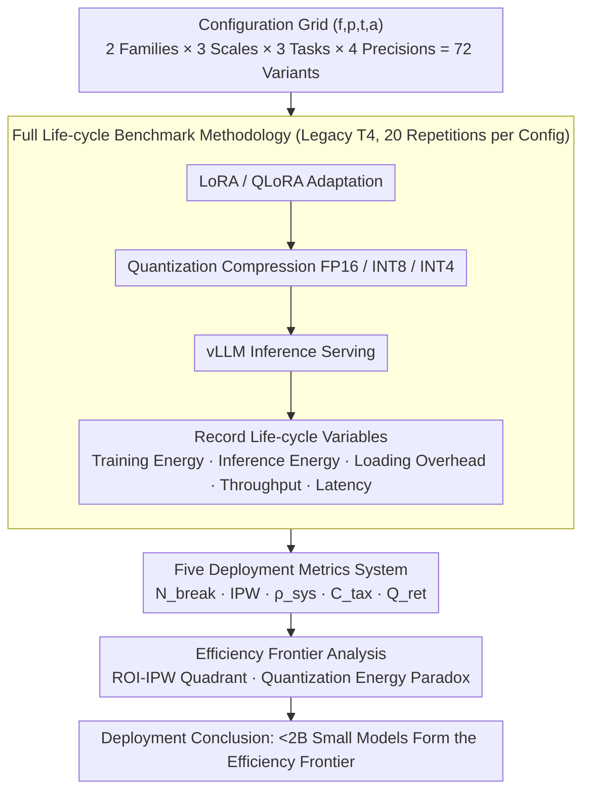

# Are Large Language Models Economically Viable for Industry Deployment?

**Conference**: ACL 2026  
**arXiv**: [2604.19342](https://arxiv.org/abs/2604.19342)  
**Code**: [https://github.com/Abdullah4152/EDGE-EVAL](https://github.com/Abdullah4152/EDGE-EVAL)  
**Area**: Others  
**Keywords**: Deployment Economics, Life-cycle Benchmark, Energy Efficiency Evaluation, Quantization Fidelity, Edge Inference

## TL;DR

The Edge-Eval framework is proposed to evaluate the full life cycle of LLMs on traditional T4 GPUs through five deployment metrics (Economic Break-even, Intelligence-Power Ratio, System Density, Cold Start Tax, and Quantization Fidelity). It reveals that small models (<2B) are comprehensively superior to 7B models in economic and ecological dimensions and identifies an anomalous phenomenon where QLoRA increases energy consumption by up to 7x despite reducing memory usage.

## Background & Motivation

**Background**: Generative AI-driven LLMs are rapidly transitioning from research prototypes to industrial deployment, with wide applications in medical decision-making, financial analysis, enterprise retrieval, and dialogue automation. These scenarios have strict constraints on energy consumption, latency, and hardware utilization.

**Limitations of Prior Work**: Existing evaluation pipelines are accuracy-centric and lack operational and economic metrics, creating a "Deployment-Evaluation Gap." Models may perform excellently in accuracy but prove infeasible in energy efficiency, cost recovery, or hardware utilization during deployment.

**Key Challenge**: Memory efficiency $\neq$ energy efficiency $\neq$ deployment efficiency. For example, QLoRA reduces memory by approximately 60%, but the energy consumption for fine-tuning increases by up to 7.2x. These critical trade-offs are completely invisible in accuracy benchmarks.

**Goal**: Construct a full life-cycle evaluation framework for industrial deployment to fill the evaluation blind spot between the laboratory and production environments.

**Key Insight**: Conduct a full life-cycle benchmark from adaptation to inference for LLaMA and Qwen series on widely deployed legacy NVIDIA Tesla T4 GPUs.

**Core Idea**: Define five deployment metrics covering profitability, energy efficiency, hardware density, cold start overhead, and compression safety to reveal the efficiency frontier of small models and the energy consumption paradox of quantization.

## Method

### Overall Architecture

Edge-Eval is a full life-cycle evaluation framework for industrial deployment, designed to quantify the "operational and economic" dimensions invisible to accuracy benchmarks. For each configuration $(f, p, t, a) \in \mathcal{F} \times \mathcal{P} \times \mathcal{T} \times \mathcal{A}$ (Model Family × Parameter Scale × Task × Precision), it executes a complete deployment pipeline—from LoRA/QLoRA adaptation to optional quantization compression, and finally to vLLM inference serving. All tests are conducted on the most widely deployed legacy T4 GPUs. Covering 72 variants (2 model families × 3 parameter scales × 3 tasks × 4 precision configurations), each pipeline records life-cycle variables such as training energy, inference energy, loading overhead, throughput, and latency. Finally, the framework uses five deployment metrics and efficiency frontier analysis to determine which configurations are truly viable for production.

### Key Designs

**1. Full Life-cycle Benchmark Methodology: End-to-End Evaluation on Controlled Legacy Hardware**

To simulate real industrial conditions, evaluations are fixed on dual-GPU T4 nodes (T4 being one of the most widely deployed inference GPUs globally). Full tests of four precision configurations (LoRA-FP16/INT8/INT4 and QLoRA-INT4) are performed for LLaMA (1B/3B/8B) and Qwen (1.5B/3B/7B) on three industrial tasks: summarization, RAG, and dialogue. Each configuration is independently repeated 20 times to suppress variance. All life-cycle variables, including training energy, inference energy, loading overhead, sustained throughput, latency characteristics, and GPU VRAM footprint, are recorded. This ensured that the entire chain from adaptation to inference, rather than just the inference segment, is included in the measurement. This controlled pipeline provides the data source for the subsequent two designs.

**2. Five Deployment Metrics System: Quantifying Economics, Energy Efficiency, and Feasibility**

Since accuracy masks dimensions critical to deployment, five complementary metrics are defined based on the recorded variables. **Economic Break-even** $N_{break} = (C_{train}+C_{setup})/(C_{api}-C_{infer})$ calculates how many requests are needed for local deployment to match the cost of calling an API. **Intelligence-Power Ratio** $IPW = \mathcal{S}_{task} \cdot \alpha / E_{req}$ normalizes task performance to energy consumption per watt. **System Density** $\rho_{sys} = \mathcal{T}_{put}/M_{vram}$ measures the throughput generated per GB of VRAM. **Cold Start Tax** $C_{tax} = E_{load}/E_{infer}$ characterizes the energy penalty of model loading relative to steady-state inference. **Quantization Fidelity** $Q_{ret} = \mathcal{S}_{INT4}/\mathcal{S}_{FP16} \times 100\%$ quantifies the retention rate of inference performance after 4-bit compression. These five metrics supplement accuracy to provide a direct basis for industrial decision-making.

**3. Efficiency Frontier Analysis: Identifying Optimal Configurations and Anomalies via Visualization**

After obtaining life-cycle data, ROI-IPW quadrant charts, system density analysis, and quality-stability trade-off maps are used to identify the efficiency frontier formed by <2B small models. Simultaneously, the energy consumption of LoRA and QLoRA is compared side-by-side to reveal the "Quantization Energy Paradox"—where QLoRA significantly raises fine-tuning energy despite lower memory usage. This step transforms fragmented metrics into actionable deployment conclusions.

### Loss & Training

The evaluation framework itself does not introduce new training strategies. It uniformly uses standard LoRA ($r=16$, $\alpha=32$) and corresponding QLoRA configurations to ensure comparability among the 72 variants.

## Key Experimental Results

### Main Results

Life-cycle efficiency frontier (INT4 Median, 20 runs, 3 tasks):

| Model | $N_{break}$ | IPW | $\rho_{sys}$ (tok/s/GB) | $Q_{ret}$ | $C_{tax}$ |
|------|------------|-----|------------------------|----------|----------|
| LLaMA-1B | **14 Reqs** | 0.45 | **6,930** | 100.6% | 183x |
| LLaMA-3B | 33 Reqs | 0.27 | 1,336 | 99.8% | 184x |
| LLaMA-7B | 43 Reqs | 0.15 | 387 | 100.3% | 230x |
| Qwen-1.5B | 21 Reqs | **0.48** | 6,942 | 99.6% | 179x |
| Qwen-3B | 28 Reqs | 0.23 | 1,419 | 97.3% | 188x |
| Qwen-7B | 39 Reqs | 0.14 | 394 | 99.5% | 237x |

### Ablation Study

QLoRA Energy Paradox (LoRA-FP16 vs. QLoRA-INT4):

| Model | LoRA-FP16 Energy | QLoRA-INT4 Energy | Gain (Ratio) |
|------|---------------|----------------|------|
| LLaMA-1B | 0.039 kWh | 0.251 kWh | **6.4×** |
| LLaMA-3B | 0.171 kWh | 0.511 kWh | 3.0× |
| LLaMA-7B | 0.244 kWh | 0.552 kWh | 2.3× |
| Qwen-1.5B | 0.129 kWh | 0.301 kWh | 2.3× |

### Key Findings

- Models <2B form a clear efficiency frontier: LLaMA-1B requires only 14 requests to recover deployment costs, and its system density reaching 6,930 tok/s/GB is 17x that of the 7B model.
- Quantization fidelity is generally >97%, meaning INT4 is nearly lossless—indicating that quantization is a "free" inference accelerator on legacy hardware.
- The energy paradox of QLoRA is most severe in small models (6.4×) and gradually alleviates as the model size increases (down to 2.3×), possibly because quantization overhead accounts for a larger proportion of small model computation.
- The cold start tax is approximately 180-237x the steady-state inference energy, which has significant implications for serverless deployment scenarios.

## Highlights & Insights

- "Memory efficiency $\neq$ energy efficiency" is a significant and counter-intuitive finding: while QLoRA is widely recommended for resource saving, this work reveals its hidden energy costs, serving as a warning for Green AI practices.
- The design of the five deployment metrics covers the full cycle from economic profitability to ecological sustainability. $N_{break}$ (Economic Break-even) is particularly useful for practical decision-making—14 requests for cost recovery implies nearly zero barriers to entry.
- Evaluation on legacy T4 hardware is of high practical significance, as the T4 is one of the most widely deployed inference GPUs in global data centers.

## Limitations & Future Work

- Only LLaMA and Qwen families were evaluated; other popular models like Mistral and Gemma are missing.
- Tests were limited to T4 GPUs; the efficiency landscape might differ on newer hardware (A100, H100).
- Batch size was fixed at 1 to simulate low-load scenarios; the efficiency frontier might change under high-concurrency conditions.
- Combinatorial effects of quantization with other compression techniques like distillation or pruning were not considered.
- While the five metrics are comprehensive, a unified framework for trade-offs between metrics (such as automated identification of Pareto optimality) is lacking.

## Related Work & Insights

- **vs MLPerf Tiny**: Evaluates inference on ultra-low power devices but only focuses on the inference stage; Edge-Eval covers the full life cycle.
- **vs Green AI (Schizas et al.)**: Advocates for reporting energy consumption but lacks a unified framework; Edge-Eval embeds energy efficiency into a systematic metric system.
- **vs Conventional Compression Evaluation**: Usually focus only on accuracy retention; Edge-Eval adds economic and system density dimensions.

## Rating
- Novelty: ⭐⭐⭐⭐ The deployment metric system is novel, and the QLoRA energy paradox is an important discovery.
- Experimental Thoroughness: ⭐⭐⭐⭐⭐ 72 variants × 20 runs × 3 tasks represents extremely thorough experimentation.
- Writing Quality: ⭐⭐⭐⭐ Metrics are defined clearly with strong visualization analysis.
- Value: ⭐⭐⭐⭐⭐ Provides direct guidance for industrial LLM deployment decisions.

<!-- RELATED:START -->

## Related Papers

- [\[ACL 2026\] Lizard: An Efficient Linearization Framework for Large Language Models](lizard_an_efficient_linearization_framework_for_large_language_models.md)
- [\[ACL 2026\] CreditDecoding: Accelerating Parallel Decoding in Diffusion Large Language Models with Trace Credit](creditdecoding_accelerating_parallel_decoding_in_diffusion_large_language_models.md)
- [\[ACL 2026\] Breaking Block Boundaries: Anchor-based History-stable Decoding for Diffusion Large Language Models](breaking_block_boundaries_anchor-based_history-stable_decoding_for_diffusion_lar.md)
- [\[ACL 2026\] Tandem: Riding Together with Large and Small Language Models for Efficient Reasoning](tandem_riding_together_with_large_and_small_language_models_for_efficient_reason.md)
- [\[ICLR 2026\] DND: Boosting Large Language Models with Dynamic Nested Depth](../../ICLR2026/llm_efficiency/dnd_boosting_large_language_models_with_dynamic_nested_depth.md)

<!-- RELATED:END -->
