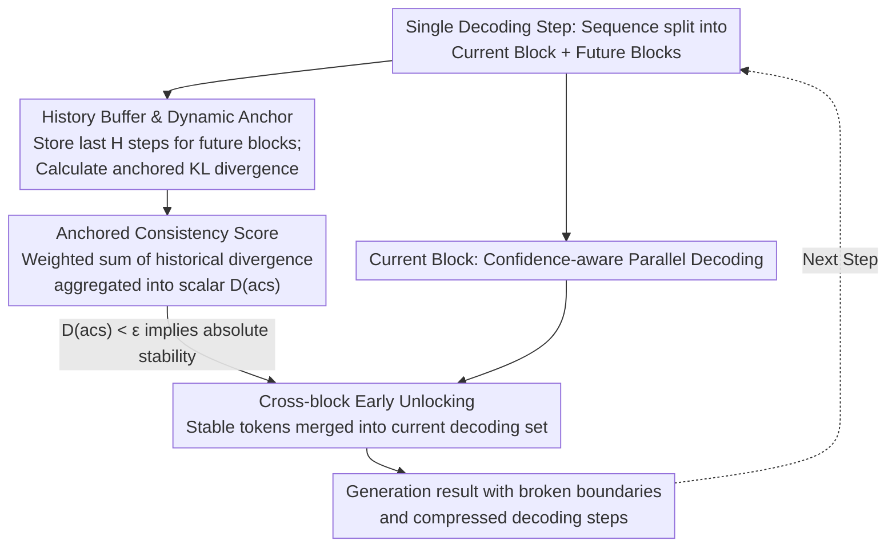

# Breaking Block Boundaries: Anchor-based History-stable Decoding for Diffusion Large Language Models

**Conference**: ACL 2026  
**arXiv**: [2604.08964](https://arxiv.org/abs/2604.08964)  
**Code**: [GitHub](https://github.com/zs1314/AHD)  
**Area**: LLM Efficiency  
**Keywords**: Diffusion Language Models, Semi-autoregressive Decoding, Cross-block Stable Tokens, Dynamic Anchors, Inference Acceleration

## TL;DR
This paper proposes AHD (Anchor-based History-stable Decoding), a training-free, plug-and-play dynamic decoding strategy. By utilizing dynamic anchors to backtrack historical trajectories and identify cross-block stable tokens in diffusion LLMs, AHD achieves early unlocking. It reduces decoding steps by 80% on BBH while simultaneously improving performance by 3.67%.

## Background & Motivation

**Background**: Diffusion Large Language Models (dLLMs), such as LLaDA, have emerged as powerful alternatives to autoregressive LLMs. Semi-autoregressive (Semi-AR) decoding is widely adopted, where the output sequence is divided into multiple blocks decoded sequentially from left to right, with each block undergoing iterative denoising.

**Limitations of Prior Work**: Semi-AR decoding suffers from a significant "block boundary delay" problem. Many tokens converge to their final values and maintain stability well before their corresponding block is decoded, yet they are forced to wait for their specific block's turn. This delayed decoding of "cross-block stable tokens" wastes decoding steps and suppresses the radiation effects on local regions, leading to performance degradation.

**Key Challenge**: How to accurately identify cross-block stable tokens? Existing methods based on single-step confidence or entropy are unreliable because (1) stable tokens may still exhibit local fluctuations, leading to misjudgment; and (2) standard decoding isolates historical information, as each prediction depends only on the previous step.

**Goal**: To break the block boundary constraints of Semi-AR decoding and improve both efficiency and performance by early unlocking cross-block stable tokens.

**Key Insight**: Three critical observations: (1) Naive lookahead decoding is unreliable due to local fluctuations; (2) token stability is highly correlated with absolute convergence trends; and (3) historical information is isolated in standard decoding. Therefore, historical trajectory information must be introduced to determine global stability.

**Core Idea**: At each decoding step, using the current step as a dynamic anchor, the system backtracks through a history buffer to calculate an anchored consistency score. This captures the absolute stability trend of tokens; once verified as stable, tokens are decoded early across blocks.

## Method

### Overall Architecture
AHD modifies the standard semi-autoregressive decoding framework used in diffusion LLMs. At each decoding step, the sequence is partitioned into a current block $B_{current}^t$ and future blocks $B_{future}^t$. The current block follows standard confidence-aware parallel decoding, while the new mechanism operates on the future blocks. AHD maintains a historical distribution trajectory for each position in the future blocks. Using the "current step" as a dynamic anchor, it backtracks this trajectory to measure whether the position exhibits an absolute stability trend. Once confirmed as stable, the token is unlocked early from the future block and merged into the current decoding set to update the sequence. This ensures the input remains a progressive denoising trajectory while historical consistency determines "early convergence," resulting in a generation process that breaks block boundaries and significantly compresses decoding steps.

### Key Designs

**1. History Buffer and Dynamic Anchors: Trajectory-based Stability Judgment**

To determine if a token is truly stable, relying on single-step confidence or entropy is unreliable, as stabilized tokens may still experience local fluctuations. AHD maintains a history buffer $\mathcal{H}_j^t = \{P_j^{t-H+1}, \dots, P_j^t\}$ of length $H$ for each position $j$ in the future blocks. It uses the current distribution $P_j^t$ as a dynamic anchor to calculate the anchored KL divergence with historical steps: $\delta_j^{t,\tau} = D_{KL}(P_{j,anchor}^t \,\|\, P_j^{t-\tau})$. In contrast to standard decoding where history is isolated, this anchor-based perspective captures early signals of stability trends from the global trajectory.

**2. Anchored Consistency Score: Aggregating Historical Evidence**

AHD performs an exponentially decaying weighted sum of the anchored divergence sequence $\{\delta_j^{t,1}, \dots, \delta_j^{t,H-1}\}$ to obtain the anchored consistency score: $D_j^t(acs) = \sum_{\tau=1}^{H-1} w_\tau \delta_j^{t,\tau}$, where weights $w_\tau = e^{-\lambda\tau}/Z$ prioritize recent history. This decay maintains sensitivity to recent changes while ensuring robustness to long-term trends. A position is deemed to have reached an absolute stability trend when $D_j^t(acs) < \varepsilon$, where $\varepsilon$ serves as a threshold for unlocking conservatism.

**3. Cross-block Early Unlocking: Releasing Radiation Effects**

In the final step, AHD merges the set of stable positions in the future blocks $G_f^t = \{j \mid j \in B_{future} \wedge D_j^t(acs) < \varepsilon\}$ with the current decoding set $G_c^t$ to form $G_{unmasked}^t$. These are unlocked and updated together. The efficiency and quality gains stem from the "radiation effect": a confirmed token accelerates the convergence of its neighbors. Semi-AR originally suppressed this by forcing tokens to wait for their block turn. Early unlocking releases this suppressed radiation, turning the trade-off between speed and quality into a mutual benefit.

AHD is a training-free, plug-and-play method that only operates during inference. Default hyperparameters are $H=6$ and $\varepsilon=0.01$.

## Key Experimental Results

### Main Results (LLaDA-8B-Instruct)

| Task | Metric | AHD | Vanilla | Step Reduction |
|------|------|-----|---------|----------|
| BBH | Score↑ | 56.78 | 53.11 | 80% |
| HumanEval | Score↑ | 43.29 | 40.85 | 70% |
| MBPP | Score↑ | 31.20 | 29.20 | 74% |
| MMLU-Pro | Score↑ | 37.42 | 35.57 | 48% |
| Asdiv | Score↑ | 77.09 | 75.57 | 76% |

### Ablation Study

| Method | BBH Score | Step Reduction | Description |
|------|-----------|----------|------|
| Vanilla | 53.11 | 0% | Standard Decoding |
| Fast-dLLM | 53.17 | 78% | Performance parity, no gain |
| KLASS | 53.03 | 62% | Slight degradation |
| Saber | 52.88 | 66% | Performance degradation |
| **Ours (AHD)** | **56.78** | **80%** | Simultaneous gain in performance and efficiency |

### Key Findings
- AHD is the only method that improves performance while accelerating inference; other strategies (Saber, KLASS) typically lead to performance drops.
- AHD is equally effective on LLaDA-1.5 (BBH +1.55, 78% step reduction), demonstrating generalizability.
- The method extends successfully to Vision-Language (MMaDA) and Audio-Language (DIFFA) domains.

## Highlights & Insights
- **"Radiation Effect of Stable Tokens"**: The discovery that stable tokens appear in clusters and accelerate the convergence of neighbors is valuable for understanding dLLM decoding dynamics.
- **Counter-intuitive "Acceleration as Improvement"**: Early unlocking not only speeds up inference but improves generation quality by releasing radiation effects, challenging the traditional "speed vs. quality" trade-off.
- **Generality of the Anchor mechanism**: This trajectory-based stability judgment can be transferred to any iterative generation process, such as pixel-level early determination in diffusion image generation.

## Limitations & Future Work
- Maintaining a history buffer increases memory overhead, which may be a bottleneck for extremely long sequences.
- Hyperparameters $\varepsilon$ and $H$ require tuning for different models and tasks.
- Evaluation is predominantly on the LLaDA series; applicability to other dLLM architectures (e.g., MDLM) requires further validation.
- Theoretical analysis assumes monotonic convergence of token stability, which may not hold in extreme cases.

## Related Work & Insights
- **vs. Fast-dLLM**: Fast-dLLM uses confidence thresholds for acceleration but maintains parity; AHD achieves a win-win in speed and quality via historical trajectories.
- **vs. Saber**: Saber uses predictors for selective denoising but loses performance; AHD's dynamic anchor is more robust.
- **vs. PC-sampler**: PC-sampler modifies the sampling process without reducing steps; AHD directly reduces steps by 70-80%.

## Rating
- **Novelty**: ⭐⭐⭐⭐⭐ The derivation from three insights to the dynamic anchor method is rigorous, and the "acceleration as improvement" finding is highly valuable.
- **Experimental Thoroughness**: ⭐⭐⭐⭐⭐ Extensive testing across 7 language, 5 vision, and 5 audio benchmarks using two dLLM models and 5 baselines.
- **Writing Quality**: ⭐⭐⭐⭐⭐ Clear narrative flow from observation to insight to method; excellent visualization (especially the heatmap analysis).

<!-- RELATED:START -->

## Related Papers

- [\[ACL 2026\] CreditDecoding: Accelerating Parallel Decoding in Diffusion Large Language Models with Trace Credit](creditdecoding_accelerating_parallel_decoding_in_diffusion_large_language_models.md)
- [\[ICLR 2026\] Diffusion Language Models Know the Answer Before Decoding](../../ICLR2026/llm_efficiency/diffusion_language_model_knows_the_answer_before_it_decodes.md)
- [\[ICLR 2026\] Hierarchy Decoding: A Training-free Parallel Decoding Strategy for Diffusion Large Language Models](../../ICLR2026/llm_efficiency/hierarchy_decoding_a_training-free_parallel_decoding_strategy_for_diffusion_larg.md)
- [\[ICLR 2026\] Learning to Parallel: Accelerating Diffusion Large Language Models via Learnable Parallel Decoding](../../ICLR2026/llm_efficiency/learning_to_parallel_accelerating_diffusion_large_language_models_via_learnable_.md)
- [\[ICLR 2026\] SparseD: Sparse Attention for Diffusion Language Models](../../ICLR2026/llm_efficiency/sparsed_sparse_attention_for_diffusion_language_models.md)

<!-- RELATED:END -->
