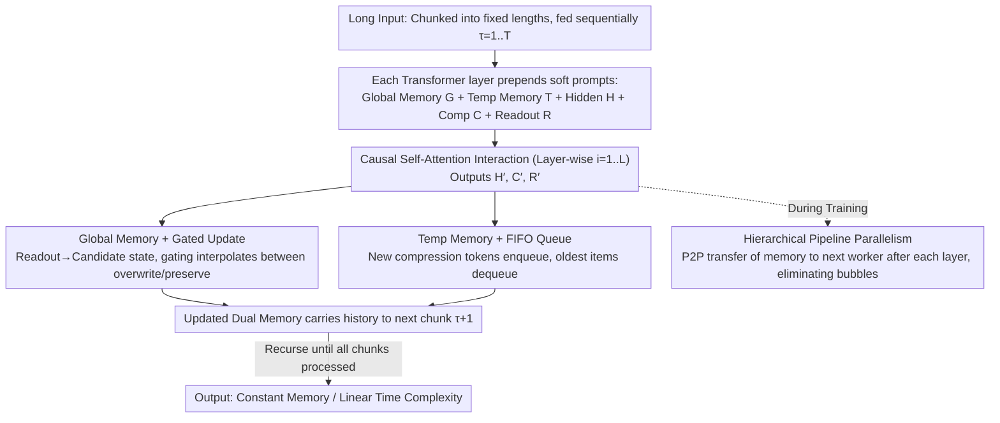

# CoMeT: Collaborative Memory Transformer for Efficient Long Context Modeling

**Conference**: ACL 2026  
**arXiv**: [2602.01766](https://arxiv.org/abs/2602.01766)  
**Code**: https://github.com/LivingFutureLab/Comet (Available)  
**Area**: LLM Efficiency / Long Context / Memory Mechanism  
**Keywords**: Long Context, Recurrent Transformer, Dual Memory System, Gated Update, Pipeline Parallelism

## TL;DR
CoMeT introduces a "Global Memory + FIFO Temporary Memory" dual-memory plugin for existing LLMs. By processing inputs in chunks, it achieves constant memory usage and linear time complexity. Fine-tuned on only 32k context, it enables precise retrieval at any position within a 1M token range. It also proposes hierarchical pipeline parallelism, enabling 128k context fine-tuning on 16×80GB GPUs.

## Background & Motivation
**Background**: Standard Transformers are practically unusable for million-token sequences due to KV cache growing linearly with context and quadratic attention complexity. Mainstream solutions include context compression (LLMLingua / ICAE / Activation Beacon) and finite-state memory models (Transformer-XL / RMT / HMT).

**Limitations of Prior Work**: (1) Compression-based methods are limited by information theory; compressed length still scales linearly with the original length, improving only the constant factor while asymptotic complexity remains unchanged. (2) Finite-state memory models achieve $\mathcal{O}(N)$ time and $\mathcal{O}(1)$ space but generally lack explicit gating to protect critical information and treat all history equally, losing fine-grained signals from recent context.

**Key Challenge**: There is an inherent conflict between the "stable compressed retention" of long-term memory and the "high-fidelity detail capture" of recent context under fixed capacity—aggressive compression loses recent details, while retaining too much recent data flushes out important long-range information.

**Goal**: (1) Design a dual-memory mechanism that simultaneously protects long-term critical information and retains recent details; (2) Make this mechanism plug-and-play for pre-trained LLMs without retraining from scratch; (3) Resolve the pipeline bubble issue of naive context parallelism during ultra-long context training.

**Key Insight**: The authors noted that LSTM/GRU gated updates can selectively "overwrite vs. preserve," and FIFO queues naturally maintain temporal continuity. Combining these addresses long-term forgetting and recent detail loss respectively.

**Core Idea**: Use "gated global memory" for long-term storage and "FIFO queue-managed temporary memory" for recent high-fidelity information. Both are prepended as soft prompts to the current chunk's hidden states.

## Method

### Overall Architecture
CoMeT transforms any pre-trained LLM into a recurrent model that processes inputs by chunks. An ultra-long input is divided into fixed-length chunks fed sequentially. Each Transformer layer carries two types of persistent states: Global Memory $\mathbf{G}^i_\tau$ for long-range key information and FIFO Temporary Memory $\mathbf{T}^i_\tau$ for recent details. When processing the $\tau$-th chunk at the $i$-th layer, both memories are prepended as soft prompts before the current hidden states $\mathbf{H}^i_\tau$, interspersed with compression tokens $\mathbf{C}^i_\tau$ for local feature extraction, and followed by $m$ readout tokens $\mathbf{R}^i_\tau$ to summarize the chunk. After interaction via causal self-attention, the output $\mathbf{H}^{i+1}_\tau, \mathbf{C}^{i+1}_\tau, \mathbf{R}^{i+1}_\tau = \mathrm{TL}(\mathbf{G}^i_\tau, \mathbf{T}^i_\tau, \mathbf{H}^i_\tau, \mathbf{C}^i_\tau, \mathbf{R}^i_\tau)$ is used to update the global memory via readouts and the temporary memory via compression tokens, maintaining constant memory and linear time across any length.

### Key Designs

**1. Global Memory + Gated Update: Distilling chunk summaries into persistent states via low-rank residuals and LSTM-like gating**

Once long-range information is indiscriminately overwritten by new content, it cannot be recovered, which is a major flaw in RMT/HMT-style single memory systems. CoMeT uses a fixed-size persistent state $\mathbf{S}^i_\tau$ to distill and protect long-range information. A Residual Low-Rank Adapter (RLA) transforms states into memory: $\mathrm{RLA}(\mathbf{X}) = \mathbf{X} + \mathbf{W}_{\text{up}}(\mathbf{W}_{\text{down}} \mathbf{X})$, where $\mathbf{W}_{\text{down}} \in \mathbb{R}^{r \times d}$ uses rank $r=8$. This ensures the CoMeT module only adds 3.95M parameters (0.098% of Qwen3-4B). This low-rank constraint stems from the observation that excessive state-to-memory parameters lead to performance degradation; LoRA-style residuals stabilize training.

The update is handled by gating: candidate state $\tilde{\mathbf{S}}^i_{\tau+1} = \mathrm{RMSNorm}(\mathbf{R}^{i+1}_\tau)$, gate $\mathbf{g} = \sigma(\mathbf{W}_g([\mathbf{S}^i_\tau; \tilde{\mathbf{S}}^i_{\tau+1}]))$, and final state $\mathbf{S}^i_{\tau+1} = \mathbf{g} \odot \mathbf{S}^i_\tau + (\mathbf{1} - \mathbf{g}) \odot \tilde{\mathbf{S}}^i_{\tau+1}$. This permits dimension-wise selection of new information while preserving old data and providing a direct gradient path across chunks.

**2. Temporary Memory + FIFO Queue: Maintaining a high-resolution rolling view of recent chunks**

Long-range information compressed into global memory often blurs into average semantics. To handle precise recall of recent details (e.g., "the specific number 3 chunks ago"), CoMeT uses a FIFO queue. Compressed tokens $\mathbf{C}^{i+1}_\tau$ from new chunks pass through RMSNorm and the RLA module before entering the queue. This structure ensures temporal continuity and provides a direct gradient return path for recent signals, complementing the global memory's long-term protection.

**3. Hierarchical Pipeline Parallelism: Reducing communication granularity to the layer level to eliminate pipeline bubbles**

In naive context parallelism, worker $j+1$ must wait for worker $j$ to complete the forward pass of all layers for a chunk, leading to low resource utilization. CoMeT observes that memory states per layer are independent and fixed in size. Consequently, worker $j$ sends layer $i$ memory to worker $j+1$ immediately after computation. This converts serial waiting into an interleaved pipeline, achieving a $2.7\times$ speedup and making 128k context fine-tuning on 16×80GB GPUs feasible.

### Loss & Training
The backbone is Qwen3-4B-Instruct-2507. All efficient methods are compared under a fair memory budget of ~3k tokens. Fine-tuning is performed on 32k context for 3 epochs. CoMeT uses a total memory size $ms=2560$ (combined G and T) with rank $r=8$.

## Key Experimental Results

### Main Results (Scrolls benchmark, ~3k memory budget)

| Method | GovRep R-1 | SumScr R-1 | Qspr F1 | Nrtv F1 | QALT F1 | Average |
|------|-----------|------------|---------|---------|---------|------|
| Full Attn (FT) | 61.0 | 32.5 | 40.3 | 22.1 | 64.2 | **42.23** |
| LongLLMLingua (3072 tok) | 38.0 | 28.2 | 35.7 | 19.2 | 65.9 | 37.36 |
| ActivationBeacon | 52.3 | 28.0 | 33.5 | 23.2 | 56.8 | 30.71 |
| Transformer-XL (ws=5120) | 51.2 | 30.7 | 35.5 | 4.5 | 33.6 | 31.83 |
| SWA (ws=5120) | 55.3 | 30.7 | 39.1 | 16.1 | 54.8 | 38.24 |
| HMT (ms=3072) | 47.3 | 29.0 | 16.8 | 11.3 | 53.5 | 30.31 |
| **CoMeT (ms=2560)** | **62.5** | **33.4** | 35.5 | 22.6 | 56.0 | **40.10** |

CoMeT achieves the highest average score among efficient methods and **outperforms** the Full Attention fine-tuned baseline on summarization tasks (GovRep / SumScr). In Needle-in-a-Haystack (NIAH), CoMeT achieves precise retrieval at **1M tokens** despite being trained only on 32k, providing $21\times$ inference speedup and $10\times$ memory savings.

### Key Findings
- **Summarization Superiority**: Segmentation forces the model to produce high-quality local summaries, acting as an implicit "outline then synthesize" training signal.
- **Dual Mechanism Necessity**: Removing gating leads to significant drops in long-range tasks; removing FIFO hurts recent detail tasks (e.g., QASPER).
- **Engineering Efficiency**: Hierarchical pipeline parallelism yields a $2.7\times$ speedup over naive context parallelism.
- **Extrapolation**: CoMeT's fixed memory capacity naturally resolves positional encoding extrapolation issues observed in RoPE-scaling methods.

## Highlights & Insights
- **Dual-Track Memory**: Bifurcating memory into "Long-term Gated + Recent FIFO" reflects the differing nature of historical information.
- **RLA for Efficiency**: Using rank=8 LoRA-style residuals introduces only 0.098% parameter overhead, preserving pre-trained knowledge while stabilizing training.
- **Asymptotic Improvement**: Unlike compression methods that only improve constant factors, CoMeT demonstrates true linear time and constant memory complexity.

## Limitations & Future Work
- Fixed memory capacity may lead to loss of detail in tasks requiring exhaustive recall beyond that capacity (as seen in QALT/QMSum).
- Sensitivity analysis for the ratio of global/temporary memory and compression token count $m$ is currently lacking.
- Evaluation of free-text generation quality at 1M length (beyond structured NIAH) is required.

## Related Work & Insights
- **vs. Transformer-XL / RMT**: CoMeT's dual-track approach significantly outperforms RMT (Avg 40.10 vs 31.83).
- **vs. Activation Beacon**: Compression methods maintain linear complexity relative to context length; CoMeT achieves $\mathcal{O}(1)$ space.
- **vs. Linear RNNs (Mamba/RWKV)**: CoMeT is a plug-and-play addition to existing LLMs, whereas Linear RNNs usually require training from scratch.

## Rating
- Novelty: ⭐⭐⭐⭐ 
- Experimental Thoroughness: ⭐⭐⭐⭐⭐ 
- Writing Quality: ⭐⭐⭐⭐ 
- Value: ⭐⭐⭐⭐⭐ 

<!-- RELATED:START -->

## Related Papers

- [\[ACL 2026\] Native Hybrid Attention for Efficient Sequence Modeling](native_hybrid_attention_for_efficient_sequence_modeling.md)
- [\[ICML 2025\] Curse of High Dimensionality Issue in Transformer for Long-context Modeling](../../ICML2025/llm_efficiency/curse_of_high_dimensionality_issue_in_transformer_for_long-context_modeling.md)
- [\[ICML 2025\] Efficient Length-Generalizable Attention via Causal Retrieval for Long-Context Language Modeling](../../ICML2025/llm_efficiency/efficient_length-generalizable_attention_via_causal_retrieval_for_long-context_l.md)
- [\[ACL 2025\] Smarter, Better, Faster, Longer: A Modern Bidirectional Encoder for Fast, Memory Efficient, and Long Context Finetuning and Inference](../../ACL2025/llm_efficiency/smarter_better_faster_longer_a_modern_bidirectional_encoder_for_fast_memory_effi.md)
- [\[CVPR 2025\] Associative Transformer](../../CVPR2025/llm_efficiency/associative_transformer.md)

<!-- RELATED:END -->
