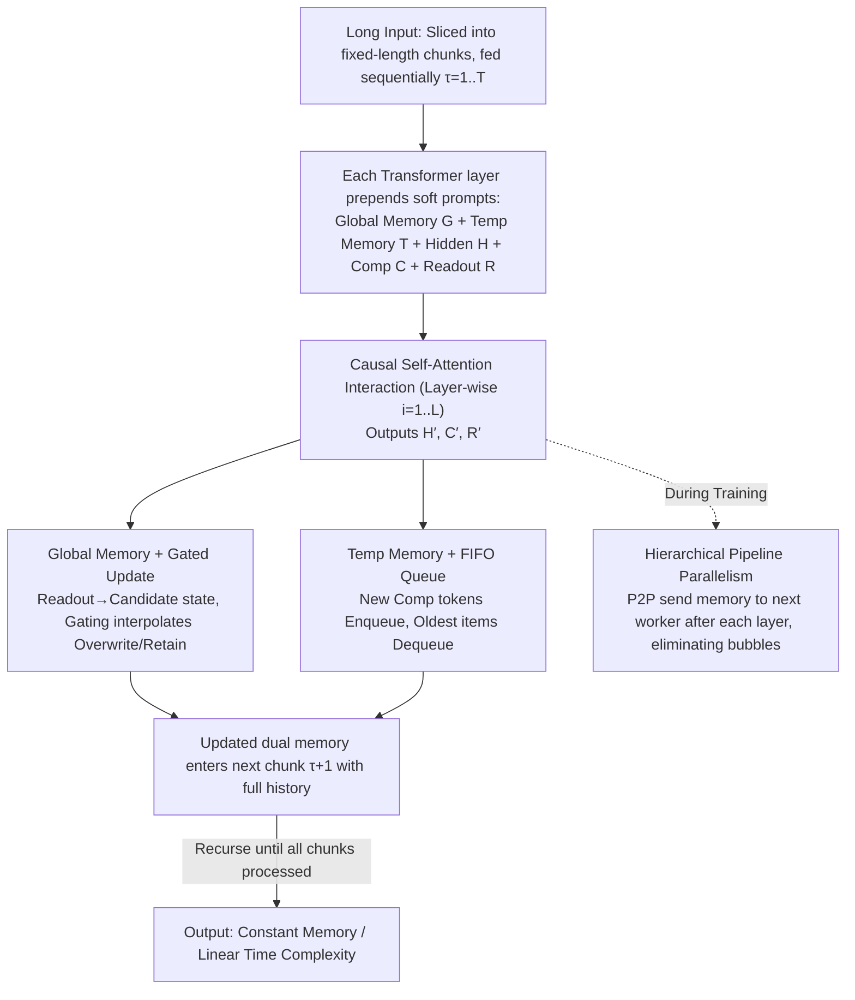

# CoMeT: Collaborative Memory Transformer for Efficient Long Context Modeling

**Conference**: ACL 2026  
**arXiv**: [2602.01766](https://arxiv.org/abs/2602.01766)  
**Code**: https://github.com/LivingFutureLab/Comet (Available)  
**Area**: LLM Efficiency / Long Context / Memory Mechanisms  
**Keywords**: Long Context, Recurrent Transformer, Dual Memory System, Gated Update, Pipeline Parallelism

## TL;DR
CoMeT introduces a "global memory + FIFO temporary memory" dual-memory plug-in for existing LLMs. By processing inputs in chunks, it achieves constant memory and linear time complexity. Fine-tuned only on 32k context, it enables precise retrieval at any position within 1M tokens and proposes hierarchical pipeline parallelism to allow fine-tuning 128k context on 16×80GB GPUs.

## Background & Motivation
**Background**: Standard Transformers are nearly unusable for million-token scales due to linear KV cache growth and quadratic attention complexity. Mainstream solutions include context compression (LLMLingua / ICAE / Activation Beacon) and finite-state memory models (Transformer-XL / RMT / HMT).

**Limitations of Prior Work**: (1) Compression methods are limited by information theory, where compressed length still grows linearly with the original length, improving only the constant factor without changing asymptotic complexity; (2) Finite-state memory models achieve $\mathcal{O}(N)$ time and $\mathcal{O}(1)$ space but generally lack explicit gating to protect important information and treat all history equally, losing fine-grained signals from recent context.

**Key Challenge**: There is a natural conflict between "compressed stable retention" of long-term memory and "high-fidelity capture" of recent details under fixed capacity—aggressive compression loses recent details, while retaining too much recent information flushes out important long-range data.

**Goal**: (1) Design a dual-memory mechanism that protects long-term key information while retaining recent details; (2) Make this mechanism plug-and-play for pre-trained LLMs without training from scratch; (3) Address the pipeline bubble issue of naive context parallelism during extreme long-context training.

**Key Insight**: Gated updates in LSTM/GRUs can selectively "overwrite vs. retain," and FIFO queues naturally maintain temporal continuity. Combining these can solve long-term forgetting and recent detail loss respectively.

**Core Idea**: Use "gated global memory" for long-term storage and "FIFO-managed temporary memory" for recent high-fidelity information, both concatenated as soft prompts before the current chunk's hidden states.

## Method

### Overall Architecture
CoMeT transforms any pre-trained LLM into a recurrent model that processes inputs by chunks. The long input is sliced into fixed-length chunks fed sequentially. Each Transformer layer carries two types of persistent states: global memory $\mathbf{G}^i_\tau$ for long-range information and FIFO temporary memory $\mathbf{T}^i_\tau$ for recent details. When processing the $\tau$-th chunk at layer $i$, both memories are prepended as soft prompts to the current hidden state $\mathbf{H}^i_\tau$. Interspersed compression tokens $\mathbf{C}^i_\tau$ extract local fine-grained information, while $m$ readout tokens $\mathbf{R}^i_\tau$ appended at the end summarize the chunk. After interaction via causal self-attention, the layer outputs $\mathbf{H}^{i+1}_\tau, \mathbf{C}^{i+1}_\tau, \mathbf{R}^{i+1}_\tau = \mathrm{TL}(\mathbf{G}^i_\tau, \mathbf{T}^i_\tau, \mathbf{H}^i_\tau, \mathbf{C}^i_\tau, \mathbf{R}^i_\tau)$. Readout tokens update global memory, while compression tokens enter the temporary memory queue, maintaining constant memory and linear time across any length.

### Key Designs

**1. Global Memory + Gated Update: Distilling chunk summaries into persistent states via low-rank residuals and LSTM-like gating**

Long-range information is lost if overwritten indiscriminately, a weakness of RMT/HMT models. CoMeT uses fixed-size state $\mathbf{S}^i_\tau$ to protect key information. A Residual Low-Rank Adapter (RLA) converts states to memory: $\mathrm{RLA}(\mathbf{X}) = \mathbf{X} + \mathbf{W}_{\text{up}}(\mathbf{W}_{\text{down}} \mathbf{X})$, with $\mathbf{W}_{\text{down}} \in \mathbb{R}^{r \times d}$ at rank $r=8$. This adds only 3.95M parameters (0.098% of Qwen3-4B). Updates use a gating mechanism: candidate $\tilde{\mathbf{S}}^i_{\tau+1} = \mathrm{RMSNorm}(\mathbf{R}^{i+1}_\tau)$, gate $\mathbf{g} = \sigma(\mathbf{W}_g([\mathbf{S}^i_\tau; \tilde{\mathbf{S}}^i_{\tau+1}]))$, and final state $\mathbf{S}^i_{\tau+1} = \mathbf{g} \odot \mathbf{S}^i_\tau + (\mathbf{1} - \mathbf{g}) \odot \tilde{\mathbf{S}}^i_{\tau+1}$. This allows dimension-wise selective absorption and provides a direct gradient path across chunks.

**2. Temporary Memory + FIFO Queue: Maintaining a rolling high-resolution view of recent chunks**

Long-term information compressed into global memory often loses specific details. Temporary memory fills this gap. Compressed tokens $\mathbf{C}^{i+1}_\tau$ pass through RMSNorm and RLA before entering a FIFO queue. This naturally maintains temporal continuity, where new items enter at the tail and old items exit from the head without complex scheduling.

**3. Hierarchical Pipeline Parallelism: Reducing communication granularity to the layer level**

In naive context parallelism, worker $j+1$ must wait for worker $j$ to complete the forward pass of all layers for a chunk, leading to low utilization. CoMeT observes that memory states are independent per layer and fixed in size. Worker $j$ sends layer $i$ memory via P2P to worker $j+1$ immediately after computation, allowing the next worker to start layer $i$ while the current worker proceeds to layer $i+1$. This achieves a $2.7\times$ speedup over naive context parallelism.

### Loss & Training
The backbone is Qwen3-4B-Instruct-2507. All efficient methods are compared under a ~3k token memory budget and fine-tuned on 32k context for 3 epochs. CoMeT uses a total memory size (ms) of 2560 with rank $r=8$.

## Key Experimental Results

### Main Results (Scrolls benchmark, ~3k memory budget)

| Method | GovRep R-1 | SumScr R-1 | Qspr F1 | Nrtv F1 | QALT F1 | Average |
|------|-----------|------------|---------|---------|---------|------|
| Full Attn (FT) | 61.0 | 32.5 | 40.3 | 22.1 | 64.2 | **42.23** |
| LongLLMLingua (3072 tok) | 38.0 | 28.2 | 35.7 | 19.2 | 65.9 | 37.36 |
| ActivationBeacon | 52.3 | 28.0 | 33.5 | 23.2 | 56.8 | 30.71 |
| Transformer-XL (ws=5120) | 51.2 | 30.7 | 35.5 | 4.5 | 33.6 | 31.83 |
| SWA (ws=5120) | 55.3 | 30.7 | 39.1 | 16.1 | 54.8 | 38.24 |
| HMT (ms=3072) | 47.3 | 29.0 | 16.8 | 11.3 | 53.5 | 30.31 |
| **CoMeT (ms=2560)** | **62.5** | **33.4** | 35.5 | 22.6 | 56.0 | **40.10** |

CoMeT achieves the highest average score among efficient methods and **outperforms** the Full Attention baseline on summarization tasks (GovRep / SumScr). In Needle-In-A-Haystack, CoMeT fine-tuned on 32k achieves precise retrieval at **1M tokens**, with $21\times$ inference speedup and $10\times$ memory savings.

### Ablation Study (Short Context Compatibility)

| Dataset | Avg Length | Full Attn EM/F1 | CoMeT EM/F1 |
|--------|---------|-----------------|--------------|
| 2WikiMQA | 1033 | 75.4 / 80.8 | **75.5 / 81.0** |
| HotpotQA | 1443 | 65.0 / 78.9 | **65.9 / 80.0** |

CoMeT performs on par with or slightly better than Full Attention on short sequences, proving the plug-in does not degrade short-context capabilities.

### Key Findings
- **Summarization superiority**: Chunking forces local high-quality summarization, acting as an implicit training signal that benefits global understanding.
- **Dual-mechanism necessity**: Removing gating causes significant drops in long-range tasks; removing FIFO causes drops in recent detail tasks (e.g., QASPER).
- **Hierarchical Parallelism**: $2.7\times$ speedup enables 128k training on 16×80GB GPUs.

## Highlights & Insights
- **Dual-track Memory**: Splitting long-term (gated) and recent (FIFO) information management recognizes that these types of data require different mechanisms.
- **RLA Rank=8**: Using LoRA-style low-rank residuals as an architectural component preserves pre-trained knowledge with minimal (0.098%) parameter overhead.
- **Extrapolation**: Achieving 30× context extrapolation (32k to 1M) is more robust than RoPE-scaling as fixed memory capacity eliminates positional embedding pressure.

## Limitations & Future Work
- Fixed memory capacity may still lose details on tasks requiring precise recall beyond the budget over 1M+ tokens.
- Sensitivity analysis for memory ratios and readout token counts is currently insufficient.
- Evaluation of free-text generation quality at 1M length is needed.
- FIFO is currently based on fixed token counts; priority-based or adaptive enqueueing could be explored.

## Related Work & Insights
- **vs. RMT / Transformer-XL**: CoMeT significantly outperforms these recurrent models (40.10 vs 31.83 on Scrolls) by explicitly separating gated and FIFO memory.
- **vs. Mamba / RWKV**: While these are linear RNNs, they require pre-training from scratch. CoMeT works as a lightweight plug-in for established LLMs like Qwen3.

## Rating
- Novelty: ⭐⭐⭐⭐
- Experimental Thoroughness: ⭐⭐⭐⭐⭐
- Writing Quality: ⭐⭐⭐⭐
- Value: ⭐⭐⭐⭐⭐

<!-- RELATED:START -->

## Related Papers

- [\[ICML 2025\] Curse of High Dimensionality Issue in Transformer for Long-context Modeling](../../ICML2025/llm_efficiency/curse_of_high_dimensionality_issue_in_transformer_for_long-context_modeling.md)
- [\[ICLR 2026\] RMAAT: Astrocyte-Inspired Memory Compression and Replay for Efficient Long-Context Transformers](../../ICLR2026/llm_efficiency/rmaat_astrocyte-inspired_memory_compression_and_replay_for_efficient_long-contex.md)
- [\[ACL 2026\] Native Hybrid Attention for Efficient Sequence Modeling](native_hybrid_attention_for_efficient_sequence_modeling.md)
- [\[ACL 2026\] Threshold Differential Attention: Sink-free, Ultra-sparse, and Non-dispersive Long-context Attention](threshold_differential_attention_for_sink-free_ultra-sparse_and_non-dispersive_l.md)
- [\[ICLR 2026\] Revisiting Long-context Modeling from Context Denoising Perspective](../../ICLR2026/llm_efficiency/revisiting_long-context_modeling_from_context_denoising_perspective.md)

<!-- RELATED:END -->
