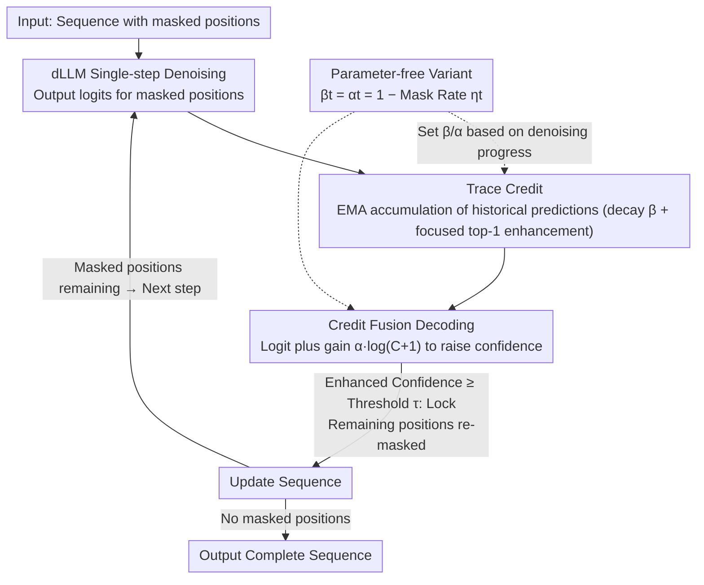

# CreditDecoding: Accelerating Parallel Decoding in Diffusion Large Language Models with Trace Credit

**Conference**: ACL 2026  
**arXiv**: [2510.06133](https://arxiv.org/abs/2510.06133)  
**Code**: None  
**Area**: Image Restoration  
**Keywords**: Diffusion Language Models, Parallel Decoding, Trace Credit, Inference Acceleration, Confidence Enhancement

## TL;DR

This paper proposes CreditDecoding, a training-free parallel decoding acceleration method that enhances correct but low-confidence tokens by accumulating token-level historical evidence (trace credit), achieving up to a 5.48x speedup and a 0.48 accuracy improvement on LLaDA-8B-Instruct.

## Background & Motivation

**Background**: Diffusion Large Language Models (dLLMs) generate text through iterative denoising, supporting bidirectional attention and parallel token prediction. Existing parallel decoding schemes confirm only high-confidence positions at each step, re-masking the remaining positions for subsequent refinement.

**Limitations of Prior Work**: (1) Computational redundancy—models often predict the correct token many steps before actual decoding, but due to insufficient confidence, these tokens are repeatedly re-masked and re-predicted; (2) History-independent decision-making—each decoding step is independent of previous predictions and fails to utilize historical consistency signals of tokens, where temporary mispredictions can cause fluctuations in the confidence of stable tokens.

**Key Challenge**: Correct tokens are repeatedly re-masked because of temporary insufficient confidence, leading to significant redundant computation; however, directly lowering the decoding threshold introduces erroneous decoding.

**Goal**: To design a mechanism that leverages historical prediction consistency to safely decode correct tokens early, thereby reducing redundant iterations.

**Key Insight**: Analysis of denoising trajectories reveals that token confidence exhibits temporal consistency—the confidence of correct tokens rises continuously over multiple steps, providing exploitable prior information.

**Core Idea**: Trace Credit = historical logits accumulated across steps, serving as a prior fused with current logits to enable correct but low-confidence tokens to cross the decoding threshold earlier.

## Method

### Overall Architecture
CreditDecoding does not modify dLLM weights; it simply wraps a token-level "credit bookkeeping" layer around standard parallel decoding. In each dLLM denoising step, logits are provided for all masked positions. While the standard approach only confirms positions where confidence exceeds a threshold $\tau$ and re-masks the rest, CreditDecoding continuously accumulates the logits of each position from historical steps into "Trace Credit." This credit is then added back to the current logits as a logarithmic gain, allowing tokens that are consistently predicted correctly but lack sufficient single-step confidence to be locked early. This process compresses redundant calculations where tokens are "predicted correctly early but repeatedly re-masked."

### Key Designs

**1. Trace Credit: Quantifying the credibility of a token being consistently predicted as correct using EMA-accumulated historical predictions.**

Single-step confidence is noisy and generally low in early stages. However, analysis of denoising trajectories shows that the confidence of correct tokens exhibits stable upward temporal consistency. This trend serves as an exploitable prior. Therefore, for each position $i$ and candidate token $v$, a non-negative credit score $C_t^{i,v}$ is maintained using an EMA-style rule:

$$C_t^{i,v} = \begin{cases} \beta\, C_{t+1}^{i,v} + (p_t^{i,v})^{\gamma}, & v = \tilde{x}_t^{i} \\ \beta\, C_{t+1}^{i,v}, & \text{otherwise} \end{cases}$$

This is balanced by two forces: **Global Decay**—the coefficient $\beta \in (0,1)$ allows old evidence to be forgotten over steps, suppressing early confidence fluctuations; **Focused Enhancement**—each step only adds an increment $(p_t^{i,v})^{\gamma}$ to the current greedy top-1 predicted token $\tilde{x}_t^{i}$ ($\gamma \in (0,1)$ is a concave transformation to boost low confidence values). Thus, credit only accumulates for tokens that consistently rank first along the trajectory, rather than for sporadic spikes, using historical consistency as the basis for early decoding instead of single-frame confidence.

**2. Credit Fusion Decoding: Injecting historical credit into current logits via logarithmic gain to allow correct tokens to cross the decoding threshold earlier.**

In each step, credit is fused into the current logits to obtain a sharpened distribution: $\hat{l}_t^{i,v} = l_t^{i,v} + \alpha \cdot \log(C_t^{i,v}+1)$, where $\alpha > 0$ controls the strength of the prior. In the probability domain, this is equivalent to multiplying $p_t^{i,v}$ by a gain and passing it through a softmax to get the enhanced confidence $\hat{s}_t^{i}$. Tokens that are consistently predicted correctly accumulate higher credit and gain, crossing the threshold $\tau$ earlier. Why use accumulated credit instead of instantaneous probability for the gain? Derivations show that the minimum gain required to push a token across the threshold is $X_{\min} = \frac{\tau}{1-\tau} \cdot (\frac{1}{p_t^{i,v}} - 1)$, which is highly sensitive to $p_t^{i,v}$; single-frame fluctuations could push incorrect tokens across. Using historical accumulated credit makes the gain smoother and more robust, balancing "early decoding" and "error avoidance."

**3. Parameter-free Variant: Coupling decay/fusion coefficients to denoising progress for out-of-the-box use.**

Optimal values for fusion strength $\alpha$ and decay $\beta$ vary by dataset, making per-task manual tuning costly. The parameter-free variant uses a step-adaptive schedule: setting $\gamma=1$ and binding $\beta_t = \alpha_t = 1-\eta_t$ directly to the current mask rate $\eta_t$. When the mask rate is high and confidence is unreliable in early stages, credit weight is suppressed; as denoising progresses and the mask rate drops, prediction stabilizes and credit strength automatically increases. This allows it to serve as a general acceleration plugin for existing dLLMs without the cost of re-searching parameters for different benchmarks.

### Loss & Training
CreditDecoding is an entirely training-free inference-time method that only modifies the decoding strategy without any parameter updates. It is orthogonal to existing optimizations like KV caching and operator fusion, and can be combined with them for greater acceleration.

## Key Experimental Results

### Main Results

**Performance of LLaDA-8B-Instruct across 8 benchmarks**

| Method | Speedup | Accuracy Change | Description |
|------|--------|-----------|------|
| Standard Parallel Decoding | 1× | Baseline | Threshold control |
| Fast-dLLM | ~3× | Slight drop | Adaptive step count |
| **CreditDecoding** | **5.48×** | **+0.48** | Historical credit enhancement |
| CreditDecoding + KV Cache | Higher | +0.48 | Orthogonal combination |

### Ablation Study

| Component | Effect | Description |
|------|------|------|
| No Credit (Pure Threshold) | Baseline | Standard parallel decoding |
| Current-step Credit Only | Slight speedup | No accumulation effect |
| Full Trace Credit | Max speedup | Historical accumulation is key |
| Different dLLM Architectures | Effective | High generalizability of the method |

### Key Findings

- CreditDecoding achieves speedups across knowledge, reasoning, and code benchmarks without compromising accuracy.
- Acceleration becomes more significant as the number of denoising steps increases, as more steps involve greater redundancy.
- The method is effective across various dLLM architectures, such as LLaDA and Dream.
- It is orthogonal to optimizations like KV caching and operator fusion and can be stacked for even greater speedups.
- It is extensible to long-context scenarios.

## Highlights & Insights

- The redundancy analysis of "early prediction, late decoding" identifies a core bottleneck in dLLM inference.
- Trace Credit is an elegant utilization of temporal consistency in token prediction—simple historical accumulation significantly accelerates inference.
- Its training-free and orthogonal nature makes it a practical, plug-and-play tool.

## Limitations & Future Work

- Credit accumulation may not gather enough signal in extremely short sequences or scenarios with very few steps.
- The assumption of linear gain for credit fusion may not be optimal for all scenarios.
- The method has only been validated on discrete token diffusion models; its applicability to continuous diffusion models remains unexplored.

## Related Work & Insights

- **vs. Standard Threshold Decoding**: Threshold decoding ignores historical information; CreditDecoding leverages temporal consistency to accelerate.
- **vs. Fast-dLLM**: Fast-dLLM adjusts step scheduling; CreditDecoding optimizes at the token confidence level.
- **vs. KV Cache**: KV cache optimizes computational overhead; CreditDecoding reduces redundant steps. The two are orthogonal.

## Rating

- Novelty: ⭐⭐⭐⭐ The concept of Trace Credit is intuitive and effective, offering unique insights into dLLM inference.
- Experimental Thoroughness: ⭐⭐⭐⭐⭐ Evaluated on four models, eight benchmarks, multiple ablations, and orthogonality tests.
- Writing Quality: ⭐⭐⭐⭐ Clear analysis with intuitive visualizations.
- Value: ⭐⭐⭐⭐⭐ Provides a practical and general solution for accelerating dLLM inference.

<!-- RELATED:START -->

## Related Papers

- [\[ICLR 2026\] Learning to Parallel: Accelerating Diffusion Large Language Models via Learnable Parallel Decoding](../../ICLR2026/llm_efficiency/learning_to_parallel_accelerating_diffusion_large_language_models_via_learnable_.md)
- [\[ACL 2026\] Breaking Block Boundaries: Anchor-based History-stable Decoding for Diffusion Large Language Models](breaking_block_boundaries_anchor-based_history-stable_decoding_for_diffusion_lar.md)
- [\[ICLR 2026\] Hierarchy Decoding: A Training-free Parallel Decoding Strategy for Diffusion Large Language Models](../../ICLR2026/llm_efficiency/hierarchy_decoding_a_training-free_parallel_decoding_strategy_for_diffusion_larg.md)
- [\[ICLR 2026\] Accelerating Diffusion Large Language Models with SlowFast Sampling: The Three Golden Principles](../../ICLR2026/llm_efficiency/accelerating_diffusion_large_language_models_with_slowfast_sampling_the_three_go.md)
- [\[ICML 2026\] Diffusion Language Model Parallel Decoding via Product-of-Experts Bridge](../../ICML2026/llm_efficiency/diffusion_language_model_parallel_decoding_via_product-of-experts_bridge.md)

<!-- RELATED:END -->
