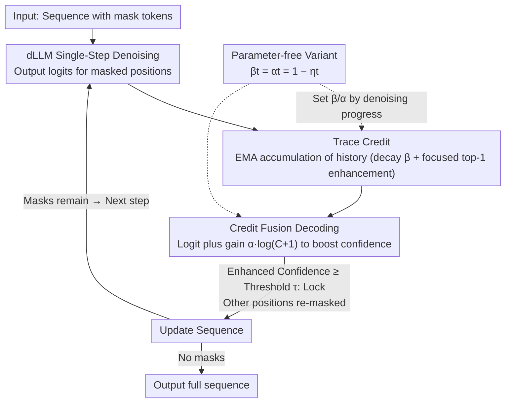

# CreditDecoding: Accelerating Parallel Decoding in Diffusion Large Language Models with Trace Credit

**Conference**: ACL 2026  
**arXiv**: [2510.06133](https://arxiv.org/abs/2510.06133)  
**Code**: None  
**Area**: Image Restoration  
**Keywords**: Diffusion Language Models, Parallel Decoding, Trace Credit, Inference Acceleration, Confidence Enhancement

## TL;DR

This paper proposes CreditDecoding, a training-free parallel decoding acceleration method. By accumulating token-level historical evidence (trace credit) to enhance correct but under-confident tokens, it achieves up to a 5.48x speedup with a 0.48 accuracy improvement on LLaDA-8B-Instruct.

## Background & Motivation

**Background**: Diffusion Large Language Models (dLLMs) generate text through iterative denoising, supporting bidirectional attention and parallel token prediction. Existing parallel decoding schemes only confirm high-confidence positions at each step, re-masking others for subsequent refinement.

**Limitations of Prior Work**: (1) Computational redundancy—models often predict correct tokens many steps before actual decoding, but these are repeatedly re-masked due to insufficient confidence. (2) History-independent decisions—each decoding step is independent of previous predictions, failing to utilize historical consistency signals of tokens; transient mispredictions can cause fluctuations in the confidence of stable tokens.

**Key Challenge**: Correct tokens are repeatedly re-masked due to temporarily insufficient confidence, causing significant computational redundancy; however, directly lowering the decoding threshold introduces decoding errors.

**Goal**: Design a mechanism that leverages historical prediction consistency to safely decode correct tokens early, thereby reducing redundant iterations.

**Key Insight**: Analysis of denoising trajectories reveals that token confidence exhibits temporal consistency—the confidence of correct tokens continuously rises over multiple steps, providing exploitable prior information.

**Core Idea**: Trace Credit = historical logits accumulated across steps. This serves as a prior to be fused with current logits, allowing correct but low-confidence tokens to cross the decoding threshold prematurely.

## Method

### Overall Architecture
CreditDecoding does not modify dLLM weights; it introduces a token-level "credit accounting" layer over standard parallel decoding. In each denoising step, the dLLM provides logits for all masked positions. While standard practice only confirms positions exceeding a threshold $\tau$ and re-masks the rest, CreditDecoding accumulates logits for each position over historical steps into "trace credit." This credit is added back to current logits as a logarithmic gain, enabling tokens that are consistently predicted correctly but lack single-step confidence to be locked early. This process compresses redundant computations where tokens are "predicted correctly early but repeatedly re-masked."

### Key Designs

**1. Trace Credit: Quantifying the reliability of a token being consistently predicted via EMA-accumulated historical predictions**

Single-step confidence is noisy and generally low in early stages. Analysis of denoising trajectories shows that correct tokens exhibit stable rising temporal consistency. A non-negative credit score $C_t^{i,v}$ is maintained for each position $i$ and candidate token $v$ using an EMA-style rule:

$$C_t^{i,v} = \begin{cases} \beta\, C_{t+1}^{i,v} + (p_t^{i,v})^{\gamma}, & v = \tilde{x}_t^{i} \\ \beta\, C_{t+1}^{i,v}, & \text{otherwise} \end{cases}$$

This is balanced by two forces: **Global Decay**—the coefficient $\beta \in (0,1)$ causes old evidence to be forgotten, suppressing early confidence jitters; **Focused Enhancement**—each step adds an increment $(p_t^{i,v})^{\gamma}$ (where $\gamma \in (0,1)$ is a concave transformation to boost low confidence values) only to the current greedy top-1 prediction $\tilde{x}_t^{i}$. Credit accumulates only on tokens that consistently remain top-1 along the trajectory.

**2. Credit Fusion Decoding: Injecting historical credit as logarithmic gain into current logits**

At each step, credit is fused into current logits to obtain a sharpened distribution: $\hat{l}_t^{i,v} = l_t^{i,v} + \alpha \cdot \log(C_t^{i,v}+1)$, where $\alpha > 0$ controls prior strength. In the probability domain, this scales $p_t^{i,v}$ by a gain to produce enhanced confidence $\hat{s}_t^{i}$. Tokens confirmed consistently accumulate higher credit and larger effective gains, crossing the threshold $\tau$ sooner. The use of accumulated credit rather than instantaneous probability for the gain ensures smoothness and robustness, balancing early decoding with error prevention.

**3. Parameter-free Variant: Coupling decay/fusion coefficients to denoising progress**

To avoid per-task manual tuning of $\alpha$ and $\beta$, a step-adaptive schedule is used: setting $\gamma=1$ and binding $\beta_t = \alpha_t = 1-\eta_t$ to the current mask ratio $\eta_t$. Credit weight is minimized early when masking is high and confidence is unreliable, then automatically increases as the mask ratio drops and predictions stabilize. This allows it to function as a universal acceleration plugin for existing dLLMs.

### Loss & Training
CreditDecoding is a purely training-free inference-time method that only modifies the decoding strategy. It is orthogonal to existing optimizations like KV caching or operator fusion and can be stacked for greater acceleration.

## Key Experimental Results

### Main Results

**Performance of LLaDA-8B-Instruct across 8 benchmarks**

| Method | Speedup | Accuracy Change | Notes |
|------|--------|-----------|------|
| Standard Parallel Decoding | 1× | Baseline | Threshold control |
| Fast-dLLM | ~3× | Slight decrease | Adaptive steps |
| **CreditDecoding** | **5.48×** | **+0.48** | Trace credit enhancement |
| CreditDecoding + KV Cache | Higher | +0.48 | Orthogonal stacking |

### Ablation Study

| Component | Effect | Notes |
|------|------|------|
| No Credit (Pure Threshold) | Baseline | Standard parallel decoding |
| Current Step Credit Only | Minimal speedup | No accumulation effect |
| Full Trace Credit | Max speedup | Historical accumulation is key |
| Different dLLM Architectures | Effective | High generalizability |

### Key Findings

- CreditDecoding achieves speedups across knowledge, reasoning, and code benchmarks without compromising accuracy.
- Acceleration becomes more significant as denoising steps increase, where redundancy is higher.
- The method is effective across different dLLM architectures such as LLaDA and Dream.
- It is orthogonal to KV caching and operator fusion, allowing for additive performance gains.
- It scales effectively to long-context scenarios.

## Highlights & Insights

- The redundancy analysis of "early prediction, late decoding" reveals a core bottleneck in dLLM inference.
- Trace credit elegantly utilizes the temporal consistency of token predictions; simple historical accumulation leads to significant acceleration.
- Its training-free and orthogonal nature makes it a practical, plug-and-play tool.

## Limitations & Future Work

- Credit accumulation may not yield sufficient signals in very short sequences or scenarios with very few steps.
- The linear gain assumption for credit fusion may not be optimal for all scenarios.
- Validation was limited to discrete token diffusion models; applicability to continuous diffusion models remains unexplored.

## Related Work & Insights

- **vs. Standard Threshold Decoding**: Threshold decoding ignores historical information; CreditDecoding leverages temporal consistency for acceleration.
- **vs. Fast-dLLM**: Fast-dLLM adjusts step scheduling; CreditDecoding optimizes at the token confidence level.
- **vs. KV Caching**: KV caching optimizes computational overhead, while CreditDecoding reduces redundant steps; the two are orthogonal.

## Rating

- Novelty: ⭐⭐⭐⭐ The trace credit concept is intuitive and effective, offering unique insights into dLLM inference.
- Experimental Thoroughness: ⭐⭐⭐⭐⭐ Four models, eight benchmarks, multiple ablations, and orthogonality verification.
- Writing Quality: ⭐⭐⭐⭐ Clear analysis with intuitive visualizations.
- Value: ⭐⭐⭐⭐⭐ Provides a practical and universal solution for dLLM inference acceleration.

<!-- RELATED:START -->

## Related Papers

- [\[ACL 2026\] Breaking Block Boundaries: Anchor-based History-stable Decoding for Diffusion Large Language Models](breaking_block_boundaries_anchor-based_history-stable_decoding_for_diffusion_lar.md)
- [\[ICML 2026\] dLLM-Cache: Accelerating Diffusion Large Language Models with Adaptive Caching](../../ICML2026/llm_efficiency/dllm-cache_accelerating_diffusion_large_language_models_with_adaptive_caching.md)
- [\[ACL 2026\] Lizard: An Efficient Linearization Framework for Large Language Models](lizard_an_efficient_linearization_framework_for_large_language_models.md)
- [\[ACL 2026\] Are Large Language Models Economically Viable for Industry Deployment?](are_large_language_models_economically_viable_for_industry_deployment.md)
- [\[ACL 2026\] Tandem: Riding Together with Large and Small Language Models for Efficient Reasoning](tandem_riding_together_with_large_and_small_language_models_for_efficient_reason.md)

<!-- RELATED:END -->
