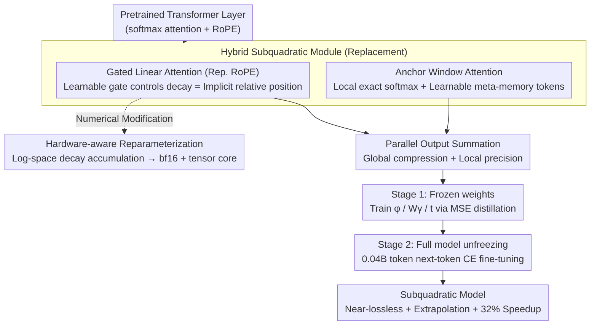

# Lizard: An Efficient Linearization Framework for Large Language Models

**Conference**: ACL 2026  
**arXiv**: [2507.09025](https://arxiv.org/abs/2507.09025)  
**Code**: TBD (Adobe Research × University of Oregon)  
**Area**: LLM Efficiency / Linear Attention / Model Compression  
**Keywords**: Linearization, Gated Linear Attention, Long-context Extrapolation, Teacher-student, Tensor Core

## TL;DR
Lizard replaces the softmax attention of pretrained Transformers with a hybrid subquadratic attention module (Gated Linear Attention for global compression + Anchor Window Attention for local precision + learnable gates replacing RoPE). Using only 0.04B tokens for distillation, it outperforms existing linearization methods by 9.4–24.5 points on 5-shot MMLU and achieves a 32% throughput increase via a tensor-core-friendly training algorithm.

## Background & Motivation
**Background**: Two main paths exist to address the $O(L^2)$ complexity of softmax attention: (a) pretraining linear/State Space Models from scratch (Mamba, RWKV, Griffin), or (b) *linearizing* existing Transformers (replacing attention modules with subquadratic forms), represented by LoLCATs, Liger, SUPRA, and Mamba2-LLaMA.

**Limitations of Prior Work**: Pretraining requires trillion-token budgets, and these models often suffer performance drops in in-context learning and retrieval tasks (Transformers typically outperform Mamba/Mamba-2 by 15 points on 5-shot MMLU). Linearization has lower overhead but similar issues: LoLCATs and Liger drop 13.8 and 21.9 MMLU points respectively compared to the teacher. Furthermore, inheriting RoPE limits the model's length extrapolation capabilities.

**Key Challenge**: Existing linearization methods strictly maintain the "frozen teacher architecture," leading to two fundamental design flaws: (1) lack of adaptive memory control (LoLCATs lacks gates, Liger uses parameterless pooling, creating information bottlenecks); (2) fixed RoPE position embeddings sever the inherent extrapolation capability of recurrent forms.

**Goal**: To introduce a student model with minimal learnable modules (feature map $\phi$, gate $W_\gamma$, meta-memory token $t$) to achieve near-lossless teacher performance, true long-context extrapolation, and a training workflow accelerated by modern tensor cores.

**Key Insight**: The authors observe that the decay pattern of gated recurrent models like GLA can inherently encode relative positions, making RoPE redundant. Furthermore, global GLA is less precise than sliding windows for local attention, leading to a parallel architecture combining both.

**Core Idea**: A hybrid of "GLA (global compression + learnable gates replacing RoPE) + local Anchor Window Attention (with meta-memory tokens to fix attention sinks)," combined with numerical reparameterization to enable GLA execution on bf16 + tensor cores.

## Method

### Overall Architecture
Lizard replaces the standard softmax attention in each layer of a pretrained Transformer with a hybrid subquadratic module and transfers teacher knowledge via two-stage distillation. The module consists of two parallel branches: a global branch using Gated Linear Attention (GLA) for long-range compression with $O(Ld^2)$ complexity, constant-memory inference, and data-dependent decay, which also replaces RoPE for position encoding; and a local branch using Anchor Window Attention for precise softmax attention within a fixed window, augmented with learnable meta-memory tokens to mitigate attention sinks. Training starts by freezing existing weights and training only new modules to approximate teacher attention outputs (Stage 1), followed by end-to-end fine-tuning of the whole model with language modeling loss on only 0.04B tokens (Stage 2) to realign the new architecture with the original MLP/embedding layers.

### Key Designs

**1. Gated Linear Attention Replacing RoPE for Position Encoding: Converting Position Info into Data-driven Decay**

RoPE is a primary cause for the failure of length extrapolation in linearized models. While LoLCATs lacks a gate and Liger uses fixed pooling, Lizard adopts a gated recurrent form: $\mathbf{h}_i = \gamma_i \odot \mathbf{h}_{i-1} + \phi(\mathbf{k}_i)\mathbf{v}_i^\top$, with output $\mathbf{y}_i = \phi(\mathbf{q}_i)^\top \mathbf{h}_i$. The learnable, token-dependent gate $\gamma_i$ (computed by $W_\gamma$) controls the decay of the hidden state per dimension. Since this decay pattern inherently perceives distance ("how long ago"), RoPE can be discarded, reclaiming both adaptive memory control and true length extrapolation.

**2. Anchor Window Attention (Local Precision + Meta-memory Tokens): Ensuring Recall via Local Windows and Learnable Anchors**

Pure linear attention compresses history into a fixed-size state, failing at fine-grained retrieval tasks like needle-in-a-haystack. Lizard maintains an exact softmax attention within the most recent $W$ tokens: $\text{Attn}_{\text{local}}(\mathbf{q}_i) = \text{softmax}([\mathbf{q}_i^\top T;\ \mathbf{q}_i^\top \mathbf{k}_{i-W:i}]) \cdot [V_T;\ \mathbf{v}_{i-W:i}]$. Here $T = [t_1,\dots,t_M]$ are learnable meta-memory tokens prepended to the key/value sequence, allowing every query to attend to global anchors. This explicitly models the "attention sink" phenomenon (where initial tokens receive high attention) as a learnable module, stabilizing numerical values and attention distributions during long-sequence inference.

**3. Hardware-aware Numerical Reparameterization: Moving Decay Multiplications to Log-space for bf16 + Tensor Core Training**

The cumulative decay $\prod \gamma$ in GLA causes exponential underflow or overflow in bf16/fp16. Previous implementations reverted to fp32 for stability, losing tensor core acceleration. Lizard rewrites the recurrence as log-space accumulation: $\log \mathbf{h}_i = \log \mathbf{h}_{i-1} + \log \gamma_i + \dots$, ensuring intermediate states stay within the precision range supported by tensor cores. This enables training with bf16 and tensor cores, increasing throughput by approximately 32% with zero loss in precision.

### Loss & Training
- **Stage 1**: MSE distillation $\mathcal{L}_1 = \sum_\ell \|\mathbf{y}_\ell^{\text{Lizard}} - \mathbf{y}_\ell^{\text{teacher}}\|_2^2$, training only new modules ($\phi$, $W_\gamma$, $t$).
- **Stage 2**: Standard next-token cross-entropy for full model fine-tuning.
- **Total Budget**: 0.04B tokens (500× less than the 20B used for Mamba2-LLaMA-3-8B), making it feasible on consumer-grade hardware.

## Key Experimental Results

### Main Results
Standard short-context benchmarks from LM-eval-harness (Selected from Table 1, values are acc/acc_norm, tokens in B):

| Model | Training Tokens (B) | MMLU (5-shot) | ARC-c | Hella. | Avg |
|------|----------------|---------------|-------|--------|-----|
| LLaMA-3-8B (teacher) | 15000 | **66.6** | 53.3 | 79.1 | 73.1 |
| Mamba-7B (from scratch) | 1200 | 33.3 | 46.7 | 77.9 | 71.0 |
| Mistral-7B-LoLCATs | 0.04 | 51.4 | 54.9 | 80.7 | 74.5 |
| LLaMA-3-8B-LoLCATs | 0.04 | 52.8 | 54.9 | 79.7 | 74.2 |
| Liger-GLA-Llama-3-8B | 0.02 | 43.4 | 52.5 | 76.3 | 72.4 |
| Mamba2-LLaMA-3-8B | 20 | 43.2 | 48.0 | 70.8 | 65.6 |
| **Mistral-7B-Lizard (Ours)** | 0.04 | **60.8** | 55.8 | 79.8 | 74.5 |
| **LLaMA-3-8B-Lizard (Ours)** | 0.04 | **61.2** | 56.7 | 79.3 | **74.6** |

Lizard improves 5-shot MMLU from LoLCATs' 52.8 to 61.2 (+8.4), trailing the teacher by only 5.4 points, and outperforms Liger by 17.8 points. A hybrid version (retaining 50% softmax layers) reaches 65.1, near-identical to the teacher.

### Ablation Study (Architectural Comparisons on 5-shot MMLU)

| Configuration | MMLU (5-shot) | Description |
|------|---------------|------|
| Full Lizard | 61.2 | Complete GLA + Anchor Window + meta-memory + reparameterization |
| w/o learnable gate (LoLCATs-like) | ~52.8 | No adaptive memory control; performance drops to LoLCATs level |
| w/o meta-memory tokens | Significant Drop | Degradation in long-context needle-in-haystack tasks |
| w/o tensor-core reparameterization | ~61 | No change in accuracy but throughput drops ~32% |
| 50% softmax / 50% Lizard Hybrid | 65.1 | Close to teacher's 66.6 |

### Key Findings
- The "learnable gate" is the fundamental factor allowing Lizard to gap LoLCATs/Liger by 9–18 points—memory control is more critical than feature map selection.
- Data-driven gates replacing RoPE allow Lizard to extrapolate to unseen lengths under the *Unbounded* category, which *Bounded* methods like LoLCATs/Liger cannot achieve.
- Restoring 92% of teacher MMLU with a 0.04B token budget implies that the marginal cost of converting existing LLMs to subquadratic is negligible.
- Hardware-aware improvements provide a 32% throughput bonus with zero accuracy loss, directly benefiting open-source reproducibility.

## Highlights & Insights
- The observation that "GLA decay is inherently position encoding" simplifies the architecture by removing RoPE, demonstrating a "less is more" design that can be applied to other recurrent architectures.
- Meta-memory tokens represent an explicit learnable version of the "attention sink" phenomenon observed in StreamingLLM, turning an empirical observation into a module design.
- Accomplishing 92% teacher performance recovery with 0.04B tokens suggests that pretraining Mamba/RWKV from scratch for short-context tasks may be less cost-effective than linearization with architectural patches.
- Treating numerical stability as a first-class citizen (one full section in the paper) is an essential engineering contribution often missing in GLA research.

## Limitations & Future Work
- Experiments were primarily conducted at the 7B–8B scale; scalability to 70B+ teachers with a 0.04B token budget remains unverified.
- Main results focus on short-context benchmarks; the claimed "associative recall" advantage lacks comprehensive needle-in-haystack or long-context QA metrics.
- The 50% hybrid version almost matching the teacher suggests that Pure-Lizard still struggles with the hardest reasoning tasks (high-difficulty MMLU sub-tasks), indicating a potential capacity ceiling for the "linear + local window" approach.
- Future potential: Interfacing the GLA gate with MoE routers might further enhance memory efficiency.

## Related Work & Insights
- **vs LoLCATs**: Both utilize linearization, but LoLCATs lacks gates and keeps the teacher architecture; Lizard adds learnable gates, gaining +8.4 MMLU.
- **vs Liger**: Liger uses fixed pooling as a gate, creating a bottleneck; Lizard uses a fully learnable $W_\gamma$, gaining +17.8 MMLU.
- **vs Mamba2-LLaMA-3-8B**: Uses 20B tokens for cross-architecture distillation but fails to extrapolate due to RoPE and reaches only 43.2 MMLU; Lizard uses 1/500 of the tokens and scores 18 points higher.
- **vs SUPRA**: An early linearization scheme without learned gates; Lizard outperforms it across all metrics.

## Rating
- Novelty: ⭐⭐⭐⭐ Strong combination of "GLA decay as position encoding" and tensor-core-friendly training.
- Experimental Thoroughness: ⭐⭐⭐⭐ Coverage of 8 baselines across two teacher families; long-context and ablation sections are somewhat concise.
- Writing Quality: ⭐⭐⭐⭐ Clear motivation and design trade-offs with compact derivations.
- Value: ⭐⭐⭐⭐⭐ Extremely attractive for long-context LLM deployment due to low distillation cost and 32% acceleration.

<!-- RELATED:START -->

## Related Papers

- [\[ACL 2026\] Are Large Language Models Economically Viable for Industry Deployment?](are_large_language_models_economically_viable_for_industry_deployment.md)
- [\[ACL 2026\] Tandem: Riding Together with Large and Small Language Models for Efficient Reasoning](tandem_riding_together_with_large_and_small_language_models_for_efficient_reason.md)
- [\[ICLR 2026\] Cascadia: An Efficient Cascade Serving System for Large Language Models](../../ICLR2026/llm_efficiency/cascadia_an_efficient_cascade_serving_system_for_large_language_models.md)
- [\[ACL 2026\] CreditDecoding: Accelerating Parallel Decoding in Diffusion Large Language Models with Trace Credit](creditdecoding_accelerating_parallel_decoding_in_diffusion_large_language_models.md)
- [\[ACL 2026\] Breaking Block Boundaries: Anchor-based History-stable Decoding for Diffusion Large Language Models](breaking_block_boundaries_anchor-based_history-stable_decoding_for_diffusion_lar.md)

<!-- RELATED:END -->
