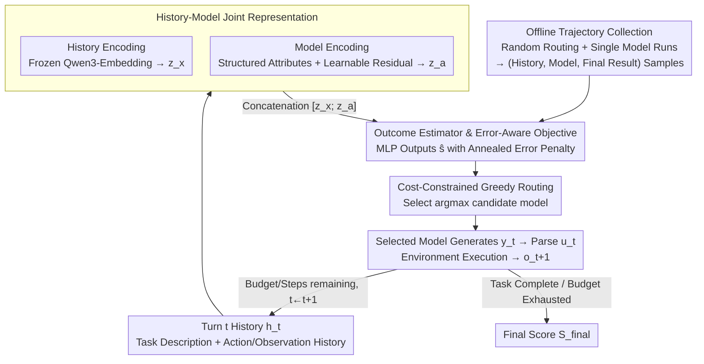

# MTRouter: Cost-Aware Multi-Turn LLM Routing with History-Model Joint Embeddings

**Conference**: ACL 2026  
**arXiv**: [2604.23530](https://arxiv.org/abs/2604.23530)  
**Code**: https://github.com/ZhangYiqun018/MTRouter  
**Area**: LLM Routing / Agent / NLP  
**Keywords**: Multi-turn LLM routing, cost-aware reasoning, history-model joint embeddings, offline trajectory learning, tool-use Agent

## TL;DR
MTRouter models the decision of "which LLM to call for each turn" in multi-turn Agents as a turn-by-turn routing problem under cost constraints. By utilizing history-model joint embeddings to predict the contribution of candidate models to the final task outcome, it simultaneously improves task performance and significantly reduces total invocation costs on ScienceWorld and HLE.

## Background & Motivation
**Background**: LLMs are evolving from single-turn Q&A toward multi-turn, long-horizon Agent tasks involving tool calls, such as scientific environment interactions, complex retrieval reasoning, and code/web operations. These tasks typically require multiple model calls where the model must continuously observe the environment, plan next steps, invoke tools, correct errors, and submit answers.

**Limitations of Prior Work**: Relying solely on high-capability models like GPT-5 or Claude Opus yields high success rates but results in rapidly accumulating inference costs due to expanding multi-turn contexts. Conversely, using only cheap models may suffice for routine tool calls but often leads to failure during critical planning or error-recovery turns. Single-turn routing methods usually select one model at the start of an episode and fix it throughout the trajectory, failing to adapt to phase-specific requirements like "early-stage planning, mid-stage exploration, and late-stage verification."

**Key Challenge**: The difficulty of multi-turn routing lies not just in judging the difficulty of the current input, but in determining whether choosing a specific model under the current historical state will affect the final outcome. A seemingly local format error, invalid action, or incorrect search might be corrected later or lead the entire episode astray. If a router only perform reactive upgrades for current errors, it may frequently switch models—breaking caches and increasing costs—without necessarily improving the final success rate.

**Goal**: Ours aims to choose candidate models turn-by-turn to maximize the final task score or accuracy, given a fixed cost budget per episode and a maximum number of turns. This objective involves three tasks: representing the current interaction history, representing the cost and capability features of different models, and learning a lightweight router capable of predicting final gains from offline trajectories.

**Key Insight**: The core observation is that supervision signals for multi-turn routing naturally exist in historical trajectories: every episode eventually has a final score, and intermediate events like format errors, tool errors, or invalid actions can be detected. Instead of using a large LLM to judge model switching via prompting, it is better to learn the mapping from "historical state + candidate model" to the final outcome using these logs.

**Core Idea**: Use history-model joint embeddings to learn a final outcome estimator, selecting the model predicted to yield the highest final gain in each turn, rather than relying on a fixed model or reactive rules for the entire multi-turn task.

## Method
The design of MTRouter can be understood as a "scheduler" wrapped around the Agent. The Agent continues to output actions or tool calls as required by the environment; MTRouter does not rewrite the task logic but decides which LLM should handle the current turn based on the history and candidate model pool before each call.

### Overall Architecture
An episode consists of multiple interaction turns. At turn `t`, the router observes history $h_t$ and selects model $a_t$. The selected model generates output $y_t$ based on the history, a parser converts the output into an executable action $u_t$, and the environment returns a new observation $o_{t+1}$. The episode ends when the task is completed, the maximum turns are reached, or the cost budget is exhausted, at which point the environment provides a final score $S_{final}$.

During the training phase, offline trajectories are collected: one part from a random router selecting models turn-by-turn, and another from single-model trajectory runs. Each trajectory is decomposed into numerous "history-model-final outcome" training samples. The model learns a scalar function $\hat{s}_\theta(h_t, a)$, representing the expected contribution to the final result when selecting candidate model `a` under the current history.

During the inference phase, MTRouter first encodes the current history once, concatenates it with the embedding of each candidate model, scores all candidates in batch, and selects $\text{argmax}_a \hat{s}_\theta(h_t, a)$. The entire process is constrained by a cost ceiling and maximum steps per episode, with costs calculated based on input/output tokens and model pricing.

### Key Designs

**1. History-Model Joint Representation: Enabling Routing Decisions to See Both "State" and "Model"**

Single-turn routing only considers the query or model price. However, in multi-turn Agents, the same history has different implications for different models—a cheap model may handle formatted or simple queries but collapse during complex planning or Python reasoning. MTRouter thus encodes both sides into the decision. The history $h_t$ consists of the task description and the sequence of previous actions and observations. Implementation-wise, task blocks are preserved, and the most recent context is kept within an 8192-token budget by truncating older content. This is encoded into a 1024-dimensional vector $z_x$ via a frozen Qwen3-Embedding-0.6B.

The model side is encoded via a dual-channel "structured attributes + learnable residuals" approach: attributes include explicit info like context length, knowledge cutoff, and pricing, while residual embeddings capture behaviors unexplained by metadata (e.g., a model's stability in searching). The concatenated and projected model vector $z_a$ is fed into the estimator as $[z_x; z_a]$. This ensures the estimator learns "who to assign per history state" rather than "which model is overall stronger."

**2. Final Outcome Estimator & Error-Aware Objective: Transforming Coarse Final Scores into Learnable Signals**

Complex Agent environments typically lack reliable dense rewards, offering only a final score $S_{final}$ at the end of an episode. Using only this final score as a label is too coarse to distinguish between "early recoverable minor errors" and "late destructive errors." The estimator is a lightweight MLP outputting a scalar $\hat{s}_\theta(h_t, a)$, but its supervision target layers an error penalty onto the final score:

$$\tilde{S}_t = S_{final} - \sum_{i=t}^{T-1}\rho_i$$

Where $\rho_i$ is determined by whether an error occurred, the error severity, and a progress weight that increases with turn count (penalizing later errors more heavily). This allows the estimator to remain task-oriented while providing fine-grained feedback without treating every local error as an immediate signal to switch models.

**3. Cost-Constrained Greedy Routing: Reflecting Waste via the Execution Environment**

The goal is to allocate expensive models to truly worthwhile turns while assigning cheap models to low-risk or specialized operations. MTRouter does not add an explicit cost penalty to the training objective—because trajectories are generated under episode cost and step constraints, wasting high-cost calls or turns is naturally reflected in lower final scores or premature budget exhaustion. During inference, it simply selects $\arg\max_a \hat{s}_\theta(h_t, a)$ and stops the episode if budgets or steps are exceeded. This is more stable than reactive "upgrade on error" rules.

### Loss & Training
Training data comes from two sources: random turn-by-turn routing for model coverage, and single-model runs for stable behavior anchors. This combines for 1,291 training instances, 29,693 trajectories, and 515,221 turns, costing approximately $1,620 for collection.

The loss function is Mean Squared Error (MSE): for turn `t` of trajectory `k`, the sample $(h_t^{(k)}, a_t^{(k)})$ is supervised by the error-adjusted target $y_t^{(k)} = \tilde{S}_t^{(k)}$, minimizing $\sum_{k,t}(\hat{s}_\theta(h_t^{(k)}, a_t^{(k)}) - y_t^{(k)})^2$. The AdamW optimizer is used with a learning rate of $1e-3$, weight decay of 0.01, and cosine annealing over 100 epochs, with early stopping at patience=3 and batch size 64. Model residual embeddings include $L2$ regularization to avoid overfitting to specific model IDs.

The candidate pool includes 6 models with a ~20x price variance: GPT-5, DeepSeek-V3.2, MiniMax-M2, Kimi-K2, Gemini-2.5-Flash-Lite, and GPT-OSS-120B. ScienceWorld has a 50-step max, HLE a 30-step max, and both have a $2 budget per episode.

## Key Experimental Results

### Main Results
Evaluation is conducted on ScienceWorld and Humanity's Last Exam (HLE) across ID and OOD splits. ScienceWorld scores range from $[-100, 100]$, while HLE measures accuracy. OOD splits preserve complete task types or subject categories.

| Dataset / Split | Metric | MTRouter | GPT-5 | Router-R1 | Gain vs GPT-5 |
|--------|------|------|----------|----------|------|
| ScienceWorld Test | Score / Cost | 53.8 / $5.7 | 48.4 / $13.9 | 42.1 / $12.6 | +5.4 score, -58.7% cost |
| ScienceWorld OOD | Score / Cost | 9.9 / $16.3 | 4.9 / $47.6 | 2.1 / $21.0 | +5.0 score, -65.8% cost |
| HLE Test | Acc / Cost | 26.0% / $35.0 | 25.1% / $61.8 | 24.2% / $51.9 | +0.9 pts, -43.4% cost |
| HLE OOD | Acc / Cost | 38.6% / $31.2 | 34.8% / $65.3 | 35.1% / $60.7 | +3.8 pts, -52.3% cost |

These results indicate that MTRouter does not simply trade capability for cost. It outperforms GPT-5 only on ScienceWorld Test at less than half the cost, while on HLE, it achieves similar or higher accuracy with significant cost reductions. Compared to the RL-based Router-R1, MTRouter is cheaper and performs better across all splits.

### Ablation Study

| Configuration | ScienceWorld Score | HLE Acc. | Description |
|------|---------|---------|------|
| MTRouter Full Model | 53.8 ± 3.2 | 26.0 ± 2.3 | Joint embeddings, MLP, random data, error penalty enabled |
| Ridge instead of MLP | 49.1 ± 3.5 | 23.4 ± 2.2 | Inadequate expressiveness for linear model |
| w/o Random-Router Data | 47.2 ± 4.1 | 22.6 ± 2.1 | Harder to learn cross-model preferences |
| w/o Error Penalty | 48.5 ± 3.6 | 23.8 ± 2.1 | Coarse supervision weakens error recovery patterns |
| w/o History | 44.6 ± 3.8 | 21.3 ± 2.0 | Unable to utilize long-horizon context |
| Hardcoded Model Encoder | 41.3 ± 4.4 | 19.7 ± 2.1 | Fixed attributes fail to capture actual behavior differences |

### Key Findings
- **Switching Efficiency**: MTRouter avoids frequent switching. Successful ScienceWorld episodes require ~5 switches, whereas Router-R1 requires ~20.
- **Error Patience**: MTRouter is more patient with transient errors, maintaining the current model 90.2% (ScienceWorld) and 80.9% (HLE) of the time after an error, significantly higher than Router-R1. This suggests it learns "which errors are recoverable."
- **Specialization**: Model specialization emerges: DeepSeek is over-represented in search, GPT-5 in python, and Kimi in browsing. In ScienceWorld, MiniMax favors observation, Gemini favors object interaction, and GPT-OSS favors query commands.
- **Representational Logic**: t-SNE analysis of learned model embeddings shows clear clusters based on identity and cost hierarchy, proving the encoder captures capability-price relationships.

## Highlights & Insights
- Pushes LLM routing from "which model for this query" to "which model for each turn in a long trajectory," which is more aligned with real Agent deployment.
- Employs an error-aware objective that uses final scores as primary supervision while using error severity and progress for light correction, providing a learnable signal without complex dense rewards.
- Model encoding combines structured attributes and learnable residuals, allowing the router to understand both the "price list" and the empirical reliability of models for specific actions.
- Proves through analysis that cost reduction stems from reducing low-value switching and utilizing model-tool specialization, rather than just sacrificing performance.

## Limitations & Future Work
- **Collection Cost**: Trajectory collection cost (~$1,620 for 1,291 instances) is high and may become a bottleneck if model pools or task domains change frequently.
- **Online Adaptation**: The method is fixed after training and lacks the immediate adaptability of online RL to new tool errors or model version updates.
- **Cache Efficiency**: While switching is minimized, cross-model switching still loses prompt/KV caching benefits, leading to latency and overhead in API environments.
- **Evaluation Coverage**: While ScienceWorld and HLE are representative, further validation is needed for software engineering, web navigation, or multimodal Agent workflows.

## Related Work & Insights
- **vs FrugalGPT**: FrugalGPT uses confidence-triggered cascades for single queries; MTRouter focuses on the long-term impact of turn-level model choices on trajectory outcomes.
- **vs Router-R1**: Router-R1 uses RL and LLM-based routers; MTRouter uses a lightweight outcome estimator from offline trajectories, resulting in more stable behavior and lower overhead.
- **vs Avengers**: Avengers focuses on performance-efficiency Pareto for single turns; MTRouter targets dynamic resource allocation across time, specifically error recovery.

## Rating
- **Novelty**: ⭐⭐⭐⭐☆ Formalizes multi-turn routing as a history-model joint outcome estimation problem.
- **Experimental Thoroughness**: ⭐⭐⭐⭐⭐ Includes ID, OOD, ablation, budget sensitivity, and behavior analysis.
- **Writing Quality**: ⭐⭐⭐⭐☆ Structure is clear; information density is high.
- **Value**: ⭐⭐⭐⭐⭐ High engineering value for optimizing cost in multi-turn Agent systems.

<!-- RELATED:START -->

## Related Papers

- [\[ACL 2026\] Task-Aware LLM Routing with Multi-Level Task-Profile-Guided Data Synthesis for Cold-Start Scenarios](task-aware_llm_routing_with_multi-level_task-profile-guided_data_synthesis_for_c.md)
- [\[ICLR 2026\] Did You Check the Right Pocket? Cost-Sensitive Store Routing for Memory-Augmented Agents](../../ICLR2026/llm_efficiency/did_you_check_the_right_pocket_cost-sensitive_store_routing_for_memory-augmented.md)
- [\[ACL 2026\] Breaking Block Boundaries: Anchor-based History-stable Decoding for Diffusion Large Language Models](breaking_block_boundaries_anchor-based_history-stable_decoding_for_diffusion_lar.md)
- [\[NeurIPS 2025\] Efficient Training-Free Online Routing for High-Volume Multi-LLM Serving](../../NeurIPS2025/llm_efficiency/efficient_training-free_online_routing_for_high-volume_multi-llm_serving.md)
- [\[ACL 2026\] Understanding LLM Performance Degradation in Multi-Instance Processing: The Roles of Instance Count and Context Length](understanding_llm_performance_degradation_in_multi-instance_processing_the_roles.md)

<!-- RELATED:END -->
