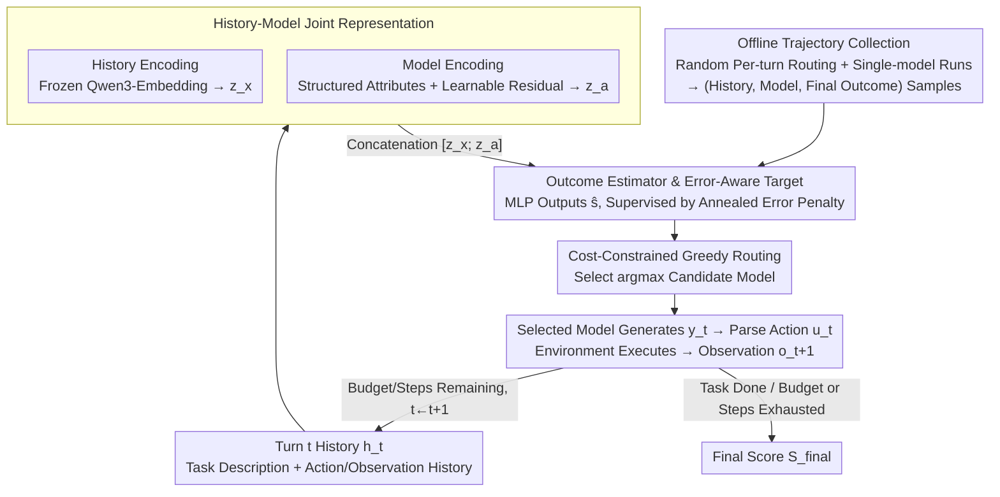

# MTRouter: Cost-Aware Multi-Turn LLM Routing with History-Model Joint Embeddings

**Conference**: ACL 2026  
**arXiv**: [2604.23530](https://arxiv.org/abs/2604.23530)  
**Code**: https://github.com/ZhangYiqun018/ZhangYiqun018/MTRouter  
**Area**: LLM Routing / Agent / NLP  
**Keywords**: Multi-turn LLM Routing, Cost-Aware Inference, History-Model Joint Embedding, Offline Trajectory Learning, Tool-use Agents

## TL;DR
MTRouter models the selection of "which LLM to invoke at each turn" within multi-turn agent tasks as a per-turn routing problem under cost constraints. By using history-model joint embeddings to predict the contribution of candidate models to the final task outcome, it improves task performance while significantly reducing total invocation costs on ScienceWorld and HLE.

## Background & Motivation
**Background**: LLMs are transitioning from single-turn Q&A to multi-turn, long-horizon agent tasks involving tool use, such as scientific environment interactions, complex retrieval reasoning, and code/web operations. These tasks typically require multiple model calls to observe the environment, plan next steps, invoke tools, correct errors, and submit final answers.

**Limitations of Prior Work**: Relying solely on high-capability models like GPT-5 or Claude Opus yields high success rates but leads to rapidly accumulating costs as multi-turn contexts grow. Conversely, using only inexpensive models might suffice for routine tool calls but often fails during critical planning or error recovery phases. Single-turn routing methods usually select one model at the beginning of an episode and fix it throughout the trajectory, failing to adapt to phase-specific differences such as "early-stage planning, mid-stage exploration, and late-stage verification."

**Key Challenge**: The difficulty in multi-turn routing is not merely judging the difficulty of the current input, but determining whether "selecting a specific model under the current historical state will affect the final outcome." A seemingly local formatting error, invalid action, or failed search might be corrected later or might derail the entire episode. If a router performs reactive upgrades based only on current errors, it may frequently switch models—disrupting caches and increasing costs—without necessarily improving the final success rate.

**Goal**: The authors aim to maximize the final task score or accuracy by selecting a candidate model turn-by-turn, subject to a fixed per-episode cost budget and maximum turn constraints. This objective involves three components: representing the current interaction history, representing the cost and capability features of different models, and learning a lightweight router that predicts final returns from offline trajectories.

**Key Insight**: The core observation is that supervision signals for multi-turn routing naturally exist within historical trajectories: every episode ends with a final score, and intermediate events like formatting errors, tool failures, or invalid actions can be detected. Rather than having a large LLM judge whether to switch models using zero-shot prompts, it is more effective to learn the mapping from "historical state + candidate model" to the final outcome from logs.

**Core Idea**: Use history-model joint embeddings to learn a final outcome estimator. At each turn, select the model predicted to yield the highest final return instead of using a fixed model or reactive rules for the entire multi-turn task.

## Method
MTRouter's design can be viewed as an external "scheduler" for an Agent. The Agent itself continues to output actions or tool calls as required by the environment; MTRouter does not rewrite the task logic but decides which LLM to assign the current turn before each invocation, based on the history and the candidate model pool.

### Overall Architecture
An episode consists of multiple interaction turns. At turn `t`, the router observes history `h_t` and selects model `a_t`. The chosen model generates output `y_t`, which a parser converts into an executable action `u_t`. The environment executes the action and returns a new observation `o_{t+1}`. An episode ends when the task is completed, the maximum turns are reached, or the cost budget is exhausted, at which point the environment provides a final score $S_{final}$.

During the training phase, the authors collect offline trajectories: one set from a random router that selects models per turn, and another set from trajectories where a single model runs the entire episode. Each trajectory is decomposed into numerous "history-model-final outcome" training samples. The model learns a scalar function $\hat{s}_\theta(h_t, a)$, representing the expected contribution to the final result when selecting candidate model `a` given the current history.

During the inference phase, MTRouter encodes the current history once and concatenates it with the embedding of each candidate model to score all candidates in batch, selecting $\arg\max_a \hat{s}_\theta(h_t, a)$. The process is constrained by the per-episode cost ceiling and maximum steps, with costs calculated based on input/output tokens and model pricing.

### Key Designs

**1. History-Model Joint Representation: Enabling decisions based on both "current state" and "candidate model characteristics"**

Single-turn routing only considers the query or model price. However, in multi-turn Agent tasks, the same history segment carries different implications for different models—a cheap model may handle formatting or simple queries well but fail at complex planning or Python reasoning. MTRouter encodes both sides into the decision. The history $h_t$ consists of task descriptions, previous actions, and observation sequences. Implementation-wise, task blocks are preserved, and the most recent context is kept within an 8192-token budget (truncating older content first), which is then encoded into a 1024-dimensional vector $z_x$ via a frozen Qwen3-Embedding-0.6B.

The model side is encoded through a dual-channel: structured attributes (explicit info like context length, knowledge cutoff, and I/O pricing) and learnable residual embeddings that capture model behaviors not explained by metadata (e.g., a model's stability in search). These are projected and concatenated to form the model vector $z_a$. The final $[z_x; z_a]$ is fed to the estimator. Consequently, the estimator learns "who to assign given this history" rather than "which model is stronger overall."

**2. Final Outcome Estimator & Error-Aware Target: Converting coarse final scores into learnable per-turn signals via annealed error penalties**

Complex Agent environments typically lack reliable dense rewards, offering only a final score $S_{final}$ at the end of an episode. Using only this final score as a label is too coarse to distinguish between "early recoverable mistakes" and "late-stage destructive errors." The estimator is a lightweight MLP that outputs a scalar $\hat{s}_\theta(h_t, a)$, and its supervision target overlays an error penalty from the current turn to the end:

$$\tilde{S}_t = S_{final} - \sum_{i=t}^{T-1}\rho_i$$

Where $\rho_i$ is determined by the presence of errors, error severity, and a progress weight that increases with turn count (penalizing later errors more heavily). This allows the estimator to remain task-oriented while providing granular feedback per turn without treating every local error as a signal to "immediately switch models."

**3. Cost-Constrained Per-Turn Greedy Routing: Natural waste reflection through budget enforcement rather than explicit cost penalties**

The goal is to allocate expensive models to truly critical turns and cheap models to low-risk or specialized operations. MTRouter does not add an explicit cost penalty to the training objective. Since trajectories are generated under per-episode cost and turn constraints, wasting expensive calls or turns naturally manifests as a degradation in final scores or premature budget exhaustion. During inference, the router simply takes $\arg\max_a \hat{s}_\theta(h_t, a)$ and stops the episode if budgets or steps are depleted. This approach is more stable than "upgrade upon error" reactive rules and allows the router to learn non-explicit divisions of labor: e.g., using GPT-5 for planning in the early phase and GPT-OSS for queries later.

### Loss & Training
Training data comes from two sources: random per-turn routing (providing model coverage) and single-model runs (providing stable behavioral anchors). Combined, these include 1,291 training instances, 29,693 trajectories, and 515,221 turns, with a collection cost of approximately \$1,620.

The loss function is Mean Squared Error (MSE): for a sample $(h_t^{(k)}, a_t^{(k)})$ from trajectory turn $t$, the estimator is supervised by the error-adjusted target $y_t^{(k)} = \tilde{S}_t^{(k)}$, minimizing $\sum_{k,t}(\hat{s}_\theta(h_t^{(k)}, a_t^{(k)}) - y_t^{(k)})^2$. The optimizer is AdamW with a learning rate of `1e-3`, weight decay of 0.01, cosine annealing, 100 epochs, and early stopping with patience=3. The batch size is 64. Model residual embeddings include $L2$ regularization to prevent the router from simply memorizing model IDs from training trajectories.

The candidate pool includes 6 models covering a 20x price range: GPT-5, DeepSeek-V3.2, MiniMax-M2, Kimi-K2, Gemini-2.5-Flash-Lite, and GPT-OSS-120B. ScienceWorld limits are 50 steps and \$2 per episode; HLE limits are 30 steps and \$2 per episode.

## Key Experimental Results

### Main Results
Evaluation was conducted on ScienceWorld and Humanity's Last Exam (HLE) across ID test and OOD splits. ScienceWorld is a text-based interactive environment (scores: [-100, 100]); HLE is a long-context, multi-tool reasoning task (metric: accuracy). OOD splits involve holding out entire task types or academic categories.

| Dataset / Split | Metric | MTRouter | GPT-5 | Router-R1 | Gain vs GPT-5 |
|--------|------|------|----------|----------|------|
| ScienceWorld Test | Score / Cost | 53.8 / $5.7 | 48.4 / $13.9 | 42.1 / $12.6 | +5.4 score, 58.7% cost saved |
| ScienceWorld OOD | Score / Cost | 9.9 / $16.3 | 4.9 / $47.6 | 2.1 / $21.0 | +5.0 score, 65.8% cost saved |
| HLE Test | Acc / Cost | 26.0% / $35.0 | 25.1% / $61.8 | 24.2% / $51.9 | +0.9 pts, 43.4% cost saved |
| HLE OOD | Acc / Cost | 38.6% / $31.2 | 34.8% / $65.3 | 35.1% / $60.7 | +3.8 pts, 52.3% cost saved |

These results indicate that MTRouter does not merely trade capability for cost. It outperforms full GPT-5 invocation on the ScienceWorld Test at less than half the cost. On HLE, it achieves parity or better accuracy than GPT-5 while significantly reducing total expenditures. Compared to the RL-based baseline Router-R1, MTRouter is both cheaper and more effective across all four splits.

### Ablation Study

| Configuration | ScienceWorld Score | HLE Acc. | Description |
|------|---------|---------|------|
| MTRouter (Full) | 53.8 ± 3.2 | 26.0 ± 2.3 | Joint embedding, MLP estimator, random data, error penalty enabled |
| Ridge instead of MLP | 49.1 ± 3.5 | 23.4 ± 2.2 | Linear models lack expressivity; performance isn't just from manual features |
| w/o Random-Router Data | 47.2 ± 4.1 | 22.6 ± 2.1 | Lack of turn-level model coverage hinders learning cross-model preferences |
| w/o Error Penalty | 48.5 ± 3.6 | 23.8 ± 2.1 | Using only final scores makes supervision too coarse for error recovery |
| w/o Routing History | 44.6 ± 3.8 | 21.3 ± 2.0 | Router loses ability to leverage long-term context |
| Hard-coded Model Enc. | 41.3 ± 4.4 | 19.7 ± 2.1 | Fixed attributes alone fail to capture practical behavioral differences |

### Exploratory Analysis

| Analysis | Config | ScienceWorld | HLE | Key Findings |
|------|------|------|------|------|
| Budget Sensitivity | 0.5×B / 1.0×B / 2.0×B | 45.2 / 53.8 / 55.6 | 20.6 / 26.0 / 27.3 | Loosening limits improves performance, but marginal returns diminish past 1× |
| Model Pool Size | 2 / 6 / 8 models | 50.6 / 53.8 / 54.1 | 25.4 / 26.0 / 25.8 | 6 models cover main complementarity; further expansion adds little |
| History Length | 2k / 4k / 8k / 16k tokens | 49.3 / 52.1 / 53.8 / 53.5 | 23.8 / 25.3 / 26.0 / 26.2 | 8192 tokens is the sweet spot; excessive length adds no value |

### Key Findings
- **Stability**: MTRouter's success is not due to "frequent model switching." It completes successful episodes with fewer switches than Router-R1 (e.g., ~5 vs ~20 in ScienceWorld).
- **Error Tolerance**: MTRouter is more "patient" with transient errors. After an error, it retains the current model 90.2% of the time in ScienceWorld and 80.9% in HLE—significantly higher than Router-R1—yet achieves a higher recovery rate, suggesting it learns which errors are recoverable.
- **Specialization**: Model behavior shows specialized labor. In HLE, DeepSeek is over-represented in `search`, GPT-5 in `python`, and Kimi in `browse`. In ScienceWorld, MiniMax is preferred for observation, Gemini for interactions, and GPT-OSS for queries.
- **Embedding Space**: T-SNE visualizations of learned model embeddings show clear clusters by identity and cost hierarchy, proving the encoder captures capability-price relationships beyond simple ID memorization.

## Highlights & Insights
- This work pushes LLM routing from "which model answers this query" to "which model takes this turn in a long trajectory," a perspective much closer to real-world Agent deployment where costs and errors accumulate.
- The error-aware final target is highly practical. Avoiding complex dense rewards, the authors use the final score as the primary signal while using error severity and timing as lightweight corrections.
- Model encoding is sophisticated. By combining structured attributes with learnable residuals, the router understands not just price and context limits, but also the empirical reliability of models on specific tools/actions.
- The analysis section is notably rigorous. Rather than just reporting Pareto curves, the authors explain the mechanical reasons for cost reduction: avoiding low-value switches, stability during recoverable errors, and specialized model-tool task division.

## Limitations & Future Work
- **Collection Cost**: The offline trajectory cost (~$1,620 for 1,291 instances) is high. Repeated collection for changing model pools or toolsets could be a bottleneck.
- **Implicit Domain Adaptation**: MTRouter is fixed after training. It lacks online adaptation to new tool errors, model version updates, or rapid distribution shifts.
- **Cache Efficiency**: Switching models per turn may lose prompt/KV caching benefits. Though MTRouter switches less than baselines, cross-model switches still require re-processing history, potentially incurring latency.
- **Evaluation Coverage**: While ScienceWorld and HLE are representative, further validation on software engineering or multi-modal workflows is needed.
- **Lack of Lookahead**: The current greedy selection does not explicitly plan future routing sequences based on remaining budget or future uncertainty.

## Related Work & Insights
- **vs FrugalGPT**: FrugalGPT uses cascading calls from cheap to expensive models based on confidence triggers for single-turn Q&A. MTRouter addresses multi-turn trajectories where long-term outcomes matter more than single-answer confidence.
- **vs EmbedLLM / RouterDC**: These focus on learned matching for single-turn or episode-level routing; MTRouter explicitly encodes interaction history and allows per-turn selection.
- **vs Router-R1**: Router-R1 uses an LLM-based router with RL, which is more powerful but heavier and prone to reactive switching. MTRouter's lightweight estimator is more stable and cost-efficient.
- **vs ReAct/Toolformer**: These teach LLMs how to use tools. MTRouter acts as a cost-control layer *outside* the tool-use framework, deciding which LLM executes each turn.

## Rating
- Novelty: ⭐⭐⭐⭐☆ Solid formalization of multi-turn routing via joint embeddings; highly relevant to Agent deployment.
- Experimental Thoroughness: ⭐⭐⭐⭐⭐ Comprehensive experiments across splits, ablation, and behavioral analysis.
- Writing Quality: ⭐⭐⭐⭐☆ Clear structure and methodology, though some tables are dense.
- Value: ⭐⭐⭐⭐⭐ High engineering value for optimizing long-horizon Agent costs beyond naive large-model-only strategies.

<!-- RELATED:START -->

## Related Papers

- [\[ACL 2026\] Task-Aware LLM Routing with Multi-Level Task-Profile-Guided Data Synthesis for Cold-Start Scenarios](task-aware_llm_routing_with_multi-level_task-profile-guided_data_synthesis_for_c.md)
- [\[ACL 2026\] Breaking Block Boundaries: Anchor-based History-stable Decoding for Diffusion Large Language Models](breaking_block_boundaries_anchor-based_history-stable_decoding_for_diffusion_lar.md)
- [\[ICLR 2026\] Did You Check the Right Pocket? Cost-Sensitive Store Routing for Memory-Augmented Agents](../../ICLR2026/llm_efficiency/did_you_check_the_right_pocket_cost-sensitive_store_routing_for_memory-augmented.md)
- [\[NeurIPS 2025\] Efficient Training-Free Online Routing for High-Volume Multi-LLM Serving](../../NeurIPS2025/llm_efficiency/efficient_training-free_online_routing_for_high-volume_multi-llm_serving.md)
- [\[ACL 2026\] Understanding LLM Performance Degradation in Multi-Instance Processing: The Roles of Instance Count and Context Length](understanding_llm_performance_degradation_in_multi-instance_processing_the_roles.md)

<!-- RELATED:END -->
