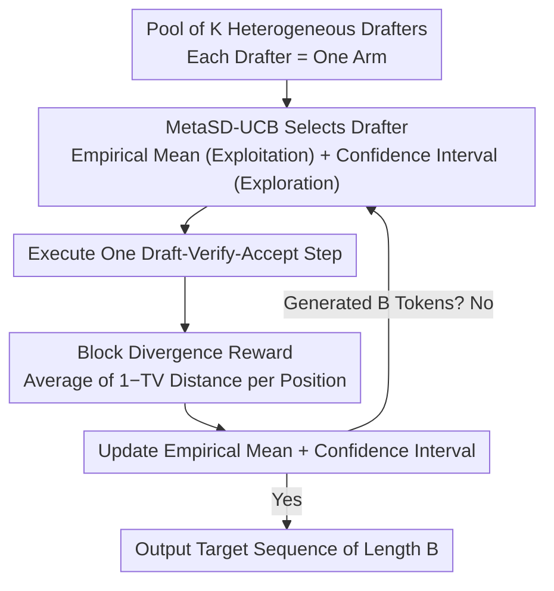

# Multi-Drafter Speculative Decoding with Alignment Feedback

**Conference**: ACL 2026 Findings  
**arXiv**: [2604.05417](https://arxiv.org/abs/2604.05417)  
**Code**: Yes  
**Area**: LLM Efficiency  
**Keywords**: Speculative Decoding, Multi-Armed Bandit, Multi-Drafters, Alignment Feedback, Inference Acceleration

## TL;DR

This paper proposes MetaSD, a unified framework that integrates multiple heterogeneous drafters into speculative decoding. By modeling drafter selection as a Multi-Armed Bandit (MAB) problem and using Block Divergence as a reward signal, MetaSD dynamically selects the drafter most aligned with the target LLM. It consistently outperforms single-drafter methods in both black-box and white-box configurations.

## Background & Motivation

**Background**: Speculative decoding accelerates LLM inference using small models (drafters) to predict future tokens, which are verified in parallel by a larger model. Existing methods have improved acceptance rates through architectural enhancements (e.g., EAGLE, Medusa), knowledge distillation, and tree-search verification.

**Limitations of Prior Work**: Most existing methods rely on a single drafter. However, a single drafter is typically trained for specific tasks or domains and performs poorly on out-of-distribution inputs or dynamic user queries. With the rise of "Expert Model Integration" (similar to LLM routing), the limitations of single drafters have become more pronounced.

**Key Challenge**: Different tasks require different drafters, but it is impossible to know which drafter is most suitable for a given input in advance during inference. Manual switching is infeasible, necessitating an automated dynamic selection mechanism.

**Goal**: Design a multi-drafter framework that can dynamically select the optimal drafter during the inference process.

**Key Insight**: Speculative decoding naturally provides "alignment feedback"—the degree of match between drafter predictions and target model predictions—which can serve as a real-time feedback signal. This maps perfectly to the Multi-Armed Bandit problem: each drafter acts as an arm, and the alignment feedback serves as the reward signal.

**Core Idea**: Multi-drafter speculative decoding is modeled as an MAB problem. The paper introduces Block Divergence (BD) as a reward signal, which is more informative and has lower variance than traditional block efficiency. The UCB algorithm is employed to dynamically balance exploration and exploitation during drafter selection.

## Method

### Overall Architecture

MetaSD maintains a pool of $K$ heterogeneous drafters to address the problem of selecting the most aligned drafter in real-time. This selection process is framed within a Multi-Armed Bandit structure where each drafter is an arm, and the alignment feedback generated by speculative decoding represents the reward. The mechanism optimizes for stopping-time regret. In each round, the UCB algorithm selects a drafter based on historical performance to execute a draft-verify-accept cycle. The resulting block divergence reward is used to update the empirical mean and confidence interval for that drafter. This loop continues until a target sequence of length $B$ is generated, allowing the selection strategy to converge to the optimal drafter as observations accumulate.

> Optimization Goal: Stopping-time regret—minimizing the difference in total rounds between the current policy and an "oracle optimal" policy for generating $B$ tokens, driving the loop to converge on the optimal arm as quickly as possible.

### Key Designs

**1. Block Divergence Reward: Replacing Binary Acceptance with Continuous Alignment**

To identify the optimal arm quickly, reward signals should be as clean as possible. Traditional "block efficiency" (the count of accepted tokens in a block) is a discrete integer that collapses rich distribution information, leading to high variance. MetaSD introduces Block Divergence (BD): at each position of a draft block, it calculates the Total Variation (TV) distance between the target model and the drafter's probability distributions, then averages them: $r_{i,t}^{BD} = \frac{1}{N_{max}} \sum_{j=0}^{N_{max}-1} \big(1 - d_{TV}(p^{l(t)+j}, q_i^{l(t)+j})\big)$. This allows every position to contribute continuous alignment information, avoiding the loss of information inherent in binary "accept/reject" signals.

The paper quantitatively explains why this is superior by defining feedback signal strength as $R(r_i) = \frac{\Delta_i^2}{\max(\text{Var}[r_i], \text{Var}[r_{i^*}])}$. It demonstrates that in most cases, BD provides a stronger signal than block efficiency, enabling the bandit to identify the optimal drafter with fewer exploration steps.

**2. Stopping-Time Regret: An Objective Tailored for Speculative Decoding**

The regret in standard bandits is "maximizing cumulative reward," which does not directly correspond to speculative decoding efficiency—where the primary concern is the number of rounds required to generate $B$ tokens. MetaSD reformulates the target as stopping-time regret $\text{Reg}(\pi, B) = \mathbb{E}[\tau(\pi, B)] - \mathbb{E}[\tau(\pi^*, B)]$, representing the difference in total rounds between the chosen policy and the optimal strategy.

The paper proves via a lemma that this objective is equivalent to "maximizing the number of tokens accepted per round," which aligns perfectly with the goal of speculative decoding acceleration.

**3. MetaSD-UCB: Dynamic Exploration-Exploitation Trade-off**

MetaSD utilizes a UCB selection rule: in each round, it chooses $a_t = \arg\max_{i \in [K]} \hat{\mu}_{i,t} + \beta \sqrt{\frac{2 \ln t}{n_i}}$. The first term represents the empirical mean reward (exploitation), while the second term represents the width of the confidence interval (exploration). After an initial phase where each drafter is tried once, the rule is applied throughout the generation process. The paper provides rigorous theoretical guarantees, achieving an $O(\ln B)$ regret upper bound, meaning the cost of exploring non-optimal drafters grows only logarithmically with sequence length.

### Loss & Training

MetaSD is a training-free, inference-only algorithm. Drafters in the pool can be any pre-trained models. The framework supports both black-box (independent drafters) and white-box (EAGLE drafters reusing target LLM latent representations) configurations.

## Key Experimental Results

### Black-Box Speculative Decoding Speedup

| Task | Best Single Drafter | MetaSD-UCB |
|------|-------------|------------|
| Code | 2.437 | 2.300 |
| Translation | 2.076 | 1.587 |
| Summary | 2.133 | 1.971 |
| QA | 1.960 | 1.711 |
| Math | 2.454 | 2.280 |

### White-Box Speculative Decoding Speedup (EAGLE Drafters)

| Task | Best Single Drafter | MetaSD-UCB |
|------|-------------|------------|
| Code | 3.934 | 3.724 |
| Translation | 2.496 | 2.318 |
| Summary | 3.382 | 3.057 |
| QA | 2.916 | 2.641 |
| Math | 3.903 | 3.520 |

### Key Findings
- MetaSD-UCB automatically achieves performance levels close to the optimal expert drafter without prior knowledge of the task type.
- Significant improvements over random selection (Rand) and static aggregation demonstrate the effectiveness of dynamic selection.
- The high mean difference and low variance of BD rewards allow UCB to converge faster to the optimal drafter.
- The framework naturally handles non-stationarity between queries and is extensible to non-stationarity within a query.
- Plug-and-play capability requires no additional training.

## Highlights & Insights
- **Integration of MAB and Speculative Decoding**: The combination is highly natural, as alignment feedback inherently provides reward signals. This modeling bridges online decision theory with LLM inference acceleration.
- **Analytical Depth of BD vs. BE**: Proving the superiority of Block Divergence via feedback signal strength provides a theoretical framework that can be extended to other reward design scenarios.
- **Stopping-Time Regret**: This objective reveals that standard MAB regret is not directly applicable to speculative decoding and provides a more appropriate metric for inference efficiency.

## Limitations & Future Work
- Speedup remains slightly below the "Oracle Optimal" upper bound due to required exploration cycles.
- Drafter switching incurs overhead for KV-cache recomputation, though this can be mitigated by techniques like Sequential Halving.
- Requires access to probability distributions, making it unsuitable for pure black-box APIs that only return tokens.
- Scales to larger pools might require more efficient exploration strategies than standard UCB.

## Related Work & Insights
- **vs. Standard Speculative Decoding**: While standard methods use a single drafter, MetaSD extends to a heterogeneous pool with dynamic selection.
- **vs. LLM Routing**: While LLM routing occurs at the query level, MetaSD operates at the finer granularity of speculative decoding steps.
- **vs. Hou et al. (2025)**: While both use MAB for speculative decoding, MetaSD introduces the BD reward and stronger instance-dependent regret bounds.

## Rating
- Novelty: ⭐⭐⭐⭐ MAB modeling for multi-drafter decoding is elegant, and BD reward design has theoretical depth.
- Experimental Thoroughness: ⭐⭐⭐⭐ Covers black-box/white-box settings, multiple tasks, languages, and non-stationary environments.
- Writing Quality: ⭐⭐⭐⭐⭐ Rigorous theoretical analysis validated by experimental results.
- Value: ⭐⭐⭐⭐ Provides a theoretically optimal selection algorithm for multi-drafter speculative decoding.

<!-- RELATED:START -->

## Related Papers

- [\[ACL 2026\] TokenTiming: A Dynamic Alignment Method for Universal Speculative Decoding Model Pairs](tokentiming_a_dynamic_alignment_method_for_universal_speculative_decoding_model_.md)
- [\[ACL 2026\] Speculative Verification: Exploiting Information Gain to Refine Speculative Decoding](speculative_verification_exploiting_information_gain_to_refine_speculative_decod.md)
- [\[ACL 2026\] RACER: Retrieval-Augmented Contextual Rapid Speculative Decoding](racer_retrieval-augmented_contextual_rapid_speculative_decoding.md)
- [\[ICLR 2026\] Not-a-Bandit: Provably No-Regret Drafter Selection in Speculative Decoding for LLMs](../../ICLR2026/llm_efficiency/not-a-bandit_provably_no-regret_drafter_selection_in_speculative_decoding_for_ll.md)
- [\[NeurIPS 2025\] OmniDraft: A Cross-Vocabulary Online Adaptive Drafter for On-Device Speculative Decoding](../../NeurIPS2025/llm_efficiency/omnidraft_a_cross-vocabulary_online_adaptive_drafter_for_on-device_speculative_d.md)

<!-- RELATED:END -->
