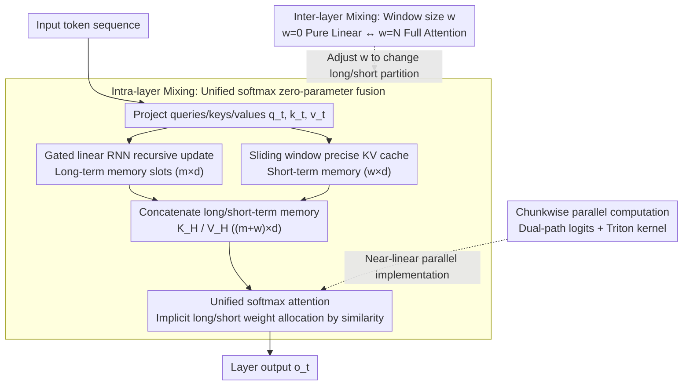

# Native Hybrid Attention for Efficient Sequence Modeling

**Conference**: ACL 2026  
**arXiv**: [2510.07019](https://arxiv.org/abs/2510.07019)  
**Code**: [GitHub](https://github.com/JusenD/NHA)  
**Area**: LLM Efficiency / Attention Mechanism  
**Keywords**: Hybrid Attention, Linear Attention, Sliding Window, Fusion of Long-short Term Memory, Efficient Sequence Modeling

## TL;DR

This paper proposes Native Hybrid Attention (NHA), which unifies the long-term memory slots of linear RNNs with the short-term precise tokens of sliding windows through a single softmax attention operation. This achieves native unification of intra-layer and inter-layer mixing—dynamically allocating attention weights between long and short terms without extra fusion parameters—outperforming Transformer and other hybrid baselines on recall-intensive and common-sense reasoning tasks.

## Background & Motivation

**Background**: The $O(n^2)$ complexity of the Transformer's self-attention mechanism limits long-sequence processing. The research community has evolved along two paths: (1) Sparse attention (e.g., Sliding Window Attention, SWA) calculates softmax within a local window; (2) Linear sequence models (e.g., Mamba, GLA, GSA) compress full sequences into fixed-size states to achieve $O(n)$ efficiency.

**Limitations of Prior Work**: (1) SWA cannot capture tokens outside the window, while the extreme compression of linear models often loses precise token information—their strengths and weaknesses are complementary; (2) Existing intra-layer hybrid schemes (e.g., MesaNet, Titans) compute linear attention and local softmax separately and then fuse them via weighted summation—requiring extra fusion parameters and fixed weights; (3) Existing inter-layer hybrid schemes (e.g., Jamba) stack different types of layers—requiring the management of heterogeneous modules and alignment, with layer type selection necessitating expensive searches.

**Key Challenge**: Pure linear models cannot perfectly preserve infinite information in a fixed-size memory (theoretically impossible), but maintaining a full KV cache for every token in every layer like a Transformer is too expensive and unnecessary. A better balance must be found between information retention and computational efficiency.

**Goal**: Design a natively unified hybrid attention mechanism that simultaneously achieves: (1) Intra-layer fusion—dynamically allocating long and short-term attention without extra parameters; (2) Inter-layer mixing—enabling flexible configuration simply by adjusting window size hyperparameters.

**Key Insight**: Represent the memory slots of a linear RNN in an $m \times d$ KV format (consistent with the KV cache format of SWA), allowing them to be directly concatenated and processed by a unified softmax—softmax itself can learn to dynamically allocate attention weights.

**Core Idea**: Long-term memory (RNN compression) and short-term memory (sliding window precise tokens) are naturally compatible in the KV dimension. Concatenating them and processing them with a single softmax realizes context-dependent fusion with zero additional parameters.

## Method

### Overall Architecture

The core insight of NHA is that both the compressed memory of linear RNNs and the precise KV cache of sliding windows can essentially be written in an $m \times d$ KV format. Therefore, they can be directly concatenated and processed by the same softmax operation, rather than being calculated separately and then fused via weighting as in previous methods. In each layer, NHA maintains two types of memory: long-term memory $K^{long}_t, V^{long}_t \in \mathbb{R}^{m \times d}$ is recursively updated by a gated RNN, compressing all history outside the window into fixed-size slots; short-term memory $K^{short}_t, V^{short}_t \in \mathbb{R}^{w \times d}$ is the precise KV cache of tokens within the window. These are concatenated into $K^H_t \in \mathbb{R}^{(m+w) \times d}$ to produce the output via a single softmax attention. Furthermore, by adjusting the window size $w$, the same architecture can continuously slide between "pure linear RNN ($w=0$)", "hybrid", and "full attention ($w=N$)", unifying intra-layer fusion and inter-layer mixing into one mechanism.

### Key Designs

**1. Intra-layer Mixing—Zero-parameter long-short fusion with unified softmax**

Linear models lose precise tokens when compressing full sequences into fixed states, and sliding windows cannot see content outside the window. Their strengths complement each other, but previous intra-layer hybrids (e.g., MesaNet, Titans) calculated linear attention and local softmax separately and then used weighted summation—requiring extra parameters and often fixed weights. NHA first uses a gated linear RNN for recursive updates: $K^{long}_t = \text{Diag}(\alpha_t) K^{long}_{t-1} + (1-\alpha_t) \otimes k_t$, then concatenates it with the short-term window KV cache for a single softmax: $o_t = \text{softmax}(\frac{q_t (K^H_t)^T}{\sqrt{d}}) V^H_t$.

The key is that softmax normalization naturally "allocates attention"—the actual attention proportion obtained by long-term memory $\omega_L = \frac{\sum_{i \in long} \exp(q_t k_i^\intercal)}{\sum_{i \in long} \exp(q_t k_i^\intercal) + \sum_{j \in short} \exp(q_t k_j^\intercal)}$ is entirely determined by the similarity between the query and all keys. Thus, fusion becomes a per-token, per-head context-dependent weighting without any extra parameters, and gradients naturally couple the learning of long and short-term memory. Token shifting ensures that only tokens sliding out of the window update the long-term memory; RoPE is used for position encoding within the window, while long-term memory receives no position encoding.

**2. Inter-layer Mixing—Switching layer behavior via a single window size hyperparameter**

Previous inter-layer hybrids (e.g., Jamba) stacked different types of layers, requiring management of alignment between heterogeneous modules and expensive searches for layer types. NHA lets all layers share the exact same architecture, with behavioral differences determined entirely by the sliding window $w$ of each layer: $w=0$ is a pure linear RNN layer, $w=N$ is a full attention layer, and values in between create hybrid layers.

This "duality" brings a practical bonus—since switching does not require architectural changes or retraining, the same model can search for precision-speed configurations at inference time with zero cost, turning expensive layer type searches into nearly free inference-time knobs.

**3. Chunkwise Parallel Computation—Exploiting GPU parallelism at near-linear complexity**

While unified softmax is elegant, it cannot leverage GPU parallelism if executed recursively per token. NHA splits sequences into chunks of size $C$ and calculates two paths of logits in parallel: the linear path is obtained via cumulative/reverse gated products $\mathcal{A}$, and the sliding window path is standard attention with an offset window. After concatenating both paths and passing through softmax, value vectors are aggregated from both branches. The process is implemented using Triton kernels.

This preserves near-linear computational complexity while delegating intra-chunk operations to the GPU. NHA's speed on long sequences is comparable to GSA and significantly better than the quadratic growth of FlashAttention.

### Loss & Training

Standard language modeling cross-entropy loss. The 340M model was trained on 15B tokens, and the 1.3B model on 100B tokens; when hybridizing pre-trained LLMs, fine-tuning was performed using 10B tokens from SlimPajama.

## Key Experimental Results

### Main Results

**1.3B Model Performance Comparison (100B tokens)**

| Model | Common-sense Avg↑ | Recall-intensive Avg↑ | Wiki ppl↓ |
|------|-------------|-------------|----------|
| Trans++ | 50.71 | 37.31 | 17.61 |
| GSA | 51.79 | 32.05 | 16.69 |
| GSA-H (+Transformer layer) | 50.76 | 44.99 | 16.22 |
| GDN-H | 52.54 | 44.88 | 16.02 |
| **NHA** | **52.89** | **46.43** | 16.16 |

### Hybridization of Pre-trained LLMs

| Model | Full Attention Layers | Common-sense Avg↑ | Recall-intensive Avg↑ |
|------|-----------|-------------|-------------|
| Llama-3-8B | 32 | 71.30 | 60.08 |
| NHA-Llama-3-8B | 4 | 70.31 | 57.64 |
| Zamba2-7B | 9 | 71.50 | 54.56 |
| StripedHyena-7B | 16 | 68.10 | 57.59 |

### Key Findings

- NHA achieves optimal performance in both common-sense reasoning and recall-intensive tasks at the 1.3B scale, surpassing all pure linear and hybrid baselines.
- Pre-trained LLM Hybridization: NHA-Llama-3-8B, using only 4 full attention layers and 10B token fine-tuning, reached 57.64 on recall-intensive tasks, surpassing StripedHyena (57.59) which uses 16 full attention layers.
- In RULER long-context evaluation, NHA demonstrates the strongest extrapolation capability—extrapolating from 2K training length to 8K, it scored 24.8 on the Hotpot task, far exceeding other hybrid models.
- Inference-time Architecture Search: By inserting a global window at Layer 11, NHA with 4 full attention layers can match the performance of a 12-layer baseline—optimizing the position of layers is more important than the quantity.
- NHA outperforms Transformers trained from scratch when contracted to pure Transformer form—indicating a regularization effect from hybrid training.

## Highlights & Insights

- Unified softmax fusion is the core innovation—downgrading fusion from explicit parameter learning to implicit softmax allocation, which simplifies design while enhancing context adaptability. Gradient analysis proves unified softmax naturally couples the gradient flow of long and short-term memory.
- NHA's "architectural duality" is highly practical—the same model can switch between different efficiency-precision configurations at zero cost during inference, suitable for heterogeneous deployment scenarios.
- The finding that "optimizing the position of full attention layers is more important than the quantity" provides direct guidance for hybrid architecture design.

## Limitations & Future Work

- When hybridizing pre-trained LLMs, knowledge-intensive benchmarks like MMLU show some regression due to the 10B token fine-tuning budget and 2K training context limitations.
- The choice of the number of long-term memory slots $m$ affects performance; it is currently fixed at 32/64, and adaptive slot counts have not been explored.
- The Triton kernel implementation currently supports only training; the RNN mode kernel for inference requires further optimization.
- Effectiveness in ultra-long context scenarios (128K+) has not yet been verified.

## Related Work & Insights

- **vs Titans/MesaNet**: These intra-layer hybrid schemes calculate two types of attention separately before weighted fusion. NHA uses unified softmax for zero-parameter fusion—simpler and more context-adaptive.
- **vs Jamba/StripedHyena**: These inter-layer hybrid schemes stack heterogeneous layers. NHA uses a unified architecture plus window size adjustment—supporting zero-cost inference-time search.
- **vs Atlas**: The window range of Atlas is equivalent to the sliding window of NHA, but Atlas's joint KV update cannot incorporate the softmax operation.

## Rating

- Novelty: ⭐⭐⭐⭐⭐ Unified softmax fusion + architectural duality is an elegant design.
- Experimental Thoroughness: ⭐⭐⭐⭐⭐ Includes training from scratch + LLM hybridization + RULER long context + inference-time search + ablation.
- Writing Quality: ⭐⭐⭐⭐⭐ Clear explanation of the progressive three-layer architecture with rigorous mathematical formalism.
- Value: ⭐⭐⭐⭐⭐ Provides a unified and practical hybrid solution for efficient LLM architectures.

<!-- RELATED:START -->

## Related Papers

- [\[ICLR 2026\] RACE Attention: A Strictly Linear-Time Attention for Long-Sequence Training](../../ICLR2026/llm_efficiency/race_attention_a_strictly_linear-time_attention_for_long-sequence_training.md)
- [\[ACL 2026\] CoMeT: Collaborative Memory Transformer for Efficient Long Context Modeling](comet_collaborative_memory_transformer_for_efficient_long_context_modeling.md)
- [\[ACL 2025\] Native Sparse Attention: Hardware-Aligned and Natively Trainable Sparse Attention](../../ACL2025/llm_efficiency/native_sparse_attention.md)
- [\[CVPR 2025\] LOCORE: Image Re-ranking with Long-Context Sequence Modeling](../../CVPR2025/llm_efficiency/locore_image_re-ranking_with_long-context_sequence_modeling.md)
- [\[ICML 2025\] Efficient Length-Generalizable Attention via Causal Retrieval for Long-Context Language Modeling](../../ICML2025/llm_efficiency/efficient_length-generalizable_attention_via_causal_retrieval_for_long-context_l.md)

<!-- RELATED:END -->
