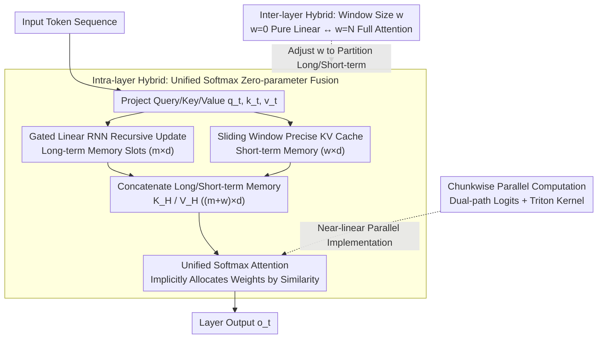

# Native Hybrid Attention for Efficient Sequence Modeling

**Conference**: ACL 2026  
**arXiv**: [2510.07019](https://arxiv.org/abs/2510.07019)  
**Code**: [GitHub](https://github.com/JusenD/NHA)  
**Area**: LLM Efficiency / Attention Mechanism  
**Keywords**: Hybrid Attention, Linear Attention, Sliding Window, Long-Short Term Memory Fusion, Efficient Sequence Modeling

## TL;DR

Ours proposes Native Hybrid Attention (NHA), which unifies the long-term memory slots of linear RNNs and the short-term precise tokens of sliding windows through a single softmax attention operation. This achieves a native unification of intra-layer and inter-layer hybridization—dynamically allocating attention weights between long and short terms without extra fusion parameters—surpassing Transformer and other hybrid baselines in recall-intensive and commonsense reasoning tasks.

## Background & Motivation

**Background**: The $O(n^2)$ complexity of the Transformer self-attention mechanism limits long-sequence processing. The research community has evolved along two paths: (1) Sparse attention (e.g., Sliding Window Attention, SWA) calculates softmax within local windows; (2) Linear sequence models (e.g., Mamba, GLA, GSA) compress the full sequence into fixed-size states to achieve $O(n)$ efficiency.

**Limitations of Prior Work**: (1) SWA cannot capture tokens outside the window, while extreme compression in linear models often loses precise token information—the two have complementary advantages and disadvantages; (2) Existing intra-layer hybrid schemes (e.g., MesaNet, Titans) compute linear attention and local softmax separately and then merge them via weighted summation—requiring extra fusion parameters and fixed weights; (3) Existing inter-layer hybrid schemes (e.g., Jamba) stack different types of layers—requiring the management of heterogeneous modules and alignment, with layer type selection necessitating expensive searches.

**Key Challenge**: Pure linear models cannot perfectly preserve infinite information in a fixed-size memory (theoretically impossible), but maintaining a full KV cache for every token in every layer like a Transformer is too expensive and unnecessary—a better balance must be found between information retention and computational efficiency.

**Goal**: Design a natively unified hybrid attention mechanism that simultaneously achieves: (1) Intra-layer fusion—dynamically allocating long and short-term attention without extra parameters; (2) Inter-layer hybridization—enabling flexible configuration solely by adjusting the window size hyperparameter.

**Key Insight**: Represent the memory slots of linear RNNs in an $m \times d$ KV format (consistent with the KV cache format of SWA), allowing them to be directly concatenated and processed by a unified softmax attention—softmax itself can learn to dynamically allocate attention weights.

**Core Idea**: Long-term memory (RNN compression) and short-term memory (SWA precise tokens) are naturally compatible in the KV dimension. Concatenating them for processing by a single softmax achieves context-dependent fusion with zero extra parameters.

## Method

### Overall Architecture

The core insight of NHA is that both the compressed memory of linear RNNs and the precise KV cache of sliding windows can essentially be written in an $m \times d$ KV format. Therefore, they can be concatenated and handled by the same softmax operation, rather than being calculated separately and then fusion-weighted as in previous works. Specifically, for each layer, NHA maintains two types of memory: long-term memory $K^{long}_t, V^{long}_t \in \mathbb{R}^{m \times d}$ updated recursively by a gated RNN, compressing all history outside the window into fixed-size slots; and short-term memory $K^{short}_t, V^{short}_t \in \mathbb{R}^{w \times d}$ representing the precise KV cache of tokens within the window. The two are concatenated into $K^H_t \in \mathbb{R}^{(m+w) \times d}$ and processed through a single softmax attention to obtain the output. By adjusting the window size $w$, the same architecture can continuously slide between "pure linear RNN ($w=0$)," "hybrid," and "full attention ($w=N$)," unifying intra-layer fusion and inter-layer hybridization into one mechanism.

### Key Designs

**1. Intra-layer Hybrid—Zero-parameter long-short fusion with unified softmax**

Linear models lose precise tokens when compressing the full sequence into a fixed state, and sliding windows cannot see content outside the window. While their pros and cons are complementary, previous intra-layer hybrid methods (e.g., MesaNet, Titans) computed linear attention and local softmax separately and then performed weighted summation—requiring extra fusion parameters and often fixed weights. NHA first recursively updates long-term memory $K^{long}_t = \text{Diag}(\alpha_t) K^{long}_{t-1} + (1-\alpha_t) \otimes k_t$ using a gated linear RNN, and then concatenates it with the short-term window KV cache for a single softmax: $o_t = \text{softmax}(\frac{q_t (K^H_t)^T}{\sqrt{d}}) V^H_t$.

The key is that the normalization of softmax naturally handles "attention allocation"—the proportion of attention received by long-term memory $\omega_L = \frac{\sum_{i \in long} \exp(q_t k_i^\intercal)}{\sum_{i \in long} \exp(q_t k_i^\intercal) + \sum_{j \in short} \exp(q_t j^\intercal)}$ is entirely determined by the similarity between the query and all keys. Thus, fusion becomes a per-token, per-head context-dependent weighting without extra parameters, and gradients naturally couple the learning of long and short-term memories. Implementation-wise, token shifting ensures only tokens sliding out of the window update the long-term memory; RoPE is used for position encoding within the window, while long-term memory lacks position encoding.

**2. Inter-layer Hybrid—Switching layer behavior via a single window size hyperparameter**

Previous inter-layer hybrid models (e.g., Jamba) stacked different layer types, requiring management of alignment between heterogeneous modules and expensive searches for layer types. NHA allows all layers to share the exact same architecture, with behavioral differences determined entirely by the sliding window $w$ of each layer: $w=0$ for pure linear RNN layers, $w=N$ for full attention layers, and hybrid layers in between.

This "duality" brings a practical benefit—since switching requires no structural changes or retraining, the same model can search for speed-accuracy configurations at inference time by adjusting window sizes, turning expensive layer-type searches into virtually free inference-time knobs.

**3. Chunkwise Parallel Computation—Maximizing GPU parallelism with near-linear complexity**

While unified softmax is elegant, it misses GPU parallelism if computed recursively per token. NHA segments the sequence into chunks of size $C$, calculating two-path logits in parallel: the linear path via cumulative/inverse gated products $\mathcal{A}$, and the sliding window path via standard shifted-window attention. After concatenation and a unified softmax, value vectors are aggregated from both memory branches. The entire process is implemented using Triton kernels.

This maintains near-linear computational complexity while delegating intra-chunk operations to GPU parallelism. On long sequences, NHA's speed is on par with GSA and significantly better than the quadratic growth of FlashAttention.

### Loss & Training

Standard language modeling cross-entropy loss. A 340M model was trained on 15B tokens, and a 1.3B model on 100B tokens. When hybridizing pre-trained LLMs, fine-tuning with 10B tokens from SlimPajama is sufficient.

## Key Experimental Results

### Main Results

**1.3B Model Performance Comparison (100B tokens)**

| Model | Commonsense Reasoning Avg↑ | Recall-Intensive Avg↑ | Wiki ppl↓ |
|-------|---------------------------|-----------------------|-----------|
| Trans++ | 50.71 | 37.31 | 17.61 |
| GSA | 51.79 | 32.05 | 16.69 |
| GSA-H (+Trans Layers) | 50.76 | 44.99 | 16.22 |
| GDN-H | 52.54 | 44.88 | 16.02 |
| **NHA** | **52.89** | **46.43** | 16.16 |

### Hybridization of Pre-trained LLMs

| Model | Full Attn Layers | Commonsense Reasoning Avg↑ | Recall-Intensive Avg↑ |
|-------|------------------|---------------------------|-----------------------|
| Llama-3-8B | 32 | 71.30 | 60.08 |
| NHA-Llama-3-8B | 4 | 70.31 | 57.64 |
| Zamba2-7B | 9 | 71.50 | 54.56 |
| StripedHyena-7B | 16 | 68.10 | 57.59 |

### Key Findings

- NHA achieves state-of-the-art performance in both commonsense reasoning and recall-intensive tasks at the 1.3B scale, surpassing all pure linear and hybrid baselines.
- Hybridization of Pre-trained LLMs: NHA-Llama-3-8B, with only 4 full attention layers and 10B token fine-tuning, achieves 57.64 in recall-intensive tasks, surpassing StripedHyena (57.59) which uses 16 full attention layers.
- In RULER long-context evaluation, NHA demonstrates the strongest extrapolation capability—when extrapolating from a 2K training length to 8K, it achieves 24.8 on the Hotpot task, far exceeding other hybrid models.
- Inference-time Architecture Search: By inserting a global window at Layer 11, NHA with 4 full attention layers can match the performance of a 12-layer baseline—optimizing layer location is more important than quantity.
- NHA outperforms Transformers trained from scratch when collapsed into a pure Transformer—indicating that hybrid training has a regularization effect.

## Highlights & Insights

- Unified softmax fusion is the core innovation—downgrading fusion from explicit parameter learning to implicit softmax allocation simplifies the design and enhances context adaptability. Gradient analysis proves that unified softmax naturally couples the gradient flow of long and short-term memory.
- NHA’s "architectural duality" is highly practical—the same model can shift between different efficiency-accuracy configurations at zero cost during inference, making it suitable for heterogeneous deployment scenarios.
- The discovery that "optimizing the location of full attention layers is more important than their quantity" provides direct guidance for hybrid architecture design.

## Limitations & Future Work

- When hybridizing pre-trained LLMs, restricted by a 10B token fine-tuning budget and 2K training context, there is some performance degradation on knowledge-intensive benchmarks like MMLU.
- The choice of the number of long-term memory slots $m$ affects performance; currently fixed at 32/64, with adaptive slot counts yet to be explored.
- The Triton kernel implementation currently only supports training; the RNN mode kernel for inference requires further optimization.
- The effectiveness has not been verified in ultra-long context scenarios exceeding 128K.

## Related Work & Insights

- **vs Titans/MesaNet**: These intra-layer hybrid schemes compute two types of attention separately and then weight-fuse them. NHA uses unified softmax for zero-parameter fusion—simpler and more context-adaptive.
- **vs Jamba/StripedHyena**: These inter-layer hybrid schemes stack heterogeneous layers. NHA uses a unified architecture plus window size adjustment—supporting zero-cost search at inference time.
- **vs Atlas**: The window range of Atlas is equivalent to NHA’s sliding window, but Atlas’s joint KV update cannot incorporate the softmax operation.

## Rating

- Novelty: ⭐⭐⭐⭐⭐ Unified softmax fusion + architectural duality is an elegant design.
- Experimental Thoroughness: ⭐⭐⭐⭐⭐ Includes training from scratch, LLM hybridization, RULER long context, inference-time search, and ablation.
- Writing Quality: ⭐⭐⭐⭐⭐ Clear progression in explaining the three-layer architecture design with rigorous mathematical formalization.
- Value: ⭐⭐⭐⭐⭐ Provides a unified and practical hybrid solution for efficient LLM architectures.

<!-- RELATED:START -->

## Related Papers

- [\[ICLR 2026\] RACE Attention: A Strictly Linear-Time Attention for Long-Sequence Training](../../ICLR2026/llm_efficiency/race_attention_a_strictly_linear-time_attention_for_long-sequence_training.md)
- [\[ACL 2026\] CoMeT: Collaborative Memory Transformer for Efficient Long Context Modeling](comet_collaborative_memory_transformer_for_efficient_long_context_modeling.md)
- [\[CVPR 2025\] LOCORE: Image Re-ranking with Long-Context Sequence Modeling](../../CVPR2025/llm_efficiency/locore_image_re-ranking_with_long-context_sequence_modeling.md)
- [\[ACL 2025\] Native Sparse Attention: Hardware-Aligned and Natively Trainable Sparse Attention](../../ACL2025/llm_efficiency/native_sparse_attention.md)
- [\[ICML 2025\] Efficient Length-Generalizable Attention via Causal Retrieval for Long-Context Language Modeling](../../ICML2025/llm_efficiency/efficient_length-generalizable_attention_via_causal_retrieval_for_long-context_l.md)

<!-- RELATED:END -->
