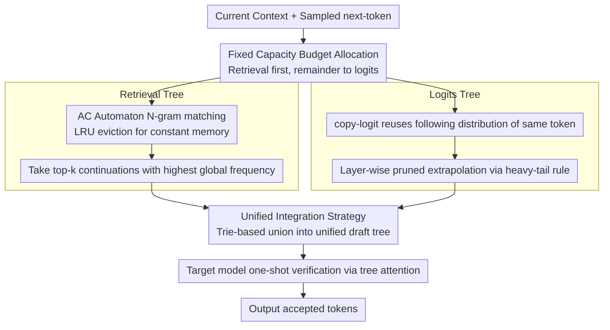

# RACER: Retrieval-Augmented Contextual Rapid Speculative Decoding

**Conference**: ACL 2026 Findings  
**arXiv**: [2604.14885](https://arxiv.org/abs/2604.14885)  
**Code**: [https://github.com/hkr04/RACER](https://github.com/hkr04/RACER)  
**Area**: Information Retrieval  
**Keywords**: Speculative Decoding, Retrieval-Augmentation, Training-free, Aho-Corasick Automaton, Inference Acceleration

## TL;DR

RACER proposes a training-free speculative decoding method that unifies retrieval-based exact pattern matching with logit-based future prediction. By constructing a Logits Tree via a copy-logit strategy and a Retrieval Tree via an LRU-evicted AC automaton, it achieves over 2x inference acceleration across multiple benchmarks.

## Background & Motivation

**Background**: LLM autoregressive decoding generates one token per step, causing inference latency to grow linearly with sequence length. Speculative Decoding is one of the most promising acceleration schemes, validating multiple tokens in parallel via a "guess-and-verify" strategy without sacrificing output quality.

**Limitations of Prior Work**: Existing training-free methods suffer from two types of issues: (1) Retrieval-based methods (e.g., PLD, REST) rely on exact token matching and fail completely when matching continuations do not exist in the context; (2) Logit-based methods (e.g., Token Recycling) lack structural guidance, resulting in narrow prediction ranges and suboptimal quality. These categories have distinct advantages but remain fragmented.

**Key Challenge**: Retrieval provides "seen information" (precise but sparse), while logits provide "unseen information" (flexible but lacking anchors). These are complementary, but existing methods fail to fuse them effectively.

**Goal**: Design a lightweight, plug-and-play, training-free speculative decoding method that unifies retrieval and logit signal sources.

**Key Insight**: The authors found that the copy-logit strategy (reusing logits from the most recent occurrence of the same token in context) yields higher acceptance rates and sharper distributions (rank-1 exceeding 50%) than the last-logit strategy, providing a foundation for building efficient logit draft trees.

**Core Idea**: Use an AC automaton to maintain n-gram patterns in context as structural retrieval anchors, and use copy-logit to construct a layer-wise pruned Logits Tree for flexible extrapolation. Both dynamically allocate a budget within a fixed capacity and merge into a unified draft tree via a trie.

## Method

### Overall Architecture

RACER integrates two complementary but fragmented training-free signals into a single draft tree: retrieval provides "seen information" (precise but sparse), while logits provide "unseen information" (flexible but lacking anchors). In each decoding step, it first uses an AC automaton to find matching n-gram patterns in the current context and takes retrieval candidates from the highest-frequency continuations. The remaining draft budget is assigned to the Logits Tree, which performs breadth-first extrapolation using copy-logit. Finally, these two trees are merged into a unified draft tree via a trie for one-shot verification by the target model using tree attention. Retrieval secures the "proximal repeating pattern" anchors, while logits perform flexible extrapolation guided by those anchors; both dynamically allocate budget under a fixed capacity.

### Key Designs

**1. Logits Tree: Distribution reuse via copy-logit with layer-wise heavy-tail pruning**

Token-by-token decoding is slow due to serial generation, and training-free logit methods (e.g., Token Recycling) can guess more tokens but lack structural guidance and have narrow prediction ranges. RACER's key observation is the copy-logit strategy: for the currently sampled next-token $x_t$, look back to find the most recent occurrence $x_i = x_t$ in the context and reuse its succeeding logits $\mathbf{z}_{i+1}$ to approximate $\mathbf{z}_{t+1}$. This assumes that "the same token has similar semantic continuation in similar contexts," which is significantly more accurate than reusing the last step's logits—experiments show copy-logit reaches a Mean Acceptance Token (MAT) of 1.87 (vs. 1.57 for last-logit), with over 50% rank-1 acceptance and sharper distributions.

Since acceptance rates decay rapidly with depth, RACER designs a decreasing breadth allocation for the draft tree: $b_{child(i,j)} = \max(1, \lfloor b_i / 2^{j+[i\neq 0]} \rfloor)$. The first layer is the widest, narrowing depth-wise to spend the limited budget on shallow nodes most likely to be accepted.

**2. Retrieval Tree: Online pattern retrieval with constant memory via LRU-evicted AC automaton**

Retrieval candidates require efficient extraction of repeating n-grams from a growing context. However, structures like suffix arrays or suffix automata expand linearly with context length and cannot discard obsolete states. RACER instead uses an Aho-Corasick automaton to maintain n-grams (max length 10) in the context, employing a maximum node capacity (10,000) with LRU eviction for the least recently used leaf nodes to fix memory at a constant level. During matching, all boundary nodes with depth $\geq 2$ are retrieved, and the top-k continuations with the highest global frequency from their subtrees are selected as candidates. Failure links are reconstructed lazily at the end of the prefill stage.

Choosing an AC automaton offers an additional benefit: its failure links naturally utilize "partial matches," enriching draft diversity—a feature difficult to provide cost-effectively with suffix structures.

**3. Unified Integration Strategy: Retrieval followed by logits under fixed capacity, merged via trie**

To coexist within the same draft budget, two types of signals require allocation rules. RACER priority-allocates to retrieval candidates (structurally reliable but sparse), leaving remaining capacity for breadth-first expansion in the Logits Tree. Finally, both are merged via a trie-based union into a unified draft tree for one-shot verification under tree attention.

This "retrieval-as-anchor, logits-as-extrapolator" sequence is deliberate: the sharp predictions from proximal repeats guide logit distributions, reducing cumulative error in speculative expansion. Thus, filling slots with retrieval before logits is more stable than parallel competition.

### Loss & Training

RACER is entirely training-free. Default hyperparameters: Logits Tree max breadth 8, Retrieval Tree max 10,000 nodes, n-gram length 10, draft capacity 64 per step; greedy decoding, batch size 1.

## Key Experimental Results

### Main Results

| Model | Method | Spec-Bench Speedup | HumanEval Speedup | MGSM-ZH Speedup | Avg Speedup |
|------|------|----------------|---------------|--------------|---------|
| Vicuna-7B | PLD | 1.50× | 1.40× | 2.27× | 1.87× |
| Vicuna-7B | LogitSpec | 1.77× | 1.66× | 2.67× | 2.03× |
| Vicuna-7B | Token Recycling | 2.06× | 2.17× | 2.30× | 2.18× |
| Vicuna-7B | **RACER** | **2.21×** | **2.29×** | **2.77×** | **2.42×** |
| Vicuna-33B | **RACER** | **2.20×** | **2.58×** | **2.77×** | **2.52×** |
| Qwen3-8B | EAGLE-3 | 2.14× | 2.44× | 0.86× | 1.81× |
| Qwen3-8B | **RACER** | **2.13×** | 2.24× | **2.26×** | **2.21×** |

### Ablation Study

| Configuration | Spec-Bench MAT | HumanEval MAT | Notes |
|------|---------------|---------------|------|
| RACER (Full) | 3.00 | 3.11 | Full integration of retrieval + logits |
| Logits Tree Only | ~2.76 | ~2.83 | No retrieval guidance, similar to Token Recycling |
| Retrieval Tree Only | ~1.82 | ~2.06 | No logit extrapolation, similar to REST |

### Key Findings

- RACER consistently outperforms all training-free methods, achieving average speedups of 2.42x-2.52x.
- Compared to EAGLE-3 (which requires an eagle-specific draft model), RACER has a slightly lower MAT but matches or exceeds actual speedup due to zero model overhead.
- EAGLE-3 fails on Chinese reasoning (MGSM-ZH) (speedup <1x), exposing the sensitivity of model-based methods to training data distribution, whereas RACER maintains stable acceleration.
- Copy-logit increases MAT by 0.3 over last-logit (1.87 vs 1.57), with a rank-1 acceptance rate over 50%.
- The method is insensitive to hyperparameters, demonstrating solid robustness.

## Highlights & Insights

- The copy-logit strategy is a clever observation—the distribution of succeeding logits for the same token at different positions exhibits high similarity. This "in-context logit reuse" concept is simple but effective, applicable to any autoregressive model.
- Replacing suffix arrays with an AC automaton is ingenious: failure links provide inherent pattern generalization, and LRU eviction ensures constant memory overhead. This structural choice is valuable for other online pattern matching scenarios.
- Positioning "retrieval as structural guidance rather than an independent generator"—retrieval signals do not just generate candidates but provide anchors and direction for logit prediction. This fusion philosophy is more elegant than a simple combination.

## Limitations & Future Work

- Evaluation is limited to batch size 1 and greedy decoding; large-batch and sampling scenarios remain to be verified.
- AC automaton node capacity (10K) and n-gram length (10) are fixed; adaptive adjustment might further enhance performance.
- Combinatorial potential with model-based methods is unexplored.
- Whether the advantage in non-English languages stems from retrieval-based language-agnosticism warrants deeper analysis.

## Related Work & Insights

- **vs Token Recycling**: TR expands the draft tree using only a top-k adjacency matrix without retrieval guidance. RACER makes logit expansion more precise through structural anchors provided by the AC automaton, accepting an average of 0.4 more tokens.
- **vs EAGLE-3**: EAGLE-3 requires additional draft model training; while it has a higher MAT, actual speedup isn't necessarily better. RACER's zero-training and zero-extra-memory advantages make it better for plug-and-play deployment.

## Rating

- Novelty: ⭐⭐⭐⭐ Unified perspective of retrieval + logits is novel; copy-logit and LRU-AC automaton designs are sophisticated.
- Experimental Thoroughness: ⭐⭐⭐⭐⭐ Covers multiple model scales (7B-33B), diverse tasks, and multiple languages, with thorough ablation and analysis.
- Writing Quality: ⭐⭐⭐⭐ Clear methodological descriptions and intuitive illustrations.
- Value: ⭐⭐⭐⭐ Provides a practical training-free inference acceleration scheme with high plug-and-play deployment value.

<!-- RELATED:START -->

## Related Papers

- [\[ACL 2026\] Speculative Verification: Exploiting Information Gain to Refine Speculative Decoding](speculative_verification_exploiting_information_gain_to_refine_speculative_decod.md)
- [\[ACL 2026\] Multi-Drafter Speculative Decoding with Alignment Feedback](multi-drafter_speculative_decoding_with_alignment_feedback.md)
- [\[ACL 2026\] TokenTiming: A Dynamic Alignment Method for Universal Speculative Decoding Model Pairs](tokentiming_a_dynamic_alignment_method_for_universal_speculative_decoding_model_.md)
- [\[NeurIPS 2025\] 3-Model Speculative Decoding (PyramidSD)](../../NeurIPS2025/llm_efficiency/3model_speculative_decoding.md)
- [\[ACL 2025\] SAM Decoding: Speculative Decoding via Suffix Automaton](../../ACL2025/llm_efficiency/sam_decoding_speculative_decoding_via_suffix_automaton.md)

<!-- RELATED:END -->
