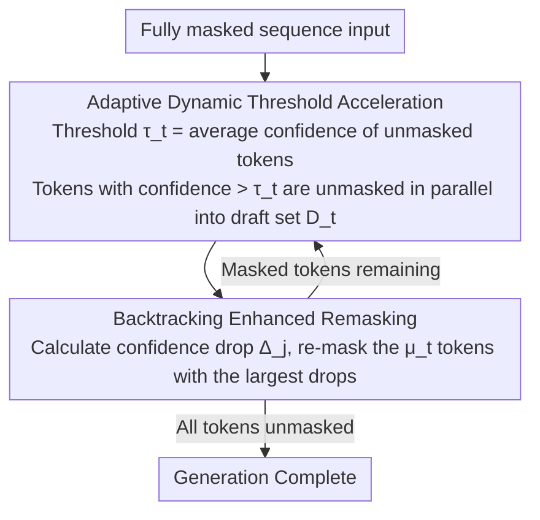

# Saber: Efficient Sampling with Adaptive Acceleration and Backtracking Enhanced Remasking for DLMs

**Conference**: ACL 2026  
**arXiv**: [2510.18165](https://arxiv.org/abs/2510.18165)  
**Code**: [GitHub](https://github.com/zhaoyMa/Saber)  
**Area**: LLM Efficiency  
**Keywords**: Diffusion Language Models, Adaptive Sampling, Backtracking Remasking, Code Generation Acceleration, Speed-Quality Trade-off

## TL;DR

This paper proposes Saber, a training-free sampling algorithm for Diffusion Language Models (DLMs). By utilizing adaptive acceleration (dynamically adjusting parallel decoding based on the established context) and backtracking-enhanced remasking (undoing tokens invalidated by new context), Saber achieves an average improvement of 1.9% in Pass@1 on code generation while providing an inference speedup of 251.4%.

## Background & Motivation

**Background**: DLMs (e.g., LLaDA, Dream) achieve parallel generation through iterative demasking, serving as a powerful alternative to autoregressive models. However, in tasks with strong structural constraints like code generation, reducing sampling steps often lead to a catastrophic drop in Pass@1 (sometimes exceeding 60%).

**Limitations of Prior Work**: (1) Static acceleration strategies (fixed token counts or confidence thresholds) are too conservative for simple stages and too aggressive for complex ones; (2) DLM decoding is irreversible—once a token is unmasked, it cannot be undone, causing early errors to be permanently locked and propagated.

**Key Challenge**: The speed advantage of parallel generation vs. quality collapse due to error propagation—both non-uniform difficulty and error accumulation must be addressed simultaneously.

**Goal**: Design a DLM sampling method that can adaptively adjust parallelism and allow for self-correction.

**Key Insight**: Two key observations—(1) generation difficulty decreases as context is established (confidence rises monotonically); (2) the confidence of previously generated tokens changes with new context (potentially shifting from high to low).

**Core Idea**: Adaptive threshold + Backtracking remasking—cautious early on (few unmaskings) and aggressive later (high parallelism), while allowing the withdrawal of "regretted" tokens.

## Method

### Overall Architecture

Saber does not modify the weights or architecture of the DLM. Instead, it transforms the standard "step-by-step demasking" sampling loop into a two-stage process with correction capabilities. In each step, it performs adaptive acceleration—dynamically determining how many new tokens can be unmasked in parallel based on the current context; this is followed by backtracking-enhanced remasking—checking if previously settled tokens are invalidated by the new context and re-masking the most suspicious ones. Through this iteration, the fully masked input sequence is filled under a "cautious start, aggressive finish, reversible decisions" rhythm, enjoying step compression from parallelism while avoiding permanent lock-in of early errors.

### Key Designs

**1. Adaptive Dynamic Threshold Acceleration: Shifting Parallelism with Context**

The weakness of static acceleration strategies lies in using a fixed token count or confidence threshold throughout the process, which is too aggressive when the context is sparse and too conservative near completion. Saber binds the threshold to the generation progress itself: the threshold at step $t$ is the average confidence of already unmasked tokens at their time of unmasking $\tau_t = \frac{1}{|\mathcal{U}_{t-1}|} \sum_{j \in \mathcal{U}_{t-1}} c_j^{\text{unmask}}$. Any masked tokens whose current confidence exceeds $\tau_t$ are included in the draft set $\mathcal{D}_t$ and unmasked together.

As generation difficulty monotonically decreases as context is built, the model's confidence rises, causing $\tau_t$ to increase naturally. In the early stages, the low mean results in a loose threshold but few tokens pass; in the later stages, even with a higher threshold, the generally higher confidence allows many tokens to pass, achieving aggressive parallelism. This "cautious → aggressive" gear-shifting is driven entirely by the model's own confidence signals.

**2. Backtracking Enhanced Remasking: Introducing Reversibility to Decoding**

Another flaw in traditional DLM sampling is irreversible decoding—once a token is unmasked, it is fixed, and an early error can pollute the context for all subsequent steps. Saber appends a backtracking phase after each acceleration step: for each unmasked token, it calculates its confidence drop relative to the previous step under the new context $\Delta_j = c_j^{t-1} - c_j^t$. The tokens with the most significant drops are re-masked, allowing for a better decision to be made later with more information.

The number of revoked tokens $\mu_t = \max(1, \lfloor |\mathcal{D}_t| / \mu \rfloor)$ is proportional to the aggressiveness of the current step—the more tokens unmasked in parallel, the higher the quota for verification and backtracking. This mechanism breaks the "irrevocable decision" constraint and effectively cuts the error propagation chain.

**3. Training-free Plug-and-Play: Modifying Sampling, Not Models**

All Saber logic occurs during the token selection and revocation phase of the sampling process; it does not touch model weights, change architecture, or require retraining. This choice makes it orthogonal to research focusing on "improving DLM training"—any existing DLM (LLaDA, Dream, etc.) can directly adopt Saber to gain speed and quality benefits without additional training costs.

### Loss & Training

Training-free method. Experiments were conducted on LLaDA-8B-Instruct with temperature 0 and a generation length of 256 tokens.

## Key Experimental Results

### Main Results

**Code Generation Pass@1 and Inference Speed**

| Method | HumanEval Pass@1 | MBPP Pass@1 | Avg Steps | Relative Speedup |
|------|----------------|------------|---------|---------|
| Confidence (Standard) | 43.29 | 42.86 | 256 | 1.0x |
| Fast-dLLM | 38.54 | 38.95 | ~80 | ~3.2x |
| Saber | **45.12** | **44.76** | ~72 | **~3.5x** |

### Ablation Study

| Configuration | HumanEval Pass@1 | Description |
|------|----------------|------|
| Saber (Full) | 45.12 | Complete model |
| w/o Backtracking | 42.68 | Quality drops without backtracking |
| w/o Adaptive | 43.89 | Speed drops without adaptive thresholding |
| Fixed Threshold | 40.12 | Static threshold performs the worst |

### Key Findings

- Saber simultaneously improves quality (+1.9% Pass@1) and speed (251.4% acceleration)—breaking the typical DLM speed-quality trade-off.
- The backtracking mechanism is the primary source of quality improvement—allowing the model to correct early errors prevents cascading failures.
- Adaptive acceleration is the primary driver of speedup—allowing massive parallel demasking in later stages.
- Saber is effective across different DLMs (LLaDA, Dream)—demonstrating model independence.

## Highlights & Insights

- The "cautious → aggressive" adaptive strategy is highly intuitive and effective—as the context becomes richer and the model more confident, more parallelism should be allowed.
- Backtracking remasking is a significant innovation in the DLM field—breaking the limitation of "irreversible decisions."
- The two strategies work in synergy—adaptive acceleration enables aggressive parallelism, while backtracking ensures that such aggressiveness does not lead to disaster.

## Limitations & Future Work

- Backtracking increases the computational overhead per step (requires re-evaluating the confidence of unmasked tokens).
- The hyperparameter $\mu$ (backtracking ratio) requires tuning.
- Validated only on code generation; the effectiveness for natural language generation remains unknown.
- DLMs overall still lag behind ARMs; Saber only narrows the gap.

## Related Work & Insights

- **vs Fast-dLLM**: Fast-dLLM uses fixed threshold acceleration; Saber is more precise with dynamic thresholds.
- **vs ReMDM**: ReMDM uses staged remasking; Saber's step-by-step backtracking is finer-grained.
- **vs ARM Speculative Decoding**: These solve different problems—ARM accelerates single-token generation, while Saber optimizes parallel demasking in DLMs.

## Rating

- Novelty: ⭐⭐⭐⭐ The combination of adaptive thresholding and backtracking is a first in the DLM field.
- Experimental Thoroughness: ⭐⭐⭐⭐⭐ 5 code benchmarks + multiple DLMs + detailed ablations.
- Writing Quality: ⭐⭐⭐⭐ Motivation analysis is clear, and the algorithm pseudocode is complete.
- Value: ⭐⭐⭐⭐ Significant advancement toward making DLMs practical.

<!-- RELATED:START -->

## Related Papers

- [\[ICML 2026\] TEAM: Temporal-Spatial Consistency Guided Expert Activation for MoE Diffusion Language Model Acceleration](../../ICML2026/llm_efficiency/team_temporal-spatial_consistency_guided_expert_activation_for_moe_diffusion_lan.md)
- [\[ACL 2026\] SpecBound: Adaptive Bounded Self-Speculation with Layer-wise Confidence Calibration](specbound_adaptive_bounded_self-speculation_with_layer-wise_confidence_calibrati.md)
- [\[ICML 2026\] dLLM-Cache: Accelerating Diffusion Large Language Models with Adaptive Caching](../../ICML2026/llm_efficiency/dllm-cache_accelerating_diffusion_large_language_models_with_adaptive_caching.md)
- [\[CVPR 2026\] ParallelVLM: Lossless Video-LLM Acceleration with Visual Alignment Aware Parallel Speculative Decoding](../../CVPR2026/llm_efficiency/parallelvlm_lossless_video-llm_acceleration_with_visual_alignment_aware_parallel.md)
- [\[ACL 2025\] DIVE into MoE: Diversity-Enhanced Reconstruction of Large Language Models from Dense into Mixture-of-Experts](../../ACL2025/llm_efficiency/dive_moe_reconstruction.md)

<!-- RELATED:END -->
