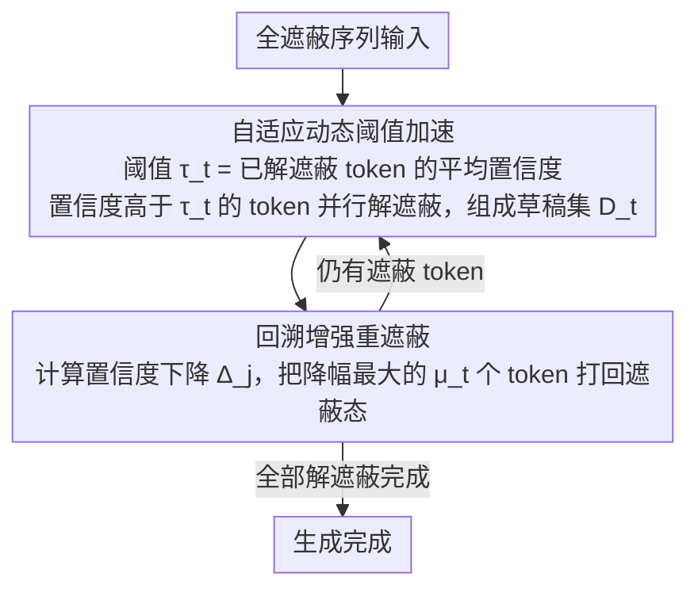

# Saber: Efficient Sampling with Adaptive Acceleration and Backtracking Enhanced Remasking for DLMs

**Conference**: ACL 2026  
**arXiv**: [2510.18165](https://arxiv.org/abs/2510.18165)  
**Code**: [GitHub](https://github.com/zhaoyMa/Saber)  
**Area**: LLM Efficiency  
**Keywords**: Diffusion Language Models, Adaptive Sampling, Backtracking Remasking, Code Generation Acceleration, Speed-Quality Trade-off

## TL;DR

This paper proposes Saber, a training-free sampling algorithm for Diffusion Language Models (DLMs). By utilizing adaptive acceleration (dynamically adjusting the volume of parallel decoding based on the established context) and backtracking-enhanced remasking (undoing tokens invalidated by new context), it achieves an average Pass@1 improvement of 1.9% while attaining a 251.4% inference speedup in code generation.

## Background & Motivation

**Background**: DLMs (such as LLaDA and Dream) achieve parallel generation through iterative demasking, serving as a potent alternative to autoregressive models. However, on tasks with strong structural constraints like code generation, reducing the number of sampling steps leads to a catastrophic drop in Pass@1 (sometimes exceeding 60%).

**Limitations of Prior Work**: (1) Static acceleration strategies (fixed token counts or confidence thresholds) are too conservative for simple stages and too aggressive for complex ones; (2) DLM decoding is irreversible—once a token is unmasked, it cannot be undone, meaning early errors are permanently locked and propagated.

**Key Challenge**: The speed advantage of parallel generation vs. the quality collapse caused by error propagation—addressing both non-uniform difficulty and error accumulation simultaneously.

**Goal**: To design a DLM sampling method that can adaptively adjust parallelism and allow for self-correction.

**Key Insight**: Two critical observations—(1) generation difficulty decreases as context is established (confidence rises monotonically); (2) the confidence of already generated tokens fluctuates with new context (potentially shifting from high to low).

**Core Idea**: Adaptive threshold + backtracking remasking—maintaining caution in early stages (low unmasking) and becoming aggressive in later stages (high parallelism), while allowing for the retraction of "regretted" tokens.

## Method

### Overall Architecture

Saber does not modify the weights or architecture of the DLM. Instead, it reconfigures the standard "step-by-step demasking" sampling loop into a two-stage process with reversible capabilities. In each step, it first performs adaptive acceleration—dynamically determining the number of new tokens to unmask in parallel based on the currently established context; it then performs backtracking remasking—re-evaluating whether previously fixed tokens are invalidated by the new context and remasking the most suspicious ones. Through this iterative process, the fully masked input sequence is gradually filled following a rhythm of "early caution, late aggression, and constant reversibility," thereby enjoying step compression from parallelism while preventing early errors from being permanently locked.

### Key Designs

**1. Adaptive Dynamic Threshold Acceleration: Letting parallelism upshift naturally with context**

The primary weakness of static acceleration strategies is the use of a fixed token count or confidence threshold throughout the process, which is too aggressive when context is sparse and too conservative when information is sufficient near completion. Saber binds the threshold to the generation progress itself: the threshold at step $t$ is the average confidence of already unmasked tokens at their time of unmasking $\tau_t = \frac{1}{|\mathcal{U}_{t-1}|} \sum_{j \in \mathcal{U}_{t-1}} c_j^{\text{unmask}}$. Any masked tokens with current confidence exceeding $\tau_t$ are included in the draft set $\mathcal{D}_t$ and unmasked.

Since generation difficulty decreases monotonically as context is built, model confidence rises accordingly, causing $\tau_t$ to increase naturally. In early stages, low mean confidence results in fewer tokens passing the threshold; in later stages, despite a higher threshold, the overall confidence improvement allows many tokens to pass, achieving aggressive parallelism. This transition from "caution to aggression" is driven entirely by the model's own confidence signals without manual scheduling.

**2. Backtracking Enhanced Remasking: Providing an undo button for irreversible decoding**

Another flaw in traditional DLM sampling is the irreversibility of decoding—once a token is unmasked, it is fixed, allowing early errors to pollute subsequent context. Saber appends a backtracking step after each acceleration: for every unmasked token, it calculates the confidence drop relative to the previous step in the new context $\Delta_j = c_j^{t-1} - c_j^t$. The tokens with the most severe drops are re-masked, to be re-decided later with more sufficient context.

The number of revoked tokens $\mu_t = \max(1, \lfloor |\mathcal{D}_t| / \mu \rfloor)$ is proportional to the aggressiveness of the current step—the more tokens unmasked in parallel, the higher the quota for verification and reversal. This mechanism breaks the "irrevocable decision" constraint and fundamentally interrupts the error propagation chain.

**3. Training-free Plug-and-play: Modifying sampling, not the model**

All logic in Saber occurs during the token selection and revocation phases of the sampling process, without touching model weights or architecture. This choice makes it orthogonal to research focusing on "improving DLM training"—any existing DLM (such as LLaDA or Dream) can directly adopt Saber to gain acceleration and quality benefits without additional training costs.

### Loss & Training

Training-free method. Experiments were conducted on LLaDA-8B-Instruct with temperature 0 and a generation length of 256 tokens.

## Key Experimental Results

### Main Results

**Code Generation Pass@1 and Inference Speed**

| Method | HumanEval Pass@1 | MBPP Pass@1 | Average Steps | Relative Speedup |
|------|----------------|------------|---------|---------|
| Confidence (Standard) | 43.29 | 42.86 | 256 | 1.0x |
| Fast-dLLM | 38.54 | 38.95 | ~80 | ~3.2x |
| Saber | **45.12** | **44.76** | ~72 | **~3.5x** |

### Ablation Study

| Configuration | HumanEval Pass@1 | Description |
|------|----------------|------|
| Saber (Full) | 45.12 | Full model |
| w/o Backtracking | 42.68 | Backtracking removed, quality decreases |
| w/o Adaptive | 43.89 | Adaptive acceleration removed, speed decreases |
| Fixed Threshold | 40.12 | Static threshold performs worst |

### Key Findings

- Saber simultaneously improves quality (+1.9% Pass@1) and speed (251.4% speedup), breaking the typical speed-quality trade-off in DLMs.
- The backtracking mechanism is the primary source of quality gain—allowing the model to correct early errors prevents cascading failures.
- Adaptive acceleration is the primary driver of speedup—allowing massive parallel unmasking in later stages.
- Saber is effective across different DLMs (LLaDA, Dream), demonstrating model-agnosticism.

## Highlights & Insights

- The "Caution → Aggression" adaptive strategy is highly intuitive and effective—as context grows richer, the model becomes more confident, justifying more parallelism.
- Backtracking remasking is a significant innovation in the DLM field, breaking the "decisions are final" limitation.
- The two strategies work in synergy—adaptive acceleration enables aggressive parallelism, while backtracking ensures that aggression does not lead to disaster.

## Limitations & Future Work

- Backtracking increases the computational overhead per step (requires re-evaluating the confidence of unmasked tokens).
- The hyperparameter $\mu$ (backtracking ratio) requires tuning.
- Validated only on code generation; effectiveness on natural language generation remains unknown.
- DLMs overall still lag behind ARMs; Saber merely narrows the gap.

## Related Work & Insights

- **vs Fast-dLLM**: Uses fixed threshold acceleration; Saber is more precise with dynamic thresholds.
- **vs ReMDM**: Uses phased remasking; Saber's step-by-step backtracking is finer-grained.
- **vs ARM Speculative Decoding**: Addresses different problems—ARM accelerates single-token generation, while Saber optimizes parallel demasking for DLMs.

## Rating

- Novelty: ⭐⭐⭐⭐ The combination of adaptive acceleration and backtracking is a first in the DLM field.
- Experimental Thoroughness: ⭐⭐⭐⭐⭐ Evaluated on 5 code benchmarks with multiple DLMs and detailed ablations.
- Writing Quality: ⭐⭐⭐⭐ Clear motivation analysis and complete algorithmic pseudocode.
- Value: ⭐⭐⭐⭐ Significantly advances the practical application of DLMs.

<!-- RELATED:START -->

## Related Papers

- [\[ICLR 2026\] Dynamic-dLLM: Dynamic Cache-Budget and Adaptive Parallel Decoding for Training-Free Acceleration of Diffusion LLM](../../ICLR2026/llm_efficiency/dynamic-dllm_dynamic_cache-budget_and_adaptive_parallel_decoding_for_training-fr.md)
- [\[ICLR 2026\] NI Sampling: Accelerating Discrete Diffusion Sampling by Token Order Optimization](../../ICLR2026/llm_efficiency/ni_sampling_accelerating_discrete_diffusion_sampling_by_token_order_optimization.md)
- [\[ICLR 2026\] DiffAdapt: Difficulty-Adaptive Reasoning for Token-Efficient LLM Inference](../../ICLR2026/llm_efficiency/diffadapt_difficulty-adaptive_reasoning_for_token-efficient_llm_inference.md)
- [\[ICLR 2026\] Householder-Diagonalized Linear Attention (HDLA): Utilizing Rank-Enhanced Decay Mechanism for Efficient Sequence Modeling](../../ICLR2026/llm_efficiency/householder-diagonalized_linear_attention_hdla_utilizing_enhanced_decay_mechanis.md)
- [\[ICLR 2026\] vAttention: Verified Sparse Attention via Sampling](../../ICLR2026/llm_efficiency/vattention_verified_sparse_attention_via_sampling.md)

<!-- RELATED:END -->
