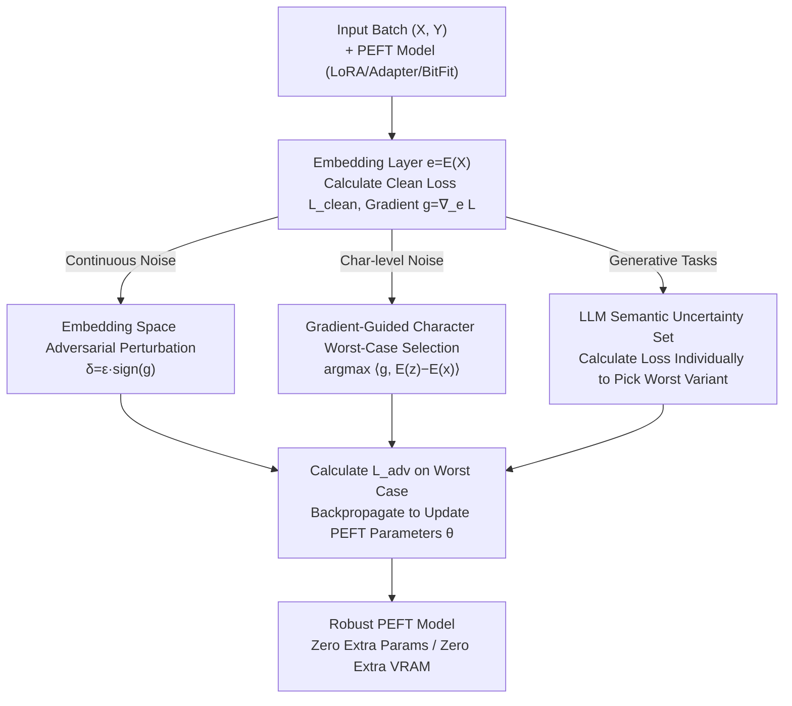

# Small Data, Big Noise: Adversarial Training for Robust Parameter-Efficient Fine-Tuning

**Conference**: ACL 2026  
**arXiv**: [2606.10610](https://arxiv.org/abs/2606.10610)  
**Code**: https://github.com/shaham-lab/SDBN  
**Area**: LLM Efficiency / Parameter-Efficient Fine-Tuning / Adversarial Training / Robust Optimization  
**Keywords**: PEFT, LoRA, Adversarial Training, Robust Optimization, Low-Resource, Character-level Noise

## TL;DR
This paper integrates adversarial training into Parameter-Efficient Fine-Tuning (PEFT). By employing a unified robust optimization framework, SDBN, it generates worst-case perturbations in the embedding space. Specific discrete uncertainty sets are introduced for "tokenization-breaking character noise" and "generative tasks." This approach significantly enhances the robustness of LoRA/Adapter/BitFit in low-data and noisy scenarios without adding trainable parameters or increasing VRAM.

## Background & Motivation
**Background**: PEFT (LoRA, Adapter, BitFit, etc.) has become the de facto standard for adapting large models to downstream tasks, as it trains only a tiny fraction of parameters, drastically reducing computational and storage overhead. In small-dataset scenarios, PEFT is often more efficient and less prone to overfitting than full fine-tuning.

**Limitations of Prior Work**: However, PEFT performance degrades significantly under two realistic conditions. First, **input noise**: real-world text is rife with perturbations like misspellings, inconsistent casing, and dialectal variations that preserve semantics but change surface forms. Figure 1 shows that when clean training samples for Banking77 drop below 1000, the accuracy of Adapter/BitFit/LoRA on test sets with word-substitution noise can drop by more than half. Second, **domain shift**: performance deteriorates when the deployment environment differs slightly in style or topic from the training distribution. These issues are especially severe in **low-resource** settings, where small corpora lack the diversity of corruptions, dialects, and domain-specific terminology, leaving the model with no exposure to such variations.

**Key Challenge**: The optimization objective of standard PEFT focuses solely on the average loss of clean training samples, failing to incorporate "worst-case inputs." Low-resource settings deprive the model of the natural linguistic diversity needed for basic robustness. Existing adversarial training methods (FreeLB, SMART, VAT) enhance robustness but assume full fine-tuning and remain unvalidated in PEFT settings. The few works combining adversarial training with LoRA (LoFT, AdvLoRA) primarily target vision tasks, leaving a gap in the NLP domain.

**Goal**: To make PEFT robust against word-level noise, tokenization-breaking character-level noise, and unknown domain shifts without compromising parameter efficiency, with maximal gains in low-resource scenarios.

**Key Insight**: Linguistic variations and domain shifts can be unified as points within an **uncertainty region** around clean samples. (PCA/t-SNE visualizations in Figure 2 demonstrate that uncertainty ellipses of word-level perturbations and source domain samples can cover target domain samples). Actively optimizing for the worst-case points in these regions during training enables generalization to unseen perturbations.

**Core Idea**: Replace standard empirical risk minimization in PEFT with **Robust Optimization (Adversarial Training)**. This involves using gradients to find worst-case perturbations in the embedding space to flatten the loss in the "worst-case neighborhood." For scenarios where linear gradient approximation fails (character-level tokenization breakage and generative rewriting), **discrete uncertainty sets** are utilized instead.

## Method

### Overall Architecture
SDBN (Small Data Big Noise) is essentially a **unified robust optimization framework** with the classic min–max objective function:

$$\min_{\theta}\ \mathbb{E}_{(x,y)\sim\mathcal{D}}\Big[\max_{x+\delta\in\mathcal{S}_x}\mathcal{L}(x+\delta;\theta,y)\Big].$$

The inner maximization finds the worst-case sample within the **uncertainty set $\mathcal{S}_x$** (the set of all sentences derived from sample $x$ via small, semantic-preserving edits) that maximizes the loss. The outer minimization updates only the small amount of trainable PEFT parameters $\theta$. The primary variable in this framework is the **definition of $\mathcal{S}_x$**. SDBN provides three instantiations: (i) continuous $\ell_\infty$ norm balls (default SDBN); (ii) discrete character-level edit sets that break tokenization (SDBN-h); and (iii) discrete semantic variant sets generated by LLMs (SDBN-p). All three share a cycle of "finding the worst-case sample → backpropagating gradients on the worst-case sample to update PEFT," differing only in the construction of the uncertainty set and selection rules.

### Key Designs

**1. Embedding Space Adversarial Perturbation: Wrapping Min-Max into PEFT Without Modifying Text Tokens**

Text consists of discrete symbols, preventing the direct application of continuous perturbations $x+\delta$ as in images. SDBN follows NLP adversarial training conventions by **injecting perturbations into the embedding layer** rather than the raw text. Let $E(\cdot)$ be the embedding extractor and $f(\cdot;\theta)$ be the network with PEFT. First, the clean loss $\mathcal{L}_{\text{clean}}=\mathcal{L}(f_\theta(\mathbf{e}),Y)$ and the gradient $\mathbf{g}=\nabla_{\mathbf{e}}\mathcal{L}_{\text{clean}}$ are calculated. Then, an FGSM-style sign perturbation $\delta=\epsilon\cdot\operatorname{sign}(\mathbf{g})$ is used to obtain the adversarial embedding $\mathbf{e}_{\text{adv}}=\mathbf{e}+\delta$. Finally, the **PEFT parameters are updated by backpropagating only on $\mathcal{L}_{\text{adv}}=\mathcal{L}(f_\theta(\mathbf{e}_{\text{adv}}),Y)$**. Experiments show optimal performance with perturbations from the $\ell_\infty$ norm ball at $\epsilon=10^{-4}$.

The authors provide a high-dimensional geometric interpretation for why "gradient-based adversarial signals" are more effective than "random noise" (e.g., NEFTune). The first-order approximation of loss change is $\mathcal{L}_{\theta,y}(x+\delta)\approx\mathcal{L}_{\theta,y}(x)+\langle\nabla\mathcal{L}_{\theta,y}(x),\delta\rangle$. In high-dimensional spaces, a random vector is nearly orthogonal to any fixed direction, meaning $\mathbb{E}[\langle\mathbf{g},\delta_{\text{random}}\rangle]\approx 0$. Random noise has almost no consistent impact on loss and acts only as a non-directional weak regularizer. In contrast, adversarial perturbations explicitly maximize $\langle\mathbf{g},\delta\rangle$, specifically selecting directions where the model is most sensitive, forcing the optimization to flatten the "steepest areas" and increasing the decision margin.

**2. SDBN-h: Gradient-Guided Discrete Character Worst-Case Selection for Tokenization-Breaking Noise**

Design 1 has a coverage blind spot: character edits like deleting a letter can change tokenization (splitting words or generating UNK tokens), pushing embeddings far from the clean region—way beyond a small-radius ball (Figure 2a shows character-level edits falling outside uncertainty ellipses). SDBN-h defines a **discrete uncertainty set** $\mathcal{S}_x$ as all single-character variants of sentence $x$. Since this set is finite and non-differentiable, Projected Gradient Descent cannot be used. Instead, the authors reuse the gradient $g=\nabla_e\mathcal{L}(f_\theta(e),y)$ from the clean embedding to select the worst variant via first-order inner product:

$$z^{*}=\arg\max_{z\in\mathcal{S}_x}\ \langle g,\ E(z)-E(x)\rangle.$$

Crucially, the **gradient is used only for "selection," not for "generating" the perturbation**—the perturbation itself is a discrete, real character edit. During training, each mini-batch is split: half undergoes Design 1's $\ell_\infty$ FGSM, and half undergoes $z^{*}$, while reusing the same gradient to minimize overhead. This makes the model robust to both continuous embedding perturbations and discrete character distortions.

**3. SDBN-p: LLM-Generated Discrete Semantic Uncertainty Set for Generative Tasks**

The authors found that continuous embedding perturbations are less effective for generative tasks because they rely on the Taylor approximation of the clean gradient, which requires small perturbations. Generative tasks require **large structural changes** like paraphrasing, colloquialisms, or style changes that exit the local linear region. SDBN-p uses an LLM (GPT-5.2 in experiments) to generate $k$ semantic-preserving adversarial variants (paraphrases, typos, style shifts) for each training sample $x$, forming the set $S_x^{\text{prompt}}=\{z_1,\dots,z_k\}$. Since gradient selection rules fail here, the framework **calculates the loss for each of the $k$ variants and selects the one with the maximum loss**:

$$z^{*}=\arg\max_{z\in S_x^{\text{prompt}}}\ \mathcal{L}(f(E(z);\theta),y).$$

This requires $k$ forward passes but enables robust optimization against true "worst-case semantic variants" that cover complex rewrites.

### Loss & Training
The training protocol consists of a 3-epoch standard warm-up followed by 10–20 epochs of SDBN training. All three variants use only $\mathcal{L}_{\text{adv}}$ to backpropagate to PEFT parameters. The process **adds no trainable parameters and no extra VRAM**; the only overhead is one additional forward and backward pass per mini-batch to compute $\mathbf{g}$. In low-resource settings (5%–100% data), models are tested with word-level and character-level noise.

## Key Experimental Results

### Main Results
Models used: BERT-base, DeBERTa-v3 for classification; LLaMA-3.2-1B, LLaMA-2-7B, Qwen-2.5-7B for generation. Datasets: 20Newsgroups, Banking77, TREC, IMDB, BLESS (classification); SQuAD, TweetQA (generation). PEFT methods: Adapter, BitFit, LoRA, QLoRA. Baselines: NEFTune, EDA, FreeLB, SMART.

Character-level noise on BLESS (DeBERTa-v3 + LoRA, 1000 clean training samples) — SDBN-h is the strongest against tokenization-breaking perturbations while maintaining clean accuracy:

| Method | Clean | Delete-char | Swap-char | Double-char |
|------|-------|-------------|-----------|-------------|
| Vanilla | 89.81 | 60.67 | 56.82 | 68.51 |
| SDBN | 89.83 | 60.84 | 57.22 | 68.66 |
| NEFTune | 89.08 | 61.19 | 57.22 | 69.42 |
| **SDBN-h** | 89.61 | **65.14** | **62.80** | **72.54** |

Generative tasks (SDBN-p trained with LLM variants):

| Task / Model | Metric | Noise | Vanilla | FreeLB | SDBN-p |
|-------------|------|------|---------|--------|--------|
| SQuAD / LLaMA-3.2-1B | EM | Clean | 58.92 | 57.00 | **59.84** |
| SQuAD / LLaMA-3.2-1B | EM | Swap-Word | 32.44 | 31.64 | **35.08** |
| SQuAD / LLaMA-3.2-1B | EM | Homophone | 47.28 | 44.04 | **52.20** |
| TweetQA / LLaMA-2-7B | F1 | Clean | 68.09 | 76.57 | **80.81** |
| TweetQA / LLaMA-2-7B | F1 | Delete-Char | 51.56 | 60.59 | **65.55** |
| TweetQA / LLaMA-2-7B | F1 | Delete-Word | 56.06 | 60.79 | **64.15** |

### Ablation Study
Absolute accuracy **Gain** when applying SDBN to different training methods (Banking77 low-resource subset, DeBERTa-v3):

| Method | Clean | Replace | Delete | Swap | Average Gain |
|----------|-------|---------|--------|------|----------|
| LoRA | +23.6 | +18.8 | +18.7 | +17.1 | **+19.6** |
| BitFit | +16.0 | +11.2 | +12.8 | +11.3 | +12.8 |
| Adapter | +13.3 | +9.4 | +9.8 | +6.2 | +9.7 |
| Full FT | +1.3 | +0.9 | +0.5 | +0.8 | +0.9 |

### Key Findings
- **Gains increase as data decreases**: SDBN does not compromise clean accuracy and often improves it; the smaller the training set, the more significant the relative gain (Figure 3), confirming that robust optimization is most valuable in low-resource settings.
- **Adversarial signals are more focused in PEFT's restricted parameter subspace**: SDBN yields an average gain of +19.6 for LoRA but only +0.9 for full fine-tuning. The authors suggest that full fine-tuning has too many parameters and overfits to adversarial samples, whereas PEFT’s smaller subspace concentrates adversarial signals more effectively.
- **Specialized uncertainty sets**: Continuous $\ell_\infty$ is suitable for word-level noise and domain shift; the discrete character set (SDBN-h) addresses tokenization distortions (+4-7 points), and the LLM semantic set (SDBN-p) outperforms FreeLB/SMART in generative tasks.

## Highlights & Insights
- **Clean decomposition of the "one framework, three sets" approach**: A single min-max objective unifies continuous perturbations, discrete character edits, and LLM semantic rewrites. The choice of gradient generation, gradient selection, or pure loss selection is determined by whether the Taylor approximation holds.
- **Geometric argument for adversarial vs. random noise**: The point about $\mathbb{E}[\langle g,\delta_{\text{random}}\rangle]\approx 0$ concisely explains why random noise (like NEFTune) acts only as weak regularization, providing a solid theoretical justification.
- **"Select, don't generate" for discrete sets**: Reusing clean gradients for worst-case selection in discrete sets bypasses the non-differentiable nature of text with near-zero extra cost—a strategy transferable to any scenario with finite candidate sets.
- **Asymmetric gains for PEFT**: The counterintuitive finding that adversarial training helps small parameter spaces much more than full ones provides empirical motivation for using "PEFT + Robust Optimization" in low-resource settings.

## Limitations & Future Work
- **Computational Overhead**: Each mini-batch requires extra forward and backward passes. While VRAM is unaffected, training time increases, which could be a bottleneck for ultra-large models or datasets. SDBN-p requires $k$ forward passes.
- **$\epsilon$ Sensitivity**: The perturbation radius is sensitive to different datasets. The paper provides empirical defaults ($\ell_\infty$, $\epsilon=10^{-4}$) but lacks an adaptive tuning mechanism.
- **Inherent Limitations**: SDBN-p relies on powerful external LLMs (GPT-5.2) for variant generation, introducing dependency on closed-source models and associated costs. Variant quality also dictates final robustness. The generalization of classification vs. generation variants to longer / more complex texts remains to be fully explored.

## Related Work & Insights
- **vs NEFTune**: Both add noise in the embedding space, but NEFTune uses uniform random noise to improve average performance, whereas SDBN uses gradient-guided worst-case perturbations. SDBN is significantly better in low-resource and noisy scenarios.
- **vs FreeLB / SMART / VAT**: These methods target full fine-tuning. SDBN is the first to systematically validate adversarial training's value for PEFT, finding even greater benefits in this context.
- **vs LoFT / AdvLoRA**: These works combine AT and LoRA for vision/vision-language tasks; SDBN fills the gap for NLP text tasks and extends the framework to character-level and LLM-semantic discrete sets.
- **vs HotFlip / EDA**: HotFlip uses gradient-guided edits for attacks; EDA is for random augmentation. SDBN-h incorporates edits into a robust training framework using gradients for selection to build defense robustness rather than attack tools.

## Rating
- Novelty: ⭐⭐⭐⭐ Systematically integrates AT into PEFT and adds discrete uncertainty sets for NLP.
- Experimental Thoroughness: ⭐⭐⭐⭐ Covers classification and generation across 5 models, 4 PEFT methods, and multiple noise types.
- Writing Quality: ⭐⭐⭐⭐ Unified framework with clear geometric arguments and logical justifications for variant choices.
- Value: ⭐⭐⭐⭐ Practical for real-world, noisy, low-resource NLP deployments with zero parameter overhead.

<!-- RELATED:START -->

## Related Papers

- [\[ICML 2026\] TuneAhead: Predicting Fine-tuning Performance Before Full Training Begins](../../ICML2026/llm_efficiency/tuneahead_predicting_fine-tuning_performance_before_full_training_begins.md)
- [\[ICLR 2026\] TokenSeek: Memory Efficient Fine Tuning via Instance-Aware Token Selection](../../ICLR2026/llm_efficiency/tokenseek_memory_efficient_fine_tuning_via_instance-aware_token_selection.md)
- [\[ACL 2026\] Tandem: Riding Together with Large and Small Language Models for Efficient Reasoning](tandem_riding_together_with_large_and_small_language_models_for_efficient_reason.md)
- [\[ICML 2026\] A Risk Decomposition Framework for Pre-Hoc Fine-Tuning Prediction](../../ICML2026/llm_efficiency/a_risk_decomposition_framework_for_pre-hoc_fine-tuning_prediction.md)
- [\[NeurIPS 2025\] Hierarchical Balance Packing: Towards Efficient Supervised Fine-tuning for Long-Context LLM](../../NeurIPS2025/llm_efficiency/hierarchical_balance_packing_towards_efficient_supervised_fine-tuning_for_long-c.md)

<!-- RELATED:END -->
