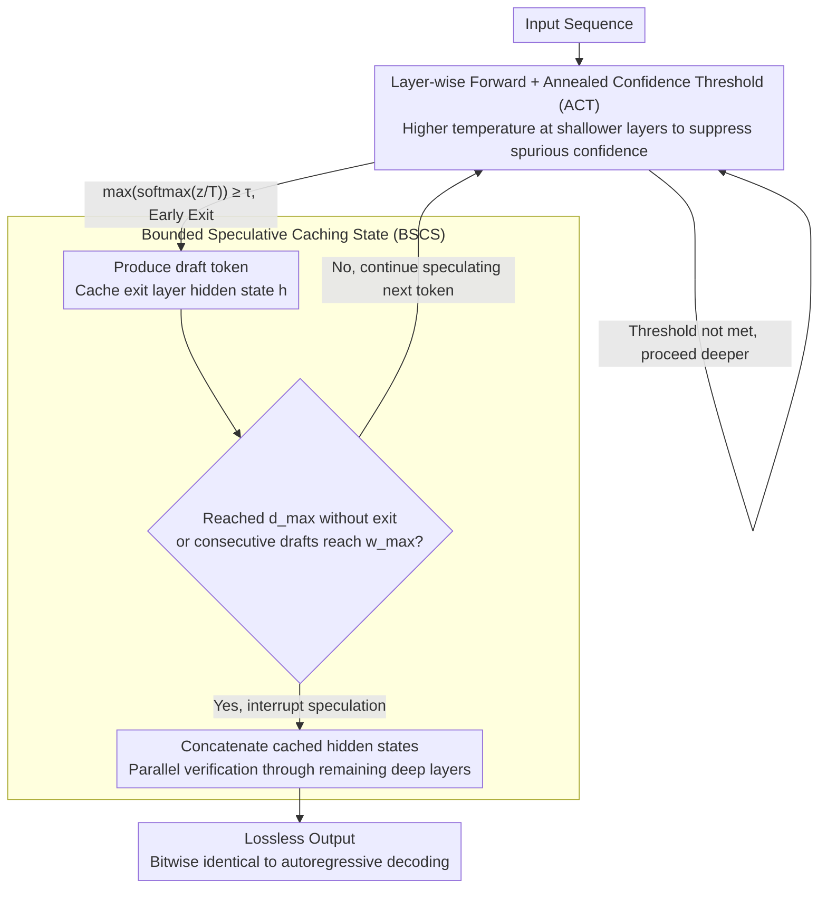

# SpecBound: Adaptive Bounded Self-Speculation with Layer-wise Confidence Calibration

**Conference**: ACL 2026 Findings  
**arXiv**: [2604.12247](https://arxiv.org/abs/2604.12247)  
**Code**: [GitHub](https://github.com/ictnlp/SpecBound)  
**Area**: LLM Efficiency  
**Keywords**: Speculative decoding, self-speculation, early exit mechanism, confidence calibration, inference acceleration

## TL;DR
The authors propose SpecBound, a self-speculative decoding framework that suppresses spurious high-confidence predictions in shallow layers through layer-wise temperature annealing. By designing a bounded speculation algorithm to adaptively control the depth and width of drafts, the framework achieves up to 2.33× inference acceleration while maintaining lossless output.

## Background & Motivation

**Background**: Speculative decoding is a crucial method for accelerating autoregressive LLM inference. Its core idea is "guess-then-verify": first quickly generate candidate tokens using a lightweight method, then verify them in parallel using the full model. Existing methods are divided into independent draft models (requiring extra training/storage) and self-speculation methods (utilizing the model itself).

**Limitations of Prior Work**: While "early exit" strategies in self-speculation do not require additional models, their acceleration effects are limited. Through visualization of intermediate layer computations, the authors identify two key issues: (1) Shallow layers often exhibit spurious high confidence for incorrect tokens, leading to erroneous early exit decisions; (2) A few difficult tokens require deep computation, but the batch verification mechanism forces all tokens through the deep layers, resulting in significant redundant computation.

**Key Challenge**: The pre-training loss function only supervises the final layer output, leaving shallow layers without direct optimization signals. Consequently, shallow layer confidence is unreliable. Simultaneously, decoding difficulty at the token level is highly heterogeneous—most tokens can be correctly predicted in shallow layers, but a few hard tokens bottleneck the entire sequence.

**Goal**: Design a self-speculation framework that can reliably determine early exit timing and adaptively handle heterogeneous difficulty for lossless acceleration.

**Key Insight**: Perform "cooling" calibration on shallow layer confidence (higher temperatures for shallower layers to suppress spurious confidence) and transition the speculation process from an unbounded token-by-token mode to a bounded block-level pipeline.

**Core Idea**: Annealed Confidence Threshold (ACT) to suppress shallow spurious confidence + Bounded Speculative Caching State (BSCS) to simultaneously restrict draft depth and width, interrupting speculation and triggering parallel verification immediately upon encountering difficult tokens.

## Method

### Overall Architecture

SpecBound is a self-speculation framework: it introduces no independent draft models but instead allows the base LLM to "turn in its work early" at intermediate layers to generate draft tokens during layer-wise forward passes. As the input sequence enters the model, each token is checked at intermediate layers for exit conditions—if satisfied, it exits early and produces a draft token; otherwise, it propagates to deeper layers. Once a token reaches the maximum depth $d_{\max}$ without exiting (marking it a difficult token), or when the cumulative draft length reaches $w_{\max}$, speculation is interrupted. All cached intermediate hidden states are then sent in parallel to the remaining deep layers for one-time verification. This cycle of "shallow fast guessing, stopping at difficulty, and batch verification" compresses the computation depth for most simple tokens while ensuring every token eventually passes through all layers, making the output bitwise identical to original autoregressive decoding.

### Key Designs

**1. Annealed Confidence Threshold (ACT): Cooling Spurious Confidence in Shallow Layers**

Visualization of intermediate computations revealed that shallow layers often exhibit spurious high confidence for incorrect tokens, triggering erroneous early exits. The root cause is that pre-training loss only supervises the final layer; shallow layers never receive direct optimization signals, making their confidence naturally unreliable. ACT counters this by applying temperature annealing based on layer depth: the temperature for layer $\ell$ is set as $T_\ell = 1 + \alpha(1 - \ell/L)$. Shallower layers have higher temperatures, flattening the softmax distribution, while deeper layers approach a temperature of 1 to maintain the original distribution. The exit condition is rewritten as $\max(\text{softmax}(\mathbf{z}^{(\ell)}/T_\ell)) \geq \tau$.

High temperatures systematically suppress exaggerated confidence in shallow layers, making it harder for incorrect tokens to cross the threshold, whereas deep layers remain largely unaffected. This is a near-zero-cost calibration—requiring only one scalar multiplication without modifying model parameters or the final layer's output distribution.

**2. Bounded Speculative Caching State (BSCS): Dual-Boundary Stop-Loss + Unified State Verification**

Token-level decoding difficulty is highly heterogeneous: most tokens can be guessed correctly in shallow layers, while a few difficult ones require deep computation. Batch verification forces all tokens to follow these difficult ones to the end, causing redundancy. BSCS sets two boundaries for speculation—maximum depth $d_{\max}$ and maximum width $w_{\max}$. If any token reaches $d_{\max}$ without exiting, it is flagged as a difficult token, and speculation is immediately interrupted. Similarly, a verification is forced when $w_{\max}$ consecutive tokens exit successfully, preventing error accumulation in long drafts. This transforms speculation into a "bounded block-level pipeline," preventing a single difficult token from stalling the entire sequence.

The "caching state" in BSCS handles the stagger caused by early exits. When token $t_i$ exits at layer $\ell$, its hidden state $\mathbf{h}_i^{(\ell)}$ is written to a cache. Upon verification, all cached states are concatenated and sent in parallel through the remaining deep layers. This "cache-align-complete" mechanism ensures every output token eventually undergoes complete layer computation, supporting SpecBound's guarantee of lossless output: simple tokens pass through shallow layers quickly, difficult tokens trigger timely stop-loss, and both types are reconciled in a single parallel verification.

### Loss & Training

The base model parameters are frozen; only lightweight LM heads are trained for intermediate layers (used for early exit decisions). Training used 68K ShareGPT multi-turn dialogue data with the AdamW optimizer, a learning rate of $3 \times 10^{-5}$, for 20 epochs, taking approximately 2 hours (on 4×H800).

## Key Experimental Results

### Main Results

| Model | Method | Avg CR | Overall Speedup |
|------|------|--------|---------|
| Vicuna-7B | Lookahead | - | 1.35× |
| Vicuna-7B | Medusa | - | 1.71× |
| Vicuna-7B | REST | - | 1.47× |
| Vicuna-7B | Kangaroo | - | 1.50× |
| Vicuna-7B | SpecBound (Ours) | 3.78+ | **2.15×** |
| Vicuna-13B | Medusa | - | 1.81× |
| Vicuna-13B | SpecBound (Ours) | 4.09+ | **2.16×** |
| CodeLlama-7B | Medusa | - | 1.70× |
| CodeLlama-7B | SpecBound (Ours) | 3.63+ | **1.93×** |
| CodeLlama-13B | SpecBound (Ours) | 3.49+ | **2.33×** |

### Ablation Study

| Configuration | Speedup | Description |
|------|---------|------|
| SpecBound (Full) | Best | Full combination of ACT + BSCS |
| w/o ACT | Significant drop | Increased spurious exits in shallow layers, lower draft quality |
| w/o Depth Boundary $d_{\max}$ | Drop | Difficult tokens waste deep layer computation |
| w/o Width Boundary $w_{\max}$ | Drop | Error accumulation in long drafts increases verification failure |

### Key Findings
- **Highest acceleration in translation tasks** (up to 2.94×), as translation contains many predictable functional tokens.
- **13B models benefit more than 7B models**: Even with similar CR, deeper models save more layers via early exit, resulting in higher speedup ratios.
- **Temperature annealing is highly effective**: Removing ACT significantly reduces speedup because spurious exits lead to massive draft rejections.
- The method supports temperature sampling ($T=0.3$) with only a slight decrease in acceleration.

## Highlights & Insights
- **Ingenious simplicity of temperature annealing**: Using a linear schedule $T_\ell = 1 + \alpha(1-\ell/L)$ effectively calibrates shallow confidence with near-zero overhead and no change to the final distribution.
- **Design philosophy of bounded speculation**: Operationalizing the principle "better to guess less than guess wrong"—decisively stopping at difficult tokens is more efficient than forced guessing. This concept can be generalized to other speculative computing scenarios.
- **Lossless guarantee**: By ensuring every token eventually passes through the full computation of all layers, the output remains perfectly consistent with original autoregressive decoding.

## Limitations & Future Work
- Requires training extra LM heads for each intermediate layer; although lightweight, this remains an additional overhead.
- Optimal values for $d_{\max}$ and $w_{\max}$ depend on task characteristics and require specific hyperparameter tuning.
- Has not been verified on larger models (e.g., 70B+), where shallow layer predictive capabilities might differ.
- Current temperature annealing uses a linear schedule; more complex non-linear or adaptive strategies have not been explored.

## Related Work & Insights
- **vs Medusa (Cai et al. 2023)**: Medusa uses extra heads for parallel prediction requiring training; SpecBound is more lightweight by utilizing the model's own intermediate layers. Medusa still holds advantages on certain models (e.g., CodeLlama-13B at 1.81× vs. Ours in some tasks).
- **vs AdaDecode (Wei et al. 2025)**: AdaDecode also uses intermediate early exits but lacks confidence calibration and bounded speculation. SpecBound achieves significantly higher speedup via ACT and BSCS.
- **vs Kangaroo (Liu et al. 2024)**: Kangaroo uses an independent small model for drafts; its acceleration ceiling is limited by the small model's quality. SpecBound’s self-speculation avoids model selection issues.

## Rating
- Novelty: ⭐⭐⭐⭐ The combination of temperature annealing calibration and bounded speculation is highly innovative.
- Experimental Thoroughness: ⭐⭐⭐⭐ Covered multiple models, tasks, full ablations, and parameter sensitivity.
- Writing Quality: ⭐⭐⭐⭐ Visualization-driven problem analysis is very intuitive.
- Value: ⭐⭐⭐⭐ A practical lossless acceleration solution with open-source code.

<!-- RELATED:START -->

## Related Papers

- [\[ICML 2026\] KnapSpec: Self-Speculative Decoding via Adaptive Layer Selection as a Knapsack Problem](../../ICML2026/llm_efficiency/knapspec_self-speculative_decoding_via_adaptive_layer_selection_as_a_knapsack_pr.md)
- [\[ICLR 2026\] ReST-KV: Robust KV Cache Eviction with Layer-wise Output Reconstruction and Spatial-Temporal Smoothing](../../ICLR2026/llm_efficiency/rest-kv_robust_kv_cache_eviction_with_layer-wise_output_reconstruction_and_spati.md)
- [\[ACL 2025\] CLaSp: In-Context Layer Skip for Self-Speculative Decoding](../../ACL2025/llm_efficiency/clasp_self_speculative_decoding.md)
- [\[ACL 2026\] RACER: Retrieval-Augmented Contextual Rapid Speculative Decoding](racer_retrieval-augmented_contextual_rapid_speculative_decoding.md)
- [\[ACL 2026\] Multi-Drafter Speculative Decoding with Alignment Feedback](multi-drafter_speculative_decoding_with_alignment_feedback.md)

<!-- RELATED:END -->
