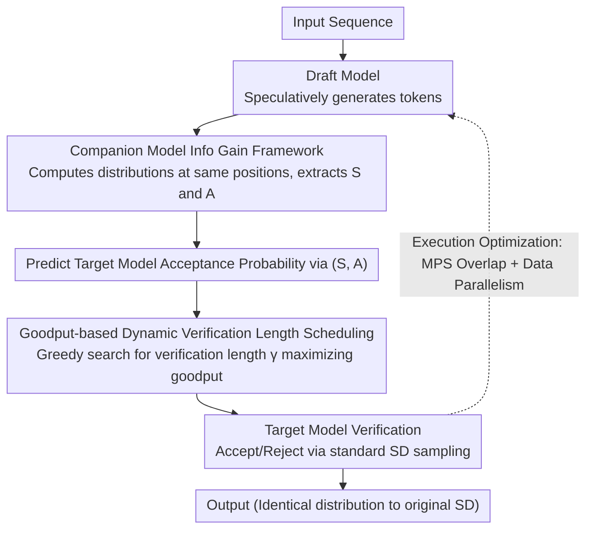

# Speculative Verification: Exploiting Information Gain to Refine Speculative Decoding

**Conference**: ACL 2026 Findings  
**arXiv**: [2509.24328](https://arxiv.org/abs/2509.24328)  
**Code**: None  
**Area**: LLM Efficiency  
**Keywords**: Speculative Decoding, Information Gain, Inference Acceleration, Companion Model, Dynamic Verification

## TL;DR

Proposes Speculative Verification (SV), which introduces a companion model of the same scale as the draft model to predict speculative accuracy by leveraging the similarity between draft and companion distributions. By dynamically adjusting verification length to maximize effective throughput, it achieves an average speedup of 1.4× and up to 1.9× compared to standard Speculative Decoding in large-batch inference scenarios.

## Background & Motivation

**Background**: Speculative Decoding (SD) is a mainstream method for accelerating LLM inference. It uses a small draft model to speculatively generate multiple tokens, which are then verified in parallel by a large target model. Effectiveness depends on speculative accuracy (the proportion of draft tokens accepted by the target model).

**Limitations of Prior Work**: Speculative accuracy fluctuates drastically and unpredictably between decoding steps. When accuracy is low, the verification overhead for rejected tokens offsets acceleration gains. In large-batch scenarios, SD gains are naturally diminished, and extra verification overhead can even lead to worse performance than direct target model decoding. Experiments show over 40% of verification computation is wasted on rejected tokens, and 48% of SD steps are slower than direct decoding.

**Key Challenge**: Accurately predicting speculative accuracy is a prerequisite for optimizing verification length. However, signals solely from the draft model (token probability, entropy, attention patterns, historical acceptance rates) cannot reliably predict this. Previous methods (SVIP, SmartSpec, etc.) degrade significantly under large-batch conditions.

**Goal**: Introduce an additional information source to reliably predict speculative accuracy and achieve dynamic, adaptive verification length optimization.

**Key Insight**: Information Theory Framework — obtaining positive information gain regarding target model acceptance probability by observing the distribution of a companion model.

**Core Idea**: Introduce a companion model of the same scale as the draft model. By comparing the distribution similarity $S$ between draft and companion models and the acceptance probability $A$ under the companion model, the target model's acceptance probability can be predicted. This prediction is used to dynamically select the optimal verification length to maximize goodput.

## Method

### Overall Architecture

SV embeds a lightweight companion model, identical in scale to the draft model, into the standard Speculative Decoding (SD) pipeline. Its purpose is to pre-judge whether each draft token will be accepted by the target model before verification, thereby dynamically determining the optimal verification length for the current round. After the draft model generates speculative tokens, the companion model computes its own distribution for the same positions to extract two metrics: distribution similarity $S$ and companion acceptance probability $A$. SV uses these to predict the acceptance probability of each draft token by the target model and employs a greedy search to pick a verification length that maximizes goodput (accepted tokens per unit of time). Actual verification is still performed by the target model following standard SD sampling rules, ensuring the output distribution remains identical to original SD—the companion model only "advises" and does not change final results.

### Key Designs

**1. Companion Model Information Gain Framework: Guessing Acceptance Probability with External Information**

Speculative accuracy is highly volatile and unpredictable. Signals from the draft model alone fail to provide reliable predictions—a root cause for the degradation of methods like SVIP and SmartSpec in large-batch settings. SV utilizes information theory, defining draft-companion distribution similarity $S = \sum_{i \in \text{vocab}} \min(P_d(t_i), P_c(t_i))$ and the draft token's acceptance probability under the companion model $A = \min(1, P_c(t_d)/P_d(t_d))$. Observing $S$ and $A$ reduces the uncertainty of target acceptance probability $X$ by approximately 34% and increases predicted acceptance rates by about 20%.

This framework has minimal requirements for model combinations; it only requires the draft-companion distributions to provide positive information gain rather than high correlation. Since modern LLMs often share training data (e.g., Wikipedia, C4), statistical independence is nearly impossible, making "positive information gain" a valid premise across 90 tested public model combinations.

**2. Goodput-based Dynamic Verification Length Scheduling: Finding the Inflection Point between GPU Underutilization and Wasted Compute**

A verification length that is too short underutilizes the target model's parallel GPU resources, while one that is too long wastes compute on tokens destined for rejection. SV quantifies this trade-off by optimizing goodput: for each candidate length $\gamma$, the expected accepted tokens $E(N|\gamma)$ is calculated using predicted conditional acceptance probabilities, then divided by the verification latency for that length.

Since goodput is a concave function of verification length, the optimal point can be efficiently approached through incremental search without exhaustive enumeration. This capability to dynamically crop verification subsets based on predicted acceptance avoids the drawbacks of fixed lengths in large-batch scenarios.

**3. Execution Optimization (Overlap + Data-Parallel): Minimizing Companion Model Overhead**

To prevent the additional model from becoming a bottleneck, SV employs two system-level optimizations. First, it uses NVIDIA MPS to overlap target model verification with the execution of the next round's draft and companion models. Second, it reuses idle GPU resources for data-parallel draft generation in multi-GPU tensor-parallel verification configurations. Ultimately, the companion model adds only 1.3–5.3% computational overhead and 2.8–8.1% memory overhead, ensuring it remains an "information provider" rather than a system burden.

### Loss & Training

Ours is an inference-time method requiring no additional training. Companion models can be obtained by fine-tuning the draft model, quantizing the draft model, or selecting a public model of similar scale. Experiments show all three methods provide positive information gain.

## Key Experimental Results

### Main Results

| Configuration | Batch Size | SD Throughput | SV Throughput | Speedup |
| :--- | :--- | :--- | :--- | :--- |
| Qwen2.5 32B | 32 | Baseline | — | Up to 1.61× |
| Llama 70B | 64 | Baseline | — | Up to 1.37× |
| Large Batch Avg | 32-64 | Baseline | — | Avg 1.4× |
| Best Case | — | Baseline | — | Up to 1.9× |

### Ablation Study

| Configuration | Key Metric | Description |
| :--- | :--- | :--- |
| Reduced Verification Cost | 18-45% TFLOPs Reduction | Companion model adds only 1.3-5.3% compute |
| Info Gain (S, A) | 30-40% Entropy Reduction | Positive gain across 90 D-C-T model groups |
| Token Acceptance Rate | Up to 4.5× Improvement | Especially significant in large batches |
| Prefill Overhead | ~10% lower than SD | Extra cost of the companion model |

### Key Findings
- SV outperforms both SD and target-only decoding across all experimental setups, with notable gains on difficult tasks (GSM8K, ChatGPT).
- Positive information gain was observed across 90 pairs of public draft-companion-target models, validating universality.
- SV is applicable to self-speculative models (improving LayerSkip by 30%, Eagle-3 improvements are moderate).
- Fairness analysis shows reasonable verification allocation within batches, avoiding request starvation.

## Highlights & Insights
- **Elegant Information Theory Perspective**: Formalizes speculative accuracy prediction as an information gain maximization problem with a solid theoretical foundation.
- **Minimal Assumptions**: Only requires positive information gain from the draft-companion distribution (not high correlation), making it widely applicable.
- **High Practicality**: Requires no extra training; companion models can be chosen from off-the-shelf public models with extremely low overhead.
- **Value in Large-Batch Scenarios**: Directly addresses the performance degradation of SD in practical large-batch deployments.

## Limitations & Future Work
- **Public Model Evaluation Only**: Possible model-specific biases.
- **Missing Variance/Confidence Intervals**: Covered ~10,000 decoding steps per evaluation, but lacks repeated statistical trials.
- **Prefill Overhead**: Prefill throughput is approximately 10% lower than standard SD.
- Future Work: Explore optimal selection strategies for companion models and integration with more inference frameworks (e.g., TensorRT-LLM).

## Related Work & Insights
- **vs SVIP/SmartSpec**: These predict based on draft model entropy or history, failing in large batches; SV overcomes this by introducing an external information source.
- **vs Staged SD**: Uses a medium model to verify draft outputs but is limited by the medium model's capacity; SV uses the companion model only for information, not direct verification.
- **vs Eagle-3**: Uses token tree parallel speculation, efficient for small batches but high overhead for large ones; SV is complementary to such methods.

## Rating
- Novelty: ⭐⭐⭐⭐⭐ The idea of introducing a companion model for info-gain-based accuracy prediction is highly innovative and theoretically elegant.
- Experimental Thoroughness: ⭐⭐⭐⭐⭐ 104 model combinations, 7 tasks, multiple batch sizes, covering SOTA comparisons and multi-dimensional ablations.
- Writing Quality: ⭐⭐⭐⭐ Structure is clear, though technical density is high and some derivations require careful reading.
- Value: ⭐⭐⭐⭐⭐ Addresses a core bottleneck of SD in real-world deployment with high practicality.

<!-- RELATED:START -->

## Related Papers

- [\[ACL 2026\] Multi-Drafter Speculative Decoding with Alignment Feedback](multi-drafter_speculative_decoding_with_alignment_feedback.md)
- [\[ACL 2026\] RACER: Retrieval-Augmented Contextual Rapid Speculative Decoding](racer_retrieval-augmented_contextual_rapid_speculative_decoding.md)
- [\[ACL 2026\] TokenTiming: A Dynamic Alignment Method for Universal Speculative Decoding Model Pairs](tokentiming_a_dynamic_alignment_method_for_universal_speculative_decoding_model_.md)
- [\[NeurIPS 2025\] 3-Model Speculative Decoding (PyramidSD)](../../NeurIPS2025/llm_efficiency/3model_speculative_decoding.md)
- [\[ACL 2025\] SAM Decoding: Speculative Decoding via Suffix Automaton](../../ACL2025/llm_efficiency/sam_decoding_speculative_decoding_via_suffix_automaton.md)

<!-- RELATED:END -->
