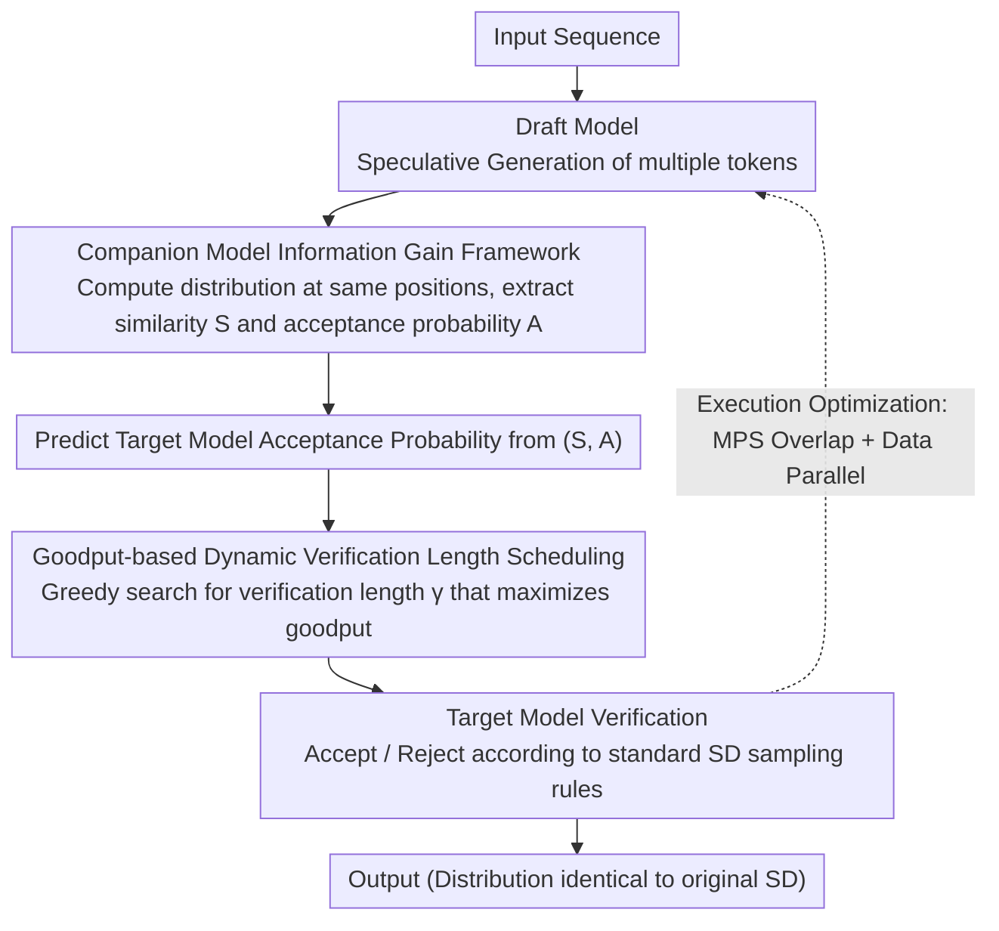

# Speculative Verification: Exploiting Information Gain to Refine Speculative Decoding

**Conference**: ACL 2026 Findings  
**arXiv**: [2509.24328](https://arxiv.org/abs/2509.24328)  
**Code**: None  
**Area**: LLM Efficiency  
**Keywords**: Speculative Decoding, Information Gain, Inference Acceleration, Companion Model, Dynamic Verification

## TL;DR

Ours proposes Speculative Verification (SV), which introduces a companion model of the same scale as the draft model. By leveraging the similarity between draft and companion distributions to predict speculative accuracy, it dynamically adjusts the verification length to maximize effective throughput. This method achieves an average speedup of 1.4× and up to 1.9× compared to standard speculative decoding in large-batch inference scenarios.

## Background & Motivation

**Background**: Speculative Decoding (SD) is a mainstream method for accelerating LLM inference. It involves a small draft model predicting multiple tokens, which are then verified in parallel by a large target model. Performance depends heavily on speculative accuracy (the ratio of draft tokens accepted by the target model).

**Limitations of Prior Work**: Speculative accuracy fluctuates violently and unpredictably between decoding steps. When accuracy is low, the overhead of verifying rejected tokens offsets acceleration gains. In large-batch scenarios, the benefits of SD are inherently reduced, and additional verification overhead can even result in performance worse than direct target model decoding. Experiments reveal over 40% of verification computation is wasted on rejected tokens, and 48% of SD steps are slower than direct decoding.

**Key Challenge**: Accurate prediction of speculative accuracy is the prerequisite for optimizing verification length. However, signals from the draft model alone (token probability, entropy, attention patterns, historical acceptance rates) cannot reliably predict acceptance. Previous methods (SVIP, SmartSpec, etc.) degrade sharply under large-batch settings.

**Goal**: Introduce an additional information source to reliably predict speculative accuracy and achieve dynamic, adaptive verification length optimization.

**Key Insight**: Information theory framework—obtaining positive information gain regarding target model acceptance probability by observing the companion model's distribution.

**Core Idea**: Introduce a companion model of the same scale as the draft model. By comparing the draft-companion distribution similarity $S$ and the acceptance probability under the companion model $A$, the target model's acceptance probability is predicted. This allows for dynamically selecting the optimal verification length to maximize goodput.

## Method

### Overall Architecture

SV embeds a lightweight companion model, equivalent in scale to the draft model, into the standard Speculative Decoding (SD) pipeline. Its purpose is to predict whether each draft token will be accepted by the target before verification occurs, thereby dynamically deciding the verification length for the current iteration. After the draft model generates speculative tokens as usual, the companion model computes its own distribution for the same positions to extract two metrics: distribution similarity $S$ and companion acceptance probability $A$. SV uses these to predict the acceptance probability of each draft token by the target model. A greedy search then selects the verification length that maximizes goodput (the number of accepted tokens per unit of time). Actual verification is still executed by the target model following standard SD sampling rules, ensuring the output distribution remains identical to original SD—the companion model only serves to "advise" and does not alter the final results.

### Key Designs

**1. Companion Model Information Gain Framework: Using external information to predict acceptance probability**

Speculative accuracy fluctuates wildly and unpredictably. Signals from the draft model itself (token probability, entropy, attention, history) are insufficient for reliable prediction—the root cause for the degradation of methods like SVIP and SmartSpec in large batches. SV approaches this via information theory: defining draft-companion distribution similarity $S = \sum_{i \in \text{vocab}} \min(P_d(t_i), P_c(t_i))$ and the acceptance probability of a draft token under the companion model $A = \min(1, P_c(t_d)/P_d(t_d))$. Observing $S$ and $A$ reduces uncertainty regarding the target acceptance probability $X$ by approximately 34% and improves the acceptance rate by about 20%. 

This framework has minimal requirements for model combinations—it only requires the draft-companion distribution to provide positive information gain, rather than requiring high correlation. Since modern LLMs typically share training corpora (e.g., Wikipedia, C4), statistical independence is nearly impossible, making the "positive information gain" premise hold across all 90 tested public model combinations.

**2. Goodput-based Dynamic Verification Length Scheduling: Finding the pivot between GPU idle time and wasted computation**

A verification length that is too short leaves target model GPU resources underutilized, while one that is too long wastes computation on tokens destined for rejection. SV quantifies this trade-off as goodput optimization: for each candidate verification length $\gamma$, the expected number of accepted tokens $E(N|\gamma)$ is calculated using predicted conditional acceptance probabilities, then divided by the corresponding verification latency. The $\gamma$ that maximizes goodput is selected.

Since goodput is a concave function of verification length, the optimal point can be efficiently reached via incremental search without enumerating all lengths. This ability to "dynamically prune the verification subset based on predicted acceptance probability" allows SV to shorten verification during low-accuracy steps and lengthen it during high-accuracy steps, avoiding the performance penalties of fixed lengths in large-batch scenarios.

**3. Execution Optimization (Overlap + Data-Parallel): Making companion model overhead negligible**

To prevent the second model from becoming a bottleneck, SV employs two system-level optimizations. First, it utilizes NVIDIA MPS to overlap the target model's verification with the next round's draft/companion model execution in time. Second, it reuses idle GPU resources in multi-GPU tensor-parallel verification configurations to perform data-parallel draft generation. Ultimately, the companion model introduces only 1.3–5.3% extra computational overhead and 2.8–8.1% memory overhead, ensuring it remains an "information provider" rather than a system burden.

### Loss & Training

SV is an inference-time method and requires no additional training. Companion models can be obtained by: fine-tuning the draft model, quantizing the draft model, or directly selecting public models of similar scale. Experiments show all three methods provide positive information gain.

## Key Experimental Results

### Main Results

| Configuration | Batch Size | SD Throughput | SV Throughput | Gain |
| :--- | :--- | :--- | :--- | :--- |
| Qwen2.5 32B | 32 | Baseline | — | Up to 1.61× |
| Llama 70B | 64 | Baseline | — | Up to 1.37× |
| Large Batch Avg | 32-64 | Baseline | — | Avg 1.4× |
| Best Case | — | Baseline | — | Up to 1.9× |

### Ablation Study

| Configuration | Key Metric | Description |
| :--- | :--- | :--- |
| Verification Cost Reduction | 18-45% TFLOPs reduction | Companion model only adds 1.3-5.3% computation |
| Information Gain (S,A) | 30-40% Entropy reduction | Positive gain across 90 D-C-T model groups |
| Token Acceptance Rate | Up to 4.5× improvement | Particularly significant in large batches |
| Prefill Overhead | ~10% lower than SD | Extra cost of the companion model |

### Key Findings
- SV outperforms both SD and target-only decoding across all experimental settings, with particularly prominent results on hard tasks (GSM8K, ChatGPT).
- Positive information gain was observed across 90 combinations of public draft-companion-target models, verifying the universality of the method.
- SV is applicable to self-speculative models (improving LayerSkip by 30% and providing moderate gains for Eagle-3).
- Fairness analysis indicates that verification allocation among queries within a batch is reasonable, with no starvation issues.

## Highlights & Insights
- **Elegant Information Theory Perspective**: Formalizing speculative accuracy prediction as an information gain maximization problem provides a solid theoretical foundation.
- **Minimal Assumptions**: Requires only that the draft-companion distribution provides positive information gain (not high correlation), making the method widely applicable.
- **High Practicality**: Requires no extra training; companion models can be selected from existing public models with minimal overhead.
- **Value in Large-Batch Scenarios**: Directly addresses the performance degradation of SD in large-batch deployments, which is a critical bottleneck in real-world applications.

## Limitations & Future Work
- **Public Model Evaluation Only**: Potential for model-specific biases.
- **Reporting of Variance/Confidence Intervals**: While each evaluation covers approximately 10,000 decoding steps, statistical reporting of repeated experiments is lacking.
- **Prefill Stage Overhead**: Prefill throughput is approximately 10% lower than standard SD.
- **Future Directions**: Exploring optimal selection strategies for companion models and integration with more inference frameworks (e.g., TensorRT-LLM).

## Related Work & Insights
- **vs SVIP/SmartSpec**: These rely on draft model entropy or historical acceptance rates, which fail in large batches; SV overcomes this by introducing an external information source.
- **vs Staged SD**: Uses a medium-sized model to verify draft outputs directly, which is limited by the medium model's capability; SV uses the companion model only for information, not direct verification.
- **vs Eagle-3**: Uses token trees for parallel speculation; efficient for small batches but high overhead for large batches. SV is complementary to such approaches.

## Rating
- Novelty: ⭐⭐⭐⭐⭐ The idea of introducing a companion model + information gain for accuracy prediction is highly innovative and theoretically elegant.
- Experimental Thoroughness: ⭐⭐⭐⭐⭐ Covers 104 model combinations, 7 tasks, and various batch sizes, including SOTA comparisons and multi-dimensional ablations.
- Writing Quality: ⭐⭐⭐⭐ Clear structure, though technically dense; some derivations require careful reading.
- Value: ⭐⭐⭐⭐⭐ Extremely practical, solving a core bottleneck for SD in production deployments.

<!-- RELATED:START -->

## Related Papers

- [\[ICML 2026\] VIA-SD: Verification via Intra-Model Routing for Speculative Decoding](../../ICML2026/llm_efficiency/via-sd_verification_via_intra-model_routing_for_speculative_decoding.md)
- [\[ACL 2026\] Multi-Drafter Speculative Decoding with Alignment Feedback](multi-drafter_speculative_decoding_with_alignment_feedback.md)
- [\[ACL 2026\] RACER: Retrieval-Augmented Contextual Rapid Speculative Decoding](racer_retrieval-augmented_contextual_rapid_speculative_decoding.md)
- [\[ICLR 2026\] Speculative Speculative Decoding](../../ICLR2026/llm_efficiency/speculative_speculative_decoding.md)
- [\[ACL 2026\] TokenTiming: A Dynamic Alignment Method for Universal Speculative Decoding Model Pairs](tokentiming_a_dynamic_alignment_method_for_universal_speculative_decoding_model_.md)

<!-- RELATED:END -->
