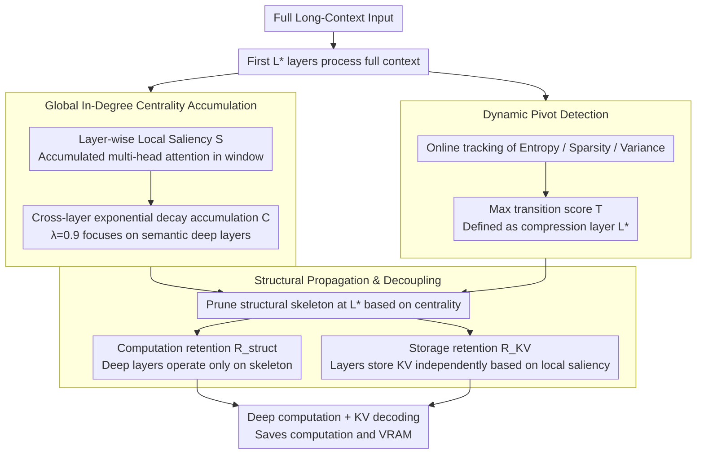

# StructKV: Preserving the Structural Skeleton for Scalable Long-Context Inference

**Conference**: ACL 2026 Findings  
**arXiv**: [2604.06746](https://arxiv.org/abs/2604.06746)  
**Code**: None  
**Area**: Model Efficiency / KV Cache Compression  
**Keywords**: KV Cache Compression, Long-Context Inference, Global In-Degree Centrality, Dynamic Pivot Detection, Structural Propagation

## TL;DR

This paper proposes StructKV, a structure-aware KV Cache compression framework. It identifies global information hubs through cross-layer accumulated attention patterns (Global In-Degree Centrality), adaptively locates the optimal compression layer via Dynamic Pivot Detection, and separates computation from storage budgets using Structural Propagation & Decoupling. On LongBench and RULER, it achieves near full-context performance with 60% prefill + 10% KV retention.

## Background & Motivation

**Background**: LLM context windows have expanded to over a million tokens, but inference efficiency faces dual bottlenecks: $O(N^2)$ attention computation complexity during the prefill phase and linear memory growth of KV cache during the decoding phase. Existing methods usually address only one of these stages.

**Limitations of Prior Work**: (1) Decoding-only methods (StreamingLLM, SnapKV) compress KV cache without reducing prefill computation; (2) Prefill-aware methods (GemFilter, FastKV) rely on local saliency from single-layer attention snapshots to select tokens, but some tokens may be temporarily "dormant" in a selected layer while possessing critical global structural importance; (3) FastKV uses a fixed pruning layer (e.g., Layer 15), a hyperparameter that is not universal across different model architectures or depths.

**Key Challenge**: Local saliency (single-layer snapshot) $\neq$ structural importance (cross-layer semantic role). A token might have low attention in a specific layer but act as an information hub across the network depth. Once discarded by local snapshot methods, this information is lost permanently.

**Goal**: Design a structure-aware compression framework to identify the "structural skeleton" of the context, ensuring tokens are preserved even if they are not locally salient.

**Key Insight**: The true importance of a token is defined by its cumulative contribution throughout the network depth—which can be formalized using in-degree centrality from graph theory.

**Core Idea**: Cross-layer accumulated attention scores form the Global In-Degree Centrality. Information theory metrics are used to adaptively detect the "phase transition" layer where attention stabilizes as the compression point. Computation and storage retention rates are decoupled to optimize prefill speed and decoding memory independently.

## Method

### Overall Architecture

StructKV aims to dismantle both bottlenecks of long-context inference: $O(N^2)$ prefill attention and linearly increasing KV cache in decoding. It processes the full context normally for the first $L^*$ layers, accumulating "Global In-Degree Centrality" for each token. When an automated detector identifies an attention "phase transition," it prunes the context into a compact "structural skeleton" at the optimal layer $L^*$, decoupling computation and storage budgets into two independent knobs. Subsequent deep layers operate only on this skeleton, saving both computation and VRAM without losing global pivot tokens.

### Key Designs

**1. Global In-Degree Centrality Accumulation: Using cross-layer contribution instead of single-layer snapshots.**

Existing prefill-aware methods (e.g., GemFilter, FastKV) select tokens based on a single-layer attention snapshot. However, some tokens might be "dormant" in that specific layer despite acting as information hubs across the network. StructKV formalizes this as in-degree centrality: it calculates local saliency $\mathcal{S}_j^{(l)} = \sum_{g=1}^{G}\left(\frac{1}{w}\sum_{t=N-w}^{N}\sum_{h\in\mathcal{H}_g} a_{t,j}^{(l,h)}\right)$ (the accumulated multi-head attention directed toward token $j$ within a window) for each layer $l$, then performs exponential decay accumulation: $\mathcal{C}_j = \sum_{l=0}^{L^*}\lambda^{(L^*-l)}\cdot\mathcal{S}_j^{(l)}$. The decay factor $\lambda=0.9$ ensures layers closer to $L^*$ carry more weight. Thus, a token consistently pointed to in earlier layers is preserved in the skeleton even if it is temporarily silent in a specific layer.

**2. Dynamic Pivot Detection: Letting the model decide the compression layer.**

A fixed compression layer is a non-universal hyperparameter—FastKV fixes it at Layer 15, but experiments show the optimal layer shifts with model depth (Layer 12 for Qwen-2.5-7B, Layer 28 for 32B). StructKV tracks three signals reflecting the transition "from broad exploration to focused extraction": attention entropy $\mathcal{H}_l$ (distribution uncertainty), sparsity $\rho_l$ (top-k cumulative probability mass), and variance $\mathcal{V}_l$ (discriminability). Their normalized gradients are weighted into a transition score $\mathcal{T}_l = w_1\cdot\bar{\nabla}(-\mathcal{H}_l) + w_2\cdot\bar{\nabla}(\rho_l) + w_3\cdot\bar{\nabla}(\mathcal{V}_l)$. The point of the most intense phase transition is selected as the compression point $L^* = \arg\max_l \mathcal{T}_l + 1$. This allows the compression timing to be automatically discovered rather than manually tuned.

**3. Structural Propagation & Decoupling: Separating "computational speed" and "storage reduction" into two knobs.**

In coupled settings, using the same retention rate for both computation and storage can cause performance to collapse (a 10% retention rate drops the score to 45.3). StructKV observes that these two aspects should not share a budget. The computation retention rate $R_{struct}$ determines which tokens the deep layers operate on, while the storage retention rate $R_{KV}$ determines which tokens are saved in the KV cache. At $L^*$, the structural skeleton is selected via global centrality: $\mathcal{I}_{struct} = \text{top-k}(\mathcal{C}, N\cdot R_{struct})\cup\mathcal{I}_{win}$. Meanwhile, the KV cache is independently selected based on layer-wise local saliency: $\mathcal{I}_{KV}^{(l)} = \text{top-k}(\mathcal{S}^{(l)}, N\cdot R_{KV})\cup\mathcal{I}_{win}$. By allowing $R_{struct}$ to be larger than $R_{KV}$ (e.g., 20% vs 10%), +13.8 points are recovered with negligible additions to VRAM.

The entire process is training-free and active during inference. Default parameters: window $w=8$, decay $\lambda=0.9$, transition weights $\{w_1, w_2, w_3\}=\{0.2, 0.3, 0.5\}$, $R_{struct}=20\%$, $R_{KV}=10\%$.

## Key Experimental Results

### Main Results

**LongBench (LLaMA-3.1-8B-Instruct, Average of 16 sub-tasks)**

| Method | Prefill | KV | Avg Score |
|------|---------|-----|-------|
| Full-context | 100% | 100% | 49.33 |
| StreamingLLM | 100% | 10% | 41.59 |
| SnapKV | 100% | 10% | 46.92 |
| GemFilter | 60% | 10% | 40.40 |
| FastKV | 60% | 10% | 47.59 |
| **StructKV** | **60%** | **10%** | **48.61** |
| **StructKV** | **60%** | **20%** | **48.97** |

**RULER (LLaMA-3.1-8B-Instruct, Retrieval Benchmark)**

| Method | 8K | 16K | 32K | 64K | 128K | Avg |
|------|-----|------|------|------|-------|------|
| Full-context | 90.1 | 95.0 | 83.4 | 85.5 | 76.3 | 86.0 |
| SnapKV | 75.6 | 76.8 | 72.9 | 75.0 | 67.7 | 73.6 |
| FastKV | 77.8 | 77.3 | 77.2 | 77.4 | 68.2 | 75.6 |
| **StructKV** | **81.3** | **82.5** | **81.8** | **81.5** | **73.6** | **80.1** |

### Ablation Study

**Sensitivity of decay factor $\lambda$ (LongBench, 10% KV)**

| $\lambda$ | Avg Score | Change |
|-----------|-------|------|
| 0.50 | 47.41 | -1.20 |
| 0.80 | 48.35 | -0.26 |
| **0.90** | **48.61** | **Ref** |
| 0.95 | 48.42 | -0.19 |
| 1.00 | 48.03 | -0.58 |

### Key Findings

- StructKV significantly recovers performance losses seen in FastKV at 128K context (73.6 vs 68.2), validating the effectiveness of global accumulation against "dormant token loss."
- Dynamic pivot layers adapt across model architectures (Qwen-7B: L12, 14B: ~L20, 32B: L28), eliminating the need for manual tuning.
- Decoupling strategy is critical: $R_{struct}=20\%, R_{KV}=10\%$ yields a +13.8 point improvement over a coupled 10% setting.
- The overhead of GlobalScoreAccumulator + DynamicPivotDetector is only ~35ms (<2.5%), which is negligible.
- Hidden state fidelity analysis: StructKV maintains >95% attention quality recovery across all layers, whereas FastKV drops to ~85% in deeper layers.

## Highlights & Insights

- "Local saliency $\neq$ structural importance" is the core insight, with global in-degree centrality providing an elegant formalization.
- Dynamic phase transition detection transforms compression timing from manual tuning to automatic discovery, offering high practical value.
- The computation/storage decoupling is a simple yet powerful design—breaking the implicit assumption that "to compute fast, one must store less."

## Limitations & Future Work

- Experimental validation is capped at 128K tokens; the stability of the structural skeleton for million-token scales remains unverified.
- Testing was restricted to standard dense Transformers; applicability to MoE or SSM architectures is unknown.
- Dynamic detection relies on specific aggregation operations, which may require optimization on hardware with constrained memory bandwidth.

## Related Work & Insights

- **vs FastKV**: FastKV uses local snapshots from fixed layers to select tokens; StructKV uses cross-layer accumulation and automatic layer detection, showing significant performance gains at 128K.
- **vs SnapKV**: SnapKV only optimizes decoding without accelerating prefill; StructKV optimizes both stages.
- **vs GemFilter**: GemFilter produces fragmented contexts resulting in lower fidelity (~75-80%); StructKV maintains >95%.

## Rating

- Novelty: ⭐⭐⭐⭐ The combination of global in-degree centrality, dynamic phase transition detection, and decoupling is innovative.
- Experimental Thoroughness: ⭐⭐⭐⭐⭐ Comprehensive coverage includes LongBench, RULER, multiple model series, detailed ablations, overhead analysis, and fidelity analysis.
- Writing Quality: ⭐⭐⭐⭐ Method descriptions are clear with complete mathematical derivations.
- Value: ⭐⭐⭐⭐ Provides a more robust compression solution for long-context inference with strong practical utility.

<!-- RELATED:START -->

## Related Papers

- [\[ICLR 2026\] LycheeDecode: Accelerating Long-Context LLM Inference via Hybrid-Head Sparse Decoding](../../ICLR2026/llm_efficiency/lycheedecode_accelerating_long-context_llm_inference_via_hybrid-head_sparse_deco.md)
- [\[ICML 2026\] OBCache: Optimal Brain KV Cache Pruning for Efficient Long-Context LLM Inference](../../ICML2026/llm_efficiency/obcache_optimal_brain_kv_cache_pruning_for_efficient_long-context_llm_inference.md)
- [\[ICML 2026\] Training-Inference Consistent Segmented Execution for Long-Context LLMs](../../ICML2026/llm_efficiency/training-inference_consistent_segmented_execution_for_long-context_llms.md)
- [\[ACL 2025\] Squeezed Attention: Accelerating Long Context Length LLM Inference](../../ACL2025/llm_efficiency/squeezed_attention_accelerating_long_context_length_llm_inference.md)
- [\[ICLR 2026\] RepSpec: Structural Re-parameterized Draft Model Training for Speculative Decoding](../../ICLR2026/llm_efficiency/repspec_structural_re-parameterized_draft_model_training_for_speculative_decodin.md)

<!-- RELATED:END -->
