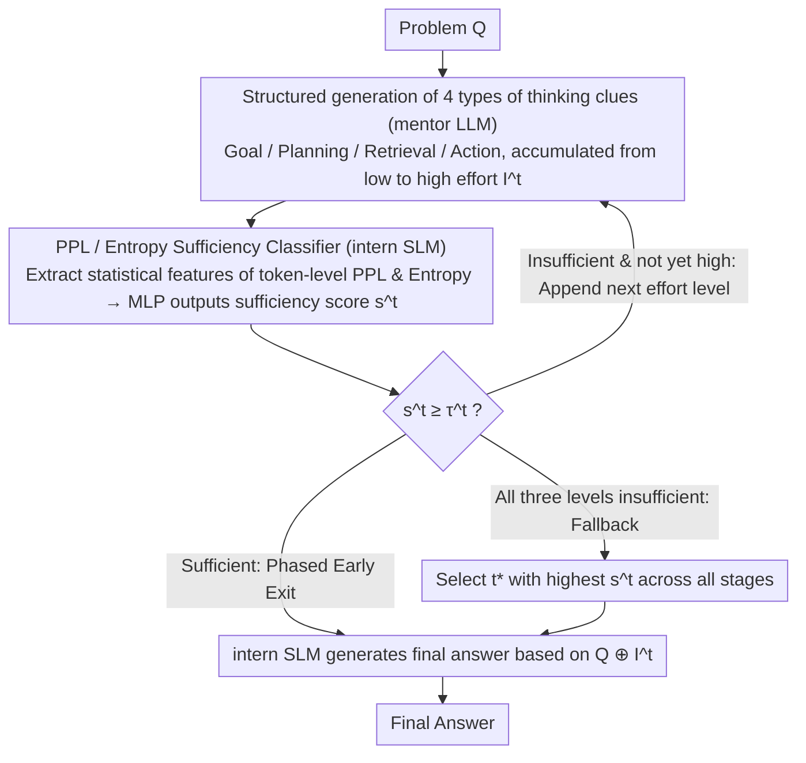

# Tandem: Riding Together with Large and Small Language Models for Efficient Reasoning

**Conference**: ACL2026 Findings  
**arXiv**: [2604.23623](https://arxiv.org/abs/2604.23623)  
**Code**: https://github.com/Applied-Machine-Learning-Lab/ACL2026_Tandem  
**Area**: LLM Reasoning / Model Collaboration / Inference Efficiency  
**Keywords**: Large and Small Model Collaboration, Structured Thought Prompting, Reasoning Acceleration, Uncertainty Estimation, Cost-Aware Routing

## TL;DR
Tandem allows a large model to generate only four types of short reasoning clues—Goal, Planning, Retrieval, and Action—while a small model uses perplexity and entropy to judge clue sufficiency and complete the answer. On MATH, GSM8K, and HumanEval, it achieves or exceeds the performance of a standalone large model using approximately 60% of the computational cost.

## Background & Motivation
**Background**: LLM reasoning has evolved from simple answering to an explicit thinking paradigm. Typical models first expand into long-chain thinking before generating the final answer. This externalization of thought enhances interpretability for complex mathematical, scientific reasoning, and code generation, making models more robust on difficult problems.

**Limitations of Prior Work**: The primary cost of explicit thinking stems from the generation length. The paper notes that the reasoning traces of thinking models are often 5 to 10 times longer than standard outputs, creating latency and API cost pressures during real-world deployment. Existing approaches, such as reinforcement fine-tuning to make large models think less, require modifying LLM weights, which is unavailable for closed-source API models and may harm general capabilities.

**Key Challenge**: High-quality reasoning requires the abstract planning and key insights of large models, yet a complete reasoning chain contains significant exploration, explanation, and repetitive steps. In other words, the expensive part is not "obtaining the key idea," but forcing the large model to write out the entire problem-solving process.

**Goal**: The authors aim to compress the thinking capabilities of large models into lightweight guidance without training or modifying the mentor LLM. This allows a cheaper small model to take over execution, while dynamically deciding the required amount of LLM guidance for problems of varying difficulty.

**Key Insight**: The paper uses a mentor-intern analogy: the large model acts as the mentor, responsible for providing goals, plans, retrieved knowledge, and key actions; the small model acts as the intern, responsible for completing specific reasoning based on these clues. Whether to continue querying the mentor is not determined by a fixed token budget, but by the distributional uncertainty of the small model when processing the current clues.

**Core Idea**: Deconstruct long LLM thinking into phased, structured insights and train a sufficiency classifier using SLM PPL / entropy features to determine when to stop LLM generation and let the small model finalize the answer.

## Method
The focus of Tandem is not on model debating or one-time query routing between multiple models, but on splitting a single inference task into "guidance generation" and "answer completion" roles. The large model outputs increasingly detailed reasoning clues, while the small model judges its own ability to complete the task while reading these clues. If current clues are determined to be sufficient, the large model stops early, and the remaining reasoning is completed by the small model.

### Overall Architecture
Given a problem $Q$, the mentor LLM generates reasoning insights across three effort levels. Each phase contains four types of information: Goal (clarifying the final objective), Planning (providing solution strategies), Retrieval (extracting relevant facts or knowledge), and Action (giving key calculations or logical moves).

The new insight added in stage $t$ is denoted as $\Delta I^t$, and the accumulated clues as $I^t = I^{t-1} \oplus \Delta I^t$. After each stage, the intern SLM reads $Q \oplus I^t$ and extracts statistical features of token-level perplexity and entropy, which are then passed to an MLP classifier to output a sufficiency score $s^t$.

If $s^t$ exceeds the current stage threshold $\tau^t$, the system stops LLM generation and lets the SLM output the final answer based on $Q \oplus I^t$. If none of the three stages are judged sufficient, the system does not blindly use the last stage but selects $t^*$ with the highest sufficiency score across all stages to complete the answer.

Two details are noteworthy. First, the LLM insights are constrained by prompts to be structured rather than raw, long-chain thinking. Second, the classifier input comes from the SLM's distributional state; thus, it judges whether "this specific small model is confident given these clues," rather than making a generic estimation of problem difficulty.

### Key Designs

**1. Structured generation of four types of thinking clues: Compressing verbose LLM CoT into high-level skeletons digestible by small models**

Directly feeding the complete thinking chain of a large model to a small model is neither economical nor often within the SLM's comprehension—it is filled with trial-and-error, explanations, and redundant steps. Drawing from cognitive modularity and LLM agent workflows, the author fixes the insights into four categories: Goal (clarifying what needs to be solved), Planning (sub-problem decomposition and roadmap), Retrieval (supplementing necessary factual knowledge), and Action (providing key operations or logical steps). All three effort levels cover these four types, with increasing depth and token budgets.

This preserves the "why" of the solution skeleton while stripping away trial-and-error and explanatory redundancy, providing the small model with guidance that is stronger than a simple prompt but much shorter than a full CoT.

**2. PPL / entropy-based sufficiency classifier: Using the small model's own uncertainty, rather than problem difficulty, to decide whether to query the large model**

Fixed low/medium/high thinking budgets waste resources on simple problems and may fail on difficult ones. Furthermore, the same insight might be sufficient for a strong SLM but insufficient for a weak one; thus, uniform partitioning by problem difficulty is irrational. Tandem uses the small model's own distributional state as a signal: when the SLM processes $Q \oplus I^t$, it produces a predictive distribution for each token. The paper calculates the PPL and entropy for each token, then takes the mean, standard deviation, median, maximum, minimum, 25th/75th percentiles, and the trend difference between the last 20 tokens and the first 20 tokens as input for an MLP to output the sufficiency score $s^t$.

The intuition is straightforward: if the current clues help the small model form stable predictions, entropy will be lower and distribution statistics will resemble "solvable" samples. Because the input comes from the SLM distribution, the classifier judges whether "this small model is confident under these clues," tying resource allocation directly to the execution model's capability.

**3. Phased early stopping and fallback: Fine-grained trade-off between LLM cascades and full LLM inference**

Many problems only require goal clarification or simple planning; allowing the large model to write out action details is a waste of cost. For other problems requiring longer guidance, the final answer can still be generated by a small model. Tandem thus lets the LLM generate low-effort insights first; if the classifier deems them sufficient, it stops immediately and lets the SLM answer based on $Q \oplus I^t$. Otherwise, it appends medium, and then high effort.

The key lies in the fallback logic: if none of the three stages pass the threshold $\tau^t$, the system does not mechanically use the longest clue. Instead, it selects the stage $t^*$ with the highest sufficiency score. This ensures Tandem is neither a single-query router nor full LLM takeover, but a dynamic decision of "exactly how much LLM guidance is needed" based on difficulty.

### Loss & Training
Tandem does not train the mentor LLM, nor does it require fine-tuning the intern SLM's primary generation capability. The component requiring training is the sufficiency classifier: on the training set, for each problem and effort level, if the SLM answers correctly under the current insight, it is labeled as sufficient; otherwise, it is labeled as insufficient.

The classifier uses a two-layer MLP (hidden layers of 64 and 32), ReLU activation, 0.3 dropout, Adam optimizer with a learning rate of $10^{-4}$, for up to 3 epochs with early stopping on the validation set. Thresholds $\tau^t$ for each effort level are determined via a grid search from 0.05 to 0.95.

LLMs in the experiment include DeepSeek-R1-Distill-Qwen-32B, Qwen3-32B, GPT-4o-mini, and gpt-oss-120b. SLMs include DeepSeek-7B, Qwen3-8B, etc. Main datasets are MATH and GSM8K, with HumanEval used for cross-domain code generation transfer testing.

## Key Experimental Results

### Main Results
The main MATH table shows that with DeepSeek-32B as the mentor and DeepSeek-7B as the intern, Tandem outperforms both the standalone 32B and fixed high-effort collaboration while significantly reducing TFLOPs.

| Method | MATH Avg. Acc. | Avg. Gen Length | Cost TFLOPs | Cost vs. 32B | Main Conclusion |
|------|----------------|--------------|-----------------|---------------|----------|
| 7B Single Model | 77.14 | 2,732 | 38.25 | 22.7% | Low cost but insufficient for complex problems |
| 32B Single Model | 80.90 | 2,630 | 168.35 | 100% | Strong baseline, but full thinking is expensive |
| 7B+32B low | 78.74 | 2,735 | 44.76 | 26.6% | Guidance too short, limited Gain |
| 7B+32B medium | 80.36 | 2,853 | 71.96 | 42.7% | Close to 32B, but still slightly lower |
| 7B+32B high | 83.18 | 2,930 | 104.62 | 62.1% | Fixed long guidance improves accuracy |
| Tandem | 83.46 | 2,916 | 99.72 | 59.2% | Highest accuracy, cost reduced by ~41% |

Cross-model family experiments show the insight format is not limited to models from the same provider. DeepSeek-7B reading Qwen3-32B insights achieved 79.96 on MATH, significantly exceeding DeepSeek-7B's own 76.92 and Qwen3-32B's 69.50. On GSM8K, most combinations also outperformed the standalone SLM.

| SLM + LLM | MATH Acc. | MATH Cost | GSM8K Acc. | GSM8K Cost | Observation |
|-----------|-----------|-----------|------------|------------|------|
| Qwen3-8B Single Model | 60.86 | 51.15 | 89.61 | 31.86 | Weak SLM has moderate cost but lacks math capability |
| Qwen3-32B Single Model | 69.50 | 193.41 | 94.01 | 104.00 | Qwen3-32B is weaker on MATH than DeepSeek |
| DeepSeek-7B Single Model | 76.92 | 37.25 | 87.11 | 15.74 | Strong math, slightly weaker on GSM8K |
| DeepSeek-32B Single Model | 80.76 | 163.84 | 94.47 | 67.14 | Strong mentor baseline |
| DeepSeek-7B + Qwen3-32B | 79.96 | 58.06 | 94.62 | 76.87 | Cross-family insights are utilized |
| DeepSeek-7B + DeepSeek-32B | 83.34 | 97.95 | 95.45 | 52.66 | Best with same family & moderate capability gap |

### Ablation Study
The paper evaluates the stability of Tandem across model size, API mentor, cross-domain transfer, and against efficiency baselines.

| Analysis Dimension | Contrast Setup | Key Finding | Meaning |
|----------|----------|----------|------|
| Model Scale | DeepSeek Counting & Probability | 7B+32B high reached 82.49 vs 7B's 75.95; 14B+32B only grew 79.96 to 80.38 | Gain is limited if capability gap is too small; weak SLM fails if gap is too large |
| API Mentor | DeepSeek-7B + GPT-oss-120B | Algebra 95.79, Counting 86.71, Geometry 84.55, all exceeding individual models | No weight access needed, suitable for closed API scenarios |
| Cross-Domain Transfer | MATH classifier applied to HumanEval | Tandem 85.37 vs 7B+32B high's 83.54 (SLM: 65.24, LLM: 89.02) | PPL/entropy sufficiency features are somewhat domain-agnostic |
| Efficiency Baselines | Competing with Budget Forcing & LLM Cascade (MATH) | Tandem 83.46 / 99.72 TFLOPs; Budget Forcing 82.18 / 108.74; Cascade 82.60 / 95.33 | Tandem is more accurate than fixed truncation and finer-grained than routing |

### Key Findings
- Tandem's primary Gain comes from "dynamically choosing the required guidance," rather than simply making the 32B model write more or less; it improves accuracy while lowering costs relative to a strong high-effort baseline.
- Structured insights are portable across model families, but the SLM cannot be too weak. a 1.5B model cannot approach 32B performance even with guidance, indicating the bottleneck shifts from mentor's reasoning to intern's execution understanding.
- API experiments are practical: when GPT-oss-120B acts as a remote mentor, the cost for local subjects is lower than direct API calls because it only outputs short insights, with long answers completed by the local 7B.
- HumanEval results suggest the sufficiency classifier learns distribution patterns related to "small model stability after reading guidance" rather than just math-specific features.

## Highlights & Insights
- The paper reframes the LLM reasoning efficiency problem from "how to make the LLM think less" to "which parts of thinking must be provided by the LLM." This reformulation is vital as it avoids LLM training and naturally supports closed APIs.
- The four insight categories—Goal/Planning/Retrieval/Action—are more controllable than standard hints. They are neither full CoT leaks nor simple prompts but deconstructed cognitive modules necessary for problem-solving, facilitating hand-off to the small model.
- The sufficiency classifier uses the small model's internal distribution features, giving it individualized meaning. The "sufficiency" of the same clue for the same problem can vary between different SLMs, which is more practical than routing based on problem difficulty or LLM confidence.
- Tandem offers a lightweight paradigm for model collaboration: collaboration doesn't require multi-round debates or ensembling full answers; correct role partitioning allows short guidance plus local execution to yield high cost-performance.

## Limitations & Future Work
- The paper primarily covers mathematical reasoning and HumanEval code generation; it has not fully validated open-domain QA, common-sense reasoning, long-context RAG, or multi-turn task planning.
- The sufficiency classifier still requires training data with correctness labels. While cross-domain transfer is promising, at least one source domain training set is needed, and cold-starting for low-resource tasks remains a challenge.
- The current structure is a fixed mentor-intern pair; it lacks dynamic selection of mentors/interns or multiple expert models. In complex products, different problems might require different mentors or verifiers.
- The method assumes insights are reliable. If the mentor LLM provides factual errors in Retrieval or Action, the small model may be misled with high confidence; future work could include verifiers or counter-factual checking mechanisms.

## Related Work & Insights
- **vs Budget Forcing**: Budget Forcing truncates LLM thinking, saving cost but potentially cutting key steps. Tandem uses structured short insights for SLMs to complete, changing the role division rather than just compressing length.
- **vs LLM Cascade / FrugalGPT**: Cascades usually decide query-level between SLM or LLM. Tandem's decisions occur between reasoning stages, allowing a single problem to use minimal guidance first and append more only if needed.
- **vs Speculative Decoding**: Speculative decoding uses SLMs to accelerate LLM token generation; the output still belongs to the LLM. Tandem has the SLM generate the final answer with LLM guidance, targeting different cost-saving sources.
- **vs Multi-Agent Debate**: Debate or role-based collaboration often adds multi-round communication costs. Tandem communicates via short insights, resembling a relay between a mentor's tip and an executor's work.

## Rating
- Novelty: ⭐⭐⭐⭐☆ Compressing long reasoning into structured insights and using SLM uncertainty for phased early stopping is elegant and addresses deployment costs effectively.
- Experimental Thoroughness: ⭐⭐⭐⭐☆ Covers MATH, GSM8K, HumanEval, multiple model families, and API mentors; requires further validation on open-domain complex tasks.
- Writing Quality: ⭐⭐⭐⭐☆ Clear methodology, experiments organized by RQ, and transparent cost definitions.
- Value: ⭐⭐⭐⭐⭐ Highly valuable for reducing LLM reasoning service costs and provides a reusable system design for large-small model collaboration.

<!-- RELATED:START -->

## Related Papers

- [\[ACL 2026\] Lizard: An Efficient Linearization Framework for Large Language Models](lizard_an_efficient_linearization_framework_for_large_language_models.md)
- [\[ACL 2026\] CreditDecoding: Accelerating Parallel Decoding in Diffusion Large Language Models with Trace Credit](creditdecoding_accelerating_parallel_decoding_in_diffusion_large_language_models.md)
- [\[ACL 2026\] Are Large Language Models Economically Viable for Industry Deployment?](are_large_language_models_economically_viable_for_industry_deployment.md)
- [\[ACL 2026\] Breaking Block Boundaries: Anchor-based History-stable Decoding for Diffusion Large Language Models](breaking_block_boundaries_anchor-based_history-stable_decoding_for_diffusion_lar.md)
- [\[ICML 2026\] dLLM-Cache: Accelerating Diffusion Large Language Models with Adaptive Caching](../../ICML2026/llm_efficiency/dllm-cache_accelerating_diffusion_large_language_models_with_adaptive_caching.md)

<!-- RELATED:END -->
