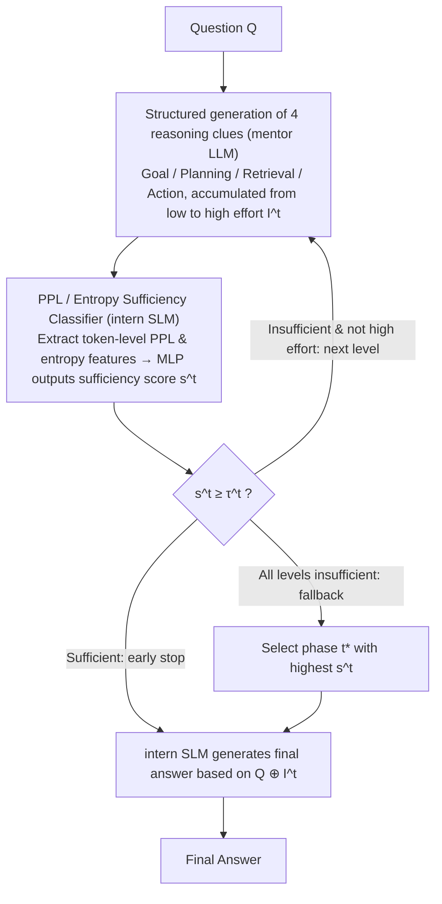

# Tandem: Riding Together with Large and Small Language Models for Efficient Reasoning

**Conference**: ACL2026 Findings  
**arXiv**: [2604.23623](https://arxiv.org/abs/2604.23623)  
**Code**: https://github.com/Applied-Machine-Learning-Lab/ACL2026_Tandem  
**Area**: LLM Reasoning / Model Collaboration / Reasoning Efficiency  
**Keywords**: Large and small model collaboration, structured thought prompting, reasoning acceleration, uncertainty estimation, cost-aware routing  

## TL;DR
Tandem enables large models to generate only four types of short reasoning clues—Goal, Planning, Retrieval, and Action—while a small model uses perplexity and entropy to judge clue sufficiency and complete the answer. On MATH, GSM8K, and HumanEval, it achieves or exceeds the performance of standalone large models using approximately 60% of the computational cost.

## Background & Motivation
**Background**: LLM reasoning has shifted from simple answering to an explicit thinking paradigm. Typical models first unfold long-chain reasoning before generating the final answer. Such explicit thinking enhances interpretability and robustness for complex mathematical, scientific reasoning, and code generation tasks.

**Limitations of Prior Work**: The primary cost of explicit thinking stems from the generation length. The paper notes that reasoning traces of thinking models are often 5 to 10 times longer than standard outputs, causing latency and API cost pressures in real-world deployment. Existing approaches, such as reinforcement fine-tuning to reduce large model thinking, require modifying weights (unavailable for closed-source APIs) and may harm general capabilities.

**Key Challenge**: High-quality reasoning requires the abstract planning and key insights of large models, but the complete reasoning chain contains extensive exploration, explanation, and repetition. In other words, the true expense is not "obtaining the key idea," but forcing the large model to write out the entire problem-solving process.

**Goal**: The authors aim to compress the thinking capabilities of large models into lightweight guidance without training or modifying the mentor LLM, allowing cheaper small models to execute the reasoning while dynamically deciding the required amount of guidance based on problem difficulty.

**Key Insight**: The paper adopts a mentor-intern analogy: the large model acts as a mentor responsible for goals, plans, retrieved knowledge, and key actions; the small model acts as an intern responsible for specific reasoning based on these clues. Whether to continue querying the mentor is determined not by a fixed token budget, but by the distribution uncertainty of the small model when processing the current clues.

**Core Idea**: Decompose the long thinking of large models into phased, structured insights, and use the PPL (perplexity) and entropy features of the small model to train a sufficiency classifier to determine when to stop large model generation and let the small model finalize the answer.

## Method
The focus of Tandem is not mutual debate or one-time query routing, but splitting reasoning into "guidance generation" and "answer completion" roles. The large model produces increasingly detailed clues while the small model assesses its own ability to complete the task; once current clues are deemed sufficient, the large model stops early, and the remaining reasoning is handled by the small model.

### Overall Architecture
Given a question $Q$, the mentor LLM generates reasoning insights across three effort levels. Each phase includes four categories: Goal (stating the final objective), Planning (providing a strategy), Retrieval (extracting relevant facts/knowledge), and Action (giving key calculations or logical moves).

The new insight added in phase $t$ is denoted as $\Delta I^t$, and accumulated clues as $I^t = I^{t-1} \oplus \Delta I^t$. After each phase, the intern SLM reads $Q \oplus I^t$, extracts statistical features of token-level perplexity and entropy, and passes them to an MLP classifier to output a sufficiency score $s^t$.

If $s^t$ exceeds the threshold $\tau^t$ for the current phase, the system stops the LLM and has the SLM output the final answer based on $Q \oplus I^t$. If none of the three phases are judged sufficient, the system selects the phase $t^*$ with the highest sufficiency score to complete the answer.

Two details are noteworthy: First, the LLM insights are constrained by prompts to be structured rather than raw long-chain thinking. Second, the classifier input comes from the SLM's distribution state, so it judges "whether this small model is confident under these clues" rather than generally estimating problem difficulty.

### Key Designs

**1. Structured Generation of Four Types of Reasoning Clues: Compressing redundant CoT into high-level skeletons for small models**  
Feeding the complete thinking chain of a large model into a small one is neither economical nor always feasible, as it is often filled with trial-and-error and redundant explanations. Borrowing from cognitive modularity and LLM agent workflows, the paper fixes insights into four categories: Goal (defining what to solve), Planning (sub-problem decomposition), Retrieval (supplementing factual knowledge), and Action (providing critical operations). All three effort levels cover these categories, but increase in depth and token budget. This preserves the "how to solve" skeleton while removing explanatory redundancy.

**2. PPL / Entropy-based Sufficiency Classifier: Using small model uncertainty to decide when to stop**  
Fixed thinking budgets waste resources on simple problems and may fail on difficult ones. Furthermore, an insight sufficient for a strong SLM might be insufficient for a weak one. Tandem uses the small model's distributive state as a signal. When the SLM processes $Q \oplus I^t$, it generates a predictive distribution for each token. The paper calculates features (mean, std, median, max, min, quartiles, and trends) from token PPL and entropy, which are fed into an MLP to output $s^t$. This ties resource allocation directly to the execution model's capability.

**3. Phased Early Stopping and Fallback: Fine-grained trade-off between cascades and full LLM usage**  
Simple problems might only need goal clarification. Tandem generates low-effort insights first. If the classifier deems it sufficient, it stops immediately. If not, it proceeds to medium then high. If all thresholds fail, it reverts to the insight phase with the highest score $t^*$ rather than blindly using the longest one. This allows dynamic determination of "how much guidance is actually needed."

### Loss & Training
Tandem does not train the mentor LLM nor fine-tune the SLM's generation capability. Only the sufficiency classifier needs training. For each problem and effort level in the training set, a label is set as "sufficient" if the SLM answers correctly given the current insight, and "insufficient" otherwise.

The classifier is a two-layer MLP (hidden sizes 64 and 32) with ReLU, 0.3 dropout, and $10^{-4}$ learning rate, trained for up to 3 epochs with early stopping. Thresholds $\tau^t$ are determined via grid search from 0.05 to 0.95.

## Key Experimental Results

### Main Results
The MATH table shows that with DeepSeek-32B as mentor and DeepSeek-7B as intern, Tandem outperforms both the standalone 32B model and fixed high-effort collaboration while significantly reducing TFLOPs.

| Method | MATH Avg. Acc | Avg. Gen Length | Cost (TFLOPs) | Rel. Cost (vs 32B) | Key Conclusion |
|------|----------------|--------------|-----------------|---------------|----------|
| 7B Model | 77.14 | 2,732 | 38.25 | 22.7% | Low cost but lacks complex reasoning |
| 32B Model | 80.90 | 2,630 | 168.35 | 100% | Strong baseline but expensive |
| 7B+32B low | 78.74 | 2,735 | 44.76 | 26.6% | Guidance too short, limited gain |
| 7B+32B medium | 80.36 | 2,853 | 71.96 | 42.7% | Close to 32B but slightly lower |
| 7B+32B high | 83.18 | 2,930 | 104.62 | 62.1% | Fixed long guidance improves accuracy |
| Tandem | 83.46 | 2,916 | 99.72 | 59.2% | Highest accuracy, ~41% cost reduction |

Cross-model experiments demonstrate that the insight format is not model-specific.

| SLM + LLM | MATH Acc. | MATH Cost | GSM8K Acc. | GSM8K Cost | Observation |
|-----------|-----------|-----------|------------|------------|------|
| Qwen3-8B Alone | 60.86 | 51.15 | 89.61 | 31.86 | Weak SLM has poor math capability |
| Qwen3-32B Alone | 69.50 | 193.41 | 94.01 | 104.00 | Qwen3-32B weaker than DeepSeek on MATH |
| DeepSeek-7B Alone | 76.92 | 37.25 | 87.11 | 15.74 | Strong math, weaker GSM8K |
| DeepSeek-7B + Qwen3-32B | 79.96 | 58.06 | 94.62 | 76.87 | Cross-family insights are effective |
| DeepSeek-7B + DeepSeek-32B | 83.34 | 97.95 | 95.45 | 52.66 | Best when models are from same family |

### Ablation Study
The stability of Tandem is evaluated across model sizes, API mentors, and cross-domain transfer.

| Dimension | Comparison Setting | Key Result | Implication |
|----------|----------|----------|------|
| Model Scale | DeepSeek Counting | 7B+32B high (82.49) vs 7B (75.95) | Gains diminish if model gap is too small |
| API Mentor | DeepSeek-7B + GPT-oss-120B | Outperforms standalone models in Algebra/Geometry | Weight access not required; suitable for APIs |
| Domain Transfer| MATH classifier on HumanEval | Tandem (85.37) vs SLM (65.24) | Sufficiency features are somewhat domain-agnostic |
| Efficiency | Versus Budget Forcing/Cascade | Tandem (83.46) vs Cascade (82.60) | More precise than routing, better than truncation |

### Key Findings
- Tandem's primary gain comes from "dynamically selecting how much guidance is needed," rather than simply adjusting generation length.
- Structured insights are transferable across model families, but the SLM must have a baseline execution capability.
- API experiments show that using a large model as a remote mentor can be cheaper than full API calls because only short insights are transmitted.
- HumanEval results suggest the classifier learns distribution patterns of "stability" rather than just mathematical features.

## Highlights & Insights
- The paper reframes reasoning efficiency from "how to make large models think less" to "which parts of thinking must the large model provide." This avoids training large models and supports closed-source APIs.
- The four insight categories provide better control than raw hints. They explicitly decompose cognitive modules required for problem-solving.
- The use of the small model's own distribution features for the classifier makes the decision "individualized" to the specific executor's capabilities.
- Tandem provides a lightweight paradigm for model collaboration: collaboration does not require multi-turn debate; structured guidance followed by local execution provides high cost-performance.

## Limitations & Future Work
- Primarily covers math and HumanEval code generation; has not fully verified open-domain QA or long-context reasoning.
- The sufficiency classifier still requires labeled training data. While domain transfer is promising, low-resource cold starts remain a challenge.
- Currently uses a fixed mentor-intern pair; it does not dynamically select between multiple experts.
- Assumes insights are reliable; if the mentor provides incorrect facts (hallucination), the small model might be confidently misled.

## Related Work & Insights
- **vs Budget Forcing**: Budget Forcing truncates thinking, which may cut critical steps. Tandem uses structured insights to preserve the reasoning skeleton.
- **vs LLM Cascade**: Cascades decide between models at the query level. Tandem decides at reasoning stages, allowing partial guidance for a single query.
- **vs Speculative Decoding**: Speculative decoding targets generation speed with the large model as the final authority. Tandem uses the small model as the final executor, saving different types of costs.

## Rating
- Novelty: ⭐⭐⭐⭐☆
- Experimental Thoroughness: ⭐⭐⭐⭐☆
- Writing Quality: ⭐⭐⭐⭐☆
- Value: ⭐⭐⭐⭐⭐

<!-- RELATED:START -->

## Related Papers

- [\[ACL 2026\] Lizard: An Efficient Linearization Framework for Large Language Models](lizard_an_efficient_linearization_framework_for_large_language_models.md)
- [\[ICLR 2026\] Cascadia: An Efficient Cascade Serving System for Large Language Models](../../ICLR2026/llm_efficiency/cascadia_an_efficient_cascade_serving_system_for_large_language_models.md)
- [\[ACL 2026\] Are Large Language Models Economically Viable for Industry Deployment?](are_large_language_models_economically_viable_for_industry_deployment.md)
- [\[ACL 2026\] Small Data, Big Noise: Adversarial Training for Robust Parameter-Efficient Fine-Tuning](small_data_big_noise_adversarial_training_for_robust_parameter-efficient_fine-tu.md)
- [\[ICLR 2026\] ThinKV: Thought-Adaptive KV Cache Compression for Efficient Reasoning Models](../../ICLR2026/llm_efficiency/thinkv_thought-adaptive_kv_cache_compression_for_efficient_reasoning_models.md)

<!-- RELATED:END -->
