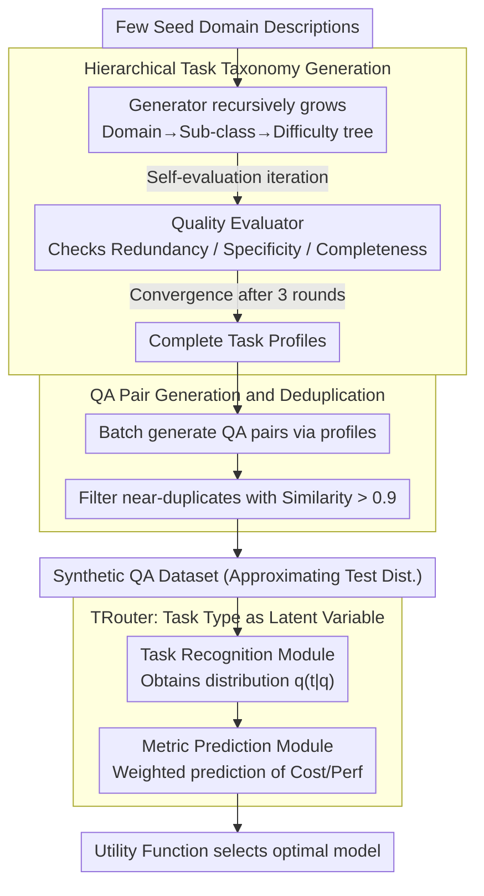

# Task-Aware LLM Routing with Multi-Level Task-Profile-Guided Data Synthesis for Cold-Start Scenarios

**Conference**: ACL 2026  
**arXiv**: [2604.09377](https://arxiv.org/abs/2604.09377)  
**Code**: [GitHub](https://github.com/less-and-less-bugs/ColdStartLLMRouter)  
**Area**: LLM Evaluation  
**Keywords**: LLM Routing, Cold-Start, Data Synthesis, Task-Aware, Cost-Performance Trade-off

## TL;DR
A multi-level task-profile-guided data synthesis framework is proposed to address the cold-start problem in LLM routing. TRouter, a routing method using task types as latent variables, is designed to model the query-cost-performance relationship via variational inference, achieving effective routing in both cold-start and in-domain settings.

## Background & Motivation

**Background**: LLM routing aims to select the optimal model from a candidate pool for each user query to balance performance and cost. Mainstream methods are divided into classification-based (directly predicting the best model) and regression-based (maximizing a utility function after predicting cost and performance), usually requiring small routers (e.g., BERT) trained on in-domain data.

**Limitations of Prior Work**: (1) Real-world deployments often face cold-start scenarios where no in-domain labeled data is available for training routers; (2) Pre-trained routers generalize poorly during cross-domain testing, sometimes underperforming simple rule-based baselines (Adaptive LLM); (3) Directly using LLMs for model selection is unreliable due to the difficulty in accurately characterizing the capability boundaries of each candidate model.

**Key Challenge**: LLM routing depends on labeled data, which is unavailable in cold-start scenarios; meanwhile, out-of-distribution shifts render cross-domain trained routers ineffective.

**Goal**: (1) Design a data synthesis method without human annotation to approximate the query distribution at test time; (2) Build a task-aware router to enhance cross-domain robustness.

**Key Insight**: LLM cost and performance are inherently correlated with task categories and difficulty—different task types/difficulties have significantly different requirements for models. Based on this, a hierarchical task taxonomy can organize synthetic data and utilize implicit task type information during routing.

**Core Idea**: Use hierarchical task classification (Domain → Sub-class → Difficulty) to guide synthetic data generation, modeling task types as latent variables within a regression-based routing framework.

## Method

### Overall Architecture
This paper addresses the cold-start dilemma of LLM routing: without in-domain labeled data, pre-trained routers generalize poorly, and direct LLM selection fails to capture model capability boundaries. The solution chains "data generation" and "router learning": first, a multi-level task-profile-guided synthesis framework iteratively builds a "Domain → Sub-class → Difficulty" taxonomy from few seed descriptions and generates deduplicated QA pairs to approximate the test distribution; then, TRouter treats these task types as latent variables, jointly modeling the conditional distribution of performance and cost via variational inference. At inference, the most cost-effective model is selected based on a utility function.

### Key Designs

**1. Hierarchical Task Taxonomy Generation: Expanding seeds into a complete task tree via "Generation-Evaluation" loops**

To approximate the real test distribution, synthetic data requires a sufficiently granular and comprehensive task partition. The Task Type Generator recursively generates subtypes (including name, definition, and examples) conditioned on parent descriptions, growing a "Domain → Sub-class → Difficulty" structure. To prevent redundancy or omissions, the Task Type Quality Evaluator performs self-evaluation on each batch, checking for redundancy, specificity, and completeness, iterating until convergence (no changes for three rounds). Using GPT-4.1, this process yielded 10 domains, 103 sub-classes, 447 difficulty nodes, and 17,880 QA pairs.

**2. QA Pair Generation and Deduplication: Ensuring diversity and uniqueness**

With task profiles (current task type plus its parent description), the Question-Answer Pair Generator produces QA pairs in batches (target 40 per profile, batch=8). To combat lack of diversity, sentence-transformers calculate semantic similarity between new and existing pairs; near-duplicates with similarity $>0.9$ are filtered. This ensures the synthetic set covers the test distribution without dragging down router training with redundant samples.

**3. TRouter: Decoupling queries and metrics using task types as latent variables**

Predicting cost/performance directly from query features is prone to being misled by surface lexical features, leading to cross-domain failure. TRouter introduces an implicit task type $t$, decomposing the conditional distribution of evaluation metrics as $p(h|q,m)=\sum_t p(h|t,m)\cdot p(t|q)$. The Task Recognition Module encodes the query and all task type descriptions, passing them through an MLP+softmax to obtain the task distribution $q_\phi(t|q)$, constrained by the KL divergence with a prior. The Metric Prediction Module predicts the value for each "metric-model" pair by weighting type-specific predictions according to the task distribution, trained via MSE. Inference uses the utility function $U(m,q)=\mu_r\cdot r(m,q)-\mu_c\cdot c(m,q)$. This intermediate representation strips task semantics from surface features, providing cross-domain robustness.

Total loss is $\mathcal{L} = \mathcal{L}_{CE} + \frac{1}{|\mathcal{M}||\mathcal{H}|}\sum_m\sum_h \mathcal{L}_{MSE}^{h,m}$, where the cross-entropy term corresponds to the KL term of the ELBO, and the MSE term corresponds to the reconstruction term. Queries and task types are encoded with all-MiniLM-L6-v2 and mapped to 256 dimensions. In cold-start, only 30 training and 10 validation QA pairs are used per type.

## Key Experimental Results

### Main Results

| Setting | Method | Cost-first Utility | Balanced Utility | Perf-first Utility | Utility Sum |
|------|------|---------------------|-------------------|---------------------|-------------|
| Cold-Start | Adaptive LLM | 0.0217 | 0.1809 | 0.2887 | 0.4913 |
| Cold-Start | RouterDC⋆ | 0.0197 | 0.1490 | 0.2989 | 0.4676 |
| Cold-Start | Ours▲ (GPT-4.1 Synth) | **0.0355** | **0.1811** | 0.3108 | **0.5274** |
| Cold-Start | Ours∙ (Gemini Synth) | 0.0352 | 0.1809 | **0.3221** | **0.5382** |
| In-Domain | MetricRouter | 0.0442 | 0.1911 | 0.3388 | 0.5741 |
| In-Domain | Ours▲ | **0.0518** | **0.1949** | 0.3447 | **0.5914** |

### Ablation Study

| Configuration | Utility Sum | Description |
|------|-------------|------|
| TRouter (Full) | 0.5382 | Full model (Gemini synthetic) |
| w/o Task Latent Variable | ~0.52 | Degenerates to standard regression routing |
| w/o Data Synthesis | 0.4913 | Degenerates to rule-based baseline |
| w/o Quality Evaluator | ~0.51 | Decreased taxonomy quality |

### Key Findings
- TRouter's Utility Sum outperforms all baselines in cold-start scenarios, approaching in-domain performance.
- The synthesis framework is effective using both GPT-4.1 and Gemini-2.5-flash, demonstrating generalizability.
- In-domain, TRouter still outperforms regression baselines like MetricRouter, proving task type modeling gains are not limited to cold-start.
- Traditional cross-domain routers (RouterDC⋆, MetricRouter⋆) perform poorly in cold-start, sometimes worse than the Adaptive LLM rule-based baseline.

## Highlights & Insights
- **Sophisticated latent variable design**: Extending the task taxonomy from data synthesis to routing modeling creates a "synthetic data → routing prior" closed loop. This provides a structured inductive bias missing in standard routers trained on synthetic data.
- **Transferable cold-start strategy**: The core idea of the synthesis framework (using hierarchical classification to guide diverse generation) is applicable to any model selection/scheduling scenario lacking labeled data.
- **Explainability via Variational Inference**: The task distribution $q_\phi(t|q)$ not only aids prediction but also informs users about the task type of the query, enhancing decision transparency.

## Limitations & Future Work
- Data synthesis still relies on powerful LLMs (GPT-4.1 or Gemini), limiting applicability where these models are unavailable.
- Seed domains for the task taxonomy require manual specification (6 expanded to 10); adaptation to entirely new domains remains unverified.
- The candidate model pool is relatively small (6 open-source + 5 commercial); routing efficiency and scalability with larger pools need validation.
- Routing latency is not discussed—in deployment, router inference time might offset efficiency gains from model selection.

## Related Work & Insights
- **vs GraphRouter**: While GraphRouter models routing as edge prediction on heterogeneous graphs, TRouter’s use of latent task variables is simpler and shows a clear advantage in cold-start.
- **vs MetricRouter**: Both being regression-based, MetricRouter predicts metrics directly from query embeddings, whereas TRouter introduces task type decomposition, outperforming it in both in-domain and cold-start settings.
- **vs Adaptive Rules**: Adaptive LLM's linear selection based on cost tolerance is more robust than most learning-based methods in cold-start, highlighting the severity of the cold-start problem.

## Rating
- Novelty: ⭐⭐⭐⭐ Meaningful definition of the cold-start problem; clever combination of synthesis and latent variable routing.
- Experimental Thoroughness: ⭐⭐⭐⭐ Covers both cold-start and in-domain settings across multiple model pools, though ablation could be more granular.
- Writing Quality: ⭐⭐⭐⭐ Clear theoretical derivation, intuitive framework diagrams, and well-defined problem.
- Value: ⭐⭐⭐⭐ Addresses a real-world pain point in LLM deployment with a generalizable synthesis framework.

<!-- RELATED:START -->

## Related Papers

- [\[ACL 2026\] MTRouter: Cost-Aware Multi-Turn LLM Routing with History-Model Joint Embeddings](mtrouter_cost-aware_multi-turn_llm_routing_with_history-model_joint_embeddings.md)
- [\[CVPR 2026\] Few-Shot Hybrid Incremental Learning: Continually Learning under Data Scarcity and Task Uncertainty](../../CVPR2026/llm_efficiency/few-shot_hybrid_incremental_learningcontinually_learning_under_data_scarcity_and.md)
- [\[ICLR 2026\] DiSRouter: Distributed Self-Routing for LLM Selections](../../ICLR2026/llm_efficiency/disrouter_distributed_self-routing_for_llm_selections.md)
- [\[ICLR 2026\] Meta-UCF: Unified Task-Conditioned LoRA Generation for Continual Learning in Large Language Models](../../ICLR2026/llm_efficiency/meta-ucf_unified_task-conditioned_lora_generation_for_continual_learning_in_larg.md)
- [\[NeurIPS 2025\] Efficient Training-Free Online Routing for High-Volume Multi-LLM Serving](../../NeurIPS2025/llm_efficiency/efficient_training-free_online_routing_for_high-volume_multi-llm_serving.md)

<!-- RELATED:END -->
