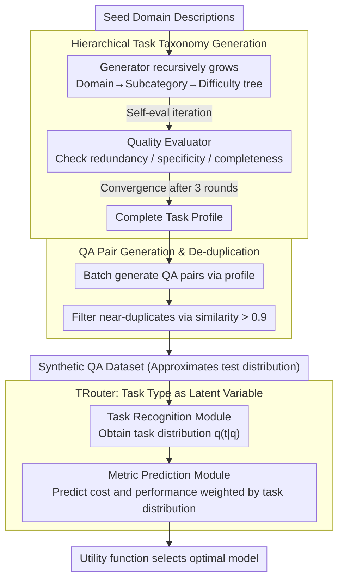

# Task-Aware LLM Routing with Multi-Level Task-Profile-Guided Data Synthesis for Cold-Start Scenarios

**Conference**: ACL 2026  
**arXiv**: [2604.09377](https://arxiv.org/abs/2604.09377)  
**Code**: [GitHub](https://github.com/less-and-less-bugs/ColdStartLLMRouter)  
**Area**: LLM Evaluation  
**Keywords**: LLM Routing, Cold-Start, Data Synthesis, Task-Aware, Cost-Performance Trade-off

## TL;DR
A multi-level task-profile-guided data synthesis framework is proposed to address the cold-start problem in LLM routing. The study designs TRouter—a routing method treating task types as latent variables. By modeling query-cost-performance relationships through variational inference, it achieves effective routing in both cold-start and in-domain settings.

## Background & Motivation

**Background**: LLM routing aims to select the optimal model from a candidate pool for each user query to balance performance and cost. Mainstream methods are divided into classification-based (directly predicting the best model) and regression-based (predicting cost and performance to maximize a utility function) approaches, usually requiring training small routers (e.g., BERT) on in-domain training data.

**Limitations of Prior Work**: (1) Real-world deployments often face cold-start scenarios with no in-domain labeled data for training; (2) Pre-trained routers generalize poorly during cross-domain testing, sometimes underperforming simple rule-based baselines (Adaptive LLM); (3) Using LLMs directly for model selection is unreliable as it is difficult to accurately characterize the capability boundaries of each candidate model.

**Key Challenge**: LLM routing depends on labeled data, which is unavailable in cold-start scenarios; simultaneously, out-of-distribution shifts render cross-domain trained routers ineffective.

**Goal**: (1) Design a data synthesis method without human annotation to approximate the query distribution at test time; (2) Construct a router capable of task-type awareness to enhance cross-domain robustness.

**Key Insight**: It is observed that LLM cost and performance are inherently linked to task categories and difficulty—different task types/difficulties have significantly varied model requirements. Based on this, a hierarchical task classification system can organize synthetic data and utilize implicit task type information during routing.

**Core Idea**: Use a hierarchical task taxonomy (domain → subcategory → difficulty) to guide synthetic data generation and model task types as latent variables within a regression-based routing framework.

## Method

### Overall Architecture
This paper addresses the cold-start dilemma in LLM routing: without in-domain labeled data, pre-trained routers generalize poorly, and direct LLM model selection fails to capture model capability boundaries. The solution chains "data synthesis" and "router learning"—first using a multi-level task-profile-guided synthesis framework to iteratively build a three-level "domain → subcategory → difficulty" taxonomy from a small set of seed descriptions, then generating de-duplicated QA pairs to approximate the test distribution. Finally, the same task types are used as latent variables in TRouter, which jointly models the conditional distribution of performance and cost via variational inference. At inference, the most cost-effective model is selected according to a utility function.

### Key Designs

**1. Hierarchical Task Taxonomy Generation: Expanding seed domains into a complete task tree via a "Generate-Self-Evaluate" loop**

To ensure synthetic data approximates the real test distribution, a sufficiently detailed and comprehensive task partition is required. The Task Type Generator recursively produces sub-types (including name, definition, and examples) conditioned on parent descriptions, growing a "domain → subcategory → difficulty" structure. This allows for both fine-grained control and efficient coverage. Since pure generation can lead to redundancy or omissions, the Task Type Quality Evaluator performs self-evaluation on each batch of sub-types, checking for redundancy, specificity, and completeness, and iteratively corrects them until convergence (no changes for three consecutive rounds). Using GPT-4.1, this process yielded 10 domains, 103 subcategories, 447 difficulty nodes, and a total of 17,880 QA pairs.

**2. QA Pair Generation and De-duplication: Ensuring diverse and non-repetitive training data**

Given a task profile (descriptions of the current and parent task types), the Question-Answer Pair Generator produces batches of QA pairs (target 40 pairs per profile, batch=8). To combat near-duplicates, the semantic similarity between new and existing QA pairs is calculated using a sentence-transformer after each batch. Items with maximum similarity $>0.9$ are filtered out, and iterations continue until the profile quota is filled. This ensuring that the synthetic set covers the real test distribution without burdening the router training with redundant samples.

**3. TRouter: Decoupling queries and metrics using task types as latent variables**

Directly predicting cost/performance from query features can be misled by surface lexical features and fails in cross-domain scenarios. TRouter introduces an implicit task type $t$, decomposing the conditional distribution of evaluation metrics as $p(h|q,m)=\sum_t p(h|t,m)\cdot p(t|q)$. The Task Recognition Module encodes the query and all task type descriptions, followed by an MLP+softmax to obtain the task distribution $q_\phi(t|q)$, constrained by the KL divergence from a prior. The Metric Prediction Module uses this distribution to weight the predictions for each "metric-model" pair. During inference, the optimal model is selected via the utility function $U(m,q)=\mu_r\cdot r(m,q)-\mu_c\cdot c(m,q)$. This intermediate representation strips task semantics from surface query features, providing cross-domain robustness.

The total loss is $\mathcal{L} = \mathcal{L}_{CE} + \frac{1}{|\mathcal{M}||\mathcal{H}|}\sum_m\sum_h \mathcal{L}_{MSE}^{h,m}$, where the cross-entropy term corresponds to the KL term of the ELBO, and the MSE term corresponds to the reconstruction term. Queries and task types are encoded with all-MiniLM-L6-v2 and mapped to 256 dimensions. In cold-start settings, only 30 training and 10 validation QA pairs per type are used.

## Key Experimental Results

### Main Results

| Setting | Method | Cost-first Utility | Balanced Utility | Perf-first Utility | Utility Sum |
|------|------|---------------------|-------------------|---------------------|-------------|
| Cold-start | Adaptive LLM | 0.0217 | 0.1809 | 0.2887 | 0.4913 |
| Cold-start | RouterDC⋆ | 0.0197 | 0.1490 | 0.2989 | 0.4676 |
| Cold-start | **Ours**▲ (GPT-4.1 Synth) | **0.0355** | **0.1811** | 0.3108 | **0.5274** |
| Cold-start | **Ours**∙ (Gemini Synth) | 0.0352 | 0.1809 | **0.3221** | **0.5382** |
| In-domain | MetricRouter | 0.0442 | 0.1911 | 0.3388 | 0.5741 |
| In-domain | **Ours**▲ | **0.0518** | **0.1949** | 0.3447 | **0.5914** |

### Ablation Study

| Configuration | Utility Sum | Description |
|------|-------------|------|
| TRouter (Full) | 0.5382 | Full model (Gemini synthetic) |
| w/o Task type variable | ~0.52 | Degenerates to standard regression routing |
| w/o Data synthesis | 0.4913 | Degenerates to rule-based baseline |
| w/o Quality evaluator | ~0.51 | Decline in taxonomy quality |

### Key Findings
- In cold-start scenarios, TRouter's Utility Sum exceeds all baselines and even approaches the performance of in-domain methods.
- The synthesis framework is effective using both GPT-4.1 and Gemini-2.5-flash, verifying its versatility.
- In in-domain settings, TRouter also outperforms regression baselines like MetricRouter, proving that the gain from task-type modeling is not limited to cold-start.
- Traditional cross-domain trained routers (RouterDC⋆, MetricRouter⋆) perform poorly in cold-start settings, with some even failing to beat the Adaptive LLM rule-based baseline.

## Highlights & Insights
- **The design of task types as latent variables is sophisticated**: It extends the task taxonomy from the data synthesis stage into the routing modeling stage, creating a closed loop from "synthetic data → routing prior." This adds a layer of structured inductive bias compared to simply training a standard router on synthetic data.
- **The definition and approach to the cold-start problem are transferable**: The core idea of the synthesis framework (using hierarchical taxonomy to guide diverse sample generation) is applicable to any model selection/scheduling scenario lacking labeled data.
- **The variational inference framework provides explainability**: The task distribution $q_\phi(t|q)$ is used not only for prediction but also to inform the user about the type of task the query belongs to, enhancing the interpretability of routing decisions.

## Limitations & Future Work
- Data synthesis still relies on powerful LLMs (GPT-4.1 or Gemini), limiting applicability in scenarios where these models are unavailable.
- Seed domains for the task taxonomy must be manually specified (6 expanded to 10); adaptability to entirely new domains remains unverified.
- The candidate model pool in experiments is relatively small (6 open-source + 5 commercial); routing efficiency and scalability with a larger pool need verification.
- Routing latency is not discussed—in actual deployment, the inference time of the router itself might offset the efficiency gains from model selection.

## Related Work & Insights
- **vs GraphRouter**: GraphRouter models routing as edge prediction on a heterogeneous graph. TRouter is more concise with implicit task-type variables and shows a clear advantage in cold-start.
- **vs MetricRouter**: Both are regression-based, but MetricRouter predicts metrics directly from query embeddings. TRouter introduces task-type decomposition, performing better in both in-domain and cold-start settings.
- **vs Adaptive LLM**: The rule-based Adaptive LLM selects models linearly based on user cost tolerance. It is more robust than most learning-based methods in cold-start, highlighting the severity of the cold-start problem.

## Rating
- Novelty: ⭐⭐⭐⭐ Meaningful definition of the cold-start problem; clever combination of data synthesis and latent variable routing.
- Experimental Thoroughness: ⭐⭐⭐⭐ Covers both cold-start and in-domain settings with multiple LLM pools, though ablation could be more detailed.
- Writing Quality: ⭐⭐⭐⭐ Clear theoretical derivation, intuitive framework diagrams, and well-defined problem.
- Value: ⭐⭐⭐⭐ Cold-start routing is a genuine pain point in actual deployment; the synthesis framework has strong generalizability.

<!-- RELATED:START -->

## Related Papers

- [\[ACL 2026\] MTRouter: Cost-Aware Multi-Turn LLM Routing with History-Model Joint Embeddings](mtrouter_cost-aware_multi-turn_llm_routing_with_history-model_joint_embeddings.md)
- [\[NeurIPS 2025\] Efficient Training-Free Online Routing for High-Volume Multi-LLM Serving](../../NeurIPS2025/llm_efficiency/efficient_training-free_online_routing_for_high-volume_multi-llm_serving.md)
- [\[AAAI 2026\] Resource Efficient Sleep Staging via Multi-Level Masking and Prompt Learning](../../AAAI2026/llm_efficiency/resource_efficient_sleep_staging_via_multi-level_masking_and_prompt_learning.md)
- [\[ICML 2026\] Fast-dLLM++: Fréchet Profile Decoding for Faster Diffusion LLM Inference](../../ICML2026/llm_efficiency/fast-dllm_fréchet_profile_decoding_for_faster_diffusion_llm_inference.md)
- [\[ACL 2026\] Understanding LLM Performance Degradation in Multi-Instance Processing: The Roles of Instance Count and Context Length](understanding_llm_performance_degradation_in_multi-instance_processing_the_roles.md)

<!-- RELATED:END -->
