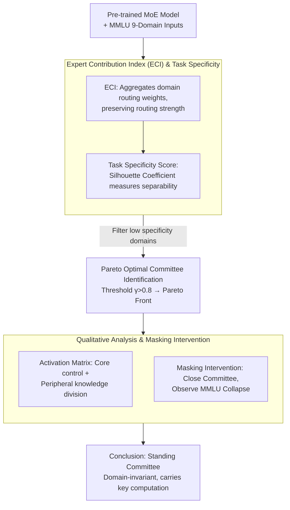

# The Illusion of Specialization: Revealing the "Standing Committee" in Mixture-of-Experts Models

**Conference**: ACL2026  
**arXiv**: [2601.03425](https://arxiv.org/abs/2601.03425)  
**Code**: https://github.com/The-FinAI/CommitteeAudit  
**Area**: Model Compression / LLM Efficiency  
**Keywords**: Mixture-of-Experts, Routing Analysis, Expert Specialization, Model Interpretability, Sparse Computation

## TL;DR
By introducing the CommitteeAudit framework, the authors discover a "Standing Committee" in MoE models—a compact, persistent set of experts consistently activated and dominating routing weights across different domains. This contrasts with the widely assumed domain-specific specialization, revealing an inherent centralized structure in sparse computation.

## Background & Motivation

**Background**: Mixture-of-Experts (MoE) models have become a primary direction for scaling large language models. Through a "divide and conquer" strategy—routing inputs from different domains to specialized experts—conditional computation can theoretically be achieved while avoiding linear increases in inference latency. Recent architectures like DeepSeek even introduce shared expert layers, attempting to force non-shared expert specialization through architectural isolation.

**Limitations of Prior Work**: However, previous research on representation collapse warns that the optimization dynamics of routing networks frequently conflict with the ideal of "expert specialization." More critically, even in architectures with shared experts, routed experts exhibit significant cross-domain overlap—this is not an optimization failure, but rather a prerequisite for these experts to remain active and functionally effective while still resisting specialization.

**Key Challenge**: Load-balancing auxiliary losses, widely adopted in MoE training, aim to encourage uniform expert utilization and prevent expert "death." But if the natural optimization path of the model actually tends toward centralized computation—where a "standing committee" dominates inference across all domains—then such loss functions are effectively working against the model's intrinsic tendencies.

**Goal**: To analyze the routing organization of MoE at the group level (rather than individual experts), confirming whether domain-invariant expert "connectomes" exist and how they evolve across depth and architecture.

**Core Idea**: Shift from individual expert statistics to "committee-level" structural analysis—using Pareto optimality and stability diagnostics to quantify the organization of expert groups instead of analyzing activation frequencies in isolation.

## Method

### Overall Architecture
CommitteeAudit seeks to verify a counter-intuitive hypothesis: does MoE truly distribute different domains to "specialized" experts, or does a "standing committee" exist that remains on duty across all domains? To this end, it designs a post-hoc analysis pipeline—first extracting task-level routing features from pre-trained MoE models, quantifying routing overlap and concentration using Jaccard similarity and Gini coefficients; then determining the task specificity of domain routing to filter out tasks with confounded routing; finally, performing Pareto optimization on domains with high specificity to identify expert groups that consistently occupy Top-k positions with stable rankings, validating their critical computational roles via activation matrices and masking interventions.

### Key Designs

**1. Expert Contribution Index (ECI) & Task Specificity Score: From Single Routing to Domain-Level Patterns**

To discuss a "committee," one needs a metric that consistently characterizes expert importance across samples and domains. ECI defines the average routing weight of expert $i$ in layer $\ell$ for domain $\tau$ as $c_{i,\tau}^{(\ell)} = \mathbf{E}_{x\in\mathcal{D}_\tau}[G^{(\ell)}(x)_i]$. Compared to simple activation frequency, it retains the "strength" information of router preferences. Task specificity is measured using a Silhouette-based index $S_\ell(\tau) = \frac{1}{|\mathcal{D}_\tau|}\sum_{x_i}\frac{b_i - a_i}{\max(a_i, b_i)}$ (where $a_i$ is intra-domain distance and $b_i$ is nearest inter-domain distance). These quantities bridge individual routing behavior to domain-level patterns, ensuring subsequent committee analysis is performed only on sufficiently specific domains to avoid contamination by routing interference.

**2. Pareto Optimal Committee Identification: Requiring Both High Rank and Cross-Domain Stability**

A qualified "committee member" should be both heavily reused across multiple domains and maintain a consistent usage pattern within those domains. Looking only at frequency might include experts that are unstable across domains, while looking only at variance might select experts that are stable but low-ranked. CommitteeAudit first uses a consistency threshold $\gamma > 0.8$ to filter experts that fail to appear in the Top-k in at least $80\%$ of domains. It then plots a Pareto curve $\{(\mu_i, \sigma_i): \mu_i = \mathbf{E}_\tau[R(i,\tau)],\ \sigma_i = \mathrm{Var}_\tau[R(i,\tau)]\}$ on the remaining candidates, automatically selecting the optimal trade-off points of "high average rank, low cross-domain rank variance." Using a Pareto front instead of hard thresholds avoids both aforementioned biases.

**3. Qualitative Function Analysis & Masking Intervention: Eliminating "High-Frequency Statistical Coincidence"**

Statistical identification of a stable expert group is insufficient; one must prove they are functionally critical. First, activation matrices record which tokens consistently activate the same committee experts across at least three different domains. Results show that abstract reasoning words ("Which", "What", "Suppose") and high-frequency structural words ("the", "a", "in") are routed to the same committee experts, while domain-specific terms are dispersed among peripheral experts, exhibiting a "core control + peripheral knowledge" division of labor. Second, masking experiments disable committee expert routing weights and re-normalize, observing the collapse on MMLU: accuracy drops from 0.39 to 0.03–0.12, and the "no answer" rate surges from 3% to 36%–38%. Qualitative and quantitative evidence corroborate that the standing committee carries real computational roles rather than being a statistical fluke.

## Key Experimental Results

### Main Results: Existence and Stability of Standing Committees

Experiments were conducted on three MoE models of varying scales and architectures (OLMoE-1B-7B, DeepSeek-V2-Lite, Qwen3-30B-A3B) using nine semantic domains from MMLU.

| Metric | Statistic | OLMoE | DeepSeek-V2-Lite | Qwen3-30B-A3B |
|------|--------|-------|----------------|--------------|
| Jaccard Similarity | Max | 1.0 | 1.0 | 1.0 |
|  | Min | 0.7963 | 0.7103 | 0.5300 |
|  | Overall Mean | 0.8735 | 0.8670 | 0.8670 |
| Gini Coefficient | Max | 0.9082 | 0.9360 | 0.9605 |
|  | Min | 0.8814 | 0.9092 | 0.9405 |
|  | Overall Mean | 0.8957 | 0.9207 | 0.9465 |

**Interpretation**: High Jaccard values indicate that the models activate nearly identical Top-k expert sets even across different domains. Gini coefficients > 0.88 show that routing weights are monopolized by a minority of experts. A larger expert pool (128 in Qwen3) did not alleviate this centralization but rather intensified the Gini value.

### Scale and Contribution of the Standing Committees

| Model | Stage | Layer | Committee Size | Avg Rank $\mu$ | Rank Var $\sigma^2$ | ECI Coverage | Relative Impact Density |
|------|------|-----|-----------|--------------|----------------|-----------|----------|
| DeepSeek-V2-Lite | Shallow | 3 | 4 | 3.36 | 1.81 | 66.3% | 29.5× |
|  | Middle | 11 | 3 | 3.15 | 1.98 | 60.7% | 31.4× |
|  | Deep | 19 | 4 | 3.11 | 0.76 | 70.5% | 35.8× |
| OLMoE | Shallow | 2 | 3 | 3.41 | 2.15 | 43.9% | 15.9× |
|  | Middle | 8 | 2 | 3.28 | 0.49 | 29.7% | 13.1× |
|  | Deep | 16 | 3 | 3.19 | 1.52 | 44.0% | 16.0× |

**Interpretation**: Committee size remains constant at 2-5 members yet accounts for 60%-70% of routing weights. Even in Qwen3 with 128 experts, the committee still consists of only 3-5 members. The relative impact density (how many times a committee member contributes relative to a uniform baseline) reaches 35.8x in DeepSeek's deep layers, indicating extreme computational density.

### Masking Intervention Results

| Masking Stage | Layer | Accuracy | Error Rate | No Answer Rate |
|-----------|------|--------|--------|---------|
| Baseline (No Mask) | — | 0.39 | 0.58 | 0.03 |
| Shallow | 2 | 0.12 | 0.52 | 0.36 |
| Middle | 10 | 0.09 | 0.55 | 0.36 |
| Deep | 26 | 0.03 | 0.59 | 0.38 |

**Interpretation**: Disabling the committee in any layer leads to a sharp performance drop. Deep-layer masking is most fatal (accuracy dropping to 3%), illustrating that the underlying reasoning backbone highly depends on the stable support of the committee.

## Highlights & Insights

- **Breaking the "Specialization" Assumption**: Directly challenges a core assumption of MoE design philosophy. Even in architectures that explicitly separate shared experts (like DeepSeek), routed "specialized" experts still form a hidden standing committee. Centralized computation is not an architectural choice but an **intrinsic necessity of sparse routing**.
- **The Load-Balancing Paradox**: Standard load-balancing losses attempt to force uniform usage of all experts, but if the model's natural optimal path is centralized, these loss functions effectively punish the model's internal tendencies, potentially **limiting training efficiency and performance**.
- **Core-Periphery Division of Labor**: Qualitative analysis reveals a sophisticated division of labor—committee members act as reasoning controllers and grammatical backbones, while peripheral experts handle domain knowledge on demand. This pattern is consistent between DeepSeek and Qwen3, suggesting it may be a **universal property of sparse computation**.
- **Universality Across Architectures**: From OLMoE (E=64) to Qwen3 (E=128), and from fully routed to hybrid shared designs, the standing committee phenomenon appears consistently, indicating it is a system-level phenomenon rather than a bug of a specific architecture.

## Limitations & Future Work

**Limitations**:
- Limited Experimental Coverage: Only three MoE models were evaluated, excluding more complex designs like hierarchical or dynamic routing.
- Incomplete Causality: While masking provide intervention evidence, systematic controls (e.g., comparing with random masking or frequency-matched masking) were not conducted.
- Limited Evaluation Scope: Primarily analyzed at the MMLU domain level; generalization to multi-step reasoning, programming, or tool-calling is unknown.
- Neglect of Dynamic Learning: CommitteeAudit is a post-hoc analysis and does not track **when and how** the standing committee emerges during training.

**Future Work**:
- Design Awareness in Routing Objectives: Instead of forcing uniform usage, **explicitly encourage core-periphery division**—for instance, by setting different target utilization rates for different experts.
- Extension to the Training Process: Monitor the formation of the standing committee throughout the process from random initialization to convergence.
- Validation Across More Architectures and Datasets: Especially datasets involving long context, multilingualism, and code.

## Related Work & Insights

- **vs. Individual Expert Specialization Analysis** (Lo et al. 2025; Olson et al. 2025): These works focus on semantic routing or activation patterns of single experts, making it difficult to capture the **synergistic structure** between experts. This paper's group-level perspective fills this gap.
- **vs. Super Expert Discovery** (Su et al. 2025): While both focus on high-frequency experts, work on super experts emphasizes individual Pareto distributions, whereas this paper reveals the **stable connectomes** formed by these high-frequency experts and their domain invariance.
- **vs. Representation Collapse Research** (Chi et al. 2022): Representation collapse emphasizes redundancy caused by optimization failure, whereas the centralization found here is a product of **successful optimization**—experts are not "dead" but actively participating in computation.
- **Insight**: Future MoE design should shift from "how to force diversification" to "how to align with the model's natural structure," designing architectures that respect this core-periphery division while giving peripheral experts meaningful tasks.

## Rating

- **Novelty**: ⭐⭐⭐⭐⭐ Shifting from individual experts to group-level analysis is a significant paradigm shift in MoE interpretability, challenging core "specialization" assumptions.
- **Experimental Thoroughness**: ⭐⭐⭐⭐ Three models and multiple metrics (Jaccard, Gini, masking) along with qualitative case studies provide sufficient support, though more complex architectures and training dynamics coverage could be enhanced.
- **Writing Quality**: ⭐⭐⭐⭐⭐ Clear logic, precise expression, well-defined problem setting, and strong argumentation.
- **Value**: ⭐⭐⭐⭐⭐ Directly instructive for MoE model design and optimization, particularly reflections on load-balancing objectives and insights into sparse computation properties.

<!-- RELATED:START -->

## Related Papers

- [\[ACL 2026\] Understanding LLM Performance Degradation in Multi-Instance Processing: The Roles of Instance Count and Context Length](understanding_llm_performance_degradation_in_multi-instance_processing_the_roles.md)
- [\[ACL 2026\] TokenTiming: A Dynamic Alignment Method for Universal Speculative Decoding Model Pairs](tokentiming_a_dynamic_alignment_method_for_universal_speculative_decoding_model_.md)
- [\[ACL 2026\] BOSCH: Black-Box Binary Optimization for Short-Context Attention-Head Selection in LLMs](bosch_black-box_binary_optimization_for_short-context_attention-head_selection_i.md)
- [\[ACL 2026\] Saber: Efficient Sampling with Adaptive Acceleration and Backtracking Enhanced Remasking for DLMs](saber_an_efficient_sampling_with_adaptive_acceleration_and_backtracking_enhanced.md)
- [\[ACL 2026\] MTRouter: Cost-Aware Multi-Turn LLM Routing with History-Model Joint Embeddings](mtrouter_cost-aware_multi-turn_llm_routing_with_history-model_joint_embeddings.md)

<!-- RELATED:END -->
