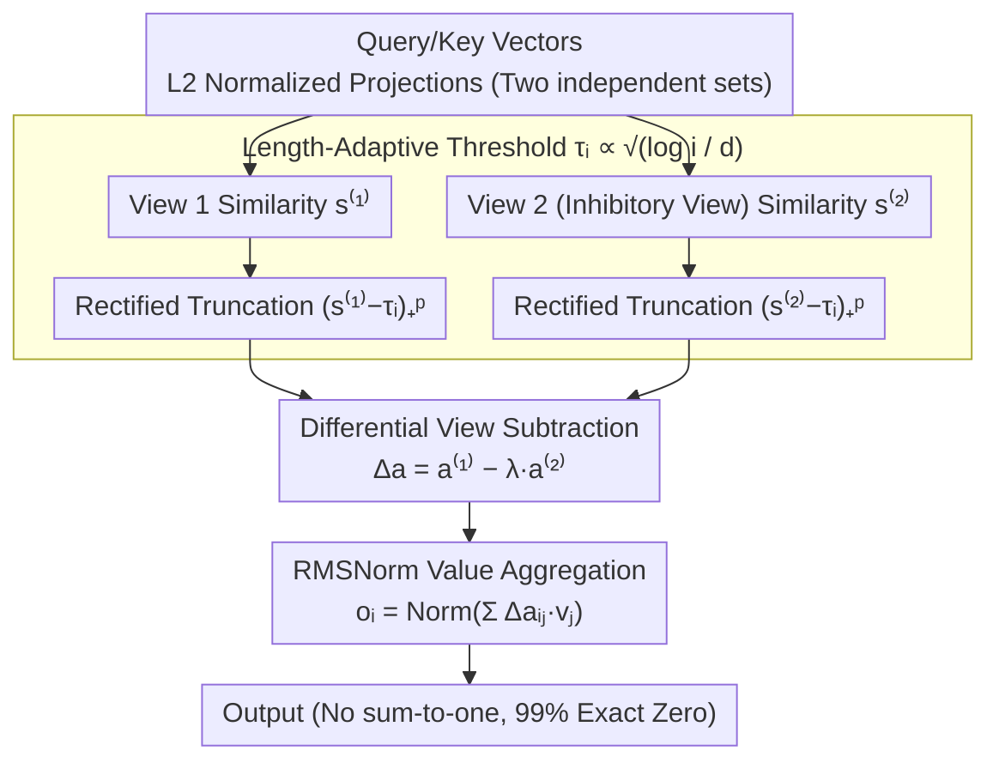

# Threshold Differential Attention: Sink-free, Ultra-sparse, and Non-dispersive Long-context Attention

**Conference**: ACL 2026  
**arXiv**: [2601.12145](https://arxiv.org/abs/2601.12145)  
**Code**: https://github.com/snap-research/TDA  
**Area**: LLM Efficiency  
**Keywords**: Attention Mechanism, Long Context, Sparse Attention, Differential Attention, Extreme Value Theory

## TL;DR
TDA achieves sink-free, 99% precise sparsity, and competitive performance in long-context Transformer attention by combining length-adaptive thresholds with differential inhibitory views.

## Background & Motivation

**Background**: Self-attention has become the core of Transformers due to its differentiability and efficient vectorized implementation. However, Softmax attention faces fundamental structural limitations when processing long sequences, primarily manifesting as two types of pathological phenomena.

**Limitations of Prior Work**: The sum-to-one constraint of Softmax forces the model to allocate non-zero probability mass to irrelevant tokens to satisfy normalization requirements, resulting in the attention sink phenomenon. Simultaneously, as sequence length increases, the probability mass is gradually diluted, leading to a decline in the model's focus on salient tokens. Although projection-based sparse methods (such as Entmax) can produce exact zeros, they are computationally expensive. Conversely, non-normalized rectified activations (such as ReLA) are efficient but suffer from performance degradation under long-context scenarios due to noise accumulation.

**Key Challenge**: Existing methods cannot simultaneously achieve three goals: (1) exact sparsity and computational efficiency, (2) sink-free attention, and (3) long-context robustness. Sparse methods typically still enforce the sum-to-one constraint and thus cannot fundamentally solve the sink problem, while rectified methods solve the sink issue but fail to control noise growth in long sequences with fixed thresholds.

**Goal**: Design a drop-in replacement for Softmax attention that satisfies the three requirements of being sink-free, ultra-sparse, and long-context robust, without exceeding the computational overhead of standard methods.

**Key Insight**: Starting from Extreme Value Theory (EVT), it is observed that in high dimensions, the maximum dot product of irrelevant query-key pairs grows with sequence length (extreme value effect). Therefore, a length-adaptive threshold can be used to suppress these spurious matches. Additionally, drawing from the concept of Differential Transformers, common-mode noise is further eliminated by calculating the difference between an inhibitory view and an excitatory view.

**Core Idea**: Use a length-adaptive threshold to filter extreme value noise, and then use differential views to cancel out spurious matches, thereby obtaining sink-free sparse attention.

## Method

### Overall Architecture

TDA is a drop-in replacement for the Softmax attention operator, aiming to make each row of attention both sparse and sink-free without relying on sum-to-one normalization. It is constructed in two layers: the bottom layer starts from rectified attention and replaces fixed thresholds with adaptive thresholds that grow with context length (referred to as TRA), suppressing the phenomenon where longer sequences lead to larger spurious dot product extremes. The upper layer adds a differential construction, subtracting two independent views to eliminate common-mode noise (resulting in the full TDA). After a query vector enters, it undergoes L2-normalized projection, calculates dot products with all historical keys, subtracts the length threshold for rectified truncation, and finally performs a weighted sum of the selected value vectors, which is output via RMSNorm. No step in this operation pipeline forces the weights to sum to 1.

### Key Designs

**1. Length-Adaptive Threshold: Increasing truncation barriers with $\log i$**

Fixed thresholds inevitably fail over long sequences because the maximum dot product of irrelevant query-key pairs in high dimensions rises with the number of candidates (extreme value effect). A constant barrier that filters noise in short sequences will allow more spurious matches in long sequences. TDA uses Extreme Value Theory to define a parameterized form for the threshold: under the sub-Gaussian assumption, the maximum of spurious dot products should satisfy $\tau_i \sim \sqrt{2\log(i/\kappa)/d}$. Thus, the authors define the row-level threshold as $\tau_i := \beta\sqrt{2\log((i+1)/\kappa)/d}$, where $i$ is the query position, $\beta > 0$ is a learnable scaling scalar, and $\kappa > 0$ controls the expected number of spurious survivors allowed per row. The truncated weight is $\mathbf{a}_{ij} = (\mathbf{s}_{ij} - \tau_i)_+^p$, where $(x)_+ = \max(x,0)$ and $p \geq 1$ is the power.

This barrier, which grows slowly with $\log i$, exactly offsets the rise of extreme values with length, making noise control stable relative to sequence length. Theorem 4.3 in the paper proves that this ensures the expected number of spurious survivors per row is $O(1)$, independent of sequence length. This addresses the root cause of degradation in fixed-threshold rectified methods like ReLA and is the source of TDA's "non-dispersive" property.

**2. Differential View Construction: Canceling occasional high-amplitude noise with two independent views**

Even if a single view reduces the expected spurious survivors to $O(1)$, individual high-amplitude noise can still occasionally cross the threshold. TDA adopts an idea from Differential Transformers as a second layer of protection: it maintains two sets of independent projection parameters $\{(\mathbf{q}^{(t)}, \mathbf{k}^{(t)})\}_{t \in \{1,2\}}$, calculates similarities for each, and applies the same length threshold to get $\mathbf{a}_{ij}^{(t)} = (\mathbf{s}_{ij}^{(t)} - \tau_i)_+^p$. The final weight is the difference between the two views: $\Delta\mathbf{a}_{ij} = \mathbf{a}_{ij}^{(1)} - \lambda\mathbf{a}_{ij}^{(2)}$, where $\lambda \in (0,1)$ is a learnable inhibition intensity.

The key observation is that a falsely high similarity often stems from non-informative structures shared by both views, and the second (inhibitory) view is trained specifically to capture such non-selective activations. Subtraction cancels out these common-mode components. Under independence assumptions, the probability that the same pair of tokens crosses the threshold in both views simultaneously decays from $O(1)$ to $O(1/(i+1))$ (Theorem 4.6), asymptotically vanishing with length. This step also makes the attention weights signed, providing more expressive power than purely positive weights.

**3. RMSNorm Value Aggregation: Stabilizing output under 99% sparsity**

Value aggregation is written as $\mathbf{o}_i := \mathrm{mathrm{Norm}}(\sum_{j=1}^{i}\Delta\mathbf{a}_{ij}\mathbf{v}_j)$, where Norm represents RMSNorm (normalization by the root mean square of activations), replacing the role of row-stochastic normalization in Softmax. Standard mean-variance normalization is avoided because 99% of TDA weights are exact zeros; if active weights are very few, the denominator of mean-variance normalization becomes too small, leading to numerical instability. RMSNorm only considers activation magnitude and does not depend on the mean or variance, making it more robust to such extreme sparse weight distributions and filling the gap of scale stabilization left after discarding sum-to-one.

### Loss & Training

The paper pre-trains GPT-2-162M from scratch on FineWebEdu-10B. Core hyperparameters are $\kappa=1$ (spurious survivor control), $\beta=1$ (threshold scaling), and $p=2$ (power). The learning rate uses linear warmup + cosine decay, with a maximum of $10^{-3}$ and a minimum of $10^{-4}$, and a weight decay of 0.1. For expansion to long contexts, NTK-aware RoPE scaling is used with an additional 500 steps of fine-tuning.

## Key Experimental Results

### Standard Language Modeling

| Method | Val Loss | HellaSwag | ARC-Easy | ARC-Challenge | OpenBookQA | PIQA | Winogrande | Sparsity |
|------|---------|----------|----------|---------------|-----------|------|-----------|--------|
| Softmax | 3.1196 | 0.345 | 0.526 | 0.223 | 0.180 | 0.641 | 0.490 | 0% |
| Gated Softmax | 3.1489 | 0.330 | 0.474 | 0.194 | 0.162 | 0.620 | 0.500 | 0% |
| Entmax | 3.1941 | 0.342 | 0.508 | 0.194 | 0.198 | 0.632 | 0.523 | 43% |
| ReLA | 3.1657 | 0.329 | 0.512 | 0.226 | 0.194 | 0.634 | 0.509 | 94% |
| Diff Softmax | 3.1941 | 0.336 | 0.509 | 0.225 | 0.178 | 0.648 | 0.514 | 0% |
| Dex | 3.1349 | 0.339 | 0.492 | 0.215 | 0.172 | 0.640 | 0.519 | 0% |
| **TDA** | **3.1190** | 0.337 | 0.524 | 0.220 | 0.216 | 0.628 | 0.489 | **99%** |

TDA achieves the lowest validation loss (3.1190) while realizing 99% exact zero-weight sparsity, far exceeding other methods. Its performance is comparable to or better than the Softmax baseline.

### Long-Context SCROLLS Evaluation

| Method | QMSum | SummScreenFD | GovReport | Qasper |
|------|-------|--------------|-----------|--------|
| Softmax | 10.29 | 7.25 | 3.78 | 8.82 |
| Entmax | 11.52 | 10.16 | 4.24 | 11.54 |
| ReLA | 11.20 | 9.14 | 4.42 | 10.77 |
| **TDA** | 11.46 | 9.13 | 5.24 | 11.41 |

TDA demonstrates strong competitive performance on the long-context SCROLLS benchmark, matching Entmax while avoiding the computational overhead of projection methods.

### Key Findings

- **Attention Sink Elimination**: The sink ratio of the first token $\mathrm{gSinkRatio}(1)$ remains at the level of a uniform distribution baseline as sequence length grows, whereas Softmax rises sharply. The inhibitory behavior of the differential view suppresses frequent stop words like "the" while retaining query-related selectivity for content words like "quick" or "brown".
- **Depth-Dependent Sparsity Distribution**: Early and late layers are highly sparse (zero-weight rate near 100%), while middle layers maintain approximately 50% activity. This aligns with the understanding that middle layers produce stronger query-key alignment.
- **Hyperparameter Robustness**: $p=2$ is optimal; $p=1$ results in a significant drop due to the removal of non-linearity, while $p \geq 3$ increases gradient variance. $\beta=1.0$ yields optimal performance and remains stable within the 0.5-1.0 range.
- **Passkey Retrieval**: At a 4000-token length, TDA's accuracy of 15% exceeds Softmax's 6%, with a more pronounced advantage in multi-needle retrieval (2 and 4 needles).

## Highlights & Insights

- **Elegant Combination of Theory and Practice**: The $\sqrt{\log i / d}$ threshold scaling derived from sub-Gaussian Extreme Value Theory not only has a solid mathematical foundation but also shows significant effects in experiments. Theorem 4.3 guarantees that the expected number of spurious survivors per row is $O(1)$ independent of length, and Theorem 4.6 further proves that consensus spurious survivors decay to $O(1/(i+1))$.
- **Ingenious Application of Differential Strategy**: Unlike other rectified methods, TDA cleverly reuses the idea of Differential Transformers but avoids the computational cost of dense Softmax by differencing two separate thresholded views, while gaining the expressive advantage of signed weights.
- **Creative Leap from Extreme Value Theory to Attention Design**: The use of standard techniques from extreme value statistics (logarithmic growth of maxima in high dimensions) to directly guide attention threshold parameterization is a cross-disciplinary insight rarely seen in attention design.

## Limitations & Future Work

**Limitations acknowledged by the authors**: Experiments were primarily conducted on small-scale models (GPT-2-162M), and performance at the multi-billion parameter scale remains to be verified. Extremely aggressive thresholds might lead to "dead heads," where an attention head has no survivors across any positions.

**Self-identified limitations**: (1) While the sub-Gaussian assumption in the theoretical analysis is empirically validated, the tightness of this approximation for highly non-linear Transformer hidden state distributions is not fully clear; (2) The independence assumption between the two views may be partially compromised during training (cross-view correlation rose from 0.0752 to 0.1231), and the long-term impact is unknown; (3) An absolute accuracy of 15% on 4000-token Passkey retrieval still leaves room for improvement.

**Specific improvement ideas**: (1) Explore layer-wise or head-wise adaptive threshold scheduling; (2) Validate the scalability of TDA on larger (billion-parameter scale) models; (3) Combine with other long-context methods such as chunked attention or memory mechanisms.

## Related Work & Insights

- **vs. Rectified Attention (ReLA)**: ReLA naturally eliminates sinks by removing the sum-to-one constraint but suffers from noise accumulation due to a lack of length awareness; TDA retains the sparsity advantages of rectified activation while actively controlling noise through $\sqrt{\log i / d}$ thresholds and differential views.
- **vs. Projection Sparsity Methods (Entmax)**: Entmax achieves sparsity through iterative projection but is computationally expensive (sorting overhead) and still imposes the sum-to-one constraint; TDA achieves $O(1)$ spurious survivors via threshold truncation without normalization constraints.
- **vs. Length-Adaptive Softmax (SSMax)**: SSMax adapts to length by scaling dot products but still uses Softmax; TDA rebuilds the attention mechanism at a structural level, fundamentally changing the nature of weight distribution.

## Rating

- Novelty: ⭐⭐⭐⭐⭐ First-time combination of Extreme Value Theory and attention design; the length-adaptive threshold concept is highly novel.
- Experimental Thoroughness: ⭐⭐⭐⭐ Covers standard LM, long context, Passkey, hyperparameter sensitivity, and efficiency analysis; experimental design is complete, though small-scale models limit the persuasiveness.
- Writing Quality: ⭐⭐⭐⭐ The paper is logically clear, with a smooth flow from problem statement to theoretical derivation and experimental validation.
- Value: ⭐⭐⭐⭐⭐ Directly addresses fundamental bottlenecks of Transformer long contexts; 99% sparsity brings practical efficiency gains; open-source Triton kernels facilitate adoption.

<!-- RELATED:START -->

## Related Papers

- [\[ICLR 2026\] Tactic: Adaptive Sparse Attention with Clustering and Distribution Fitting for Long-Context LLMs](../../ICLR2026/llm_efficiency/tactic_adaptive_sparse_attention_with_clustering_and_distribution_fitting_for_lo.md)
- [\[ICLR 2026\] Retrospective Sparse Attention for Efficient Long-Context Generation](../../ICLR2026/llm_efficiency/retrospective_sparse_attention_for_efficient_long-context_generation.md)
- [\[ICLR 2026\] Sparse Attention Adaptation for Long Reasoning](../../ICLR2026/llm_efficiency/sparse_attention_adaptation_for_long_reasoning.md)
- [\[ICLR 2026\] SparseD: Sparse Attention for Diffusion Language Models](../../ICLR2026/llm_efficiency/sparsed_sparse_attention_for_diffusion_language_models.md)
- [\[ICLR 2026\] SinkTrack: Attention Sink based Context Anchoring for Large Language Models](../../ICLR2026/llm_efficiency/sinktrack_attention_sink_based_context_anchoring_for_large_language_models.md)

<!-- RELATED:END -->
