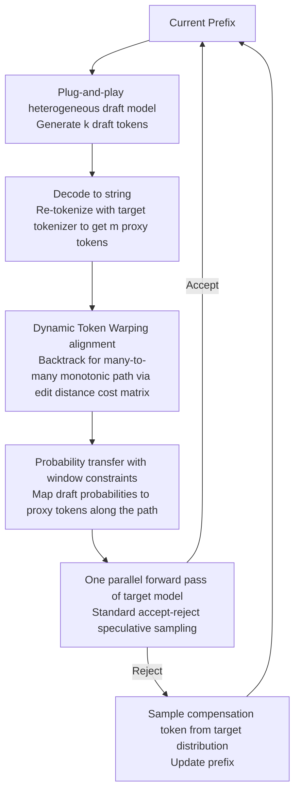

# TokenTiming: A Dynamic Alignment Method for Universal Speculative Decoding Model Pairs

**Conference**: ACL2026  
**arXiv**: [2510.15545](https://arxiv.org/abs/2510.15545)  
**Code**: TBD  
**Area**: Time Series / LLM Inference Acceleration  
**Keywords**: Speculative Decoding, Heterogeneous Vocabulary, Dynamic Time Warping, Inference Acceleration, Probability Mapping

## TL;DR
TokenTiming re-encodes the token sequences generated by draft models into the target tokenizer space and constructs many-to-many token alignments using Dynamic Time Warping (DTW). This allows off-the-shelf small models with different vocabularies to serve as draft models for speculative decoding, achieving up to 1.57x acceleration in heterogeneous speculative decoding across several 14B-70B target models.

## Background & Motivation
**Background**: Speculative decoding is a practical category of methods for accelerating LLM inference: a small draft model first rapidly proposes multiple candidate tokens, and a large target model verifies these candidates in a single parallel forward pass. If the candidate distribution is sufficiently close to the target distribution, the number of target model calls can be reduced without changing the final generation distribution.

**Limitations of Prior Work**: Standard speculative decoding assumes the draft model and target model share the same vocabulary; otherwise, draft token probabilities cannot be directly used for accept-reject sampling against target tokens. In practice, this is very restrictive as many strong models use independent tokenizers. Even if small versions within the same model family share a vocabulary, the small models may still be too large to provide sufficient acceleration gains. Re-training Medusa/EAGLE-style draft heads for each target model incurs additional training costs and model switching overhead.

**Key Challenge**: The "lossless" property of speculative decoding depends on strict correction at the probability distribution level, but heterogeneous tokenizers segment the same string into tokens of different granularities. Existing TLI (Token-Level Intervention) only transfers probabilities over the intersection of vocabularies, often degrading to incomplete correction when encountering out-of-vocabulary tokens. SLEM supports string matching but cannot support probability sampling. In essence, there is a direct conflict between universality and lossless verification.

**Goal**: The authors aim to allow any off-the-shelf small model to serve as a draft model without training, model modification, or shared vocabulary requirements. Meanwhile, it is necessary to maintain distribution consistency in speculative sampling and ensure that the additional alignment overhead is small enough not to consume the acceleration gains.

**Key Insight**: The paper observes that the problem of heterogeneous tokenizers is essentially like sequence alignment on two "timelines": the draft token sequence and the proxy target token sequence (re-tokenized from the draft string) have different lengths and local granularities, but they describe the same string. Dynamic Time Warping (DTW) excels at finding monotonic, many-to-many minimum cost paths between sequences of different lengths.

**Core Idea**: Use DTW to establish a dynamic alignment path between draft tokens and target proxy tokens, then transfer draft probabilities onto target tokens along this path to execute standard speculative sampling with the mapped probabilities.

## Method

### Overall Architecture
TokenTiming is a purely inference-time algorithm. In each decoding step, starting from the current prefix, the draft model generates a draft token sequence of length $k$. The system decodes these draft tokens into a string and then re-tokenizes them using the target tokenizer to obtain a proxy target token sequence. Due to different tokenizers, the draft sequence length $k$ and the proxy sequence length $m$ are usually different, and local token boundaries are misaligned.

Subsequently, TokenTiming runs Dynamic Token Warping on these two token sequences to obtain a monotonic alignment path. Nodes in the path can have one-to-one, one-to-many, or many-to-one relationships, covering cases where "Scaling" is a single token in one tokenizer and multiple sub-tokens in another. Finally, the algorithm maps draft probabilities to proxy target tokens according to this path. The target model performs a single parallel forward pass on the proxy sequence, accepting or rejecting tokens one by one according to standard speculative sampling rules. Once rejected, a compensation token is sampled from the target distribution to update the prefix.

### Key Designs

**1. Dynamic Token Warping Alignment: Replacing "vocabulary intersection matching" with many-to-many dynamic alignment along string sequences**

The difficulty with heterogeneous tokenizers lies in the same string being segmented into tokens of different granularities and positions, leading to unequal lengths $k$ and $m$. While TLI only transfers probabilities on the vocabulary intersection—making it fail for tokens outside that intersection—TokenTiming treats this as a sequence alignment problem. The algorithm constructs a cumulative cost matrix $C$, using Levenshtein edit distance for local distances. Each position takes the minimum cumulative cost from the top, left, and top-left, eventually backtracking the optimal path $\pi^*$ from the end.

This path is not based on whether tokens are identical but is a dynamic alignment determined by string similarity and sequence order. Nodes can be one-to-one, one-to-many, or many-to-one, which naturally handles discrepancies like "Scaling" being one token in one side and split into multiple sub-tokens in the other. Since misalignment in heterogeneous segmentation is usually local and monotonic, DTW handles granularity differences between BPE and WordPiece more naturally than TLI by allowing local stretching or compression while maintaining order.

**2. Windowed Probability Transfer: enabling standard speculative sampling formulas to hold on mapped draft probabilities**

The key to lossless speculative decoding is not just making token strings look consistent, but providing a reasonable draft probability for the accept-reject correction. The alignment path provides the correspondence between draft token blocks and target token blocks. TokenTiming allocates draft-side probabilities to proxy target tokens along the path. During verification, the standard acceptance probability is still used:

$$\min\left(1,\ \frac{q(t_j)}{p(t_j)}\right)$$

where $q$ is from the target model and $p$ is from the mapped draft distribution. To prevent DTW alignment overhead from negating acceleration gains, the authors add a Sakoe-Chiba Band, searching only within a ribbon region where $|i-j| \leq w$, reducing complexity from $O(km)$ to $O(w\max(k,m))$. The window constraint exploits the fact that segmentation misalignment usually does not drift infinitely, yielding a more stable probability mapping with minimal cost and avoiding interference between tokens at distant positions.

**3. Plug-and-play Heterogeneous Draft Model: packing all tokenizer differences into lightweight alignment between Draft-Verify rounds**

The real difficulty in deploying speculative decoding is not the algorithm form, but "finding a small draft model with the same vocabulary for every target." TokenTiming keeps both target and draft model weights unchanged; all tokenizer differences are handled in the re-tokenization + DTW alignment + probability mapping steps. Thus, draft models ranging from 68M Vicuna to 350M OPT, and then to 0.5B/0.6B Qwen, can be flexibly integrated. Target models can cover dense, distilled, and MoE architectures. Once heterogeneous vocabularies are no longer a hard constraint, the system can prioritize draft models based on speed, capability, and deployment conditions.

### Loss & Training
TokenTiming does not train models and introduces no new parameters. It only adds re-tokenization, DTW alignment, and probability mapping steps during inference. Experiments compared different window widths $w=4,8,16,\infty$, finding that a suitable local window (e.g., $w=8$) is better than unrestricted alignment because it reduces overhead and prevents probability mapping distortion caused by distant tokens. The paper reports a per-round blocking overhead of approximately 663 microseconds, accounting for 0.1%-0.5% of total runtime, which is significantly smaller than the gains from throughput improvement.

## Key Experimental Results

### Main Results
The authors evaluated 25 target/draft model combinations on Spec-Bench, covering tasks like math, code, translation, summarization, and QA. The table below extracts representative combinations with values for TPS, acceptance rate, and relative speedup over AR from Table 1 of the paper.

| Target Model | Draft Model | TLI TPS | TokenTiming TPS | TLI Acc. Rate | TokenTiming Acc. Rate | TLI Gain | TokenTiming Gain |
|----------|------------|---------|-----------------|------------|--------------------|----------|------------------|
| DeepSeek-R1-Distill-Llama-70B | Qwen2.5-0.5B | 15.68 | 19.26 | 0.34 | 0.40 | 1.07x | 1.31x |
| DeepSeek-R1-Distill-Llama-70B | OPT-350M | 16.03 | 21.35 | 0.19 | 0.31 | 1.09x | 1.45x |
| Qwen3-32B | Qwen3-0.6B | 19.16 | 24.78 | 0.43 | 0.42 | 1.21x | 1.57x |
| Phi-4 | Qwen2.5-0.5B | 17.64 | 35.58 | 0.19 | 0.39 | 0.76x | 1.54x |

From these results, the gains of TokenTiming do not come from a single model family alone. On OPT/Vicuna drafts with low vocabulary overlap, it still provides usable acceleration; on target models like Qwen3-32B and Phi-4, DTW alignment significantly expands the token probability space that TLI could not exploit.

### Ablation Study
The paper compared the acceleration of TLI and TokenTiming by task category. Representative results are shown below, illustrating the stability of the method across different generation tasks.

| Target / Draft | Math TLI→Ours | Code TLI→Ours | Translation TLI→Ours | Summarization TLI→Ours | QA TLI→Ours |
|--------------|---------------|---------------|---------------|---------------|-------------|
| DeepSeek-R1-70B / Qwen2.5-0.5B | 1.03x→1.48x | 1.05x→1.34x | 1.62x→2.54x | 0.94x→1.07x | 0.99x→1.08x |
| Qwen3-32B / Qwen2.5-0.5B | 1.44x→2.53x | 1.29x→1.80x | 1.91x→2.49x | 1.41x→1.28x | 1.01x→1.13x |
| Phi-4 / Qwen2.5-0.5B | 0.90x→1.57x | 0.94x→1.60x | 0.67x→1.31x | 0.71x→1.55x | 0.76x→1.55x |

Another important analysis is the distance from SOTA methods using the same vocabulary: on a 7B target, EAGLE-3 reaches 2.58x, while TLI peaks at around 1.32x, and TokenTiming-OPT-350M improves this to 1.80x. On a 33B target, TokenTiming-OPT-350M reaches 2.27x, exceeding Medusa's 1.71x and EAGLE-1's 2.21x, trailing EAGLE-3's 2.71x by only 0.44x.

### Key Findings
- The value of DTW is most evident in heterogeneous vocabulary scenarios: when the vocabulary intersection is insufficient to cover draft outputs, TLI loses much correctable probability, whereas TokenTiming can still establish mappings along the string sequence.
- Window constraints are not purely for saving time. The paper found $w=8$ to be better than unrestricted alignment, indicating that excessively wide alignment introduces unstable far-distance token mapping.
- The method needs to exclude inflated speeds caused by repetitive generation. The authors removed approximately 15% of pathological repetitive samples from the main analysis to avoid artificially raising acceptance rates and speedups because "repetitive tokens are too easy to predict."

## Highlights & Insights
- Reformulating tokenizer mismatch as sequence timeline alignment is very ingenious. It bypasses the discrete hard condition of "vocabulary intersection" and utilizes the monotonic structure at the string level to provide a continuous bridge for probability transfer.
- The engineering stance is very practical: no training, no model changes, and no binding to the same model family, performing only lightweight alignment during inference. For real inference services, this is easier to deploy than maintaining dedicated draft heads for every target model.
- The paper's treatment of the "lossless" issue is more serious than simple string matching. TokenTiming does not just generate identical-looking text; it puts the mapped draft probabilities back into standard speculative sampling acceptance rules to preserve target model distribution consistency as much as possible.

## Limitations & Future Work
- The paper acknowledges that the current probability transfer is close to one-hot, mainly transferring top-1 token probabilities directly, and has not yet fully utilized the probability mass of more candidate tokens in the draft distribution.
- The distance in DTW is based on character/edit distance rather than semantic distance. For mixed Chinese and English, Unicode symbols, or morphologically rich languages, character similarity does not necessarily equate to a reasonable token probability correspondence.
- Although experiments cover various tasks and models, they primarily evaluate offline benchmarks. System factors in real serving like batch scheduling, KV cache management, and multi-user latency tails still need further verification.
- Future work could explore semantic-aware or tokenizer-aware distance functions, and extend probability allocation from "direct assignment on the path" to local soft alignment to further reduce mismatch risks.

## Related Work & Insights
- **vs TLI**: TLI transfers probabilities on the intersection of draft/target vocabularies. It is simple, but handling of tokens outside the intersection is incomplete. TokenTiming constructs complete token paths via DTW, allowing it to handle draft models with very small vocabulary intersections.
- **vs RDK**: RDK redistributes draft distributions to target distributions via matrices, an approach closer to global vocabulary mapping. TokenTiming leans toward online sequence alignment dependent on the current generated string, thus not requiring pre-learned or constructed large-scale vocabulary conversion matrices.
- **vs Medusa / EAGLE**: Medusa and EAGLE achieve strong acceleration through additional draft heads or specialized training but are usually bound to the target model. TokenTiming still has a gap in acceleration but offers cross-model plug-and-play capability.

## Rating
- Novelty: ⭐⭐⭐⭐☆ Using DTW to solve heterogeneous tokenizer speculative decoding is natural yet elegantly framed. The core contribution lies in the problem reformulation and the implementation of probability mapping.
- Experimental Thoroughness: ⭐⭐⭐⭐☆ Model combinations, task types, and window analysis are relatively complete, though evaluation in real serving scenarios could be stronger.
- Writing Quality: ⭐⭐⭐⭐☆ The main line is clear and illustrations are intuitive; some table layouts and probability mapping details could be further refined.
- Value: ⭐⭐⭐⭐⭐ Heterogeneous draft models are a key bottleneck for speculative decoding deployment. This paper provides a low-cost, deployable, and universal pathway.

<!-- RELATED:START -->

## Related Papers

- [\[ACL 2026\] Multi-Drafter Speculative Decoding with Alignment Feedback](multi-drafter_speculative_decoding_with_alignment_feedback.md)
- [\[CVPR 2026\] ParallelVLM: Lossless Video-LLM Acceleration with Visual Alignment Aware Parallel Speculative Decoding](../../CVPR2026/llm_efficiency/parallelvlm_lossless_video-llm_acceleration_with_visual_alignment_aware_parallel.md)
- [\[NeurIPS 2025\] 3-Model Speculative Decoding (PyramidSD)](../../NeurIPS2025/llm_efficiency/3model_speculative_decoding.md)
- [\[ACL 2026\] Speculative Verification: Exploiting Information Gain to Refine Speculative Decoding](speculative_verification_exploiting_information_gain_to_refine_speculative_decod.md)
- [\[ACL 2026\] RACER: Retrieval-Augmented Contextual Rapid Speculative Decoding](racer_retrieval-augmented_contextual_rapid_speculative_decoding.md)

<!-- RELATED:END -->
