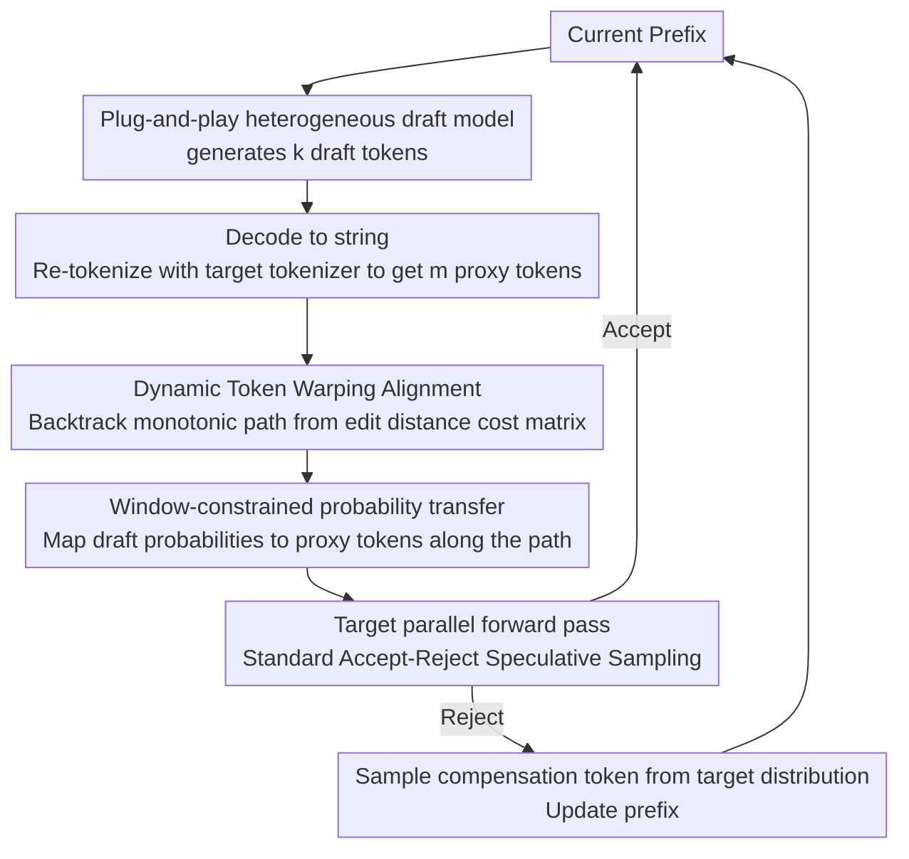

# TokenTiming: A Dynamic Alignment Method for Universal Speculative Decoding Model Pairs

**Conference**: ACL2026  
**arXiv**: [2510.15545](https://arxiv.org/abs/2510.15545)  
**Code**: To be confirmed  
**Area**: Time Series / LLM Inference Acceleration  
**Keywords**: Speculative Decoding, Heterogeneous Vocabularies, Dynamic Time Warping, Inference Acceleration, Probability Mapping

## TL;DR
TokenTiming re-encodes token sequences generated by a draft model into the target tokenizer space and utilizes Dynamic Time Warping (DTW) to construct many-to-many token alignments. This enables off-the-shelf small models with different vocabularies to serve as draft models for speculative decoding, achieving up to 1.57x speedup on various 14B-70B target models.

## Background & Motivation
**Background**: Speculative decoding is a practical method for accelerating LLM inference. A small draft model first rapidly proposes multiple candidate tokens, which are then verified in parallel by a larger target model in a single forward pass. If the candidate distribution is sufficiently close to the target distribution, the number of target model calls can be reduced without altering the final generation distribution.

**Limitations of Prior Work**: Standard speculative decoding typically requires the draft and target models to share the same vocabulary; otherwise, draft token probabilities cannot be directly used for accept-reject sampling against target token probabilities. In practice, this is a severe constraint as many powerful models use independent tokenizers. Even within the same model family, small versions might still be too large to provide significant acceleration gains. Re-training Medusa/EAGLE-style draft heads for every target model introduces substantial training and model-switching costs.

**Key Challenge**: The "lossless" nature of speculative decoding relies on strict calibration at the probability distribution level. However, heterogeneous tokenizers partition the same string into tokens of different granularities. Existing TLI (Token-Level Interpretation) only transfers probabilities within the intersection of vocabularies, often degrading to incomplete calibration for out-of-vocabulary tokens. SLEM supports string matching but lacks support for probability sampling. Thus, a direct conflict exists between universality and lossless verification.

**Goal**: The authors aim to enable any off-the-shelf small model to serve as a draft model without training, model modification, or shared vocabulary requirements. Simultaneously, the method must maintain the distribution consistency of speculative sampling while ensuring the alignment overhead is minimal enough not to offset acceleration gains.

**Key Insight**: The paper observes that the issue of heterogeneous tokenizers is essentially a sequence alignment problem across two "timelines." The draft token sequence and the proxy token sequence (re-tokenized by the target tokenizer) differ in length and local granularity but describe the same string. Dynamic Time Warping (DTW) is particularly adept at finding monotonic, many-to-many minimum-cost paths between sequences of varying lengths.

**Core Idea**: Use DTW to establish a dynamic alignment path between draft tokens and target proxy tokens, then map draft probabilities onto the target tokens along this path to execute standard speculative sampling with the mapped probabilities.

## Method

### Overall Architecture
TokenTiming is a pure inference-time algorithm. In each decoding round, starting from the current prefix, the draft model generates a sequence of $k$ draft tokens. The system decodes these into a string and re-tokenizes it using the target tokenizer to obtain a sequence of $m$ proxy target tokens. Due to the differing tokenizers, the draft length $k$ and proxy length $m$ are usually unequal, and local token boundaries are not aligned.

Subsequently, TokenTiming runs Dynamic Token Warping on these two sequences to obtain a monotonic alignment path. Nodes in the path may represent one-to-one, one-to-many, or many-to-one relationships, effectively covering cases where a word is a single token in one tokenizer but multiple sub-tokens in another. Finally, the algorithm maps draft probabilities to proxy target tokens according to this path. The target model performs a parallel forward pass on the proxy sequence, and tokens are accepted or rejected sequentially following standard speculative sampling rules. If rejected, a compensation token is sampled from the target distribution to update the prefix.

### Key Designs

**1. Dynamic Token Warping Alignment: Replacing "vocabulary intersection matching" with many-to-many dynamic alignment along the string sequence**

The difficulty with heterogeneous tokenizers is that the same string is sliced into tokens of different granularities and positions. TokenTiming treats this as a sequence alignment problem. The algorithm constructs a cumulative cost matrix $C$, where local distances are primarily based on Levenshtein edit distance. Each position takes the minimum cumulative cost from the top, left, and top-left neighbors, and the optimal path $\pi^*$ is backtracked from the terminal point. This path accounts for cases where one tokenizer's single token corresponds to multiple sub-tokens in the other. Since misalignment in heterogeneous tokenization is usually local and monotonic, DTW accommodates local stretching or compression more naturally than TLI when handling BPE or WordPiece differences.

**2. Window-constrained Probability Transfer: Maintaining standard speculative sampling formulas with mapped draft probabilities**

The key to lossless speculative decoding is providing a reasonable draft probability for accept-reject calibration. The alignment path reveals the relationship between draft token blocks and target token blocks. TokenTiming distributes draft-side probabilities to proxy target tokens along the path. During verification, the standard acceptance probability is still applied:

$$\min\left(1,\ \frac{q(t_j)}{p(t_j)}\right)$$

where $q$ is from the target model and $p$ is from the mapped draft distribution. To prevent DTW overhead from consuming acceleration gains, the authors introduce a Sakoe-Chiba Band, searching only within a band where $|i-j| \leq w$, reducing complexity from $O(km)$ to $O(w\max(k,m))$. This constraint exploits the fact that tokenization misalignment typically does not drift indefinitely.

**3. Plug-and-play Heterogeneous Draft Model: Encapsulating tokenizer differences within lightweight alignment**

The real barrier to deploying speculative decoding is finding a small draft model with a matching vocabulary for every target. TokenTiming keeps the weights of both models fixed; all tokenizer differences are handled during re-tokenization, DTW alignment, and probability mapping. Consequently, draft models ranging from Vicuna (68M) to OPT (350M) and Qwen (0.5B/0.6B) can be freely integrated across diverse target architectures (dense, distilled, or MoE).

### Loss & Training
TokenTiming involves no model training and introduces no new parameters. It only adds re-tokenization, DTW alignment, and probability mapping steps during inference. Experiments comparing window widths $w=4,8,16,\infty$ found that a local window (e.g., $w=8$) is more beneficial than unconstrained alignment, as it reduces overhead and prevents probability distortion from distant tokens. The per-round overhead is approximately 663 microseconds, accounting for roughly 0.1%-0.5% of the total runtime.

## Key Experimental Results

### Main Results
The authors evaluated 25 target/draft model pairs on Spec-Bench across tasks like math, code, translation, summarization, and QA. Representative combinations are shown below (values for TPS, acceptance rate, and relative speedup).

| Target Model | Draft Model | TLI TPS | TokenTiming TPS | TLI Accept Rate | TokenTiming Accept Rate | TLI Gain | TokenTiming Gain |
|----------|------------|---------|-----------------|------------|--------------------|----------|------------------|
| DeepSeek-R1-Distill-Llama-70B | Qwen2.5-0.5B | 15.68 | 19.26 | 0.34 | 0.40 | 1.07x | 1.31x |
| DeepSeek-R1-Distill-Llama-70B | OPT-350M | 16.03 | 21.35 | 0.19 | 0.31 | 1.09x | 1.45x |
| Qwen3-32B | Qwen3-0.6B | 19.16 | 24.78 | 0.43 | 0.42 | 1.21x | 1.57x |
| Phi-4 | Qwen2.5-0.5B | 17.64 | 35.58 | 0.19 | 0.39 | 0.76x | 1.54x |

TokenTiming remains effective even with draft models like OPT/Vicuna which have low vocabulary overlap. For target models like Phi-4, DTW alignment significantly expands the usable probability space that TLI fails to capture.

### Ablation Study
The paper compares TLI and TokenTiming across task categories.

| Target / Draft | Math TLI→Ours | Code TLI→Ours | Translation TLI→Ours | Summarization TLI→Ours | QA TLI→Ours |
|--------------|---------------|---------------|---------------|---------------|-------------|
| DeepSeek-R1-70B / Qwen2.5-0.5B | 1.03x→1.48x | 1.05x→1.34x | 1.62x→2.54x | 0.94x→1.07x | 0.99x→1.08x |
| Qwen3-32B / Qwen2.5-0.5B | 1.44x→2.53x | 1.29x→1.80x | 1.91x→2.49x | 1.41x→1.28x | 1.01x→1.13x |
| Phi-4 / Qwen2.5-0.5B | 0.90x→1.57x | 0.94x→1.60x | 0.67x→1.31x | 0.71x→1.55x | 0.76x→1.55x |

On a 33B target, TokenTiming-OPT-350M reaches 2.27x acceleration, surpassing Medusa (1.71x) and EAGLE-1 (2.21x), and narrowing the gap to EAGLE-3 (2.71x).

### Key Findings
- DTW is most valuable when the vocabulary intersection is insufficient to cover draft outputs.
- A window constraint ($w=8$) is superior to unrestricted alignment as it avoids unstable mappings between distant tokens.
- Pathological repeated samples (approx. 15%) were removed from the primary analysis to prevent artificial inflation of acceptance rates and speedup by "easily predictable" tokens.

## Highlights & Insights
- Reformulating tokenizer mismatch as sequence alignment on a timeline is an elegant solution that leverages the monotonic structure of strings.
- The engineering approach is highly practical: no training, no model modification, and no model-family binding.
- The method treats the "lossless" requirement strictly by integrating mapped probabilities back into standard acceptance rules rather than relying on simple string matching.

## Limitations & Future Work
- Current probability transfer is near-one-hot, primarily transferring top-1 token probabilities and not yet fully exploiting the full tail of the draft distribution.
- DTW distance is based on edit distance rather than semantic distance, which may be less effective for languages with rich morphology or complex Unicode symbols.
- Evaluation is primarily on offline benchmarks; system factors like batch scheduling and KV cache management in production environments require further validation.

## Related Work & Insights
- **vs TLI**: TLI transfers probabilities only on vocabulary intersections; TokenTiming uses DTW for a complete path, handling draft models with minimal overlap.
- **vs RDK**: RDK reassigns distributions via matrices (global vocabulary mapping); TokenTiming uses online sequence alignment tied to the current string.
- **vs Medusa / EAGLE**: Specialized heads provide stronger acceleration but are tied to specific targets; TokenTiming prioritizes cross-model plug-and-play capability.

## Rating
- Novelty: ⭐⭐⭐⭐☆ Using DTW for heterogeneous speculative decoding is a natural yet clever application with strong implementation details.
- Experimental Thoroughness: ⭐⭐⭐⭐☆ Covers various model pairs and window analyses, though serving-level evaluation could be expanded.
- Writing Quality: ⭐⭐⭐⭐☆ Clear narrative and intuitive diagrams.
- Value: ⭐⭐⭐⭐⭐ Addresses a critical bottleneck in deploying speculative decoding by providing a low-cost, universal pathway.

<!-- RELATED:START -->

## Related Papers

- [\[ACL 2026\] Multi-Drafter Speculative Decoding with Alignment Feedback](multi-drafter_speculative_decoding_with_alignment_feedback.md)
- [\[ICML 2026\] VIA-SD: Verification via Intra-Model Routing for Speculative Decoding](../../ICML2026/llm_efficiency/via-sd_verification_via_intra-model_routing_for_speculative_decoding.md)
- [\[ACL 2026\] Speculative Verification: Exploiting Information Gain to Refine Speculative Decoding](speculative_verification_exploiting_information_gain_to_refine_speculative_decod.md)
- [\[NeurIPS 2025\] 3-Model Speculative Decoding (PyramidSD)](../../NeurIPS2025/llm_efficiency/3model_speculative_decoding.md)
- [\[ACL 2026\] RACER: Retrieval-Augmented Contextual Rapid Speculative Decoding](racer_retrieval-augmented_contextual_rapid_speculative_decoding.md)

<!-- RELATED:END -->
