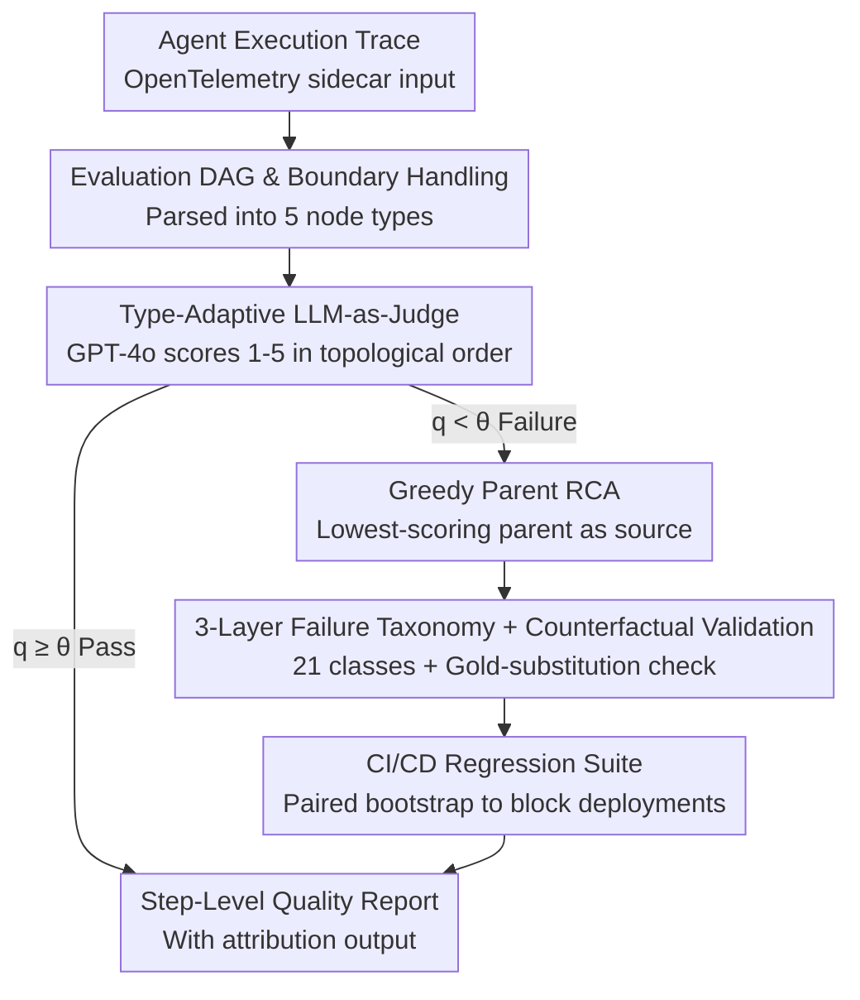

# AgentEval: DAG-Structured Step-Level Evaluation for Agentic Workflows with Error Propagation Tracking

**Conference**: ACL 2026  
**arXiv**: [2604.23581](https://arxiv.org/abs/2604.23581)  
**Code**: https://github.com/bettyguo/AgentEval (Available)  
**Area**: LLM Agent Evaluation / Software Engineering  
**Keywords**: agent evaluation, DAG, LLM-as-judge, root cause analysis, regression detection

## TL;DR
AgentEval models agent execution trajectories as "Evaluation DAGs," assigns GPT-4o as a judge to score nodes across 5 types, and traces root causes via a greedy parent strategy. Combined with a 21-category failure taxonomy and CI/CD integration, it achieves a 2.17× improvement in failure detection recall (0.41→0.89) over end-to-end evaluation on 450 production traces. It demonstrates human consistency of $\kappa=0.84$, root cause accuracy of 72% (approaching the human upper bound of 81%), and reduced median root cause localization time from 4.2 hours to 22 minutes in a 4-month pilot.

## Background & Motivation

**Background**: 62% of organizations are experimenting with agents, and 23% are scaling deployments. However, agent evaluation relies heavily on end-to-end (E2E) results (task completion) or manual trace reviews—the former masks intermediate errors, while the latter is unscalable. Gartner predicts that 40% of agent projects will be canceled by 2027 due to a lack of systematic evaluation.

**Limitations of Prior Work**: (1) E2E evaluation only considers the final state, failing to identify where errors originate or how they cascade; (2) Static benchmarks like AgentBench, SWE-bench, and WebArena focus on "capability" rather than "deployment" infrastructure, making them unsuitable for continuous monitoring or CI/CD regression detection; (3) Observability tools like LangSmith, Phoenix, and AgentOps provide trace views but lack formal dependency modeling and error propagation tracking; (4) Process supervision literature suggests evaluating intermediate steps is superior to outcome-only evaluation, but primarily for training (PRMs) rather than inference-time engineering infrastructure.

**Key Challenge**: Agent workflows are inherently DAGs, where errors compound along dependency chains (63% of step-level failures are propagated from upstream). Industrial evaluation remains stuck at either E2E metrics or flat step-level scoring that is decoupled from the DAG structure.

**Goal**: (1) Formalize agent execution as a DAG; (2) Define calibratable step-level quality metrics for each node type; (3) Provide automated attribution from failure to root cause; (4) Integrate these capabilities into CI/CD for regression detection.

**Key Insight**: Adapting spectrum-based fault localization from software engineering to agent traces, replacing hard rules with semantic scoring via LLM-as-judge, and isolating the "DAG structure" variable through ablation to quantify its impact.

**Core Idea**: "Neither E2E testing of success nor flat step-level quality assessment, but rather using a DAG to explicitly track whether a failure was propagated from upstream or locally generated, providing actionable root causes based on dependencies."

## Method

### Overall Architecture
AgentEval is an OpenTelemetry-compatible sidecar evaluation service that takes an agent execution trace and outputs a step-level quality report with root cause attribution. A trace is first parsed into an "Evaluation DAG" $\mathcal{G}=(V,E,\tau,\mathcal{M})$, where node types $\tau$ are drawn from the set $\{\text{Plan, ToolSel, ParamGen, Exec, Synth}\}$, each with specific metrics. A GPT-4o judge then scores each node on a 1-5 rubric in topological order. Failed nodes are traced back to their root cause along dependency chains. Failures are mapped to a 3-layer, 21-category taxonomy for post-hoc clustering. Finally, these capabilities are integrated into a CI/CD suite using paired significance tests to block regressions.

### Key Designs

**1. Evaluation DAG & Boundary Handling: Tracing Dependency Context**
Flat evaluation fails to capture cascades, such as context truncation in step 3 ruining subsequent steps. AgentEval uses a pragmatic compromise: nodes $v_i$ are evaluated after topological sorting, where context $c_i$ aggregates parent $\mathrm{pa}(v_i)$ outputs but excludes parent judge scores (to avoid judge bias). If $q(v_i)<\theta_{\tau(v_i)}$ indicates failure, and multiple parents are below threshold, a greedy strategy selects the lowest-scoring parent $v_j^*=\arg\min_{v_j\in\mathrm{pa}(v_i)}q(v_j)$ as the propagation source; otherwise, it is marked as the root cause. Pilot testing showed 72% of attributions are within $\leq 1$ hop of the true root cause.

**2. Type-Adaptive LLM-as-Judge & Asymmetric Prompts**
The five node types are highly heterogeneous: Plan (completeness/feasibility), ToolSel (accuracy/relevance), ParamGen (type/value/completeness), Exec (success rate/validity), and Synth (faithfulness/cohesion). The judge (GPT-4o, $T{=}0$) uses specific metric sets for each and must belong to a different model family than the agent (e.g., Claude or Llama) to avoid cycle bias. Asymmetric prompts ensure that while Plan nodes are evaluated against the user query, downstream nodes are only evaluated against their local context to avoid penalizing a step that correctly handled an upstream bug.

**3. 3-Layer Failure Taxonomy & Counterfactual Root Cause Validation**
Failures are mapped to 3 layers, 9 L2 categories, and 21 L3 subcategories (e.g., Integration → Premature termination → Truncation). To validate root cause attribution, the paper introduces counterfactual validation: for 30 failed traces, the identified root cause step was replaced with a gold reference output. In 87% (26/30) of cases, downstream scores improved (avg +2.3 points), proving that fixing the identified root cause effectively resolves the downstream failure.

### Loss & Training
AgentEval is an inference-time framework and has no training loss. Thresholds $\theta_\tau$ are calibrated per type. Regression detection utilizes paired bootstrap ($p<0.05$, 10,000 resamples) with dual-threshold alerts at $2\sigma$ of historical variance. Progressive evaluation uses a 10-trace smoke test to gate the full suite, reducing evaluation costs by 80%.

## Key Experimental Results

### Main Results
Evaluated on 450 production traces across CS, DA, and DP workflows, plus a 150-trace human-annotated subset (987 steps):

| Method | FDRec ↑ | FPR ↓ | HA ($\kappa$) ↑ | RCA ↑ |
|------|---------|-------|-----------------|-------|
| E2E Only | 0.41 | 0.08 | 0.52 | N/A |
| Flat Step | 0.67 | 0.15 | 0.71 | 0.38 |
| Rule-Based (47 rules) | 0.58 | 0.05 | 0.63 | 0.45 |
| **Ours (AgentEval)** | **0.89** | 0.07 | **0.84** | **0.72** |

FDRec measures failure detection recall for human-labeled failures. Ours improves recall by 2.17× over E2E and +22 pp over Flat Step, isolating the contribution of the DAG structure.

### Ablation Study
Impact of four components (metrics after removal):

| Configuration | FDRec ↑ | HA ↑ | RCA ↑ | Note |
|------|---------|------|-------|------|
| Full AgentEval | 0.89 | 0.84 | 0.72 | Complete framework |
| −DAG Structure | 0.67 | 0.71 | 0.38 | Largest drop (−22 pp / −34 pp) |
| −LLM-as-judge (Rules) | 0.62 | 0.66 | 0.51 | Second largest drop |
| −Failure Taxonomy | 0.82 | 0.79 | 0.54 | Primarily affects RCA (−18 pp) |
| −Calibration anchors | 0.85 | 0.76 | 0.68 | Primarily affects $\kappa$ (−8 pp) |

### Key Findings
- The DAG structure is the most critical component—the simultaneous drop in FDRec and RCA shows that dependency modeling not only detects more failures but correctly identifies their origin.
- Advantage scales with workflow length: FDRec gain is +15 pp for $\leq 3$ steps but +28 pp for $\geq 6$ steps, supporting the "error amplification" hypothesis.
- Generalization: On $\tau$-bench and SWE-bench, FDRec remains $\geq 0.78$ without taxonomy changes, though RCA drops by 14-20 pp, suggesting root cause attribution requires domain-specific taxonomy extensions.
- 4-month pilot (18 engineers): Detected 23 pre-release regressions; reduced failure rate of CS-agent from 31% to 18% by fixing a specific context truncation bug.

## Highlights & Insights
- Combining DAG-as-evaluation-structure with LLM-as-judge is the key engineering unlock—the former solves error propagation visibility, while the latter addresses rule brittleness.
- Counterfactual root cause validation (replacing steps with gold outputs to check downstream recovery) is a highly persuasive paradigm for RCA validation, applicable to process supervision and reasoning chain debugging.
- The observation "the judge doesn't need to be stronger than the agent" is counterintuitive but practical—scheduling cheaper judges for large-scale evaluation compresses costs without sacrificing detection.

## Limitations & Future Work
- Primarily suited for sequential or moderately branched tool-calling agents; advantage drops below +5 pp for non-DAG structures (e.g., multi-agent collaboration, long reasoning loops, Tree-of-Thought).
- Core experiments were conducted in specific domains. While generalization is demonstrated, RCA effectiveness remains dependent on domain taxonomy.
- LLM-as-judge exhibits model-related biases; while cross-family evaluation mitigates this, it does not eliminate it. RCA remains a greedy heuristic rather than formal causal inference.

## Related Work & Insights
- **vs. Process Supervision (Lightman 2024, Uesato 2022)**: Both emphasize intermediate evaluation, but they use PRMs for training rewards. AgentEval treats it as inference-time deployment infrastructure.
- **vs. LangSmith/Phoenix/AgentOps**: These tools offer trace views but lack formal DAG dependencies and attribution; AgentEval is the first to integrate these into a framework with quantified gains.
- **vs. Spectrum-based Fault Localization (Jones 2005)**: Borrowing root cause concepts but substituting hard rules with LLM-as-judge for semantic scoring.

## Rating
- Novelty: ⭐⭐⭐⭐ Integrated several concepts (process supervision, LLM judge, SBFL); key highlight is the systemization of DAG-as-evaluation-structure.
- Experimental Thoroughness: ⭐⭐⭐⭐⭐ 450 traces + 4 judge models + cross-benchmark + 4-month pilot + counterfactual validation.
- Writing Quality: ⭐⭐⭐⭐ High data transparency regarding CI, $\kappa$, and RCA strategies.
- Value: ⭐⭐⭐⭐⭐ Directly addresses agent production pain points with 4 months of deployment evidence.

<!-- RELATED:START -->

## Related Papers

- [\[ACL 2026\] TaxPraBen: A Scalable Benchmark for Structured Evaluation of LLMs in Chinese Real-World Tax Practice](taxpraben_a_scalable_benchmark_for_structured_evaluation_of_llms_in_chinese_real.md)
- [\[ACL 2026\] MultiFileTest: A Multi-File-Level LLM Unit Test Generation Benchmark and Impact of Error Fixing Mechanisms](multifiletest_a_multi-file-level_llm_unit_test_generation_benchmark_and_impact_o.md)
- [\[ACL 2026\] HoWToBench: Holistic Evaluation for LLM's Capability in Human-level Writing using Tree of Writing](howtobench_holistic_evaluation_for_llms_capability_in_human-level_writing_using_.md)
- [\[ICML 2026\] Beyond Trajectory-Level Attribution: Graph-Based Credit Assignment for Agentic Reinforcement Learning](../../ICML2026/llm_evaluation/beyond_trajectory-level_attribution_graph-based_credit_assignment_for_agentic_re.md)
- [\[ICLR 2026\] Talk, Evaluate, Diagnose: User-aware Agent Evaluation with Automated Error Analysis](../../ICLR2026/llm_evaluation/talk_evaluate_diagnose_user-aware_agent_evaluation_with_automated_error_analysis.md)

<!-- RELATED:END -->
