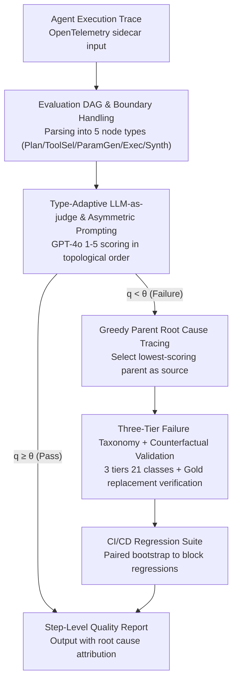

# AgentEval: DAG-Structured Step-Level Evaluation for Agentic Workflows with Error Propagation Tracking

**Conference**: ACL 2026  
**arXiv**: [2604.23581](https://arxiv.org/abs/2604.23581)  
**Code**: https://github.com/bettyguo/AgentEval (Available)  
**Area**: LLM Agent Evaluation / Software Engineering  
**Keywords**: agent evaluation, DAG, LLM-as-judge, root cause analysis, regression detection

## TL;DR
AgentEval models agent execution traces as "Evaluation DAGs," using GPT-4o as a judge to score nodes across five types and trace root causes through a greedy parent strategy. Combined with 21 failure categories and CI/CD integration, it achieved a 2.17× improvement in failure detection recall (0.41→0.89) over end-to-end evaluation on 450 production traces. It reached human consistency of $\kappa=0.84$, root cause accuracy of 72% (approaching the human limit of 81%), and reduced the median root cause localization time from 4.2 hours to 22 minutes in a 4-month pilot.

## Background & Motivation

**Background**: Currently, 62% of organizations are experimenting with agents, and 23% are scaling deployments. However, agent evaluation relies primarily on end-to-end results (task completion) or manual trace reviews; the former masks intermediate errors, while the latter is not scalable. Gartner predicts that by 2027, 40% of agent projects will be canceled due to a lack of systematic evaluation.

**Limitations of Prior Work**: (1) End-to-end evaluation only observes the final state, leaving the origin and cascade of errors invisible. (2) Static benchmarks like AgentBench/SWE-bench/WebArena focus on "capability" rather than "deployment" infrastructure, lacking support for continuous monitoring and regression detection. (3) Observability tools such as LangSmith/Phoenix/AgentOps provide trace views but lack formal dependency modeling and root cause attribution. (4) Process supervision literature demonstrates that evaluating intermediate steps is superior to outcome-only evaluation, but these methods are designed for training (PRMs) rather than inference-time engineering infrastructure.

**Key Challenge**: Agent workflows are essentially DAGs, where errors compound and amplify along dependency chains (empirical data shows 63% of step-level failures are propagated from upstream). Current industrial evaluation is either stuck at the end-to-end level or uses flat step-level evaluation disconnected from the DAG structure.

**Goal**: (1) Formalize agent execution as a DAG. (2) Define calibratable step-level quality metrics for each node type. (3) Provide automated attribution from failures to root causes. (4) Integrate these capabilities into CI/CD for regression detection.

**Key Insight**: Borrow the concept of spectrum-based fault localization from software engineering for agent traces, replace hard rules with LLM-as-judge for semantic scoring, and isolate the "DAG structure" variable for quantification via ablation studies.

**Core Idea**: "Neither just measuring if the end-to-end result is reachable nor just scoring flat step quality, but explicitly using a DAG to track whether each failure is propagated from upstream or generated locally, providing actionable root causes based on dependencies."

## Method

### Overall Architecture
AgentEval is an OpenTelemetry-compatible sidecar evaluation service. It takes an agent execution trace as input and outputs a step-level quality report with root cause attribution. A trace is first parsed into an "Evaluation DAG" $\mathcal{G}=(V,E,\tau,\mathcal{M})$, where the node type $\tau$ is drawn from a 5-element set $\{\text{Plan, ToolSel, ParamGen, Exec, Synth}\}$. A GPT-4o judge scores each node using a 1-5 rubric in topological order. Failed nodes are traced back to root causes along dependency chains, and failures are mapped to a three-tier taxonomy of 21 categories for post-hoc clustering. Finally, these capabilities are encapsulated in a CI/CD regression suite using paired significance tests to block deployments with regressions.

### Key Designs

**1. Evaluation DAG & Boundary Handling: Contextualizing Failures with Traceability**

Flat step evaluation fails to detect cascades, such as "context truncation in step 3 misguiding the entire sequence," while full causal inference is computationally heavy. AgentEval adopts an engineering-friendly compromise: traces are evaluated node-by-node after topological sorting. The context $c_i$ for node $v_i$ aggregates the outputs of parents $\mathrm{pa}(v_i)$ but excludes parent judge scores to avoid "echo chamber" bias. If $q(v_i)<\theta_{\tau(v_i)}$, and multiple parents are also below the threshold, the greedy strategy selects the lowest-scoring parent $v_j^*=\arg\min_{v_j\in\mathrm{pa}(v_i)}q(v_j)$ as the propagation source; otherwise, $v_i$ is labeled the root cause.

Pilot tests showed that 72% of attributions are $\le 1$ hop from the true root cause, and 91% are $\le 2$ hops. Engineering boundary handling includes maintaining both schema-defined and trace-inferred DAGs to treat deviations as quality signals (traces with deviations have a 2.1× higher failure rate).

**2. Type-Adaptive LLM-as-judge & Asymmetric Prompting: Heterogeneous Evaluation Without Propagation Bias**

The five node types are highly heterogeneous: Plan evaluates completeness and feasibility; ToolSel focuses on selection accuracy; ParamGen checks value/type validity; Exec looks at success rate; and Synth evaluates faithfulness/coherence. The judge (GPT-4o, $T=0$) switches metrics per type and must be from a different model family than the agent to avoid circular bias. Asymmetric prompting ensures that while Plan nodes are evaluated against the original query, subsequent nodes are evaluated only against their local upstream context to avoid penalizing downstream steps for upstream bugs, stabilizing the root cause count at the point of origin.

**3. Three-Tier Failure Taxonomy & Counterfactual Root Cause Validation**

Failures are mapped to 3 tiers, 9 L2 categories, and 21 L3 subcategories (e.g., Planning/Execution/Integration → Context loss/Output hallucination → Truncation). This taxonomy was built via consensus from 523 independent traces. To prove attribution correctness, the study utilized counterfactual validation: for 30 failed traces, the identified root cause step was replaced with "gold" reference output. In 87% of cases, downstream scores improved (avg. +2.3), confirming that dependency modeling captures the 3.2× amplification factor of context loss that flat evaluation misses.

### Loss & Training
AgentEval is an inference-time framework and contains no training loss. Thresholds $\theta_\tau$ are calibrated per type. Regression detection uses paired bootstrap ($p<0.05$, 10,000 resamples) with a $2\sigma$ historical alert threshold. Progressive evaluation utilizes a 10-trace smoke test to gate full suite runs, saving ~80% in evaluation costs.

## Key Experimental Results

### Main Results
450 production traces (across CS/DA/DP workflows) were compared against 3 baselines:

| Method | FDRec ↑ | FPR ↓ | HA ($\kappa$) ↑ | RCA ↑ |
|------|---------|-------|-----------------|-------|
| E2E Only | 0.41 | 0.08 | 0.52 | N/A |
| Flat Step | 0.67 | 0.15 | 0.71 | 0.38 |
| Rule-Based | 0.58 | 0.05 | 0.63 | 0.45 |
| **Ours (AgentEval)** | **0.89** | 0.07 | **0.84** | **0.72** |

FDRec measures detection of 195 human-labeled failed steps. AgentEval improved FDRec by 2.17× over E2E and +22 pp over Flat Step.

### Ablation Study
The impact of four components on performance:

| Configuration | FDRec ↑ | HA ↑ | RCA ↑ | Notes |
|------|---------|------|-------|------|
| Full AgentEval | 0.89 | 0.84 | 0.72 | Full framework |
| −DAG Structure | 0.67 | 0.71 | 0.38 | Largest drop (−22 pp / −34 pp) |
| −LLM-as-judge | 0.62 | 0.66 | 0.51 | Replaced with rules |
| −Taxonomy | 0.82 | 0.79 | 0.54 | Primarily affects RCA |
| −Calibration | 0.85 | 0.76 | 0.68 | Primarily affects $\kappa$ |

### Key Findings
- **DAG Importance**: The DAG structure is the single most critical component. The simultaneous drop in FDRec and RCA shows that dependency modeling is essential for identifying error origins.
- **Workflow Length**: The advantage of DAG scaling increases with workflow length, rising from +15 pp (≤3 steps) to +28 pp (≥6 steps) in FDRec.
- **Generalization**: AgentEval generalized well to $\tau$-bench and SWE-bench with FDRec $\ge 0.78$, though RCA requires domain-specific taxonomy tuning.
- **Production Pilot**: Detected 23 pre-release regressions; CS-Agent failure rate dropped from 31% to 18% after fixing a context truncation bug.

## Highlights & Insights
- The combination of **DAG-as-evaluation-structure** and **LLM-as-judge** is a critical engineering unlock: the former addresses the visibility of error propagation, while the latter handles the fragility of rules.
- **Counterfactual root cause validation** is a highly persuasive paradigm for RCA and is transferable to any task with dependency chains, such as reasoning chain debugging.
- The observation that **"the judge does not need to be stronger than the agent"** is counter-intuitive but practical, allowing for cheaper judges to be used at scale without sacrificing detection precision.

## Limitations & Future Work
- Primarily applicable to sequential and moderately branching tool-calling agents; advantages diminish for high-loop or complex multi-agent collaboration (advantage <5 pp).
- RCA remains sensitive to the quality of the domain-specific taxonomy.
- Potential model-specific bias in LLM-as-judge exists, though mitigated by cross-family evaluation.
- Root cause analysis uses greedy heuristics rather than formal causal inference.

## Related Work & Insights
- **vs. Process Supervision**: Both emphasize intermediate steps, but while PRMs focus on RL training rewards, AgentEval targets inference-time deployment infrastructure.
- **vs. Observability Tools (LangSmith, etc.)**: These tools provide visualization but lack the formal DAG dependency modeling and automated attribution integrated here.
- **vs. Spectrum-based Fault Localization**: Borrowed the core philosophy of SBFL but evolved it using LLMs to handle semantic complexity rather than binary code execution paths.

## Rating
- Novelty: ⭐⭐⭐⭐ (Systmatic integration of DAG modeling and SBFL concepts for agents).
- Experimental Thoroughness: ⭐⭐⭐⭐⭐ (Pilot data, counterfactual validation, and cross-benchmark testing).
- Writing Quality: ⭐⭐⭐⭐ (High data transparency).
- Value: ⭐⭐⭐⭐⭐ (Addresses a major bottleneck in agent productization).

<!-- RELATED:START -->

## Related Papers

- [\[ACL 2026\] TaxPraBen: A Scalable Benchmark for Structured Evaluation of LLMs in Chinese Real-World Tax Practice](taxpraben_a_scalable_benchmark_for_structured_evaluation_of_llms_in_chinese_real.md)
- [\[ACL 2026\] MultiFileTest: A Multi-File-Level LLM Unit Test Generation Benchmark and Impact of Error Fixing Mechanisms](multifiletest_a_multi-file-level_llm_unit_test_generation_benchmark_and_impact_o.md)
- [\[ICML 2026\] Beyond Trajectory-Level Attribution: Graph-Based Credit Assignment for Agentic Reinforcement Learning](../../ICML2026/llm_evaluation/beyond_trajectory-level_attribution_graph-based_credit_assignment_for_agentic_re.md)
- [\[ACL 2026\] HoWToBench: Holistic Evaluation for LLM's Capability in Human-level Writing using Tree of Writing](howtobench_holistic_evaluation_for_llms_capability_in_human-level_writing_using_.md)
- [\[ICLR 2026\] Talk, Evaluate, Diagnose: User-aware Agent Evaluation with Automated Error Analysis](../../ICLR2026/llm_evaluation/talk_evaluate_diagnose_user-aware_agent_evaluation_with_automated_error_analysis.md)

<!-- RELATED:END -->
