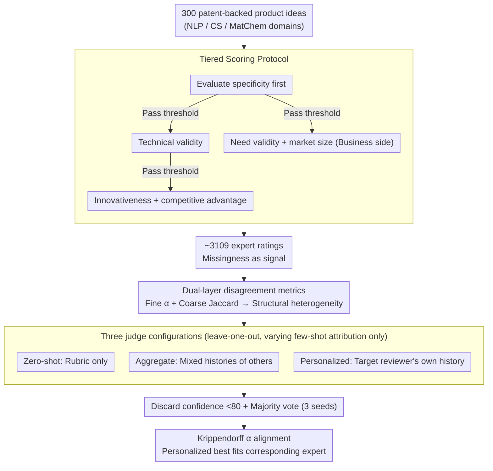

# Aggregate vs. Personalized Judges in Business Idea Evaluation: Evidence from Expert Disagreement

**Conference**: ACL 2026 Oral  
**arXiv**: [2604.22517](https://arxiv.org/abs/2604.22517)  
**Code**: None  
**Area**: LLM Evaluation  
**Keywords**: LLM-as-a-Judge, Business idea evaluation, Expert disagreement, Personalized judging, Multi-dimensional scoring

## TL;DR
Addressing the reality of systematic expert disagreement in business idea evaluation, this work constructs the PBIG-DATA dataset containing 3,000 individual expert ratings. It empirically demonstrates that "personalized judges" (conditioned on a target reviewer's history) align better with expert behavior than "aggregate judges" (conditioned on mixed reviewer histories), challenging the common assumption of using pooled labels as the sole ground truth.

## Background & Motivation

**Background**: LLM-as-a-Judge has become the mainstream solution for large-scale evaluation of generation quality. A common practice is to pool labels from multiple reviewers to serve as a single ground truth, forcing judge models to approximate this pooled signal.

**Limitations of Prior Work**: In scenarios such as business idea evaluation that require multi-dimensional judgments (feasibility, novelty, differentiation, market potential, etc.), experts from different backgrounds (technical vs. business) often provide systematically different scores even when using the same rubric. Treating this disagreement as "label noise" and pooling/averaging them erases genuine heterogeneous standards.

**Key Challenge**: Standard LLM-as-a-Judge assumes "one idea has one correct score." However, empirical findings show that no such single standard exists for business idea evaluation—Krippendorff's $\alpha$ for fine-grained ordinal ratings between reviewers is near zero or even negative, yet consistency is higher in coarse-grained selections for "identifying strong ideas."

**Goal**: To quantify the nature of disagreement using a real-world multi-reviewer dataset and test two opposing options for judge design—aggregate vs. personalized—to see which better reflects diverse expert judgment.

**Key Insight**: By viewing idea evaluation as a pluralistic problem and acknowledging that reviewers are internally consistent but heterogeneously different, "assigning a judge to each reviewer" may be a more accurate modeling approach than forcing convergence toward a consensus.

**Core Idea**: Use PBIG-DATA to empirically characterize the structure of expert disagreement and compare three judge configurations—zero-shot, aggregate, and personalized—to prove that personalized judges better fit corresponding reviewers across multiple model sizes.

## Method

### Overall Architecture

This work aims to answer whether a judge should converge toward "consensus" or align with the "individual" in business idea evaluation characterized by systematic expert disagreement. To this end, it follows a two-step approach. Step one is data construction: focusing on 300 LLM-generated product ideas based on patents (covering NLP, CS, and MatChem), 4-12 domain experts per idea provided ratings across six dimensions following a tiered protocol. This resulted in approximately 3,109 ratings, utilizing dual-layer metrics to determine whether disagreement is noise or structural. Step two is judge evaluation: under a leave-one-out protocol on the same data, zero-shot, aggregate, and personalized judge configurations are compared. The only variable is the reviewer attribution of few-shot examples, with alignment measured by Krippendorff's $\alpha$ between judge predictions and corresponding expert labels.

### Key Designs

**1. PBIG-DATA Multi-dimensional + Tiered Scoring Protocol: Encoding "what to rate, what scale to use, and when to skip" into the data.**

In business review, it is common for ideas to be "too vague to discuss feasibility." Forcing experts to rate all six dimensions for low-quality ideas only introduces noise. Thus, the protocol treats "missingness" as part of the evaluation process rather than a flaw. Each of the six dimensions uses a scale matching its natural granularity: 1-4 for specificity, technical validity, and competitive advantage; 1-5 for innovativeness (with an extra level to distinguish "impressive but not disruptive"); and 0-3 for need validity and market size (where 0 indicates category exclusion for non-B2B products).

The tiered screening rules allow progression layer by layer: specificity is rated first; only if it passes a threshold are technical validity, innovativeness, and competitive advantage evaluated. Need validity and market size are also only evaluated if specificity passes the threshold. This ensures low-quality ideas are not forced into downstream dimensions, meaning remaining ratings are truly "worth rating," and the missingness itself becomes a signal.

**2. Dual-layer Disagreement Metrics (Fine vs. Coarse): Separating ordinal scores from strong idea selection.**

Using a single metric cannot distinguish whether "high disagreement" stems from pure noise or structural heterogeneity. The paper therefore splits agreement into two layers: Fine-grained agreement uses Krippendorff's $\alpha$ to measure the consistency of ordinal scores; coarse agreement measures the Jaccard similarity between the sets of "ideas above each reviewer's median" (calculated only for pairs with $\ge 10$ co-rated ideas).

Viewing these together reveals the truth: high disagreement at the fine-grained level combined with consensus at the coarse-grained level indicates that reviewers have stable but different internal standards rather than random behavior. This combination of "low fine-grained, high coarse-grained" agreement serves as the empirical foundation for personalized judges—since disagreement is structural, assigning a judge to each reviewer is more rational than forcing convergence to an average.

**3. Comparative Design of Three Judge Configurations: Isolating the "target signal assumption" by varying only reviewer conditioning.**

To strictly determine whether "aggregate or personalized" is correct, number of examples, domain, and sampling logic must be aligned, changing only the reviewer attribution of few-shot examples. The configurations are: (a) Zero-shot judge provides only the rubric and instructions without expert history; (b) Aggregate judge uses few-shot examples from the mixed history of "non-target reviewers" (same domain/dimension, different patents), representing the pooled-label hypothesis; (c) Personalized judge uses few-shot examples specifically from the "target reviewer's own history," representing the pluralistic hypothesis. The only difference between the latter two is the attribution of examples, ensuring a fair comparison.

To reduce prediction noise, the judge outputs a confidence score (0-100). Following Dong et al. 2024, predictions with confidence $<80$ are discarded, and majority voting is performed across three random seeds. This controlled-variable arrangement is key to the credibility of the findings—any gap where personalized outperforms aggregate can only be attributed to "alignment with a single reviewer."

### Loss & Training

No training involved. All judges use the Qwen3-Instruct series (4B / 30B-A3B / 30B-A3B-Thinking / 235B-A22B) and GPT-5 mini directly for few-shot prompting. The primary variables are the number of few-shot examples (0 / 1 / 2 / 5 / 10) and their attribution (target evaluator vs. non-target).

## Key Experimental Results

### Main Results (Expert Disagreement Structure)

| Dimension | Fine α (NLP) | Fine α (CS) | Fine α (Mat) | Coarse Jaccard (NLP) | Coarse Jaccard (Mat) |
|-----------|--------------|-------------|--------------|----------------------|----------------------|
| Specificity | 0.06 | -0.11 | 0.04 | 0.45 | 0.45 |
| Technical validity | -0.03 | -0.40 | -0.28 | 0.50 | 0.42 |
| Innovativeness | 0.33 | 0.47 | 0.46 | 0.71 | 0.54 |
| Competitive advantage | -0.08 | 0.24 | -0.02 | 0.71 | 0.46 |
| Need validity | -0.23 | 0.02 | 0.05 | – | 0.89 |
| Market size | 0.48 | -0.31 | 0.08 | – | 0.57 |

Fine-grained $\alpha$ is near zero or negative for most dimensions, while coarse-grained Jaccard is significantly higher (0.4-0.9), indicating structural heterogeneity where preferences are similar despite different scales.

### Judge Alignment Comparison

Dataset: PBIG-DATA 6 dimensions $\times$ 3 domains; Metric: Krippendorff's $\alpha$ between judge prediction and corresponding expert label.

| Judge Configuration | Alignment with Target Reviewer | Trend with Few-shot Count |
|---------------------|-------------------------------|---------------------------|
| Zero-shot judge | Baseline (Low) | Unchanged |
| Aggregate judge | Moderate | Slight improvement then plateau |
| **Personalized judge** | **Highest** | Monotonic improvement with shots |

The larger the model, the more pronounced the gap between Personalized and Aggregate becomes (gap increases from 4B $\rightarrow$ 30B $\rightarrow$ 235B).

### Key Findings
- Across all dimensions and model sizes, personalized judges align better with corresponding reviewers than aggregate judges, with the gap widening as model capacity increases.
- Aggregate judges are generally better than zero-shot, suggesting that providing LLMs with some expert examples is beneficial; however, the "target signal" provided by pooled examples is blurred compared to those from a single reviewer.
- Agreement between reviewers correlates positively with the similarity of judge-generated reasoning only under personalized conditions—indirectly proving that personalized judges learn "reviewer-specific reasoning styles" rather than general criteria.

## Highlights & Insights
- Directly questions the default "disagreement = noise" assumption and provides strong counter-evidence through datasets and experiments—this problematizing methodology is a contribution in itself.
- The dual-layer agreement metrics (fine + coarse) serve as an elegant diagnostic tool to distinguish "total noise" (both low) from "structural disagreement" (low fine, high coarse), applicable to any subjective evaluation scenario.
- The tiered screening protocol cleverly avoids noise sources like "forcing ratings on low-quality ideas for completeness," treating missingness as a signal.
- The experimental design using leave-one-out and strict variable control is robust—aligning personalized and aggregate judges across shot counts, domains, dimensions, and models while changing only reviewer attribution makes the conclusions credible.

## Limitations & Future Work
- The data scale is relatively small (300 ideas / 3,109 ratings), with most reviewers having only a few dozen history entries; whether this is sufficient for LLMs to truly learn a "reviewer style" remains a question.
- Tested only on Qwen3 and GPT-5 mini; transferability to Claude/Gemini has not been verified.
- Focuses only on the specific task of idea evaluation; whether conclusions generalize to other subjective tasks (translation, writing, ethical judgment) remains to be tested.
- Implementing personalized judges in production requires maintaining history for each reviewer, which involves non-negligible storage and privacy costs.

## Related Work & Insights
- **vs. Dong et al. 2024 (personalized judging)**: That work first proposed the personalized judging concept; this paper rigorously validates it in extreme scenarios with systematically low agreement, finding the gap to be even more significant.
- **vs. Hämäläinen & Alnajjar 2021**: Early NLG evaluation literature acknowledged low agreement but mostly as a limitation; this work transforms that heterogeneity into specific judge design choices.
- **vs. Si et al. 2025**: That work documented disagreements among NLP researchers when evaluating LLM ideas; this work further asks "how a judge should model such disagreement."

## Rating
- Novelty: ⭐⭐⭐⭐ Problematizes the "disagreement is noise" assumption with empirical refutation; a methodological contribution.
- Experimental Thoroughness: ⭐⭐⭐⭐ Rigorous variable control across 6 dimensions $\times$ 3 domains $\times$ 4 model sizes.
- Writing Quality: ⭐⭐⭐⭐ Clear progression of motivation; tight logical chain between disagreement diagnosis and judge design.
- Value: ⭐⭐⭐⭐ Methodological implications for all multi-rater evaluation systems.

<!-- RELATED:START -->

## Related Papers

- [\[ACL 2026\] Stability vs. Manipulability: Evaluating Robustness Under Post-Decision Interaction in LLM Judges](stability_vs_manipulability_evaluating_robustness_under_post-decision_interactio.md)
- [\[ACL 2026\] Teaching Language Models to Forecast Research Success Through Comparative Idea Evaluation](teaching_language_models_to_forecast_research_success_through_comparative_idea_e.md)
- [\[ACL 2026\] K-MetBench: A Multi-Dimensional Benchmark for Fine-Grained Evaluation of Expert Reasoning, Locality, and Multimodality in Meteorology](k-metbench_a_multi-dimensional_benchmark_for_fine-grained_evaluation_of_expert_r.md)
- [\[ACL 2026\] Personalized Benchmarking: Evaluating LLMs by Individual Preferences](personalized_benchmarking_evaluating_llms_by_individual_preferences.md)
- [\[ACL 2026\] BizCompass: Benchmarking the Reasoning Capabilities of LLMs in Business Knowledge and Applications](bizcompass_benchmarking_the_reasoning_capabilities_of_llms_in_business_knowledge.md)

<!-- RELATED:END -->
