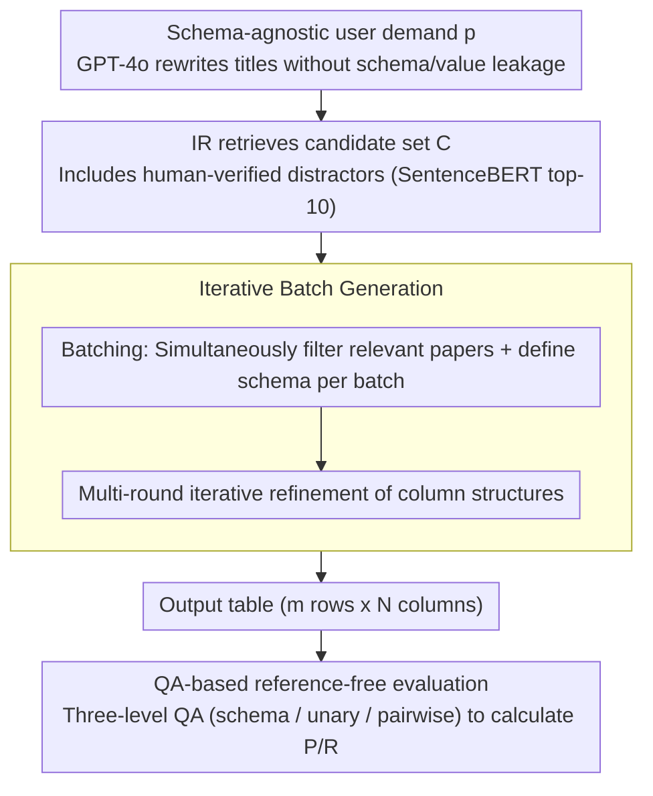

# arXiv2Table: Toward Realistic Benchmarking and Evaluation for LLM-Based Literature-Review Table Generation

**Conference**: ACL 2026  
**arXiv**: [2504.10284](https://arxiv.org/abs/2504.10284)  
**Code**: [GitHub](https://github.com/JHU-CLSP/arXiv2Table)  
**Area**: Model Compression  
**Keywords**: Literature-review table generation, benchmark evaluation, LLM, distractor papers, QA evaluation

## TL;DR

The authors present the arXiv2Table benchmark (1,957 tables, 7,158 papers), which achieves a more realistic evaluation of LLM-based literature-review table generation by introducing distractor papers, schema-agnostic user demands, and a QA-based reference-free evaluation framework, alongside an iterative batch generation method.

## Background & Motivation

**Background**: Literature-review tables are essential tools for organizing and comparing papers in scientific research. Recently, LLMs have been employed to automatically generate such tables. The typical workflow involves generating the table schema (column names) and values (cell contents) given a pre-selected set of papers and a table title.

**Limitations of Prior Work**: (1) Existing methods assume all input papers are relevant, whereas real-world scenarios include numerous semantically related but irrelevant distractor papers. (2) Using ground-truth table titles as generation targets can lead to evaluation bias, as titles are often too brief and may leak schema/value information. (3) Evaluation relies on static semantic embeddings or expensive human annotation, failing to capture fine-grained differences.

**Key Challenge**: Existing task definitions and evaluation protocols are overly idealized and detached from actual literature-review workflows, hindering the practical application of generation methods.

**Goal**: Build a more realistic benchmark and evaluation framework for literature-review table generation that simulates real-world noise and user requirements.

**Key Insight**: A three-pronged approach—integrating human-verified distractor papers, rewriting schema-agnostic user demands, and designing automated QA-based evaluation.

**Core Idea**: The task is decomposed into three sub-tasks: paper retrieval (T1) → paper filtering (T2) → table summarization (T3), with realistic noise introduced at each stage.

## Method

### Overall Architecture

arXiv2Table tests the ability of LLMs to generate literature-review tables under conditions close to real workflows. The task is split into paper retrieval (T1), paper filtering (T2), and table summarization (T3), with noise injected at each step. Specifically, given a user demand $p$, an IR engine retrieves a candidate set $C$ containing distractors. The LLM then filters a relevant subset $R \subseteq C$ and finally generates a table with $m$ rows and $N$ columns. Table quality is measured by information coverage via LLM-synthesized QA pairs. The benchmark contains a total of 1,957 tables and 7,158 papers.

### Key Designs

**1. Schema-agnostic user demand construction: Replacing answer-leaking titles with self-contained requirements**

Original table titles are often too short (e.g., "Performance comparison of different approaches"), making them difficult to understand independently and potentially leaking the gold schema or values, which inflates evaluation scores. This work uses GPT-4o to rewrite titles into self-contained, goal-oriented user demands that do not leak schema/value information, followed by automated leakage checks and manual spot-checking. After rewriting, the overlap between user demands and the schema decreased from 5.2% to 0.7%, making the generation target much closer to actual user needs in real scenarios.

**2. Human-verified distractor papers: Injecting noise encountered in real retrieval**

Existing methods assume all input papers are relevant, but real retrieval precision and recall are often low, inevitably including semantically related but irrelevant distractor papers. This work uses SentenceBERT to retrieve the top-10 distractors based on semantic similarity, which are then verified through binary judgment by an annotation team with CS research experience (IAA = 94%, Fleiss' $\kappa$ = 0.73). This requires LLMs to first possess the ability to filter truly relevant papers from noise before completing table generation.

**3. Iterative batch generation: Batch filtering and schema definition to bypass context windows and schema inconsistency**

This step addresses paper filtering (T2) and table summarization (T3). Processing all candidate papers at once exceeds the context window, while processing them one by one results in inconsistent schemas and sparse tables. This method divides input papers into batches, performing paper filtering and schema definition simultaneously within each batch, followed by multiple iterative rounds to refine column structures. This approach bypasses context length limits while ensuring cross-batch schema consistency, achieving a Gain of over 7 points in paper filtering F1 compared to baselines.

**4. QA-based reference-free evaluation framework: Decomposing table quality into answerable fine-grained dimensions**

How should a generated table be scored? Semantic embeddings miss context-specific differences, and human annotation is expensive and non-scalable. This work synthesizes three types of QA pairs from the ground-truth table—schema-level, unary value (cell-level), and pairwise value (cell relationship level). Recall is calculated by using the generated table to answer these questions, and precision is calculated via the reverse operation. This allows for a systematic measurement of information coverage across schema, cell, and relationship dimensions without additional annotation, showing high consistency with human expert judgment.

## Key Experimental Results

### Main Results

| Model | Method | Paper F1 | Schema F1 | Unary F1 | Pairwise F1 | Avg |
|------|------|----------|-----------|----------|-------------|-----|
| LLaMA-3.3-70B | Newman et al. | 60.9 | 38.3 | 37.8 | 29.8 | 35.3 |
| LLaMA-3.3-70B | Ours | **67.9** | **47.7** | **51.1** | **41.0** | **46.6** |
| Mistral-Large-123B | Newman et al. | - | 33.8 | - | - | - |

### Ablation Study

| Configuration | Change |
|------|------|
| Baseline 1 (One-step generation) | Context window overflow, poor performance |
| Baseline 2 (Per-paper processing) | Inconsistent schema, sparse table |
| Newman et al. (Two-stage) | Schema based only on abstracts, missing details |
| + COT Enhancement | Slight improvement for both strong baselines and our method |

### Key Findings

- The proposed iterative method significantly outperforms all baselines in both paper filtering and table generation.
- Absolute scores remain low (Avg ~47), highlighting the high difficulty of the task.
- LLMs exhibit weak capabilities in retrieving relevant papers from large-scale corpora (verified by a pilot study).
- QA evaluation shows high alignment with human expert judgment (verified by cross-evaluator analysis).

## Highlights & Insights

- First to introduce distractor papers and schema-agnostic user demands, bringing literature table generation evaluation closer to real-world scenarios.
- The QA-based evaluation framework requires no additional annotation and systematically measures table quality across three dimensions (schema, unary, pairwise).
- The leakage analysis of user demands vs. titles (Table 1) is compelling: overlap between user demands and schema dropped from 5.2% to 0.7%.
- The iterative batching method provides a Gain of 7+ points in paper selection F1.

## Limitations & Future Work

- Only one user demand is collected per table; diverse requirements remain to be explored.
- QA evaluation relies on GPT-4o, which may introduce model bias.
- Numerical precision matching in tables was not considered.
- Computational costs of the iterative method increase with the number of rounds.
- Future work could extend to cross-domain and multilingual scenarios.

## Related Work & Insights

- ArxivDigesTables (Newman et al., 2024): Original data source and two-stage baseline.
- Text-to-table generation: sequence-to-sequence and QA-based methods.
- Scientific table datasets: TableBank, SciGen, SciTabQA.
- The distractor paper design in this work can inspire other information extraction and survey automation tasks.

## Rating

- Novelty: ⭐⭐⭐⭐ Systematic introduction of distractors and realistic user demands.
- Experimental Thoroughness: ⭐⭐⭐⭐ Five LLMs, multiple baselines, human verification.
- Writing Quality: ⭐⭐⭐⭐⭐ Clear task definition and well-argued motivation.
- Value: ⭐⭐⭐⭐ Practical guidance for literature review automation.

<!-- RELATED:START -->

## Related Papers

- [\[ACL 2025\] RealHiTBench: A Comprehensive Realistic Hierarchical Table Benchmark for Evaluating LLM-Based Table Analysis](../../ACL2025/llm_evaluation/realhitbench_a_comprehensive_realistic_hierarchical_table_benchmark_for_evaluati.md)
- [\[ACL 2026\] IF-RewardBench: Benchmarking Judge Models for Instruction-Following Evaluation](if-rewardbench_benchmarking_judge_models_for_instruction-following_evaluation.md)
- [\[ACL 2026\] HumanLLM: Benchmarking and Improving LLM Anthropomorphism via Human Cognitive Patterns](humanllm_benchmarking_and_improving_llm_anthropomorphism_via_human_cognitive_pat.md)
- [\[ACL 2026\] IF-Critic: Towards a Fine-Grained LLM Critic for Instruction-Following Evaluation](if-critic_towards_a_fine-grained_llm_critic_for_instruction-following_evaluation.md)
- [\[ACL 2026\] Comprehensiveness Metrics for Automatic Evaluation of Factual Recall in Text Generation](comprehensiveness_metrics_for_automatic_evaluation_of_factual_recall_in_text_gen.md)

<!-- RELATED:END -->
