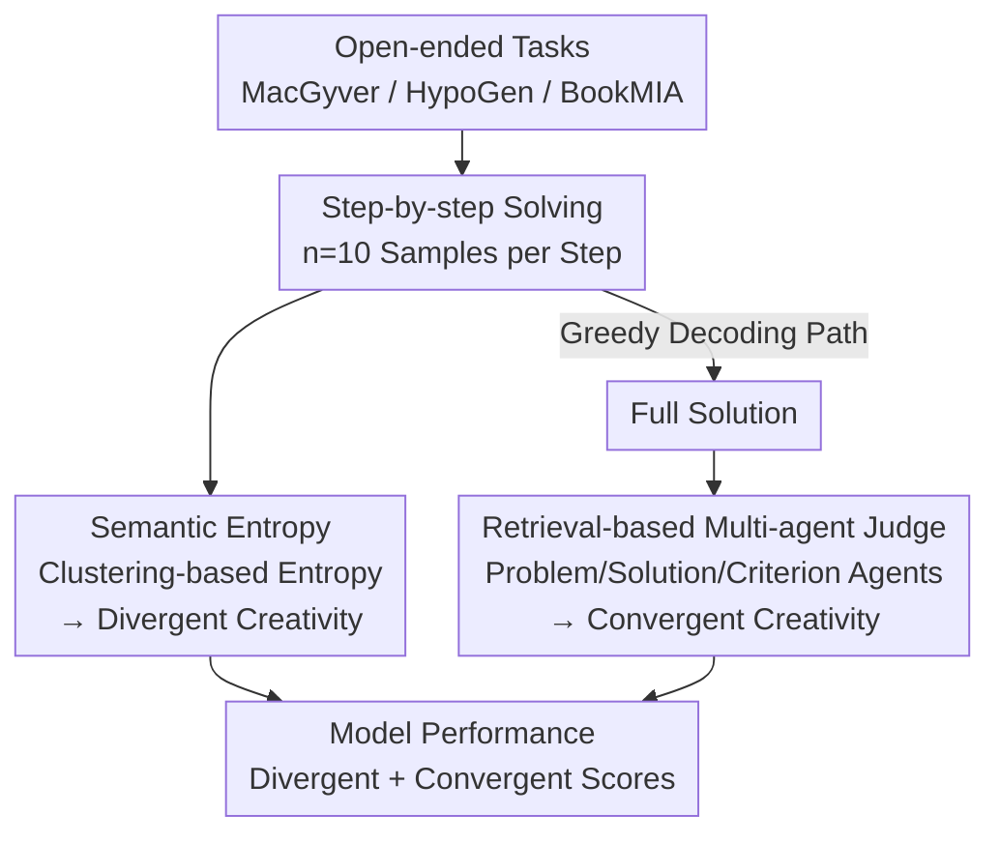

# Automated Creativity Evaluation of Language Models Across Open-Ended Tasks

**Conference**: ACL 2024  
**arXiv**: [2606.11762](https://arxiv.org/abs/2606.11762)  
**Code**: https://github.com/tanminsen/creativity-eval  
**Area**: LLM Evaluation / Creativity Assessment  
**Keywords**: Creativity Evaluation, Semantic Entropy, Multi-agent Judging, Divergent Thinking, Convergent Thinking

## TL;DR
This paper proposes an **automated, task-decoupled, and reference-free** framework to quantify LLM creativity. "Semantic Entropy" is employed to measure divergent creativity (novelty and diversity of ideas), while "Retrieval-based Multi-agent Judging" measures convergent creativity (whether the solution effectively addresses the problem). The study systematically uncovers the impact of model scale, temperature, and reasoning capabilities on creativity across three domains: problem-solving, scientific hypothesis generation, and creative writing.

## Background & Motivation
**Background**: As LLMs grow stronger in reasoning and generation, research increasingly focuses on their "creativity"—the ability to propose unconventional solutions, discover new patterns, and design experiments autonomously. Studying this requires a framework capable of cross-task and scalable creativity measurement.

**Limitations of Prior Work**: Existing creativity evaluations are largely **task-bound**. They either rely on human creativity tests (e.g., TTCT, CAT) which require intensive manual annotation and lack scalability, or are tailored for specific tasks (math, hardware design, metaphor generation, code) with hard-coded scoring rules and reference answer sets. These methods embed domain assumptions into the evaluation pipeline, making them subjective, expensive, and difficult to systematize across new tasks.

**Key Challenge**: The evaluation apparatus is **entangled** with the creative task. As long as the measurement depends on "what the correct answer for this task looks like," it cannot generalize to open-ended tasks without unique solutions.

**Goal**: To **decouple** the measurement apparatus from specific tasks, creating a reference-free, domain-agnostic, and fully automated framework that separately measures the two facets of creativity.

**Key Insight**: The authors leverage a classical distinction from cognitive science—**divergent thinking** (generating diverse, novel ideas) and **convergent thinking** (converging ideas into a feasible solution that fits the goal). These must be measured separately; a model might produce varied but incoherent outputs, which would be falsely judged as "creative" if only diversity were considered.

**Core Idea**: For the divergent side, **Semantic Entropy** is repurposed—originally used for hallucination detection—as a reference-free metric for "exploration breadth." For the convergent side, **Retrieval-based Multi-agent Judging** is introduced to maintain high-quality multi-perspective discussion while reducing the computational cost of traditional multi-agent systems by over 60%.

## Method

### Overall Architecture
The core concept is to **completely decouple "how to measure" from "what task to measure"**: the same measurement apparatus (Semantic Entropy + Multi-agent Judging) is applied to any open-ended task. For every problem, the model solves it step-by-step. At **each step**, $n=10$ candidate continuations are sampled, and the semantic entropy of these candidates is calculated as the divergent creativity score. A greedy decoding path is then chosen to extend the solution until completion. Finally, the **full solution** is submitted to the multi-agent judge to obtain the convergent creativity score. A model's performance is represented by two independent dimensions: the divergent score (average semantic entropy) and the convergent score (judgment score).

### Key Designs

**1. Semantic Entropy: Quantifying Divergence without References**

The difficulty of measuring divergent creativity lies in scoring "novelty and diversity" without manual effort or gold standards. The author's observation is that open-ended tasks often have multiple valid directions. A creative model should **explore semantically distinct paths** starting from the same prompt. Semantic Entropy (SE) is thus repurposed: in single-answer QA, probability dispersion indicates uncertainty or hallucinations; in open-ended tasks, dispersion across **semantically different ideas** represents the model's exploration of multiple solution paths.

The process involves three steps: sampling candidates, performing **semantic clustering** (using greedy categorization via bi-directional entailment to group based on meaning rather than wording), and calculating the entropy of the cluster distribution. The log-probability of a continuation $s$ (sequence $t_1,\dots,t_i$) is:

$$\log P(s|x) = \sum_i \log P(t_i \mid t_{<i}, x)$$

The probability of a semantic cluster $c$ is the sum of the probabilities of all continuations within it $P(c|x) = \sum_{s\in c} P(s|x)$. The semantic entropy is:

$$H(x) = -\sum_{i=1}^{|C|} P(C_i|x)\,\log P(C_i|x)$$

SE is calculated by sampling $n=10$ candidates per step. Crucially, it operates on the **semantic layer**, capturing genuine conceptual differences and resisting inflation through paraphrasing—a weakness of surface metrics like cosine similarity, Self-BLEU, or Distinct-n.

**2. Retrieval-based Multi-agent Judging: Scalable Convergent Creativity Evaluation**

Convergent creativity requires determining whether a "solution truly fulfills task requirements across multiple dimensions like feasibility, coherence, relevance, and domain correctness." For such subjective evaluation, a panel of specialized agents is more robust than a single judge. However, existing multi-agent frameworks (like ChatEval) append the **full discussion history** to the prompt in every round, causing token costs to explode—the bottleneck is scalability rather than quality.

The authors' mechanism uses three specialized agents (Problem, Solution, and Criterion) that write their analyses as **retrievable fragments** stored in a vector database. In each round, only the **top-$k$ most relevant fragments** (via cosine similarity) are retrieved instead of the entire history. This prevents context bloat while preserving agent specialization, eventually reaching a binary verdict. Combined with confidence-based early stopping, this reduces **token usage by ~63% and total compute by ~60%** compared to traditional multi-agent systems, with no loss in accuracy.

**3. Two-stage Step-wise Evaluation Protocol: Sampling for Divergence, Greedy for Convergence**

Since forcing divergence and convergence into the same trajectory causes interference, the authors use a two-stage protocol. On the **divergent side**, at each step, $n=10$ candidates are sampled to estimate the model's "considered range for the next step." This approximates the model's exploration space (similar to Tree-of-Thoughts), as divergent creativity is about "how many paths were explored" rather than the quality of a single path. On the **convergent side**, the model follows the **greedy decoding** path to produce its most confident complete solution, which is then evaluated to see if the model can "select and refine a valid, correct solution." Each model is tested on 300 problems per domain.

### Loss & Training
This work presents an **evaluation framework**, not a training method. Semantic clustering uses an entailment model (validated against human labels in Appendix C.3), and multi-agent judging uses a confidence threshold for termination.

## Key Experimental Results

### Main Results
Verified across three domains—MacGyver (unconventional physical problem solving), HypoGen (scientific hypothesis generation), and BookMIA (creative writing)—with 300 problems each.

Divergent Side—Alignment between Semantic Entropy and human judgment (based on a 50-problem subset of MacGyver with 3 human annotators, Cohen's $\kappa$):

| Diversity Metric | Alignment with Humans (κ) |
|------|------|
| **Semantic Entropy (Ours)** | **0.56** |
| Cosine similarity | 0.49 |
| Distinct-1 | 0.37 |
| Self-BLEU | 0.35 |
| Distinct-2 | 0.34 |

SE significantly outperforms surface-level metrics, demonstrating that it captures the "semantic breadth" recognized by humans.

Convergent Side—Accuracy of multi-agent judging against human-annotated gold labels:

| Framework | MacGyver | BookMIA |
|------|------|------|
| GPT-4o One-shot | 64.7% | – |
| GPT-4o CoT | 67.3% | – |
| ChatEval | 76.7% | 73.3% |
| **Ours (GPT-4o)** | **84.7%** | **83.0%** |
| Ours (GPT-4o-mini) | 55.3% | – |
| Human Annotators (Range) | 80.0–84.7% | 74.7–87.0% |

Using GPT-4o, the framework reaches human-level accuracy and significantly exceeds ChatEval. However, accuracy drops to 55.3% with GPT-4o-mini, indicating the dependency on the base model's capability.

### Ablation Study

| Analysis | Key Finding |
|------|------|
| SE vs. Semantic Cluster Count | Strong positive correlation, reflecting "flexibility" in TTCT |
| SE vs. Sampling Temperature | SE increases with temperature, aligning with the intuition of "higher temp -> more exploration" |
| SE vs. Cosine Similarity | Negative correlation; candidates from high-SE models are indeed more dissimilar |
| Solution-level SE vs. LLM Novelty Judging | Positively correlated (Spearman $\rho=0.80$ against human-verified LLM rankings) |
| Divergence vs. Model Scale/Age | **Non-monotonic**; SE slightly decreases in some newer/larger models (e.g., LLaMA 3 -> 3.3) |
| Convergence vs. Model Scale/Age/Reasoning | **Monotonic improvement**; larger, newer, or reasoning-capable models (R1-70B) score higher |
| Divergence vs. Convergence Correlation | Spearman correlation is consistently weak; the two dimensions are **empirically separable** |

### Key Findings
- **Divergence and Convergence are independent**: SE consistently shows weak correlation with convergent metrics. If SE in open-ended tasks merely reflected "errors/hallucinations," it would be strongly negatively correlated with task completion. The lack of such a relationship proves SE measures **generative breadth** rather than errors.
- **Current training paradigms favor convergence over divergence**: While convergent creativity improves with scale and reasoning ability, divergent creativity does not scale and may even decline. The authors hypothesize that modern training (SFT/RLHF) over-emphasizes "correctness," thereby compressing the model's divergent exploration space. This suggests the two dimensions **can be optimized independently**.
- **Temperature is a direct lever for divergence**: SE increases with temperature, providing an actionable hyperparameter for modulating model exploration.

## Highlights & Insights
- **Inverting the hallucination metric**: Repurposing Semantic Entropy is clever—SE signals "model error" in single-answer QA but "exploration of reasonable paths" in open-ended generation. It yields a zero-cost metric simply by changing the interpretative regime.
- **Retrieval-based multi-agent judging enables scalability**: Using vector retrieval for top-$k$ fragments instead of full history is a brilliant application of RAG principles to multi-agent judging, reducing tokens by 63% without quality loss. This trick is directly transferable to any multi-turn agentic system.
- **Empirical separability**: The conclusion that divergence and convergence are independent is highly valuable. it decomposes the fuzzy concept of "creativity" into two measurable, independent knobs, providing a roadmap for future work on enhancing divergent capabilities.

## Limitations & Future Work
- **Convergent scores rely on LLM judges**: While highly aligned with humans on MacGyver/BookMIA, HypoGen results lack human verification due to required domain expertise. Judgment quality also depends on the base model (e.g., GPT-4o-mini's performance drop).
- **Equating divergence with semantic diversity**: High SE represents semantic dispersion, but not necessarily "valuable novelty." It might count incoherent rambling as "high divergence," which is why it must be paired with convergent evaluation.
- **Two-stage protocol limitations**: Estimating divergence via "local branching" (10 candidates per step) might underestimate long-range, multi-step creative combinations.
- **Cross-task comparisons**: SE values should not be compared directly across different task difficulties or sampling configurations without caution.

## Related Work & Insights
- **vs. Human Creativity Tests (TTCT / CAT)**: These rely on non-scalable manual annotation; metrics like fluency/elaboration are unreliable for LLMs as they can be easily inflated by sampling settings. This work focuses on originality/flexibility and is fully automated.
- **vs. Task-bound Benchmarks** (Math/Metaphor/Code): These require hard-coded assumptions and answer sets. The proposed framework is task-agnostic and reference-free, applying one set of tools across three disparate domains.
- **vs. Semantic Entropy for Hallucinations (Farquhar et al. 2024)**: While the original work uses SE to detect errors, this paper **reinterprets** it for open-ended generation and proves via weak correlation that it does not measure error in this regime.
- **vs. ChatEval**: ChatEval suffers from unbounded context growth; this work uses top-$k$ fragment retrieval and confidence-based stopping to save 60%+ compute while maintaining accuracy.

## Rating
- Novelty: ⭐⭐⭐⭐⭐ (Inverting hallucination metrics + efficient multi-agent judging)
- Experimental Thoroughness: ⭐⭐⭐⭐ (Cross-domain and cross-model analysis, though HypoGen lacks human gold labels)
- Writing Quality: ⭐⭐⭐⭐ (Clear conceptual split, solid grounding, and complete verification chain)
- Value: ⭐⭐⭐⭐⭐ (Provides a scalable, cross-domain standard for LLM creativity evaluation)

<!-- RELATED:START -->

## Related Papers

- [\[ICLR 2026\] AutoLibra: Agent Metric Induction from Open-Ended Human Feedback](../../ICLR2026/llm_evaluation/autolibra_agent_metric_induction_from_open-ended_human_feedback.md)
- [\[ICLR 2026\] An Open-Ended Benchmark and Formal Framework for Adjuvant Research with MLLM](../../ICLR2026/llm_evaluation/an_open-ended_benchmark_and_formal_framework_for_adjuvant_research_with_mllm.md)
- [\[ICLR 2026\] MLE-Smith: Scaling MLE Tasks with Automated Multi-agent Pipeline](../../ICLR2026/llm_evaluation/mle-smith_scaling_mle_tasks_with_automated_multi-agent_pipeline.md)
- [\[ACL 2026\] Enhancing Linguistic Competence of Language Models through Pre-training with Language Learning Tasks](enhancing_linguistic_competence_of_language_models_through_pre-training_with_lan.md)
- [\[ACL 2025\] ONEBench to Test Them All: Sample-Level Benchmarking Over Open-Ended Capabilities](../../ACL2025/llm_evaluation/onebench_to_test_them_all_sample-level_benchmarking_over_open-ended_capabilities.md)

<!-- RELATED:END -->
