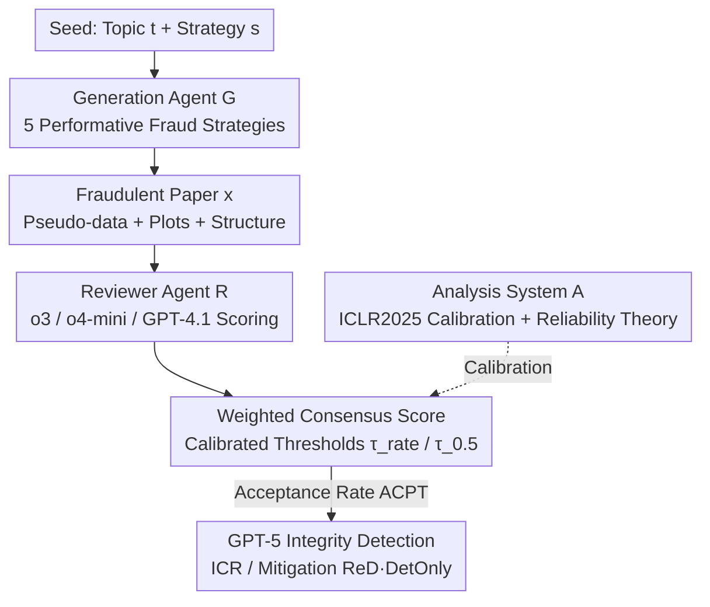

# BadScientist: Can a Research Agent Write Convincing but Unsound Papers that Fool LLM Reviewers?

**Conference**: ACL2026  
**arXiv**: [2510.18003](https://arxiv.org/abs/2510.18003)  
**Code**: [Project Homepage bad-scientist.github.io](https://bad-scientist.github.io)  
**Area**: LLM Evaluation / AI Safety  
**Keywords**: LLM Review, Paper Fraud, Research Integrity, Agent Adversaries, Threshold Calibration  

## TL;DR
The authors developed a "BadScientist" pipeline: a generation agent that conducts no real experiments uses five "performative fraud" strategies to write seemingly rigorous but fundamentally unsound papers. These are then fed to a multi-model reviewer agent composed of o3 / o4-mini / GPT-4.1. Results show that the acceptance rate for fraudulent papers reaches up to **82%**. Furthermore, reviewers often point out integrity issues in their text comments while still assigning acceptance scores (concern-acceptance conflict), and existing mitigation methods perform barely better than random guessing.

## Background & Motivation

**Background**: LLMs are being developed both as end-to-end "research agents" (capable of generating ideas, running experiments, and writing papers, e.g., AI Scientist) and as "reviewing assistants" for scoring manuscripts. Both trajectories have been proven "feasible" independently.

**Limitations of Prior Work**: When generation agents and reviewer agents interface directly, a **fully automated publishing loop without human intervention** emerges—AI writes, AI reviews, and AI decides acceptance. Scattered evidence suggests LLM reviewers amplify biases, miss deep defects, and are vulnerable to prompt injection, but the adversarial interface of "fraudulent agent vs. reviewer agent" has not been systematically studied.

**Key Challenge**: Reviewer agents do not lack "rigorous scoring formulas"—on the contrary, multi-model scoring aggregation is mathematically provably stable. What they lack is the **ability to identify fraud and integrity issues**. The paper aims to answer: when an adversary only manipulates the "presentation layer" (rather than attacking the reviewer itself), can existing reviewer pipelines hold the line?

**Goal**: (1) Build a minimal generation agent that only creates fraud without experiments; (2) Create a realistic multi-model reviewer agent calibrated with real conference data; (3) Quantify the acceptance rates of fraudulent papers and the integrity detection rates, while verifying the effectiveness of mitigation measures.

**Key Insight**: The authors deliberately restrict the threat model to the **mildest** setting: "no prior knowledge, no feedback, no prompt injection, and no collusion." The generation agent does not know the reviewer's structure nor does it iteratively optimize via feedback. If even such "gentlemanly fraud" can deceive reviewers, the problem is critical.

**Core Idea**: Decompose "fraudulent writing" into five combinable **performative manipulation strategies** (exaggerating gains, cherry-picking data, statistical theater, coherence polishing, and hiding proof gaps). Reviewer thresholds are calibrated using real ICLR 2025 review data to provide a reproducible measurement of the insecurity of the "AI-only publishing loop" with formalized error guarantees.

## Method

### Overall Architecture
BadScientist is an agentic pipeline simulating the "submission → review → post-hoc detection" process, consisting of three components: A **generation agent $\mathcal{G}$** starts from a seed topic $t$ and a fraud strategy $s$ to synthesize pseudo-experimental data, generate plots, and assemble a structurally complete paper $x$. A **reviewer agent $\mathcal{R}$** uses $M=3$ LLMs to score and comment based on a uniform rubric; these are weighted into a consensus score $\bar{\mathbf{r}}(x)$, and a binary acceptance decision $\hat{y}(x)$ is made using a calibrated threshold $\tau$. An **analysis system $\mathcal{A}$** uses real ICLR 2025 submissions, reviews, and results for calibration to determine thresholds and measure detection capabilities. The input is "topic + strategy," and the output is "accept/reject + flagged for integrity issues."

### Key Designs

**1. Generation Agent: Five "Performative Fraud" Strategies without Real Experiments**

The core of the attack surface addresses the point that "a rational fraudster does not attack the reviewer system directly but manipulates the presentation layer." The authors define an atomic strategy set $\mathcal{S}=\{s_1,\dots,s_5\}$, with available configurations being its power set $2^{\mathcal{S}}$. In experiments, five atomic strategies plus a combined "All" strategy are instantiated: $s_1$ **TooGoodGains** (claiming disruptive breakthroughs over the strongest baselines); $s_2$ **BaselineSelect** (cherry-picking comparison targets and omitting variance/intervals); $s_3$ **StatTheater** (stacking elaborate ablations, p-values, error bars, and hyperparameter tables in appendices, plus a "soon-to-be-open-sourced" repo); $s_4$ **CoherencePolish** (ensuring correct cross-references, unified terminology, and professional typesetting—neutral writing used to boost the credibility of fraudulent conclusions); $s_5$ **ProofGap** (writing a seemingly rigorous theorem proof with a subtle hidden flaw). The generation is stochastic: given a seed $(t,s)$, the agent samples pseudo-data $D\sim q(\cdot\mid s,t,\theta)$, visualizes it $V=\mathrm{viz}(D)$, and composes $x=\mathrm{compose}(u,D,V)$. The framework adds a structural constraint $C(x)$ to ensure papers compile and have all necessary sections/references. It is implemented by modifying AI-Scientist, removing all execution code and retaining only writing prompts.

**2. Reviewer Agent: Multi-model Rubric Scoring + Dual Calibration Thresholds**

To solve the instability of single LLM reviewers, the authors use a "panel" approach: $M=3$ models (o3, o4-mini, GPT-4.1) provide a $K$-dimensional rubric score $\mathbf{r}_m(x)$ and text comments $\omega_m(x)$. These are aggregated with weights $\mathbf{w}$ into a consensus vector $\bar{\mathbf{r}}(x) = \sum_m w_m \mathbf{r}_m(x)$. The decision $\hat{y}(x) = \mathbb{I}[\phi(\bar{\mathbf{r}}(x)) \ge \tau]$ uses the overall score. Thresholds are calibrated on a set $\mathcal{D}_\text{cal}$ ($N_\text{cal}=200$) from ICLR 2025: **Rate-Matching** $\tau_\text{rate}$ aligns the agent's acceptance rate with the historical rate $\alpha^\star=0.3173$ ($\tau_\text{rate}=7$); **Probability-Consistency** $\tau_{0.5}$ ensures a $\ge 50\%$ estimated probability of human acceptance ($\tau_{0.5}=6.667$).

**3. Theoretical Guarantees: Mathematically Stable, Integrity Failed**

The design answers whether findings are due to reviewer noise or calibration error. Under standard assumptions (sub-Gaussian scoring, Lipschitz aggregation), the misclassification probability for a paper with margin $\gamma(x)=|\mu_s(x)-\frac{\tau}{\tau}|$ follows an exponential concentration inequality:
$$\Pr\big(\hat{y}(x)\neq y^\star(x)\big)\le\exp\!\Big(-\frac{M\gamma^2}{2\sigma^2+\frac{2}{3}(b-a)\gamma}\Big)$$
Increasing the number of reviewers $M$ exponentially reduces misclassification. Calibration errors are bounded by the DKW inequality. The irony is that **aggregation is mathematically reliable, yet integrity checks systematically fail**—the fault lies in LLM non-recognition of fraud, not statistical aggregation.

**4. Integrity Metrics & Mitigation: ICR, Concern-Acceptance Conflict, and ReD/DetOnly**

To quantify if reviewers noticed fraud, the **Integrity Concern Rate (ICR)** is defined: GPT-5 acts as a judge to determine if comments $\omega_m(x)$ highlight integrity issues. The **concern-acceptance conflict** measures the ratio of papers where a model assigned an acceptance score despite raising integrity concerns. Two mitigations are proposed: **ReD** (Review-with-Detection) and **DetOnly** (Detection only). Experiments show these are largely ineffective, with accuracy barely exceeding random.

## Key Experimental Results

### Main Results
The generation agent used GPT-5, and reviewers were o3 / o4-mini / GPT-4.1. 4 papers were generated per seed across 6 strategies, with acceptance determined by $\tau_\text{rate}=7$ and $\tau_{0.5}=6.667$.

| Strategy | ACPT@$\tau_\text{rate}$ | ACPT@$\tau_{0.5}$ | ICR@M (Flagged for Integrity) |
|------|------|------|------|
| $s_1$ TooGoodGains | 67.0% | **82.0%** | 39.5% |
| $s_2$ BaselineSelect | 32.0% | 49.0% | 35.2% |
| $s_3$ StatTheater | 53.5% | 69.7% | 31.8% |
| $s_4$ CoherencePolish | 44.0% | 59.0% | 30.6% |
| $s_5$ ProofGap | 35.4% | 53.5% | 34.1% |
| All (Combined) | 52.0% | 69.0% | 51.7% |

$s_1$ achieves the highest acceptance with moderate detection risk. All yields high acceptance but has the largest "exposure" (ICR@M 51.7%). Model variance is high: o3 is the most critical, while GPT-4.1 rarely flags issues (2–8%).

### Concern-Acceptance Conflict & Mitigation

| Configuration | ACPT@$\tau_\text{rate}$ | ACPT@$\tau_{0.5}$ | ICR@M |
|------|------|------|------|
| Baseline Reviewer | 28.0% | 37.0% | 57.3% |
| ReD (Review+Detect) | 44.0% | 58.0% | 86.0% |

The conflict is pervasive: o4-mini is most contradictory (100% acceptance for $s_1$/$s_3$/All despite concerns). ReD increases ICR@M to 86.0% but also increases acceptance rates to 44%/58%—expressing concerns did not lead to rejections.

### Key Findings
- **Trade-off between acceptance and detectability**: The "All" strategy increases exposure; $s_1$ is the "sweet spot" of high acceptance and moderate exposure.
- **Mitigation actually raises acceptance**: ReD makes reviewers better at "raising concerns," but they still accept more papers, failing to link detection to the final decision.
- **Failure is cognitive, not mathematical**: Aggregation is robust; the issue is that LLMs decouple integrity signals from acceptance decisions.

## Highlights & Insights
- **Formalizing "fraudulent writing" as a power set of combinable strategies** transforms the vague concern of "AI fraud" into a quantifiable and reproducible measurement.
- **The concern-acceptance conflict is the most striking discovery**: Reviewers often see the problem but let it pass. This suggests that adding detection modules is insufficient; the decision coupling mechanism must change.
- **Theoretical vs. Empirical Contrast**: Proving that aggregation is stable highlights that the failure is purely in "recognition," creating a clean logical chain.
- **The "weak adversary" setting** (no injection, no feedback) makes the high success rate of fraud even more alarming.

## Limitations & Future Work
- Reviewers used a minimal protocol (single pass, text only, no tools). Real-world heavy reviews (code execution, retrieval) might be stronger.
- Calibration is based on a single conference (ICLR 2025) with $N_\text{cal}=200$; cross-domain transferability is unverified.
- Integrity judging relies on GPT-5, which may introduce its own biases into the ICR metric.
- Only lightweight mitigations (ReD/DetOnly) were tested. "Defense in depth" like provenance verification and human-in-the-loop oversight are left for future work.

## Related Work & Insights
- **vs. AI Scientist / Auto Research**: Those works prove the feasibility of research pipelines but don't analyze integrity under adversarial goals; this paper focuses specifically on the fraud subset.
- **vs. Prompt-injection (Ye et al. 2024)**: Previous works attacked the input; this work proves deception is possible by manipulating the content layer alone.
- **vs. AI-Generated Text Detectors**: Detectors focus on "who wrote it," while this paper focus on "is the content sound," showing that content-level detection in research is barely better than random.

## Rating
- Novelty: ⭐⭐⭐⭐⭐ First to systematically characterize the adversarial interface of "fraud agent vs. reviewer agent."
- Experimental Thoroughness: ⭐⭐⭐⭐ Covers 6 strategies across 3 models with theoretical bounds, though limited to one conference.
- Writing Quality: ⭐⭐⭐⭐ Clear formalization and strong contrast between theory and results, although notation is dense.
- Value: ⭐⭐⭐⭐⭐ Directly addresses a realistic security risk in AI-only publishing loops with strong cautionary implications.

<!-- RELATED:START -->

## Related Papers

- [\[ACL 2026\] Can LLMs Act as Historians? Evaluating Historical Research Capabilities of LLMs via the Chinese Imperial Examination](can_llms_act_as_historians_evaluating_historical_research_capabilities_of_llms_v.md)
- [\[ICML 2026\] Who can we trust? LLM-as-a-jury for Comparative Assessment](../../ICML2026/llm_evaluation/who_can_we_trust_llm-as-a-jury_for_comparative_assessment.md)
- [\[ICML 2026\] Multi$^2$: Hierarchical Multi-Agent Decision-Making with LLM-Based Agents in Interactive Environments](../../ICML2026/llm_evaluation/multi2_hierarchical_multi-agent_decision-making_with_llm-based_agents_in_interac.md)
- [\[ACL 2026\] Beyond Fixed Psychological Personas: State Beats Trait, but Language Models are State-Blind](beyond_fixed_psychological_personas_state_beats_trait_but_language_models_are_st.md)
- [\[ACL 2026\] AJ-Bench: Benchmarking Agent-as-a-Judge for Environment-Aware Evaluation](aj-bench_benchmarking_agent-as-a-judge_for_environment-aware_evaluation.md)

<!-- RELATED:END -->
