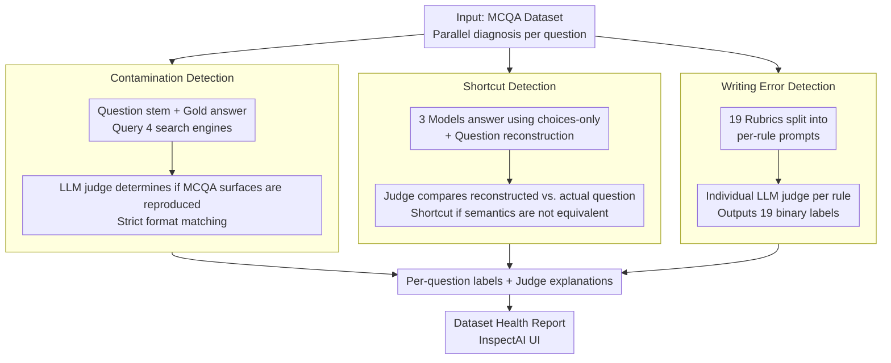

# BenchMarker: An Education-Inspired Toolkit for Highlighting Flaws in Multiple-Choice Benchmarks

**Conference**: ACL 2026  
**arXiv**: [2602.06221](https://arxiv.org/abs/2602.06221)  
**Code**: https://github.com/nbalepur/BenchMarker  
**Area**: LLM Evaluation / Benchmark Quality Control  
**Keywords**: MCQA, benchmark auditing, LLM-as-judge, writing errors, data contamination, shortcut detection

## TL;DR
Drawing on mature quality control frameworks for multiple-choice questions (MCQs) from the field of education, this work constructs BenchMarker. This tool uses LLM-as-judge to audit 12 mainstream NLP MCQA benchmarks across three dimensions: "contamination + shortcuts + writing errors." The study finds that 47% of TruthfulQA questions can be found directly online, while 100% of HellaSwag questions violate multiple writing rules. It empirically demonstrates that these flaws significantly inflate or deflate LLM accuracy and even alter model rankings.

## Background & Motivation

**Background**: From MMLU to HellaSwag and SGPQA, NLP evaluation increasingly relies on MCQA (Multiple-Choice Question Answering) due to its ease of automated scoring and similarity to human exam formats. However, in a survey of 39 MCQA datasets, 23% did not report any quality control measures.

**Limitations of Prior Work**:
1. **Data Contamination**: Original questions appear in LLM training data or on the web, allowing models to rely on "memorization" rather than "understanding."
2. **Shortcuts**: Flaws in question design allow models to guess correctly by looking only at choices (ignoring the question), similar to students using "process of elimination."
3. **Writing Errors**: Issues in grammar, structure, or distractor quality make the questions misleading.

The education sector has standardized MCQ quality control for decades (Haladyna & Downing 1989, etc.), but NLP rarely incorporates these practices.

**Key Challenge**: While NLP aims to use MCQA to evaluate "understanding-recall-reasoning" capabilities, flawed datasets introduce noise unrelated to the target ability into the scores (damaging construct validity).

**Goal**: (a) Map MCQ quality standards from education to NLP datasets; (b) Automate the process using LLM-as-judge; (c) Quantify the impact of each flaw type on LLM accuracy and rankings to prove that the harm of flawed datasets is not merely "theoretical."

**Key Insight**: A cross-disciplinary fusion of education and LLM-as-judge—education provides 19 Item-Writing Flaws rubrics (Tarrant 2006), and LLMs provide large-scale automated scoring capabilities.

**Core Idea**: BenchMarker = LLM judge × three categories of educational metrics (contamination / shortcuts / writing errors). 8,042 human annotations were used to calibrate judge reliability, followed by a systematic audit of 12 NLP benchmarks to quantify the actual impact of flaws.

## Method

### Overall Architecture

BenchMarker takes an MCQA dataset as input and runs three independent diagnostic pipelines in parallel for each question: contamination, shortcuts, and writing errors. Each pipeline centers on an LLM judge and outputs a set of binary labels plus judge explanations. Results can be retained at the question level for human review or aggregated at the dataset level to generate health reports (e.g., "how many questions are contaminated / have shortcuts / violate writing rules"). The suite is packaged within InspectAI with a provided UI. Its essence lies in translating decades of educational MCQ quality standards (item-writing rubrics, partial-input diagnostics) into scalable, automated LLM scoring protocols.

### Key Designs

**1. Contamination Detection: Web-search proxy + strict format matching.** Since LLM pre-training data is private, it is impossible to directly check if a question was "memorized." This work uses the public web as an observable proxy. The question stem $q$ and gold answer $a$ are queried across four search engines (Google/Bing/DuckDuckGo/Brave). The top-K results are then given to an LLM judge to determine if the question is "completely or almost completely reproduced." Crucially, the matching criteria are strict: if a webpage contains the knowledge corresponding to the answer but lacks the MCQA format, it is not considered contaminated—as it does not prompt the model to memorize "which choice to pick for this specific question." This is more accurate than simple token-overlap and avoids misclassifying "general knowledge testing" as contamination.

**2. Shortcut Detection: Partial-input answering + question reconstruction filtering.** The goal is to identify questions that can be solved reliably using only the choices. The approach uses three models with high choices-only accuracy (GPT-5 / Gemini Pro / Claude) to (1) answer using only options and (2) reconstruct the likely original question stem. An LLM judge then determines if the reconstructed stem is semantically equivalent to the actual question. A question is flagged as a shortcut only if all three models answer correctly AND the reconstructed stems do not match the original. This "reconstruction" filter is vital: pure choices-only accuracy might misclassify "benevolent inference" (e.g., inferring a topic from a distractor) as a shortcut. This layer ensures only meta-strategy guessing—exploiting actual question flaws—is captured.

**3. Writing Errors: 19 rubrics split into per-rule LLM judges.** Utilizing Tarrant's (2006) 19 Item-Writing Flaws rubrics (covering clarity / format / give-away / misleading categories, such as "avoid vague terms like 'mostly'," "distractors must be plausible," and "avoid 'none-of-the-above'"), each question is evaluated for violations. Instead of a single large prompt, each rule is evaluated via its own prompt (including rule name, definition, 3 violation examples, and 3 compliant examples). This decomposition prevents LLM cognitive overload; the per-rule + few-shot approach is the most stable configuration for LLM-as-judge (Kim et al. 2024). Tarrant's rubrics were chosen over Haladyna's because they exclude overly subjective rules like "avoid trivial material" that are difficult for LLMs to judge consistently.

### Loss & Training

This is a training-free inference evaluation tool. Judges use closed-source models such as GPT-5 / Gemini 2.5 Pro / Claude 4.5 Sonnet with default sampling, utilizing structured JSON outputs for easy parsing and aggregation.

## Key Experimental Results

### Judge Reliability (vs. 8,042 human annotations)

| Judge | Shortcut Acc/F1/κ | Writing-NLP Acc/F1/κ | Writing-Edu Acc/F1/κ |
|---|---|---|---|
| Gemini 2.5 Pro | 0.70 / 0.69 / 0.43 | 0.82 / 0.66 / 0.53 | 0.86 / 0.39 / 0.33 |
| GPT-5 | **0.82 / 0.75 / 0.61** | 0.81 / 0.63 / 0.50 | 0.87 / 0.37 / 0.30 |
| Claude 4.5 Sonnet | 0.81 / 0.75 / 0.59 | 0.79 / 0.63 / 0.48 | 0.83 / 0.36 / 0.28 |
| SAQUET (heuristic+GPT-5) | – | Lower than GPT-5 alone | Lower than GPT-5 alone |

GPT-5 achieved κ=0.61 (substantial agreement) for shortcut detection and κ=0.50 (moderate) for writing errors on in-domain NLP questions, making it a credible judge.

### Audit of 12 Datasets (Selected)

| Benchmark | Creation Method | Contamination Rate | Shortcut Rate | $\ge$ 1 Writing Error |
|---|---|---|---|---|
| TruthfulQA | author-written | **47%** | Medium | High |
| HellaSwag | model-generated | Medium | Medium | **100% ($\ge$ 2 rules)** |
| ScholarIQA | – | Medium | **21%** | Medium |
| MMLU | student exams | Low | Low | Lower |
| ARC | student exams | Low | Low | Lower |

Datasets derived from human student exams (MMLU/ARC/AQuA/SAT) exhibit the highest quality; crowdworker-sourced (CQA/OBQA/PIQA/SIQA/QASC) and automatically generated (HellaSwag) datasets have the most issues.

### Key Findings
- **Contamination significantly inflates LLM accuracy**: Accuracy is noticeably higher on contaminated subsets vs. clean subsets; models are essentially "memorizing answers."
- **Writing errors deflate accuracy and alter model rankings**: After removing questions with writing errors, LLM ranking shifts exceed those of random reshuffling, meaning deployment decisions are polluted by flawed questions.
- **Fixes can introduce new flaws**: MMLU-Pro attempted to lower accuracy by using LLMs to rewrite distractors, but this introduced implausible distractors and instances with $>1$ correct answer—highlighting the need for repeatable, automated detection tools.
- **High overlap between NLP and Education writing errors**: Clarity and distractor quality are top issues in both fields, suggesting a strong need for interdisciplinary cooperation.

## Highlights & Insights
- **Interdisciplinary Leverage**: The combination of decades of MCQ quality control experience from education with modern LLM-as-judge is highly effective. This methodology can be extended to other evaluation formats (e.g., rubric scoring for open-ended QA).
- **Multi-axis Diagnosis is More Comprehensive**: While previous work often focused solely on contamination (e.g., ContaminationCheck), this work proves that shortcuts and writing errors have equally or even more severe impacts (e.g., changing rankings). Evaluation health is a multi-dimensional problem.
- **Repeatable Automated Repair Loop**: The MMLU-Pro case study shows that "one-off manual fixes" address symptoms rather than causes. BenchMarker turns quality control into a repeatable pipeline, treating "benchmark maintenance" like "code maintenance" with CI.

## Limitations & Future Work
- **Author's Acknowledgement**: LLM judge F1 scores for writing errors are relatively low (0.39-0.66), especially on out-of-domain student questions. The tool focuses on intra-item flaws and does not check for global issues like saturation or diversity.
- **In-depth Observation**: Some of the 19 rules may not suit long-context questions (e.g., question stem length rules); future work should implement dynamic rule selection. GPT-5 as a judge might exhibit self-preference bias when evaluating its own benchmarks.
- **Potential Improvements**: Incorporate distractor difficulty calibration (using Item Response Theory from education); expand to grading rubrics for open-ended QA; integrate with dataset CI where "new question contributions must pass BenchMarker."

## Related Work & Insights
- **vs. Li et al. 2024b (Contamination)**: This work reuses their web-search templates but expands to 4 search engines and majority voting across 3 LLM judges for increased robustness.
- **vs. Balepur et al. 2024b (Partial-input shortcuts)**: This work adds a "question reconstruction" filter to distinguish between actual "question shortcuts" and "benevolent inferences."
- **vs. SAQUET (Writing error toolkit)**: While SAQUET is optimized for student exam questions (OOD for NLP), BenchMarker outperforms SAQUET on NLP tasks and provides InspectAI integration.

## Rating
- Novelty: ⭐⭐⭐⭐ Excellent cross-disciplinary fusion; "question reconstruction" for shortcut detection is a unique design.
- Experimental Thoroughness: ⭐⭐⭐⭐⭐ Comprehensive coverage across 23 models, 6 search APIs, 13 datasets, and 8,042 human annotations.
- Writing Quality: ⭐⭐⭐⭐⭐ The educational motivation is clear, and the three-axis framework is intuitive.
- Value: ⭐⭐⭐⭐⭐ Open-source tool that reveals fundamental flaws in popular benchmarks like TruthfulQA/HellaSwag, impacting future LLM evaluation design.

<!-- RELATED:START -->

## Related Papers

- [\[ACL 2025\] WiCkeD: A Simple Method to Make Multiple Choice Benchmarks More Challenging](../../ACL2025/llm_evaluation/wicked_a_simple_method_to_make_multiple_choice_benchmarks_more_challenging.md)
- [\[ACL 2026\] SPENCE: A Syntactic Probe for Detecting Contamination in NL2SQL Benchmarks](spence_a_syntactic_probe_for_detecting_contamination_in_nl2sql_benchmarks.md)
- [\[ACL 2026\] Beyond Static Benchmarks: Synthesizing Harmful Content via Persona-based Simulation for Robust Evaluation](beyond_static_benchmarks_synthesizing_harmful_content_via_persona-based_simulati.md)
- [\[ACL 2025\] Right Answer, Wrong Score: Uncovering the Inconsistencies of LLM Evaluation in Multiple-Choice QA](../../ACL2025/llm_evaluation/right_answer_wrong_score_uncovering_the_inconsistencies_of_llm_evaluation_in_mul.md)
- [\[ACL 2026\] Beyond the Singular: Revealing the Value of Multiple Generations in Benchmark Evaluation](beyond_the_singular_revealing_the_value_of_multiple_generations_in_benchmark_eva.md)

<!-- RELATED:END -->
